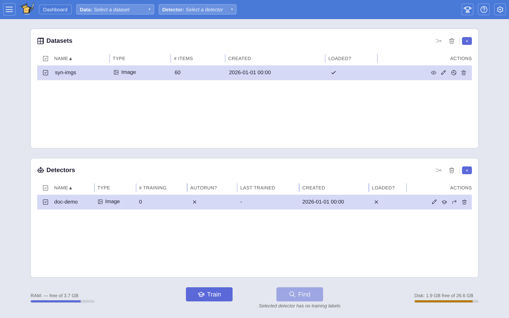

# VTSearch

A trainable media search tool. VTSearch searches collections of audio clips, images, text paragraphs, videos, and documents using a **detector** (a small trained ranker that scores every item in the collection by how well it matches what you're looking for). You search either by **training a new detector** (vote a handful of items "good" or "bad" and a small neural net learns from your votes to rank the rest of the collection) or by **using an existing detector** (one you saved earlier, exported from another VTSearch instance, or imported from disk). Trained detectors are reusable: apply the same one to any future dataset of the same media type. A natural-language query ("dog barking", "red car in snow") seeds either flow via pretrained embeddings (LAION-CLAP for audio, SigLIP for images, X-CLIP for video, E5-base-v2 for text), and also works as a quick stand-alone search when you don't need a trained detector. Several demo datasets are available directly from the UI. Built with Flask (Python), Angular (TypeScript), and PyTorch.

<picture>
  <source media="(prefers-color-scheme: dark)" srcset="docs/user/assets/dashboard-loaded.dark.png" />
  
</picture>

## Setup and running tests

See [docs/SETUP.md](docs/SETUP.md) for prerequisites, getting the code, virtual environment setup, installing dependencies, and running the test suite.

## Running the app

For development, start the Flask dev server:

```bash
python app.py
```

You should see output like:

```
 * Running on http://0.0.0.0:5000
```

Open `http://localhost:5000` in your browser. The app starts with no clips loaded. Use the menu to load a demo dataset (see below).

Press **Ctrl+C** in the terminal to stop the server.

For production, run under gunicorn (the Docker images do this automatically):

```bash
VTSEARCH_SERVER_INIT=1 gunicorn -c gunicorn.conf.py app:app
```

See [docs/SETUP.md](docs/SETUP.md#running-the-app) and [docs/DEPLOYMENT.md](docs/DEPLOYMENT.md) for details.

> **New to VTSearch?** Read **[docs/user/USER_GUIDE.md](docs/user/USER_GUIDE.md)** for a walkthrough of loading a dataset, training a detector with Autopilot (or applying an existing one), and exporting the matches. Most users never need anything else.

## Command-line interface

VTSearch provides several CLI workflows for applying detectors to datasets, importing labels, and importing processors, all without starting the web server. See [docs/CLI.md](docs/CLI.md) for the full CLI reference.

## Loading a demo dataset

When the app is running, click the hamburger menu in the top-left corner to open the dataset panel. From there you can browse the available demo datasets and load one. Each demo is downloaded and embedded on first use, then cached for instant loading afterward.

See [docs/demos.md](docs/demos.md) for the full list of available demo datasets.

You can also load your own data from pickle files or folders via the same menu.

## Project structure

```
├── app.py                          # Flask entry point, registers blueprints, CLI arg parsing
├── gunicorn.conf.py                # Gunicorn WSGI config (single worker + threads)
├── vtsearch/                       # Main application package
│   ├── config.py                   # Constants (paths, model IDs, sample rates)
│   ├── cli.py                      # CLI utilities: autodetect workflow
│   ├── cli_pipeline.py             # CLI orchestration shared by autodetect
│   ├── cli_progress.py             # CLI progress bars
│   ├── settings.py                 # Persistent settings (server tier + per-user tier)
│   ├── settings_factory.py         # Accessor factories for the settings table
│   ├── settings_models.py          # Settings dataclass schemas
│   ├── achievements.py             # User-achievement state machine
│   ├── logging_config.py           # Logging setup
│   ├── auth/                       # Authentication (LoginProvider ABC, DefaultLoginProvider)
│   ├── routes/                     # Flask blueprints (datasets, detectors, processors, media, settings, labels, …)
│   ├── detectors/                  # Detector lifecycle: registry, store, training, label sync, restoration
│   ├── training/                   # Generic learned-sort training primitives (MLP, thresholds, SVM, region-sim)
│   ├── embedding/                  # Embedder façades, torch runtime, smart preload, cached embedding matrix
│   ├── media/                      # Media type plugins (audio, image, text, video, document) + embedders, clippers
│   ├── converters/                 # Media converters (document→image/text, video→audio/image, audio→image, image→text)
│   ├── datasets/                   # Dataset loading, importers, origin tracking, labelsets, media sources
│   ├── eval/                       # Evaluation framework (metrics, runner, visualisation, voting iterations)
│   ├── exporters/                  # Results exporter plugins
│   ├── labels/                     # Label importers and labelset sync sources
│   ├── settings_io/                # Settings importers, exporters and sync sources
│   ├── state/                      # Per-dataset / per-detector context registries; medias/votes proxies
│   ├── plugins/                    # Plugin registry, PluginBase, sentinel-based discovery
│   ├── sync/                       # Generic SyncSource base for settings + labelset sources
│   ├── concurrency/                # Async job manager, memory-aware worker capping, progress trackers
│   ├── security/                   # Path/URL/pickle safety validation
│   ├── schemas/                    # JSON / OpenAPI schemas
│   └── utils/                      # build_media_hit helper + offline synthetic-media generators
├── static/                         # Angular build output (HTML, JS, CSS, assets)
├── frontend/                       # Angular SPA source (TypeScript, SCSS); builds into static/
├── tests/                          # Test suite (pytest); grouped by folder (core, api, sorting, datasets, io, …)
├── docs/                           # Extended documentation
│   ├── HANDOFF.md                  # Project handoff & orientation guide
│   ├── DEPLOYMENT.md               # Deployment, offline mode, operations
│   ├── ARCHITECTURE.md             # Architecture deep-dive
│   ├── API.md                      # HTTP API reference (all REST endpoints)
│   ├── EXTENDING.md                # Plugin authoring index (auth, deps, checklists)
│   ├── EXTENDING-plugins.md        # Data/results/label/processor/settings importers & sources
│   ├── EXTENDING-media.md          # Media types, embedders, clippers, converters, sources
│   ├── EXTENDING-processors.md     # Detectors, localizers, extractors
│   ├── EVAL.md                     # Evaluation framework guide
│   ├── CLI.md                      # CLI reference
│   ├── ML.md                       # ML model details
│   ├── SETUP.md                    # Setup instructions
│   ├── demos.md                    # Demo dataset listing
│   ├── user/                       # End-user docs (rendered in-app via the Help window)
│   │   └── USER_GUIDE.md           # End-user walkthrough (training detectors, applying detectors, exporting)
│   ├── plans/                      # Open design plans (see plans/README.md)
│   └── design/                     # Architecture design documents
└── pyproject.toml                  # Project metadata and dependencies
```

## HTTP API

VTSearch exposes a REST-style JSON API. See [docs/API.md](docs/API.md) for the full endpoint reference, including media listing, sorting, voting, dataset management, detector CRUD and scoring, exporter and importer operations, and settings.

## Deployment

For production deployment, offline/air-gapped operation, Docker hardening, environment variables, network dependency details, and data directory management, see [docs/DEPLOYMENT.md](docs/DEPLOYMENT.md).

New to the project? Start with [docs/HANDOFF.md](docs/HANDOFF.md) for a full orientation including a documentation map, key concepts, deployment checklist, and common workflows.

## Machine learning

VTSearch trains a small MLP neural network on user votes to learn a binary classifier over pretrained embeddings. See [docs/ML.md](docs/ML.md) for full details on the model architecture, training configuration, PyTorch settings, and embedding models.

## Evaluation

VTSearch includes an evaluation framework that measures sorting quality on demo datasets. Run it with:

```bash
python -m vtscore.eval --plot-dir eval_output
```

This runs text-sort and learned-sort evaluations across all demo datasets, prints a summary, and saves visualisation charts as PNGs. See [docs/EVAL.md](docs/EVAL.md) for the full guide, including:

- **[CLI reference](docs/EVAL.md#cli-reference)**: All flags and options for the eval runner.
- **[Understanding the metrics](docs/EVAL.md#understanding-the-metrics)**: What mAP, P@k, R@k, F1, and other metrics mean.
- **[Visualisations](docs/EVAL.md#visualisations)**: Charts generated by the eval framework.
- **[Writing a custom evaluation script](docs/EVAL.md#writing-a-custom-evaluation-script)**: How to sweep over parameters, run voting-iteration simulations, and use the Python API directly.

## Extending with plugins

VTSearch has a plugin architecture for media types, data importers, results exporters, label importers, processor importers, and sync sources. The extending guide is split into three topic-specific docs plus an index:

- **[docs/EXTENDING.md](docs/EXTENDING.md)**: index, authentication providers, dependency management, and a one-stop checklist for every extension type.
- **[docs/EXTENDING-plugins.md](docs/EXTENDING-plugins.md)**: data importers, results exporters, label importers, processor importers, settings importers/exporters, settings sources, labelset sources (eight auto-discovered plugin families).
- **[docs/EXTENDING-media.md](docs/EXTENDING-media.md)**: media types, embedders, clippers, converters, media sources.
- **[docs/EXTENDING-processors.md](docs/EXTENDING-processors.md)**: detectors, localizers, extractors.

---

*Readme Reader code phrase:* `all aboard the embedding express`
