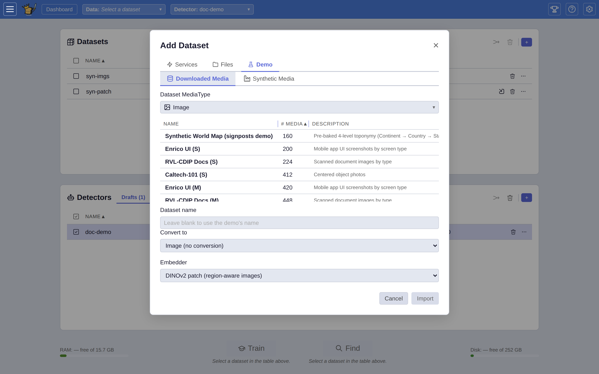

# Demo Datasets

This is the reference catalogue of every demo dataset VTSearch can download and embed on demand. For the step-by-step loading walkthrough (opening the **Add Dataset** dialog, the **Demo** tab, and the **🏭 Synthetic Media** offline generator), see **[user/USER_GUIDE.md](user/USER_GUIDE.md)**.

<picture>
  <source media="(prefers-color-scheme: dark)" srcset="user/assets/importer-picker.dark.png" />
  
</picture>

Datasets are grouped by media type below. Each demo comes in size variants — **S** / **M** / **L** (progressively larger samples) and **A** (all items in the underlying dataset). Sizes are downloaded once and cached, so reloads are instant.

## Audio

| Demo | Description |
|------|-------------|
| **esc50_s** | ~350 clips across all 50 ESC-50 sound categories: animals, nature, urban, domestic, and human sounds |
| **esc50_m** | ~650 clips across all 50 ESC-50 sound categories |
| **esc50_l** | ~1000 clips across all 50 ESC-50 sound categories |
| **esc50_a** | All clips across the 50 ESC-50 sound categories: animals, nature, urban, domestic, and human sounds (all) |
| **gtzan_a** | 30-second music excerpts across 10 GTZAN genres: blues, classical, country, disco, hiphop, jazz, metal, pop, reggae, and rock |
| **speech_commands_v2_s** | One-second keyword utterances across 35 Google Speech Commands v2 categories (small) |
| **speech_commands_v2_m** | One-second keyword utterances across 35 Speech Commands v2 categories (medium) |
| **speech_commands_v2_l** | One-second keyword utterances across 35 Speech Commands v2 categories (large) |
| **speech_commands_v2_a** | One-second keyword utterances across 35 Google Speech Commands v2 categories (all) |
| **urbansound8k_s** | Real urban field recordings across 10 UrbanSound8K categories (small) |
| **urbansound8k_m** | Real urban field recordings across 10 UrbanSound8K categories (medium) |
| **urbansound8k_l** | Real urban field recordings across 10 UrbanSound8K categories (large) |
| **urbansound8k_a** | Real urban field recordings across 10 UrbanSound8K categories: air conditioner, car horn, children playing, dog bark, and more |
| **tut_sound_events_2017_s** | Uncut ~4-minute TUT Sound Events 2017 street soundscapes, one "street" bucket (small slice of 32 recordings) |
| **tut_sound_events_2017_m** | Uncut ~4-minute TUT street soundscapes, one "street" bucket (medium) |
| **tut_sound_events_2017_l** | Uncut ~4-minute TUT street soundscapes, one "street" bucket (large) |
| **tut_sound_events_2017_a** | All 32 uncut ~4-minute TUT Sound Events 2017 street recordings (dev + eval); long-form audio for hands-on clipping rather than a labeled classification set |
| **clotho_s** | Real-world Freesound clips (15-30s) from the Clotho evaluation split, one "sound" bucket (small slice of 1045) |
| **clotho_m** | Real-world Freesound clips from the Clotho evaluation split, one "sound" bucket (medium) |
| **clotho_l** | Real-world Freesound clips from the Clotho evaluation split, one "sound" bucket (large) |
| **clotho_a** | All 1045 Clotho evaluation clips: uncurated, compositional real-world sounds with no class labels; the reference demo for natural-language text→audio (CLAP) retrieval |

## Image

| Demo | Description |
|------|-------------|
| **caltech101_s** | Centered single-object photographs across 25 Caltech-101 categories: animals, vehicles, household objects, and nature (small) |
| **caltech101_m** | Centered single-object photographs across 25 Caltech-101 categories (medium) |
| **caltech101_l** | Centered single-object photographs across 25 Caltech-101 categories (large) |
| **caltech101_a** | Centered single-object photographs across 25 Caltech-101 categories (all) |
| **caltech256_s** | Cluttered, off-center object photographs across 25 Caltech-256 categories: animals, landmarks, vehicles, and everyday objects (small) |
| **caltech256_m** | Cluttered object photographs across 25 Caltech-256 categories (medium) |
| **caltech256_l** | Cluttered object photographs across 25 Caltech-256 categories (large) |
| **caltech256_a** | Cluttered object photographs across 25 Caltech-256 categories (all) |
| **oxford_flowers_102_a** | Close-up flower photography across 102 Oxford Flowers species |
| **food101_s** | Crowd-sourced food photos across Food-101 categories (small) |
| **food101_m** | Crowd-sourced food photos across Food-101 categories (medium) |
| **food101_l** | Crowd-sourced food photos across Food-101 categories (large) |
| **food101_a** | Crowd-sourced food photos across 101 Food-101 categories, a deliberately noisy benchmark (all) |
| **eurosat_s** | Sentinel-2 satellite imagery across EuroSAT land use categories (small) |
| **eurosat_m** | Sentinel-2 satellite imagery across EuroSAT land use categories (medium) |
| **eurosat_l** | Sentinel-2 satellite imagery across EuroSAT land use categories (large) |
| **eurosat_a** | Sentinel-2 satellite imagery across 10 EuroSAT land use categories (all) |
| **stanford_dogs_s** | Fine-grained dog breed photos across Stanford Dogs categories (small) |
| **stanford_dogs_m** | Fine-grained dog breed photos across Stanford Dogs categories (medium) |
| **stanford_dogs_l** | Fine-grained dog breed photos across Stanford Dogs categories (large) |
| **stanford_dogs_a** | Fine-grained dog breed photos across 120 Stanford Dogs categories (all) |
| **places365_s** | Scene photos across 365 Places365 categories (small) |
| **places365_m** | Scene photos across 365 Places365 categories (medium) |
| **places365_l** | Scene photos across 365 Places365 categories (large) |
| **places365_a** | Scene photos across 365 Places365 categories: indoor, outdoor natural, and outdoor man-made environments (all) |
| **enrico_s** | Born-digital **mobile app UI screenshots** (Enrico, a curated Rico subset) across 20 screen-function topics — login, chat, maps, settings, gallery, media player… (small). Digitally-native imagery, not natural photos |
| **enrico_m** | Enrico mobile UI screenshots across 20 screen-function topics (medium) |
| **enrico_l** | Enrico mobile UI screenshots across 20 screen-function topics (large) |
| **enrico_a** | All ~1,460 Enrico mobile UI screenshots across 20 screen-function topics (all) |
| **rico_screen2words_s** | Born-digital **mobile app UI screenshots** (RICO-Screen2Words) labeled by **app category** (Google Play genre) — Finance, Shopping, Social, Weather, Maps & Navigation… (small). A harder, semantic label than Enrico's screen function |
| **rico_screen2words_m** | RICO mobile UI screenshots across 16 app categories (medium) |
| **rico_screen2words_l** | RICO mobile UI screenshots across 16 app categories (large) |
| **rico_screen2words_a** | RICO mobile UI screenshots across 16 Google Play app categories (all) |
| **rvl_cdip_s** | Scanned **document images** (RVL-CDIP, a 300-per-class demo mirror) across 16 balanced document types — letter, form, email, invoice, resume, memo, scientific report… (small). The document-image corner of digitally-native imagery |
| **rvl_cdip_m** | RVL-CDIP document images across 16 document types (medium) |
| **rvl_cdip_l** | RVL-CDIP document images across 16 document types (large) |
| **rvl_cdip_a** | ~4,800 RVL-CDIP document images across 16 document types (all) |
| **ucsf_documents_a** | Scanned industry document pages from the UCSF Industry Documents Library: tobacco, food, drug, chemical, fossil fuel, and opioids |
| **roxford5k_s** | ~500 Oxford Buildings photos (a 1/10 slice) for instance matching — same landmark across viewpoints; best paired with the SIFT/VLAD (instance matching) embedder |
| **roxford5k_a** | All 5,063 Revisited Oxford Buildings photos across 11 landmarks plus distractors — the canonical instance-retrieval benchmark; pair with the SIFT/VLAD (instance matching) embedder |
| **visual_genome_s** | Dense, busy scene photos from Visual Genome (a 1/50 slice) over the 100 most common object types. **Multi-label**: one photo is a positive example of several categories at once (a street scene is in `car`, `person`, `building`, `sign`…). Also carries ground-truth object bounding boxes (stored for future region voting) |
| **visual_genome_m** | Visual Genome scenes (a 2/50 slice) — multi-label over 100 object types, with ground-truth boxes |
| **visual_genome_l** | Visual Genome scenes (a 4/50 slice) — multi-label over 100 object types, with ground-truth boxes |
| **visual_genome_a** | All Visual Genome scenes — multi-label over 100 object types, with ground-truth boxes (large; ~15 GB download) |

## Text

| Demo | Description |
|------|-------------|
| **20newsgroups_s** | ~375 articles across 15 topics from 20 Newsgroups: sports, science, politics, religion, and more |
| **20newsgroups_m** | ~750 articles across 15 topics from 20 Newsgroups |
| **20newsgroups_l** | ~1875 articles across 15 topics from 20 Newsgroups |
| **20newsgroups_a** | All articles across 15 topics from 20 Newsgroups: sports, science, politics, religion, and more (all) |
| **ag_news_s** | Short news summaries across AG News categories (small) |
| **ag_news_m** | Short news summaries across AG News categories (medium) |
| **ag_news_l** | Short news summaries across AG News categories (large) |
| **ag_news_a** | Short news summaries across 4 AG News categories: world, sports, business, and sci/tech (all) |
| **bbc_news_a** | Full BBC news articles across 5 categories: business, entertainment, politics, sport, and tech |
| **imdb_s** | Long-form movie reviews with positive/negative sentiment labels (small) |
| **imdb_m** | Long-form movie reviews with positive/negative sentiment labels (medium) |
| **imdb_l** | Long-form movie reviews with positive/negative sentiment labels (large) |
| **imdb_a** | Long-form user-written movie reviews with binary positive/negative sentiment labels (all) |
| **wikipedia_topics_s** | Wikipedia article abstracts across 14 DBpedia ontology classes: companies, artists, athletes, buildings, animals, plants, films, and more (small) |
| **wikipedia_topics_m** | Wikipedia article abstracts across 14 DBpedia ontology classes (medium) |
| **wikipedia_topics_l** | Wikipedia article abstracts across 14 DBpedia ontology classes (large) |
| **wikipedia_topics_a** | Wikipedia article abstracts across 14 DBpedia ontology classes (all) |
| **arxiv_abstracts_s** | arXiv paper titles and abstracts across 12 subject categories spanning CS, math, physics, biology, and statistics (small) |
| **arxiv_abstracts_m** | arXiv titles and abstracts across 12 subject categories (medium) |
| **arxiv_abstracts_l** | arXiv titles and abstracts across 12 subject categories (large) |
| **arxiv_abstracts_a** | arXiv titles and abstracts across 12 subject categories (all) |
| **reuters21578_s** | Financial newswire stories across 10 Reuters-21578 topics: earnings, acquisitions, money/fx, grain, crude, trade, and more (small) |
| **reuters21578_m** | Financial newswire stories across 10 Reuters-21578 topics (medium) |
| **reuters21578_l** | Financial newswire stories across 10 Reuters-21578 topics (large) |
| **reuters21578_a** | Financial newswire stories across 10 Reuters-21578 topics (all) |

## Video

| Demo | Description |
|------|-------------|
| **ucf101_s** | ~150 clips across 10 UCF-101 action categories: personal activities and sports |
| **ucf101_m** | ~250 clips across 10 UCF-101 action categories |
| **ucf101_l** | ~600 clips across 10 UCF-101 action categories |
| **ucf101_a** | All clips across the same 10-category UCF-101 subset (all) |
| **ucf101_full_s** | YouTube action videos across all 101 UCF-101 categories (small) |
| **ucf101_full_m** | YouTube action videos across all 101 UCF-101 categories (medium) |
| **ucf101_full_l** | YouTube action videos across all 101 UCF-101 categories (large) |
| **ucf101_full_a** | YouTube action videos across all 101 UCF-101 categories (all) |
| **hmdb51_s** | Human-motion clips across 51 HMDB51 categories: facial actions, body movements, and human interactions (small) |
| **hmdb51_m** | Human-motion clips across 51 HMDB51 categories (medium) |
| **hmdb51_l** | Human-motion clips across 51 HMDB51 categories (large) |
| **hmdb51_a** | Human-motion clips across 51 HMDB51 categories (all) |
| **kth_s** | Simple human-action recordings across 6 KTH categories: boxing, handclapping, handwaving, jogging, running, and walking (small) |
| **kth_m** | Simple human-action recordings across 6 KTH categories (medium) |
| **kth_l** | Simple human-action recordings across 6 KTH categories (large) |
| **kth_a** | Simple human-action recordings across 6 KTH categories (all) |

> **Note:** Video demos are downloaded from a mix of sources: the UCF-101 subset from HuggingFace Datasets, the full UCF-101 categories from YouTube, HMDB51 from `serre-lab.clps.brown.edu`, and KTH from `csc.kth.se`. On some networks or air-gapped systems this may require manual setup; see [DEPLOYMENT.md](DEPLOYMENT.md) for offline deployment instructions.

You can also load your own data from pickle files or folders via the same dialog.
