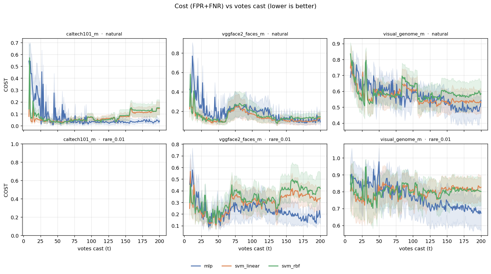
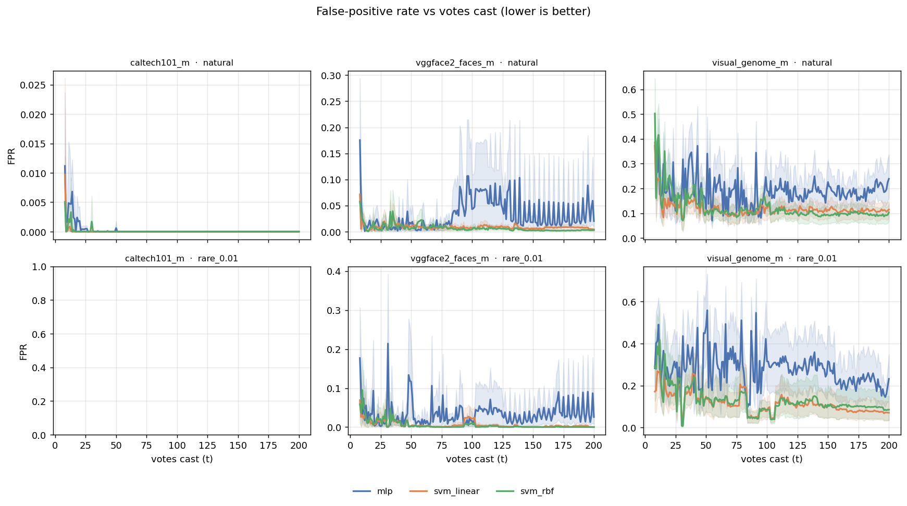
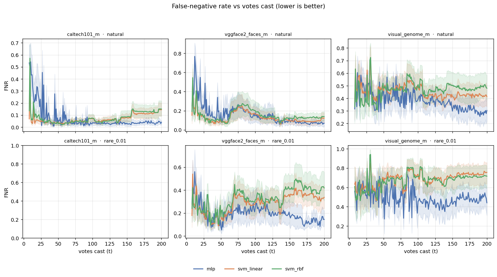
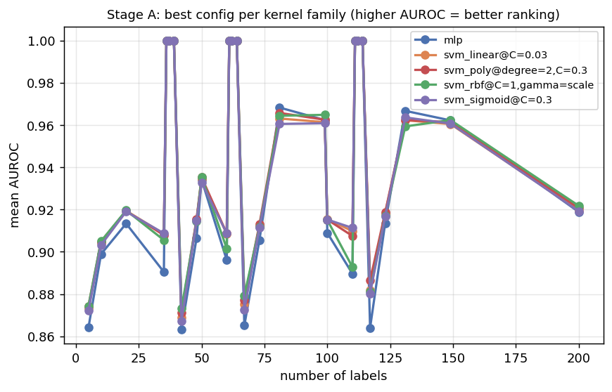
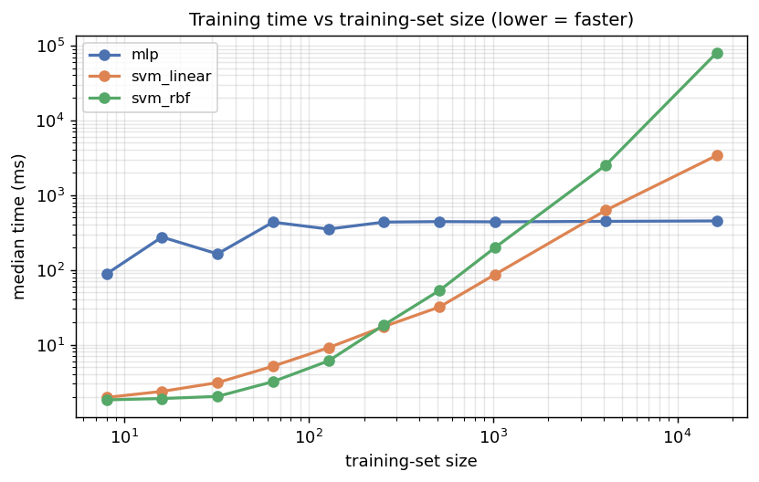
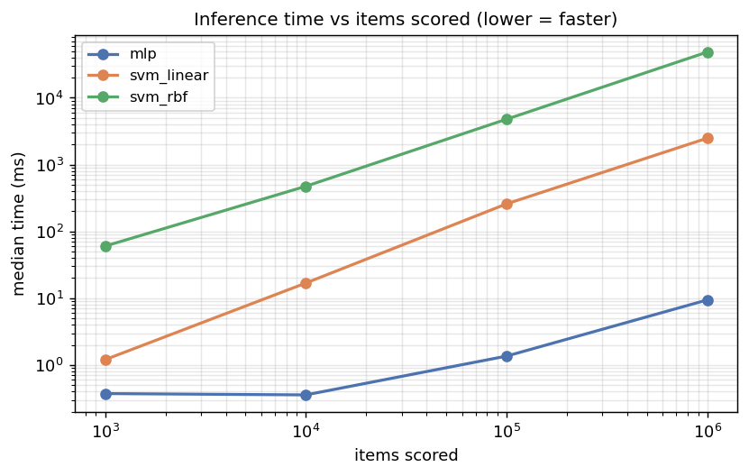

# MLP vs SVM as VTSearch's ranker — experiment report

_Generated deterministically from the Stage A/B/C CSVs by `summarize.py`._

## Verdict

**Keep the MLP.** No SVM variant met the pre-registered switch criterion.

- **svm_linear**: beats MLP cost at both t=50 & t=200 on 0/3 datasets; rare-arm FNR@50 not worse: False; paired Wilcoxon on AULC p=0.828.
- **svm_rbf**: beats MLP cost at both t=50 & t=200 on 0/3 datasets; rare-arm FNR@50 not worse: False; paired Wilcoxon on AULC p=0.081.

## Take-aways

- **The SVMs win the first few dozen votes; the MLP wins the session.** Averaged across datasets, the SVMs reach a lower cost than the MLP by vote 50 (MLP 0.387 vs svm_linear 0.331, svm_rbf 0.330), but the MLP keeps improving as votes accumulate and overtakes them well before vote 200 (MLP 0.286 vs svm_linear 0.373, svm_rbf 0.402). This is exactly the textbook trade-off: the SVM's margin-based fit is very label-efficient on a handful of clean votes, while the MLP's 'every example is evidence' learning compounds as the evidence grows.
- **On rare (1%-prevalence) events, the MLP misses fewer real matches.** At vote 50 in the rare arm the MLP's miss rate (FNR) is 0.285, lower than the SVMs' (svm_linear 0.412, svm_rbf 0.404). Since rare-event search is VTSearch's headline use case, this is the decisive column — a model that trades misses for fewer false alarms at 1% prevalence loses under the pre-registered rule even when total cost ties.
- **For product decisions:** keep the MLP as the default ranker. If a future workflow is known to stop at very few votes (≈ ≤ 40) on clean, well-separated concepts, a linear SVM is a reasonable *fast-start* alternative — but it should not replace the MLP for the general case, and especially not for rare-event search.
- **Runtime is not the deciding factor.** Both models fit and score in milliseconds at the vote budgets users actually reach; the scaling curves (Stage C) only diverge at training/inference sizes far larger than a voting session, so runtime stays a tiebreaker, not a driver.

## What this experiment asked, in plain terms

VTSearch learns what you're looking for from a handful of good/bad votes and then ranks the rest of your collection. Today the thing doing that learning is a tiny neural network (an **MLP**). This experiment asks whether a classic alternative — a **Support Vector Machine (SVM)** — would rank better, and if so which flavour.

- **MLP** treats every vote as evidence about a probability; noisy votes get outvoted by the bulk, and it can carve out a concept made of several distinct clusters.
- **Linear SVM** draws the single straightest dividing line between good and bad, decided entirely by the hardest few examples near the boundary — very label-efficient when the votes are clean, but a single mis-vote near the line can distort it.
- **RBF (kernel) SVM** draws a *curved*, local boundary; far from the examples it has seen, it defaults to 'not the thing' — cautious, which can help avoid false alarms in unexplored corners but can also miss genuinely new pockets of matches.

We measured each model **the way you actually experience VTSearch**: votes are cast in the order the app's Autopilot presents them (seeded by a text search, then good/bad/refine/explore phases), the production threshold-picking path is used unchanged, and errors are measured on a held-out half of the data the model never votes on.

## How to read the numbers

- **FPR (false-positive rate)** — of the items that are *not* matches, the fraction the model wrongly flags as matches. **Lower is better** (fewer false alarms).
- **FNR (false-negative rate)** — of the items that *are* matches, the fraction the model misses. **Lower is better** (fewer missed matches).
- **Cost = FPR + FNR** — a single summary of total error. **Lower is better.**
- **AUROC / average precision** — 'how good is the ranking' independent of where the cut-off is drawn. **Higher is better.** Reported to separate a bad *ranking* from a bad *threshold*.
- **votes cast (t)** — how many good/bad votes the user has made so far. Curves show error *as a function of effort*: a model that drops lower with fewer votes is better.
- **AULC (area under the cost curve)** — average cost over the voting budget (t=8→200); a single number for 'how good across the whole session'. **Lower is better.**
- **Prevalence arm** — *natural* = the category's real rarity; *rare* = matches thinned to 1% to stress-test the rare-event case the tool is built for.

## Experimental setup

- **Datasets** (image, SigLIP 768-d embeddings): `caltech101_m`, `vggface2_faces_m`, `visual_genome_m`.
- **Trainers compared:** `mlp`, `svm_linear`, `svm_rbf`.
- **Seeds:** [0, 1, 2, 3, 4]; **categories per dataset:** {'caltech101_m': 5, 'vggface2_faces_m': 5, 'visual_genome_m': 5}.
- **Prevalence arms:** ['natural', 'rare_0.01']; **vote budget:** up to t=200.
- **Threshold path:** production cross-calibration (calibrate_count=2, calibration_fraction=0.5), inclusion=0 so cost = FPR + FNR; held-out split = 50%.

## Error curves

**Figure 1. Total error (cost = FPR + FNR) as votes accumulate.** One panel per dataset (columns) × prevalence arm (rows); each line is a trainer, shaded band = bootstrap 95% confidence interval across categories × seeds. **Lower and earlier-dropping is better** — it means fewer total mistakes for the same voting effort.

**Figure 2. False-positive rate (false alarms) vs votes.** **Lower is better.** Watch the *rare* rows: a model that keeps FPR low here avoids drowning a 1%-prevalence search in false alarms.

**Figure 3. False-negative rate (missed matches) vs votes.** **Lower is better.** In the rare arm this is the make-or-break metric: missing real matches when they are already scarce is the costly failure the switch criterion guards against.

## Budget table (mean across categories × seeds)

Cost / FPR / FNR at fixed vote counts, and AULC over t=8→200. **Lower is better throughout.**

| trainer | cost@25 | cost@50 | cost@100 | cost@200 | fnr@50 | fnr@200 | AULC |
|---|---|---|---|---|---|---|---|
| `mlp` | 0.399 | 0.387 | 0.359 | 0.286 | 0.249 | 0.189 | 0.355 |
| `svm_linear` | 0.328 | 0.331 | 0.378 | 0.373 | 0.277 | 0.338 | 0.362 |
| `svm_rbf` | 0.333 | 0.330 | 0.390 | 0.402 | 0.280 | 0.366 | 0.380 |

## Statistical significance (paired, Holm-corrected)

Paired Wilcoxon signed-rank of each SVM against the MLP on the per-(dataset, category, arm, seed) AULC and cost at t=50 / t=200, Holm-corrected across the SVM variants. p < 0.05 means the difference is unlikely to be noise; the sign of (SVM − MLP) mean says which is better (negative = SVM lower cost = SVM better).

**aulc_cost**
| SVM variant | MLP mean | SVM mean | Δ(SVM−MLP) | Holm p |
|---|---|---|---|---|
| `svm_linear` | 0.355 | 0.362 | 0.007 | 0.828 |
| `svm_rbf` | 0.355 | 0.380 | 0.025 | 0.162 |

**cost@50**
| SVM variant | MLP mean | SVM mean | Δ(SVM−MLP) | Holm p |
|---|---|---|---|---|
| `svm_linear` | 0.387 | 0.331 | -0.056 | 0.025 |
| `svm_rbf` | 0.387 | 0.330 | -0.057 | 0.014 |

**cost@200**
| SVM variant | MLP mean | SVM mean | Δ(SVM−MLP) | Holm p |
|---|---|---|---|---|
| `svm_linear` | 0.286 | 0.373 | 0.088 | 0.000 |
| `svm_rbf` | 0.286 | 0.402 | 0.116 | 0.000 |

## Stage A: kernel / hyperparameter screen

A cheap static label-count sweep (random balanced labels, not Autopilot) used only to pick the best configuration per SVM kernel family before the definitive run.

**Figure 4. Ranking quality (AUROC) vs number of labels for the best config in each kernel family. Higher is better.** This decides which SVM flavours are worth carrying into the definitive Autopilot comparison.

Best config per family: `mlp`, `svm_linear@C=0.03`, `svm_poly@degree=2,C=0.3`, `svm_rbf@C=1,gamma=scale`, `svm_sigmoid@C=0.3`.

## Stage C: GPU runtime scaling (tiebreaker, not a decision driver)

Backends measured: {'mlp': 'torch-cuda', 'svm_linear': 'sklearn-cpu', 'svm_rbf': 'sklearn-cpu'}.

> **Note on the SVM backend.** cuML (RAPIDS' GPU SVM) is installed on this cluster but its kernels fail to compile at runtime (an nvrtc CUDA-toolchain mismatch — it tries to build CUDA-13 headers under a CUDA-12 compiler). We therefore ran the SVMs on sklearn (CPU) throughout, and say so rather than silently comparing a CPU SVM to a GPU MLP. The MLP still runs on the GPU (torch-CUDA). So Stage C compares **MLP-GPU vs SVM-CPU**; the *shape* of the scaling (flat MLP vs super-linear kernel-SVM) is what matters, not the absolute crossover, which would shift if the SVM ran on the GPU.

(sklearn↔cuML score-parity check skipped — cuML unavailable, see note above.)

**Figure 5. Fit time vs training-set size (log–log). Lower = faster.** The MLP trains a fixed number of epochs regardless of size; a kernel SVM's fit grows super-linearly, so the lines cross as the label budget grows.

**Figure 6. Scoring time vs number of items scored (log–log). Lower = faster.** The MLP is a fixed two-layer multiply; a kernel SVM's scoring grows with its support-vector count, so it is costlier to score very large collections.

## Limitations & honest caveats

- **Closed-loop divergence (by design):** Autopilot picks the next vote from the *current* model's scores, so MLP and SVM trajectories diverge after the first retrain even at the same seed. That is intentional — the question is which model makes *VTSearch* better — but it means the comparison is of whole systems, not of models on identical vote sequences. Same-seed pairing still shares the data split and seeding phase.

- **Calibration asymmetry:** the MLP uses production's abstain-aware cross-calibration exactly; the SVMs use the trainer-agnostic averaging port (the natural analogue). A small source of unfairness, accepted so the MLP path reproduces production byte-for-byte.

- **Single embedder / media type:** image + SigLIP only. Findings may not transfer to audio, video, text, or patch (region) embedders.

- **Phase interleave:** the Hard/New phases alternate on step parity rather than the live app's indicator-driven state machine; identical for every trainer, so it can't bias the comparison.

- **Stage B timing columns mix backends** (MLP on GPU, SVM on CPU for determinism); the fair runtime comparison is Stage C, not the per-step timing.
