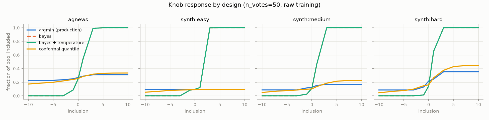
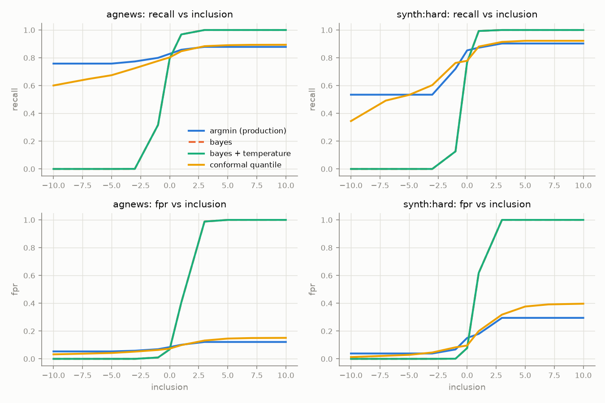

# Inclusion-knob experiment — why the knob doesn't move, and what to replace it with

**Question** (issue #2693): the Inclusion slider (-10 … +10) is supposed to trade
"allow fewer false positives" against "allow fewer false negatives", but in
practice the decision threshold barely moves — the user sees the *same* included
set at Inclusion -10 and +10. What mechanism would give a knob that provably
moves?

**Failure criterion** (from the issue, taken literally): a sweep where throwing
the knob from -10 to +10 changes the included-set size by less than 1% of the
pool is a **flat** sweep — "we failed". The headline metric below (`flat%`) is
the fraction of (category × seed) sweeps that are flat.

**Verdict: replace the min-cost threshold search with a conformal quantile rule;
keep a small amount of label smoothing as tie insurance.** The bug is not
over-training or score saturation — it is structural in
`find_optimal_threshold`'s argmin. Details below.

## Method

Production-faithful harness (`scripts/experiments/inclusion_knob/`): the *actual*
`vtscore` training loop (`train_model`), fold calibration
(`compute_fold_orderings`, fresh `RandomState(42)` per call, production
`_auto_hidden_dim(n_votes)` sizing, `calibration_fraction=0.5`,
`calibrate_count=2` as in the MLP-vs-SVM study), and production threshold search
(`threshold_from_fold_orderings` → `find_optimal_threshold`) — compared against
three candidate knob designs evaluated on the *same* trained models and fold
orderings:

| design | rule |
|---|---|
| `argmin` | production today: min of `fpr_w·FPR + fnr_w·FNR` over observed held-out score cuts, weights `2^±inclusion` |
| `bayes` | Bayes-optimal probability cut `p* = fpr_w / (fpr_w + fnr_w)` applied to the scores as-is |
| `bayes_temp` | same, after temperature-scaling the scores on the held-out fold orderings (Platt-style, `T ≥ 1`) |
| `conformal` | split-conformal quantile rule over held-out fold scores: positive inclusion buys a **false-negative budget** (`α = 0.25·2^-k` quantile of held-out *positive* scores); negative inclusion walks up the positive score distribution guarded by a **false-positive budget** on held-out negative scores; monotone in the knob by construction |

Two arms:

- **AG News × E5 (real production geometry)**: 2,400 articles (600/category)
  embedded with the production text embedder path
  (`intfloat/e5-base-v2`, `"passage: "` prefix, normalized), 4 one-vs-rest
  categories (~25% prevalence).
- **Synthetic separability sweep**: two unit-sphere Gaussian clusters at three
  empirically tuned overlap levels (balanced linear-probe error ~0% / ~3% /
  ~6-8%), 10% prevalence, so knob behavior is visible from trivially-separable
  to genuinely ambiguous.

Grid: 7 arms × 4 seeds × vote counts {12, 24, 50, 100} (stratified random votes,
~⅓ positive) × training treatments {raw, label-smoothed ε=0.05} × 4 designs ×
11 inclusion values. Metrics are computed on the held-out pool (everything not
voted). Raw data: [`sweep.csv`](sweep.csv); full tables:
[`summary_tables.md`](summary_tables.md).

## Findings

### 1. The root cause is the argmin, not over-training

`find_optimal_threshold` can only return cut points where the *weighted cost
changes ranking* — and the weighted cost has exactly as many distinct local
optima as the calibration folds have ranking errors. When the fold models rank
their held-out votes perfectly (the common case: a strongly-fit MLP on a
handful of separable votes), the zero-error cut has cost 0 under **every**
weighting from `2^-10` to `2^+10`, so the argmin — and the threshold, and the
included set — never moves. On the fully-separable synthetic arm, production's
knob was flat in **100% of sweeps** at every vote count. On real AG News
embeddings at 12 votes it was flat in **44%** of sweeps and produced only ~1.8
distinct set sizes across the 11 knob positions (at 50 votes: 12% flat, ~3
distinct sizes); it also *reversed* direction (more inclusion → fewer items) in
6-12% of sweeps, because averaging per-fold argmins is not monotone in the
weights.

### 2. Saturation is absent here — and irrelevant to the fix

The issue hypothesized over-training into "too crisp" scores. In this harness
the scores never saturate (no pool score beyond [0.001, 0.999] anywhere; mean
|logit| ≤ 1.4 even at 100 votes — see the saturation table in
`summary_tables.md`) — yet the knob failure fully reproduces. Production Find
runs may still saturate (more votes, tighter concept clusters); but crisp
scores are neither necessary for the bug nor does fixing them fix the bug:

### 3. Label smoothing alone does not rescue the knob

Training against 0.05/0.95 targets reduces logit magnitude as designed, but
`argmin` stays flat/coarse (44% flat at 12 votes, unchanged), because the fold
orderings are still perfectly ranked — smoothing shrinks the logits without
creating the calibration *errors* the cost search needs. De-saturation is not
the fix. (It still has a role — see the recommendation.)

### 4. Probability-cut designs are unusable without calibration you can't get

`bayes` swings from "include nothing" (inclusion ≤ -5) to "include the entire
pool, FPR = 1.0" (inclusion ≥ +3-5) on every arm: the MLP's scores are far from
calibrated probabilities (here badly *under*-confident), so fixed `p*` cuts land
outside the score range. Temperature scaling cannot repair this: when the fold
orderings are perfectly ranked, NLL has no gradient toward softening (`T` stays
1), and on tiny noisy fold sets it slams to the bound (`T` = 60-100 at 12
votes). `bayes_temp` was as bad as or worse than `bayes` everywhere.

### 5. The conformal quantile rule works

Because it is defined on *quantiles of the held-out score distributions* rather
than on cost argmins or absolute probabilities, it moves whenever the
calibration scores have any spread — regardless of separability, calibration
error count, or how badly the scores deviate from true probabilities. Across
every arm, vote count, and treatment:

- **0% flat sweeps** on AG News and synth:medium/hard at every vote count
  (vs. 6-44% for production; the only flat conformal sweeps anywhere were 25%
  on the fully-separable easy arm under smoothing, where the pool genuinely
  offers nothing between "all positives" and "all positives + margin").
- **0% monotonicity violations** (vs. up to 12% for production) — guaranteed by
  construction, not by luck.
- **~10 distinct set sizes** across the 11 knob positions (vs. 1.8-4.1) — the
  knob has actual resolution.
- **Better at both ends**: at +10, higher recall than production (AG News
  n=50: 0.894 vs 0.879; n=100: 0.981 vs 0.966); at -10, higher precision
  (0.846 vs 0.825 at n=50; 0.926 vs 0.875 at n=100).
- **No cost at the default**: at inclusion 0 its balanced cost (FPR+FNR) is
  within +0.015 of production's.
- Its semantics are user-facing: positive inclusion is literally "the fraction
  of true matches I'm willing to miss, halving per step" — exactly the
  "verify all the potential items" workflow the issue asks for.

## Recommendation

1. **Replace the inclusion→threshold mapping with the conformal quantile rule**
   (swap the body of `threshold_from_fold_orderings` /
   `find_optimal_threshold` in `vtscore/training/thresholds/`). The cached
   inclusion-independent fold orderings are exactly the calibration data the
   rule needs, so `DetectorContext.calibration_cache` and the cheap
   re-threshold-on-slide flow survive unchanged.
2. **Add label smoothing (ε=0.05) to `train_model`** — not to move the knob,
   but as *tie insurance*: a quantile rule needs distinct score values, and
   smoothing bounds the optimal logit (≈ ±2.9), preventing the exact-0.0/1.0
   sigmoid collapse the issue observed in production Find (where all quantiles
   would degenerate to the same value).
3. **Consider raising the default `calibrate_count`** (currently 1): pooled
   held-out scores are what give the knob resolution; at 12 votes a single fold
   yields ~4 positive calibration scores, i.e. ~4 usable knob positions on the
   negative side.
4. Acceptance test for the implementation: seeded end-to-end test asserting the
   included-set size is monotone non-decreasing in inclusion with strictly more
   items at +10 than -10 (the issue's literal criterion).

Design parameters left open (defensible defaults used here): base budget
`α₀ = 0.25` at inclusion 0, halving per step; the -10 end walking to the 75th
percentile of held-out positives.

## Limitations

- Votes are stratified-random, not Autopilot-ordered; region flooding
  (`groups`) was not exercised. Neither affects the argmin degeneracy
  mechanism, which is a property of the cost search alone.
- Production's reported exact-0/1 score crispness did not reproduce at ≤100
  random votes; the recommendation is robust to it either way (smoothing bounds
  the logits; the quantile rule is rank-based).
- Conformal's +10 recall is bounded by what the lowest-scoring held-out
  calibration positive captures; the residual misses are items the model ranks
  below every calibration positive, which no threshold rule can surface — that
  is the province of the below-threshold browsing UI (#2700).
