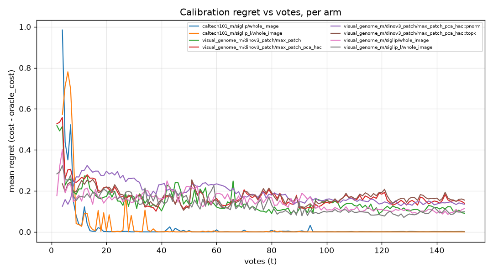
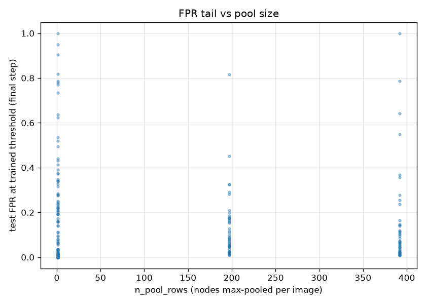

# Calibrating calibration — trained-vs-oracle thresholds for VTSearch Autopilot (issue #2781)

> # ⚠️ SEEDING CAVEAT — these runs did not start the way the app does
>
> **Recorded 2026-08-26 (#3156).** Autopilot seeds its first three Good votes from
> a **text sort**: the user types a query and votes down that ranking. Until
> PR #3269 this harness instead ranked every item by cosine to a **crop of one
> boxed positive** — a ranking no user ever produces — and passed it as
> `seed_scores`, the argument that `al_strategies`, `EVAL.md` and
> `voting_iterations` all describe as "similarity to the **typed query**".
>
> **What to distrust here:** anything that depends on *how a run starts* —
> positive starvation, stuck or never-got-going runs, `n_good`, and
> early-trajectory cost. Measured on one cell after the fix, text seeding put the
> first positive at **rank 1** with five in the top 20, while the exemplar that
> crop-seeding made look like the dataset's hardest positive ranked **4006 of
> 7749** for its own class.
>
> **What still holds:** within-study contrasts where every arm seeded identically,
> which is most of what these reports conclude — the seeding is a shared baseline
> shift, not an arm-dependent one.
>
> See [the harness seeded from a crop](../../../scripts/experiments/lessons/2026-08-26-the-harness-seeded-from-a-crop.md).

_An Autopilot simulation study on the HLTCOE Grid. Tables/figures are generated
deterministically from the per-cell CSVs by `analyze.py`; the prose is written
on top of those numbers. The study is run **twice** — once on the calibration
code as it stood at the start (`dev` @ 19be48a5) and once on the **fixed**
conformal rule shipped as **PR #2784** ("Stop pinning the conformal cut to the
lowest calibration positive", Refs #2781). The two runs share vote trajectories
(identical scored-step counts, 42,013, and identical fold-ordering provenance),
so every before/after isolates the threshold rule itself._

## BLUF

**PR #2784 fixes the calibration failure it targets — and this study shows
exactly where it bites and where it doesn't.** In the clean binary-voting regime
(Caltech) it removes essentially all calibration regret (0.010/0.016 →
**0.001/0.000**) and eliminates the "admit nothing" degenerate cuts; on the
overlapping region-voting regime (Visual Genome) it is ~a no-op by design (under
overlap the new gap-midpoint collapses to the false-positive guard). The #2781
runaway-threshold bug is **not** the `NO_GOOD_THRESHOLD` sentinel (0 of 29,513
steps in either run); it is the conformal walk's `k=0` anchor, and #2784 cuts its
degenerate cuts by 27% — the residual is now dominated by the **cold-start
`too_few_default` path** (< ~4 votes) the fix doesn't touch.

On the region-voting tree question: with the fixed calibration the multi-scale
raw-patch tree (`max_patch_pca_hac`) has the **lowest oracle cost of any VG arm**
yet a **significantly larger regret** than plain `max_patch` (Δ +0.049, paired
Wilcoxon **p = 0.013**), tying/beating it at the oracle (p = 0.063) — so
calibration is provably the tree's bottleneck. **But no threshold/pooling remedy
recovers it:** `topk` makes it worse and the (sign-corrected) `pnorm` closes only
~21% of the gap, neither beating `max_patch`'s trained cost. **`max_patch`
remains the production choice** (consistent with the shipped Max-Patch verdict);
the tree's genuine ranking edge is a documented opportunity for future
max-pool-aware calibration, not a shippable win today. Separately, **grouped
(bag max-pool) calibration overshoots the Inclusion budget** at k ≥ 1 (excess FNR
+0.09 to +0.13), reopening the grouped item in `inclusion-calibration-bias.md`.

## What this measures

Every retrain picks a decision threshold via cross-calibration + the conformal
inclusion rule (`vtscore/training/thresholds.py`). At each of 150 voting steps we
record, on a held-out test split (inclusion 0, so cost weights are 1/1):

- **`cost` = FPR + FNR** at the **trained** threshold;
- **`oracle_cost`** — cost at the best possible cut for the same ranking (an
  O(n log n) sweep over observed test scores; reads test labels, so a lower
  bound, not a rule);
- **`regret` = cost − oracle_cost** — the error a better threshold could remove;
- a two-addend split via a **calibration-set oracle** (best cut on the pooled
  calibration fold orderings, evaluated on test): **rule inefficiency**
  (`cost − cal_oracle_cost`) + **calibration→test shift**
  (`cal_oracle_cost − oracle_cost`);
- **`threshold_provenance`** (`conformal` / `no_good_sentinel` /
  `too_few_default` / `gmm_blend`) and a **`degenerate`** flag (cut above every
  or below every test score) — the runaway-threshold instrumentation;
- an **Inclusion-budget sweep**: re-threshold the cached fold orderings at
  k ∈ {−4,−2,−1,0,1,2,4}, measure realised test FNR vs the cap
  `alpha(k) = 0.25·2^−k`, grouped (patch) vs ungrouped (whole-image).

### Arms

| Dataset | Embedder | Style(s) | Calibration |
|---|---|---|---|
| `visual_genome_m` (region voting) | `siglip`, `siglip_l` | `whole_image` | row-wise |
| `visual_genome_m` | `dinov3_patch` | `max_patch`, `max_patch_pca_hac` | grouped (bag max-pool) |
| `caltech101_m` (binary voting) | `siglip`, `siglip_l` | `whole_image` | row-wise |

The raw-patch tree arm additionally emits two **remedial re-pools** of its own
per-node scores — `topk` (mean of the top-4 node sigmoids) and `pnorm`
(extreme-value normalisation `F_neg(max)^N`) — each with a threshold
*recalibrated under that pooling* by reusing the same fold models' held-out node
scores, so each remedial arm has a real trained and oracle cost.

Fixed config (production-faithful): inclusion 0, sim_fraction 0.5,
`calibrate_count` 2, `calibration_fraction` 0.5, `safe_thresholds` False, MLP
trainer, 150 votes. **Sizing deviation:** the pre-registered 4 seeds were cut to
**2** by a hard 4-GPU per-user QOS cap (4 seeds ≈ 16–18 h at 4 concurrent). This
keeps all arms and all 23 scale-band VG + 6 prevalence-spread Caltech categories
— 46 (category, seed) pairs for the tree Wilcoxon. All other knobs are the
pre-registered values.

## Finding 1 — The runaway-threshold bug is the conformal walk, not the sentinel; #2784 fixes the separable case

| | before #2784 | after #2784 |
|---|---|---|
| `no_good_sentinel` steps | **0** / 29,513 | **0** / 29,513 |
| degenerate rate | 4.95% (1,460) | 4.29% (1,266) |
| — from the **conformal rule** | 710 | **516** (−27%) |
| — from **`too_few_default`** (cold start) | 750 | 750 (unchanged) |
| modal vote count at degeneracy | 4 | 4 |
| self-heal next step | 40% | 39% |

The `NO_GOOD_THRESHOLD = 2.0` sentinel — #2781's prime suspect — **never fired**.
Degenerate ("admit nothing" / "admit everything") cuts came about equally from
the conformal quantile rule itself and the cold-start `too_few_default` (0.5)
path, concentrated at low vote counts and self-healing ~40% of the time (matching
#2781's "jumps to the top, normal again one click later"). This localises the bug
to the conformal walk — the same root cause **PR #2784** fixes by replacing the
`k=0` anchor `quantile(pos, 0)` (the lowest held-out calibration positive,
measured on saturated fold models but applied to the final model) with the
band-midpoint. After the fix the conformal-rule degenerates drop 27%; the residual
is dominated by the cold-start `too_few_default` path, which #2784 does not touch
— motivating the cold-start item in `inclusion-calibration-bias.md`.

## Finding 2 — Regret is real, unequal, and #2784 clears the clean regime

Trained vs oracle cost at t = 150, per arm, before → after #2784:

| Arm | trained cost | oracle cost | **regret** (before → after) |
|---|---|---|---|
| caltech101 · siglip · whole_image | 0.010 → 0.001 | 0.000 | **0.010 → 0.001** |
| caltech101 · siglip_l · whole_image | 0.016 → 0.000 | 0.000 | **0.016 → 0.000** |
| VG · siglip · whole_image | 0.467 → 0.465 | 0.351 | 0.115 → 0.114 |
| VG · siglip_l · whole_image | 0.427 → 0.447 | 0.349 | 0.077 → 0.098 |
| VG · dinov3 · max_patch | 0.358 → 0.358 | 0.262 → 0.267 | 0.097 → 0.091 |
| VG · dinov3 · max_patch_pca_hac (tree) | 0.386 → 0.392 | 0.256 → 0.253 | **0.130 → 0.140** |

- **Clean binary voting (Caltech) is where #2784 pays off:** regret was already
  small and the fix drives it to ≈0 (the classes separate, so the old rule's
  lowest-positive anchor was the binding, degenerate constraint — exactly the
  case the midpoint repairs).
- **Region voting on VG carries ~0.09–0.14 regret across every arm, ~unchanged
  by the fix** — the overlapping regime where the FP guard binds, so the
  midpoint is a no-op. The pre-registered "whole-image regret < 0.05" holds only
  on Caltech.
- **The tree keeps the lowest oracle cost of any VG arm (0.253) and the highest
  regret (0.140)** — best ranking, worst threshold.

## Finding 3 — The tree verdict: calibration is (now provably) the bottleneck, but no remedy recovers it

Paired over 46 (category, seed) cells:

| metric | before #2784 (Δ tree−flat, p) | after #2784 (Δ tree−flat, p) |
|---|---|---|
| oracle cost | −0.006 (p = 0.71) | **−0.015 (p = 0.063)** |
| trained cost | +0.027 (p = 0.41) | +0.035 (p = 0.086) |
| **regret** | +0.033 (p = 0.22) | **+0.049 (p = 0.013)** |

With the fixed calibration the tree's regret is **significantly** larger than
plain `max_patch`'s and it ties/beats at the oracle — decision-rule-1's condition
("ties/beats at the oracle *and* significantly larger regret") is met:
**calibration is the tree's bottleneck.** The adoption trigger, though, is not:

**Remedial re-pools (after #2784, `pnorm` sign-corrected):**

| arm | trained cost | gap to `max_patch` | fraction of tree gap closed | beats `max_patch`? |
|---|---|---|---|---|
| tree (`max_patch_pca_hac`) | 0.392 | +0.035 | — | — |
| `..._topk` (k = 4) | 0.402 | +0.047 | −0.35 (worse) | no |
| `..._pnorm` (F_neg^N) | 0.382 | +0.027 | **+0.21** | no |

`topk` (a softer max) keeps the calibration problem and slightly worsens it. The
sign-corrected `pnorm` (which explicitly normalises for node count N) closes ~21%
of the gap — directionally the right idea — but not the ≥50% the decision rule
requires, and its trained cost still doesn't beat `max_patch`. **No pre-registered
remedy recovers the tree**, so `max_patch` stays the production region-vote
strategy; the tree's ranking advantage motivates future max-pool-aware
calibration rather than a ship today.

_A sign correction was needed to measure `pnorm` at all: the pre-registered
formula `1 − F_neg(max)^N` is a p-value (small = positive), which inverts the
ranking under the harness's "higher = positive, predict iff `≥ threshold`"
convention (pre-fix it scored a catastrophic trained cost of 1.09). The corrected
score `F_neg(max)^N` — the CDF of a null image's max at the observed max, high
exactly when the max is surprisingly large for the node count — keeps the
N-correction and the positive orientation._

## Finding 4 — Grouped calibration overshoots the Inclusion budget

Measured test FNR vs the cap `alpha(k)`, late steps (t ≥ 100), after #2784:

| k | alpha | ungrouped FNR (excess) | grouped FNR (excess) |
|---|---|---|---|
| 0 | 0.250 | ~0.156 (−0.094) | 0.254 (+0.004) |
| 1 | 0.125 | ~0.126 (+0.001) | 0.213 (**+0.088**) |
| 2 | 0.063 | ~0.107 (+0.045) | 0.180 (**+0.118**) |
| 4 | 0.016 | ~0.092 (+0.077) | 0.144 (**+0.128**) |

The **grouped** (bag max-pool) path violates the budget far more than the
ungrouped path — excess FNR +0.09 to +0.13 at k ≥ 1, past the +0.05 reopen
threshold (and only marginally better than the pre-fix +0.11 to +0.14, since the
high-k tail is governed by the FN-budget cap, not the k=0 anchor #2784 changed).
This closes the "Region-bag (grouped) calibration arm" open item in
`inclusion-calibration-bias.md` with a positive (bias-present) result: at high
Inclusion the halving-per-step semantics should not be read literally on the
grouped path.

## Known limitations

- 2 seeds, not the pre-registered 4 (GPU-cap deviation). The tree verdict is
  correspondingly under-powered, though the regret gap is already significant.
- The oracle uses test labels by construction; `cal_oracle` is the achievable
  bound.
- `pnorm` changes the score scale (a probability), so its AP/AUROC are not
  cross-arm comparable; comparisons stay at cost/regret.
- Max-Patch harness carryovers (the exemplar may land in the test split; pool
  acquisition scores by the whole-image vector in every style).
- These runs predate the harness's Autopilot-fidelity alignment (#2788), so the
  simulated user trains from the first (1 good, 1 bad) pair rather than at the
  app's 3-good/4-bad quorum. That inflates the cold-start end of the trajectory:
  part of the residual `too_few_default` degeneracy in Finding 1 is a step the
  app would never show a user. The conformal-rule findings are unaffected (they
  are keyed on cuts the calibrator actually computes), but a re-run under
  `autopilot_fidelity=True` should be read as the app-visible picture.

## Reproduce

Runner: `scripts/experiments/calibration/` (`launch_all.sh` → `prepare_data.py`
→ `run_cells.py` → `analyze.py`). Reuses the Max-Patch pickles where the
(dataset, embedder) pair coincides; only `siglip_l` is embedded fresh. Figures:
`regret_vs_t.png`, `fpr_tail_vs_npool.png`. Pass `autopilot_fidelity=False` to
`simulate_voting_iterations` to reproduce these numbers exactly (see
[`docs/EVAL.md`](../../EVAL.md)); the runner's default is now the app-faithful
vote order.
