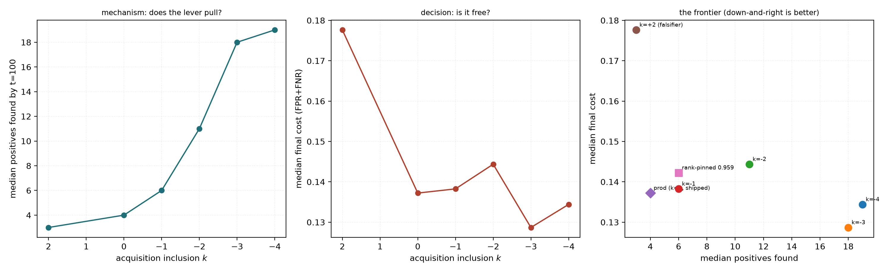

# Acquisition/reporting threshold decoupling — does it buy back the positives?

> # ⚠️ SEEDING CAVEAT — these runs did not start the way the app does
>
> **Recorded 2026-08-26 (#3156).** Autopilot seeds its first three Good votes from
> a **text sort**: the user types a query and votes down that ranking. Until
> PR #3269 this harness instead ranked every item by cosine to a **crop of one
> boxed positive** — a ranking no user ever produces — and passed it as
> `seed_scores`, the argument that `al_strategies`, `EVAL.md` and
> `voting_iterations` all describe as "similarity to the **typed query**".
>
> **What to distrust here:** anything that depends on *how a run starts* —
> positive starvation, stuck or never-got-going runs, `n_good`, and
> early-trajectory cost. Measured on one cell after the fix, text seeding put the
> first positive at **rank 1** with five in the top 20, while the exemplar that
> crop-seeding made look like the dataset's hardest positive ranked **4006 of
> 7749** for its own class.
>
> **What still holds:** within-study contrasts where every arm seeded identically,
> which is most of what these reports conclude — the seeding is a shared baseline
> shift, not an arm-dependent one.
>
> See [the harness seeded from a crop](../../../scripts/experiments/lessons/2026-08-26-the-harness-seeded-from-a-crop.md).

Design: `docs/ML.md` (threshold calibration). Reporting is cut at inclusion 0 in **every** arm; only the selector's cut moves.

## Lever verification — where each arm actually sampled

| arm | median `acq_pool_percentile` | shift vs control | steps where acq ≠ reporting |
|---|---:|---:|---:|
| `acq_m4` — k=-4 | 0.9088 | +0.1242 | 96% |
| `acq_m3` — k=-3 | 0.9059 | +0.1213 | 96% |
| `acq_m2` — k=-2 | 0.8904 | +0.1058 | 96% |
| `acq_m1` — k=-1 | 0.8550 | +0.0704 | 96% |
| `prod` — prod (k=0, shipped) | 0.7846 | +0.0000 | 0% |
| `acq_p2` — k=+2 (falsifier) | 0.4315 | -0.3531 | 97% |
| `rank_pin` — rank-pinned 0.959 | 0.9633 | +0.1787 | 100% |

## Per-arm

| arm | trajectories | positives @100 | positives @50 | final cost | mean warm cost | final AP | oracle cost | genuine blips |
|---|---:|---:|---:|---:|---:|---:|---:|---:|
| `acq_m4` — k=-4 | 540 | 12.0 | 7.0 | 0.455 | 0.509 | 0.370 | 0.414 | 10.2% |
| `acq_m3` — k=-3 | 540 | 12.0 | 6.0 | 0.452 | 0.511 | 0.371 | 0.410 | 9.8% |
| `acq_m2` — k=-2 | 540 | 10.0 | 5.0 | 0.434 | 0.491 | 0.362 | 0.407 | 10.0% |
| `acq_m1` — k=-1 | 540 | 7.0 | 4.0 | 0.437 | 0.489 | 0.350 | 0.401 | 8.3% |
| `prod` — prod (k=0, shipped) | 540 | 6.0 | 4.0 | 0.426 | 0.484 | 0.349 | 0.395 | 9.8% |
| `acq_p2` — k=+2 (falsifier) | 540 | 4.0 | 3.0 | 0.464 | 0.512 | 0.313 | 0.410 | 13.3% |
| `rank_pin` — rank-pinned 0.959 | 540 | 11.0 | 6.0 | 0.505 | 0.551 | 0.362 | 0.449 | 11.1% |

## Paired against `prod` — cells are `(category, seed)`, never steps

| arm | metric | n | control | arm | median Δ | 95% CI on mean Δ | p |
|---|---|---:|---:|---:|---:|---:|---:|
| `acq_m4` | positives_100 | 540 | 6.000 | 12.000 | +5.000 | [+7.8537, +9.6352] | 0.00000 |
| `acq_m4` | final_cost | 540 | 0.426 | 0.455 | +0.000 | [-0.0003, +0.0183] | 0.31622 |
| `acq_m4` | mean_cost_warm | 540 | 0.484 | 0.509 | +0.000 | [+0.0021, +0.0150] | 0.23340 |
| `acq_m4` | final_oracle_cost | 540 | 0.395 | 0.414 | +0.001 | [+0.0024, +0.0157] | 0.05541 |
| `acq_m4` | final_ap | 540 | 0.349 | 0.370 | +0.012 | [+0.0232, +0.0369] | 0.00000 |
| `acq_m3` | positives_100 | 540 | 6.000 | 12.000 | +4.000 | [+6.3240, +7.7611] | 0.00000 |
| `acq_m3` | final_cost | 540 | 0.426 | 0.452 | +0.000 | [+0.0033, +0.0215] | 0.24804 |
| `acq_m3` | mean_cost_warm | 540 | 0.484 | 0.511 | +0.000 | [-0.0007, +0.0123] | 0.72692 |
| `acq_m3` | final_oracle_cost | 540 | 0.395 | 0.410 | +0.000 | [+0.0019, +0.0148] | 0.20098 |
| `acq_m3` | final_ap | 540 | 0.349 | 0.371 | +0.012 | [+0.0219, +0.0349] | 0.00000 |
| `acq_m2` | positives_100 | 540 | 6.000 | 10.000 | +3.000 | [+4.5241, +5.6370] | 0.00000 |
| `acq_m2` | final_cost | 540 | 0.426 | 0.434 | +0.000 | [-0.0070, +0.0109] | 0.48323 |
| `acq_m2` | mean_cost_warm | 540 | 0.484 | 0.491 | -0.003 | [-0.0060, +0.0069] | 0.11097 |
| `acq_m2` | final_oracle_cost | 540 | 0.395 | 0.407 | -0.002 | [-0.0045, +0.0092] | 0.41272 |
| `acq_m2` | final_ap | 540 | 0.349 | 0.362 | +0.012 | [+0.0159, +0.0282] | 0.00000 |
| `acq_m1` | positives_100 | 540 | 6.000 | 7.000 | +1.000 | [+1.8481, +2.5426] | 0.00000 |
| `acq_m1` | final_cost | 540 | 0.426 | 0.437 | -0.002 | [-0.0095, +0.0075] | 0.23143 |
| `acq_m1` | mean_cost_warm | 540 | 0.484 | 0.489 | -0.006 | [-0.0081, +0.0037] | 0.02467 |
| `acq_m1` | final_oracle_cost | 540 | 0.395 | 0.401 | +0.000 | [-0.0053, +0.0079] | 0.68415 |
| `acq_m1` | final_ap | 540 | 0.349 | 0.350 | +0.004 | [+0.0055, +0.0172] | 0.00013 |
| `acq_p2` | positives_100 | 540 | 6.000 | 4.000 | -1.000 | [-3.4815, -2.7130] | 0.00000 |
| `acq_p2` | final_cost | 540 | 0.426 | 0.464 | +0.033 | [+0.0281, +0.0458] | 0.00000 |
| `acq_p2` | mean_cost_warm | 540 | 0.484 | 0.512 | +0.024 | [+0.0205, +0.0348] | 0.00000 |
| `acq_p2` | final_oracle_cost | 540 | 0.395 | 0.410 | +0.016 | [+0.0134, +0.0266] | 0.00000 |
| `acq_p2` | final_ap | 540 | 0.349 | 0.313 | -0.018 | [-0.0347, -0.0244] | 0.00000 |
| `rank_pin` | positives_100 | 540 | 6.000 | 11.000 | +5.000 | [+7.9926, +9.8093] | 0.00000 |
| `rank_pin` | final_cost | 540 | 0.426 | 0.505 | +0.015 | [+0.0196, +0.0401] | 0.00000 |
| `rank_pin` | mean_cost_warm | 540 | 0.484 | 0.551 | +0.008 | [+0.0195, +0.0360] | 0.00000 |
| `rank_pin` | final_oracle_cost | 540 | 0.395 | 0.449 | +0.008 | [+0.0241, +0.0420] | 0.00000 |
| `rank_pin` | final_ap | 540 | 0.349 | 0.362 | +0.007 | [+0.0183, +0.0352] | 0.00000 |

## Ship rule (pre-registered)

Adopt iff positives rise (p<0.05) **and** the 95% upper bound on the final-cost delta is below +0.01 **and** deep-spike incidence does not rise **and** the lever actually moved.

| arm | positives rose | cost did not regress | spikes did not rise | lever moved | **ADOPT** |
|---|:--:|:--:|:--:|:--:|:--:|
| `acq_m4` | yes | no | yes | yes | **no** |
| `acq_m3` | yes | no | yes | yes | **no** |
| `acq_m2` | yes | no | yes | yes | **no** |
| `acq_m1` | yes | yes | yes | yes | **yes** |
| `rank_pin` | yes | no | yes | yes | **no** |

**Arms passing every criterion:** acq_m1

## Data read

| arm | cell files | trajectories | never found a positive | unreadable | zero-byte |
|---|---:|---:|---:|---:|---:|
| `acq_m4` | 552 | 540 | 12 | 0 | 0 |
| `acq_m3` | 552 | 540 | 12 | 0 | 0 |
| `acq_m2` | 552 | 540 | 12 | 0 | 0 |
| `acq_m1` | 552 | 540 | 12 | 0 | 0 |
| `prod` | 552 | 540 | 12 | 0 | 0 |
| `acq_p2` | 552 | 540 | 12 | 0 | 0 |
| `rank_pin` | 552 | 540 | 12 | 0 | 0 |

## Figures

