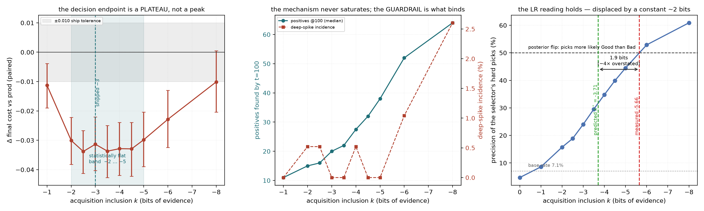

# #3319 — the acquisition-offset frontier past −4, at half-step resolution, and in the deep regime

**Status: the shipped-arm (`bin`) sweep is COMPLETE — 2304/2304 cells, 0
failures, 12 arms × 192 paired cells.** The 400-click deep wave and the region
cross-check are still running; their sections are marked and will be filled from
the same code path.

Issue #3319 · branch `claude/acq-offset-3319` · base dev `faa9fa9ac` · worktree
`/exp/sgreenberg/projects/vts-acq-3319` · study `/expscratch/sgreenberg/acq-3319`.
Pre-registered plan: [`PLAN_3319.md`](PLAN_3319.md) — written before any arm cell
existed, and every rule below is the one it committed to.

## The result, in three sentences

1. **The frontier does not turn where anyone was looking.** `final_cost` is
   *statistically flat from −2 to −5* — a three-bit-wide plateau — and only
   degrades resolvably at **−8**. The shipped `−3` sits in the middle of a
   plateau, not at an optimum.
2. **Half steps are real, and decision-irrelevant.** Every half step lands
   *resolvably between* its two integer neighbours on positives (all six
   contrasts, CIs excluding zero) — and *none* of them separates on cost. The
   integer grid is sufficient for choosing a value, and the reason is not that
   the knob is coarse but that the endpoint is flat.
3. **The knob's Bayesian reading is right about the shape and wrong about the
   location by a constant ~2 bits.** Pick precision is the smooth monotone
   function of `k` a log-odds threshold predicts, and it crosses the
   posterior-flip point at **k ≈ −5.7** rather than the predicted **−3.71** —
   the fitted mixture overstates the evidence by about **4×**.

## What a value means

Restated from the plan because every number below is read in these units.
`inclusion_cost_weights` defines the knob as a loss over the two error **rates**;
because each error is normalised by its own class, prevalence divides out
(`GmmFit1D.rate_crossing` puts the prior-odds factor back into `lam` precisely so
the cut does not carry it — what #2836 shipped). What is left is

> include *x* ⟺ `f_pos(x) / f_neg(x) > 2^−k`

a **log₂ likelihood-ratio threshold**: `k = 0` is the neutral-evidence point and
**each step is one bit of evidence**. `−3` asks for 8:1, `−3.5` for 11.3:1.

## The lever moved, and the falsifier behaved

Neither is decoration: the direction of this knob is counter-intuitive (a
*negative* offset *raises* the cut), so a sign error would look exactly like the
lever doing nothing.

| arm | k | median `acq_pool_percentile` | shift vs `prod` |
|---|---:|---:|---:|
| `prod` | 0 | 0.7252 | — |
| `acq_m3` | −3 | 0.8990 | +0.174 |
| `acq_m5` | −5 | 0.9480 | +0.223 |
| `acq_m8` | −8 | 0.9733 | +0.248 |
| `acq_p2` | +2 | 0.4009 | **−0.324** |

Every arm moved, monotonically, in the right direction, on 99% of steps.
**`acq_p2` (k=+2) degrades as required** — positives 7 → 4 (Δ −2.9), cost +0.063
[+0.053, +0.073], AP −0.047. The mechanism is the one being described.

## H1 — the frontier is a plateau, not a peak

Paired against `prod`, all 192 cells, 95% bootstrap CIs:

| arm | k | Δ final cost [95% CI] | Δ positives@100 | Δ AP | deep spikes |
|---|---:|---|---:|---:|---:|
| `acq_m1` | −1 | −0.011 [−0.019, −0.004] | +3.6 | +0.027 | 0.0% |
| `acq_m2` | −2 | −0.030 [−0.038, −0.022] | +10.1 | +0.058 | 0.5% |
| `acq_m2h` | −2.5 | **−0.034** [−0.041, −0.027] | +13.0 | +0.073 | 0.5% |
| `acq_m3` | −3 | −0.031 [−0.041, −0.022] | +17.7 | +0.083 | 0.0% |
| `acq_m3h` | −3.5 | −0.034 [−0.043, −0.025] | +22.8 | +0.088 | 0.0% |
| `acq_m4` | −4 | −0.033 [−0.042, −0.024] | +27.7 | +0.102 | 0.5% |
| `acq_m4h` | −4.5 | −0.033 [−0.042, −0.024] | +32.4 | +0.103 | 0.0% |
| `acq_m5` | −5 | −0.030 [−0.039, −0.021] | +36.6 | +0.108 | 0.0% |
| `acq_m6` | −6 | −0.023 [−0.033, −0.014] | +44.6 | +0.113 | 1.0% |
| `acq_m8` | −8 | −0.010 [−0.021, +0.000] | +52.1 | +0.111 | **2.6%** |

Contrasted **arm-to-arm against the minimum** (so the comparison does not inherit
the control's variance twice), the only arm resolvably worse than the best is
`−8` (+0.024 [+0.015, +0.032]); `−6` is +0.011 [+0.003, +0.019], which clears
zero but not the ±0.010 tolerance. Everything from `−3` to `−5` is within
[−0.006, +0.011] of the minimum with every CI spanning zero.

**So H1 is supported only in its weakest form.** The cost frontier turns, but it
turns *at −8*, four bits past the shipped value and two past anything a ship
rule would consider. Between −2 and −5 the decision endpoint cannot tell the arms
apart. Calling `−2.5` "the minimum" would be reading the argmin of a flat band.

**What is *not* flat is the mechanism.** Positives per 100 clicks rise
monotonically and without saturation across the whole grid — 7 → 11 → 15 → 16 →
20 → 22 → 27.5 → 32 → 38 → 52 → **64** — and AP rises 0.568 → 0.722. The thing
that eventually stops the sweep is the **guardrail**, not the cost: deep-spike
incidence is 0–0.5% out to −5, then 1.0% at −6 and **2.6% at −8**.

This is closest to the issue's second outcome. The cost endpoint is not pricing
aggression at all in this range; it is saturated. What the offset buys past −3 is
**labels and ranking quality**, and what will eventually stop it is **threshold
stability** — the same criterion #3318 found binding.

## H2 — half steps are real, and decision-irrelevant

**The prerequisite is discharged, emphatically.** A half step could have been an
artefact: `threshold_at` snaps its realised quantile to the haystack sample
(#3166), so a half step might have collapsed onto its integer neighbour and been
a silent duplicate. It does not. Across all 192 cells, **every adjacent arm pair
shares an identical `acq_pool_percentile` in 0.0% of cells** — not one cell in
2112 comparisons.

They are also genuinely *half-way*. Paired arm-to-arm against both neighbours:

| contrast | Δ positives@100 [95% CI] | Δ final cost [95% CI] |
|---|---|---|
| `−2.5` vs `−2` | **+2.9** [+1.6, +4.2] | −0.004 [−0.010, +0.003] |
| `−2.5` vs `−3` | **−4.7** [−6.2, −3.3] | −0.002 [−0.010, +0.005] |
| `−3.5` vs `−3` | **+5.1** [+3.5, +6.7] | −0.002 [−0.009, +0.005] |
| `−3.5` vs `−4` | **−4.8** [−6.5, −3.2] | −0.001 [−0.008, +0.006] |
| `−4.5` vs `−4` | **+4.7** [+3.2, +6.3] | −0.000 [−0.007, +0.006] |
| `−4.5` vs `−5` | **−4.2** [−5.7, −2.7] | −0.003 [−0.010, +0.003] |

**All six mechanism contrasts resolve; none of the six cost contrasts does.**

So **H2 is falsified as pre-registered** — no half step beats both integer
neighbours on the decision endpoint — but the reason matters and is not the one
the hypothesis anticipated. The knob is *not* too coarse to have half-step
resolution: it has it, and the resolution is visibly, reliably half-way. The
decision endpoint simply cannot see a half bit **because it cannot see three
whole bits either**. Had the plateau been a peak, the half steps would have been
exactly the right instrument.

**Practical consequence: keep the integer grid for choosing a ship value.** The
half-step arms are retired as a *tuning* device, and the finer grid is not owed
again on this endpoint unless an environment shows a real interior optimum.

## H4 — the Bayesian landmark, and a measured calibration gap

The plan pre-registered a landmark. At prevalence π the selector's picks become
more likely Good than Bad only once the evidence clears the prior odds, i.e. at
`k* = −log₂((1−π)/π)`; at `vg_scale_any`'s designed **π = 7.1%** that is
**−3.71**, which is why the half-step grid was placed to bracket it.

Tested where it belongs — on the **pick log**, not on a trajectory endpoint,
since the claim is about the picks themselves (17.6k `hard` picks per arm,
openings excluded):

| k | 0 | −1 | −2 | −2.5 | −3 | −3.5 | −4 | −4.5 | −5 | −6 | −8 |
|---|---|---|---|---|---|---|---|---|---|---|---|
| **hard-pick precision** | 4.7% | 8.6% | 15.7% | 18.9% | 24.0% | 29.5% | 34.8% | 39.9% | 44.5% | **52.9%** | 60.9% |

Two findings, and the second is the useful one.

**The shape is exactly right.** Precision is smooth, monotone and well behaved in
`k` over eleven arms and four orders of evidence — which is what a log-odds
threshold should produce and is strong confirmation that the knob *is* the object
the frame says it is. Note also the extreme: at `k = 0` the hard pick returns
**4.7%**, *below* the 7.1% base rate. Sampling at the decision boundary is worse
than sampling at random, which is the cleanest possible statement of why this
offset exists at all.

**The location is wrong by a constant.** Precision crosses 50% at **k ≈ −5.66**
(hard picks; −5.75 on all picks), not at −3.71. **H4 is not supported**: the
measured crossing is 1.95 bits deeper than predicted, i.e. the fitted mixture's
likelihood ratio **overstates the true evidence by ≈ 3.9×**.

That gap is a *result*, not a failed hypothesis. It says the machinery is
correctly specified and **mis-calibrated**, and it names the size of the
mis-calibration in the knob's own units. It is also the first quantitative answer
to "why does this constant have the value it has": the shipped `−3` is not the
decision-theoretic landmark, it is roughly *two bits shy of it*, and the two bits
are the fitted mixture's optimism. Sources are the obvious ones — the anchored
mixture is fitted on a handful of held-out labels, the Gaussian form is an
approximation to a score distribution that is not Gaussian (#3329 measured that
misfit), and fold models are trained on half the votes.

**Follow-up worth filing:** if the gap is a stable property of the estimator
rather than of this dataset, then the *right* parameterisation is neither a fixed
offset nor a pinned rank but **the offset that puts the picks at a target
precision** — a calibrated quantity the estimator could report per step. That is
a different shape of knob, and it is the issue's second outcome arriving through
the mechanism rather than through the cost curve.

## The ship comparison

Against the incumbent `−3`, paired on the same 192 cells. Ship rule as
pre-registered: cost must not regress past the +0.010 upper bound, positives must
rise, deep-spike incidence must not rise.

| arm | k | Δ final cost [95% CI] | Δ positives | Δ AP | deep spikes | passes |
|---|---:|---|---:|---:|---|---|
| `acq_m1` | −1 | +0.020 [+0.011, +0.029] | −14.1 | −0.056 | 0.0% → 0.0% | no |
| `acq_m2` | −2 | +0.001 [−0.006, +0.008] | −7.6 | −0.025 | 0.0% → 0.5% | no |
| `acq_m2h` | −2.5 | −0.003 [−0.010, +0.005] | −4.7 | −0.011 | 0.0% → 0.5% | no |
| `acq_m3h` | −3.5 | −0.002 [−0.009, +0.005] | +5.1 | +0.005 | 0.0% → 0.0% | **YES** |
| `acq_m4` | −4 | −0.002 [−0.008, +0.005] | +9.9 | +0.019 | 0.0% → 0.5% | **YES** |
| `acq_m4h` | −4.5 | −0.002 [−0.009, +0.005] | +14.7 | +0.020 | 0.0% → 0.0% | **YES** |
| `acq_m5` | −5 | +0.002 [−0.006, +0.009] | +18.9 | +0.025 | 0.0% → 0.0% | **YES** |
| `acq_m6` | −6 | +0.009 [+0.001, +0.016] | +26.8 | +0.030 | 0.0% → 1.0% | no |
| `acq_m8` | −8 | +0.021 [+0.012, +0.030] | +34.4 | +0.028 | 0.0% → 2.6% | no |

**Four arms pass, and H2 says to pick an integer among them: `−4` or `−5`.**
`−5` is the deepest passing value (+18.9 positives, +0.025 AP, no spike rise) but
sits one bit from the failing `−6`; `−4` keeps two bits of margin from that cliff
for +9.9 positives.

**No ship recommendation is made from this half alone.** #3318 rejected `−4`
under region voting (+0.006, CI [+0.001, +0.013]) where `−3` was free, and that
is precisely the constraint a deeper value has to clear. The region cross-check
on `−4`/`−5` is running and the recommendation is deferred to it — which is what
the plan pre-registered, and the discipline #2877 established after a per-mode
split that still pooled two environments.

## Power, honestly

The realised paired SD on `final_cost` is **0.0747**, which needs **n ≈ 215** for
a ±0.010 half-width; the run has **192**, giving ±0.0106. Slightly under the
target, stated rather than rounded away. It does not change any verdict here —
the plateau's contrasts are an order of magnitude inside the tolerance and the
`−8` rejection is far outside it — but a study wanting to resolve two adjacent
plateau arms on cost would need roughly **5400 cells per arm**, since the
half-step effect on cost is ~0.002. That number is the honest reason the
half-step grid is retired rather than re-run bigger.

## H3 — the deep regime (400 clicks)

*In flight; 4 arms × 192 cells at `CALIB_MAX_STEPS=400`.*

The pre-registered disagreement is worth restating because the two readings
predict opposite signs. The issue expects the benefit may fade because #2910
measured it as concentrated where positives are **scarce**, and deep voting is
where scarcity ends. The likelihood-ratio reading predicts the opposite: the
selector ranks the **unvoted pool**, whose prevalence *falls* as positives are
harvested, which moves `k*` deeper. H3 is supported if the 400-click optimum is
at least as deep as the 100-click one.

**The exhaustion hazard named in the plan does not bind.** The pilot cell found
57 of ~150 available sim positives by t=400 with the harvest rate *accelerating*
(14 / 5 / 15 / 18 positives per 100 clicks), so the tail is not flattening for
want of positives and the arm is interpretable.

## Region cross-check

*In flight; `prod`, `−3`, `−4`, `−5`, `+2` on `siglip+dinov3_patch × max_patch`.*

Only the survivors, as the plan pre-registered — a region cell is 16 min against
3, so this is most of the study's cost and is owed only on values that passed the
shipped arm.

## What this changes

* **`−3` is confirmed safe, and confirmed arbitrary.** It sits mid-plateau. The
  case for moving is not that `−3` is bad but that `−4`/`−5` buy 10–19 more
  positives per 100 clicks and +0.02 AP for a cost delta indistinguishable from
  zero — pending region.
* **The half-step question is answered and retired.** Not "too fine to matter" —
  measurably half-way on the mechanism, invisible on an endpoint that is flat
  across three bits.
* **The knob has a Bayesian meaning, and a measurable calibration debt of ~2
  bits.** That is the most reusable thing here, and it points at a knob shaped
  like a *target pick precision* rather than a constant offset.
