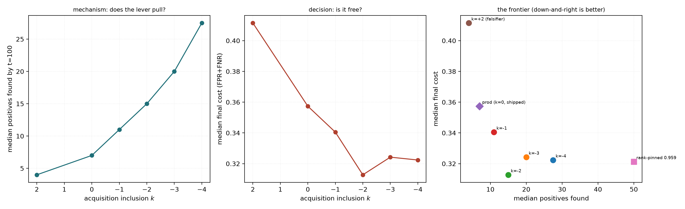
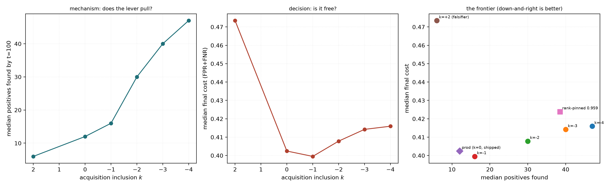
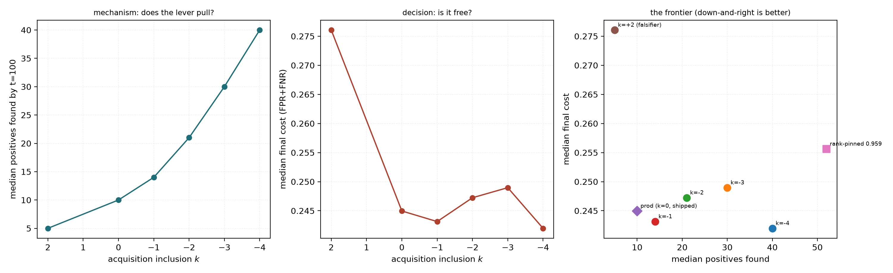
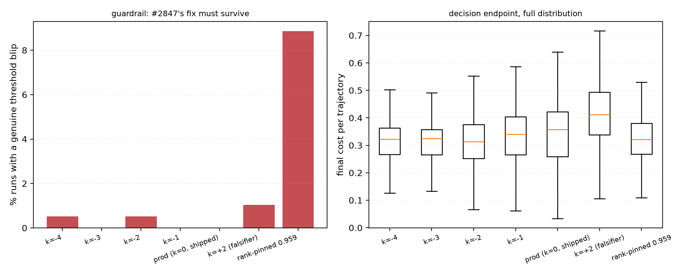
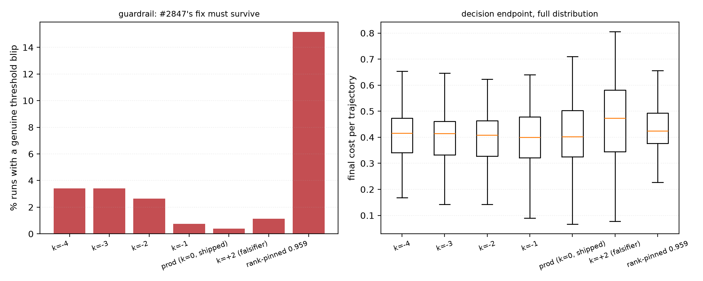
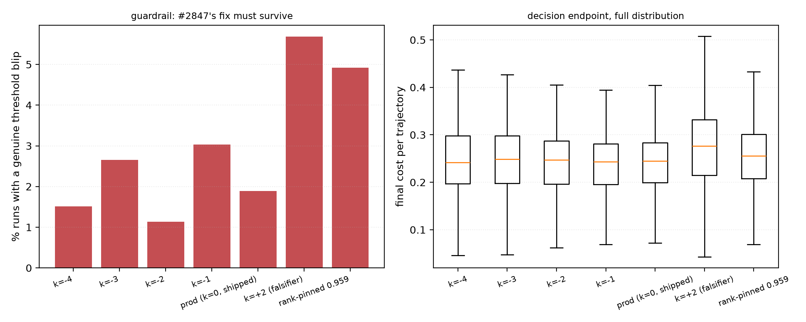

# The acquisition cut under real region voting — and why the split is not the voting mode

**Issue #2877, and the region-voting check #2905 was voided before it could
deliver · base dev `53dd14cb4` · branch `run/acq-incl-pile-2877` · GRID worktree
`/exp/sgreenberg/projects/vts-acq-2877` · study `/expscratch/sgreenberg/acq-2877`
· SLURM 590217–590247 (binary), 590289–590379 and 593036–593070 (region),
593071 (analysis) · 3192/3192 cells, 0 failures, 0 unreadable, 0 zero-byte,
0 header-only, zero GPU · 2026-08-29**

Pre-registered decision rules, written and committed before any arm cell
existed: [`PLAN_PILE_2877.md`](PLAN_PILE_2877.md) (with two amendments recorded
mid-run, before any contrast was read).

## BLUF

**The shipped `-1` survives its first real region-voting test, and the case for
gating the offset by voting mode is refuted — not because the modes agree, but
because the biggest disagreement is *inside* binary voting, where no mode gate
reaches.**

Three environments on one dataset, one grid:

| environment | mode | arms adopted | what binds |
|---|---|---|---|
| `siglip × whole_image` | binary | **−1, −2, −3, −4** | nothing — cost *falls*, no spikes |
| `siglip+dinov3_patch × whole_image` | binary | **−1 only** | **deep-spike incidence** (4.5% → 35.6%) |
| `siglip+dinov3_patch × max_patch` | **region** | **−1, −2, −3, −4** | nothing — cost flat, no spike rise |

`-1` is the only value that passes in all three. That is what ships.

**Region voting does not want a more conservative offset — it tolerates the most
aggressive one measured.** The hypothesis #2877 was built on ("region voting is
plausibly where the offset does *more*") is wrong in the direction it predicted
and right that the mode matters: measured as a difference-in-differences within
one embedder, the offset buys **less** under region voting, not more
(ΔAP +0.083 binary vs +0.024 region at k=−3; DiD −0.060, CI [−0.071, −0.049],
p < 1e-5).

**The binding criterion is threshold *stability*, not cost.** And it is the one
quantity that separates the modes cleanly on identical cells — see below.

## Why this run existed

Three environments had measured `ACQUISITION_INCLUSION_OFFSET` and none was the
check #2877 asked for.

| environment | mode | verdict on `-3` | status |
|---|---|---|---|
| `coco_val × siglip2` (#2876) | binary | ships — positives 4 → 18, cost −0.011 | stands |
| `visual_genome_m × siglip` (#2877) | **binary**, not region | fails — cost CI [+0.003, +0.022] | stands, wrong environment |
| `visual_genome_m × dinov3_patch` (#2905) | region | passed | **void** (PR #3119) |

#2877 justified itself on region voting's scoring geometry and ran an arm with
no `patch_grid`, so `region_voting=True` fell back to whole-image training,
whole-image scoring and the binary blend schedule. #2905 ran the real region arm
and lost it to #2943, which fixed `_score_pool` scoring the acquisition pool in
whole-image space while the threshold was cut in region max-pooled space — on
that run 39% of `k=−3` steps sat pinned above the entire pool, clamped exactly
where the decision was, while the falsifier moved away from the ceiling and was
spared. `docs/ML.md` has said ever since: *"The region-voting check is therefore
still outstanding."*

## The environment

**`vg_scale_any` × {`siglip`, `siglip+dinov3_patch`}**, read in place from the
shared pre-embedded pile — no GPU, no re-embed.

`vg_scale_any` (#3156 + #3115) is 12 hand-checked classes at 300 positives each
against one shared 3900-image negative pool, labelled from COCO's exhaustive
annotation and repaired by a human review pass. Cells are *designated*:
**prevalence is 7.1% in every one of them, by construction.**

That is why the run is not on `visual_genome_m`. #2910 measured this offset's
benefit as a decreasing function of positive supply (AP response slope −0.0207
on log prevalence); `visual_genome_m`'s selected categories run **25 to 1645
positives**, so a per-arm mean there averages over the axis the effect runs on.
Its thin categories also write header-only cells that pass every "N/N" tally.

**Both voting modes, one embedder between them.** The pair runs `whole_image`
*and* `max_patch` inside one task off one loaded pickle — one sim/test split,
one exemplar, one typed query — so the mode contrast is paired cell-for-cell and
differs only in the scoring geometry. #3115 reported a per-mode headline off a
grid whose binary cells were all SigLIP and region cells all DINOv3; preflight
check 13b refuses that shape and confirmed this one at launch.

**The premise was asserted, not assumed:** `patch_grid` on **7747/7747** medias,
and 24/24 selected cells opening on a typed query (`CALIB_REQUIRE_OPENING=text`).

**Before launching**, a probe answered #2905's first question — does the lever
diverge from `prod` at all? On an easy category and the hardest one, in both
modes: `acq_pool_percentile` moved 0.65 → 0.89 and 0.82 → 0.91, positives 4 → 27
and 8 → 23, and **nothing was pinned at 1.0 on any step of any arm.**

## The three environments

Tables below are **generated** by `per_env_acq_2877.py --markdown` from the same
trajectory frame the ship rule was computed on, not transcribed. That matters
here: `deep spikes` and `genuine blips` are different statistics — a genuine
blip is a deep spike additionally restricted to rankings good enough for the
threshold to be blamed (oracle ≤ 0.30) — and in the environment where the
verdict turns on them they differ by an order of magnitude.

`p (spikes)` is the paired McNemar contrast against `prod`, which is what the
ship rule reads; base rates are not comparable across environments.

### siglip x whole_image  (binary) — 192 pairs/arm

| arm | pos@100 | final cost | 95% CI on mean Δ cost | AP | oracle | deep spikes | p (spikes) | genuine blips | **ADOPT** |
|---|---:|---:|---|---:|---:|---:|---:|---:|:--:|
| `acq_m4` (-4) | 28 | 0.322 | [-0.0418, -0.0239] | 0.696 | 0.294 | 0.5% | 1.0000 | 0.5% | **yes** |
| `acq_m3` (-3) | 20 | 0.324 | [-0.0405, -0.0222] | 0.678 | 0.291 | 0.0% | 1.0000 | 0.0% | **yes** |
| `acq_m2` (-2) | 15 | 0.313 | [-0.0381, -0.0224] | 0.632 | 0.286 | 1.0% | 1.0000 | 0.5% | **yes** |
| `acq_m1` (-1) | 11 | 0.341 | [-0.0190, -0.0039] | 0.594 | 0.306 | 0.0% | 1.0000 | 0.0% | **yes** |
| `prod` (0) | 7 | 0.357 | — | 0.568 | 0.319 | 0.5% | — | 0.0% | — |
| `acq_p2` (2) | 4 | 0.411 | [+0.0533, +0.0731] | 0.539 | 0.369 | 10.9% | 0.0000 | 1.0% | falsifier ✓ |
| `rank_pin` (pin) | 50 | 0.321 | [-0.0292, -0.0073] | 0.739 | 0.294 | 10.9% | 0.0000 | 8.9% | no |

Adopted: **acq_m4, acq_m3, acq_m2, acq_m1**. Falsifier behaved: True. Power: n ≈ 164 needed for ±0.010, 192 delivered (paired SD 0.0653).

### pair   x whole_image  (binary) — 264 pairs/arm

| arm | pos@100 | final cost | 95% CI on mean Δ cost | AP | oracle | deep spikes | p (spikes) | genuine blips | **ADOPT** |
|---|---:|---:|---|---:|---:|---:|---:|---:|:--:|
| `acq_m4` (-4) | 47 | 0.416 | [-0.0131, +0.0044] | 0.625 | 0.383 | 35.6% | 0.0000 | 3.4% | no |
| `acq_m3` (-3) | 40 | 0.414 | [-0.0208, -0.0034] | 0.627 | 0.379 | 28.8% | 0.0000 | 3.4% | no |
| `acq_m2` (-2) | 30 | 0.408 | [-0.0251, -0.0097] | 0.606 | 0.373 | 22.7% | 0.0000 | 2.7% | no |
| `acq_m1` (-1) | 16 | 0.400 | [-0.0227, -0.0076] | 0.550 | 0.376 | 6.1% | 0.4545 | 0.8% | **yes** |
| `prod` (0) | 12 | 0.402 | — | 0.517 | 0.382 | 4.5% | — | 0.4% | — |
| `acq_p2` (2) | 6 | 0.473 | [+0.0498, +0.0683] | 0.476 | 0.446 | 14.8% | 0.0001 | 1.1% | falsifier ✓ |
| `rank_pin` (pin) | 38 | 0.424 | [+0.0159, +0.0438] | 0.634 | 0.378 | 25.0% | 0.0000 | 15.2% | no |

Adopted: **acq_m1**. Falsifier behaved: True. Power: n ≈ 203 needed for ±0.010, 264 delivered (paired SD 0.0726).

### pair   x max_patch    (REGION) — 264 pairs/arm

| arm | pos@100 | final cost | 95% CI on mean Δ cost | AP | oracle | deep spikes | p (spikes) | genuine blips | **ADOPT** |
|---|---:|---:|---|---:|---:|---:|---:|---:|:--:|
| `acq_m4` (-4) | 40 | 0.242 | [-0.0043, +0.0093] | 0.785 | 0.218 | 1.5% | 0.5078 | 1.5% | **yes** |
| `acq_m3` (-3) | 30 | 0.249 | [-0.0064, +0.0063] | 0.789 | 0.217 | 3.8% | 0.6072 | 2.7% | **yes** |
| `acq_m2` (-2) | 21 | 0.247 | [-0.0114, -0.0009] | 0.780 | 0.208 | 1.5% | 0.5488 | 1.1% | **yes** |
| `acq_m1` (-1) | 14 | 0.243 | [-0.0097, +0.0005] | 0.771 | 0.212 | 3.4% | 0.7744 | 3.0% | **yes** |
| `prod` (0) | 10 | 0.245 | — | 0.762 | 0.218 | 2.7% | — | 1.9% | — |
| `acq_p2` (2) | 5 | 0.276 | [+0.0294, +0.0444] | 0.741 | 0.241 | 7.6% | 0.0072 | 5.7% | falsifier ✓ |
| `rank_pin` (pin) | 52 | 0.256 | [+0.0023, +0.0140] | 0.805 | 0.220 | 5.3% | 0.1892 | 4.9% | no |

Adopted: **acq_m4, acq_m3, acq_m2, acq_m1**. Falsifier behaved: True. Power: n ≈ 122 needed for ±0.010, 264 delivered (paired SD 0.0563).

Reading them:

**`siglip × whole_image`** — cost does not merely fail to regress, it **falls**,
by 0.022–0.042, against a rule that only asked the upper bound to sit below
+0.010. AP rises *and* oracle cost falls together: COCO's starved-regime
pattern, where any positive helps globally. Nothing binds; every negative-`k`
arm adopts.

**`siglip+dinov3_patch × whole_image`** — `-2`, `-3` and `-4` are rejected **on
the guardrail alone**. Their cost deltas are *negative* and their CIs clear the
tolerance; what fails is deep-spike incidence, 4.5% → 22.7 / 28.8 / 35.6%, all
p < 1e-4. The genuine-blip contrast rises too (0.4% → 3.4%, p = 0.02), so this
is not merely an artefact of a hard ranking tripping an absolute threshold.

**`siglip+dinov3_patch × max_patch` (region)** — the check #2877 asked for.
**Every negative-`k` arm passes.** Cost is flat across the whole sweep — moved
by less than 0.01 in either direction — while positives go 10 → 40 and AP
0.762 → 0.789. Deep-spike incidence does not rise at any `k` (p = 0.51–0.77).

## The mechanism: region voting removes the instability, not the cost

The two modes above are the **same 264 cells** — same images, same splits, same
exemplar, same typed query, same DINOv3 vectors. Only the scoring geometry
differs. So the contrast is attributable.

**What region voting changes is not the price of acquisition but the stability
of the threshold under it.**

| | binary (whole_image) | region (max_patch) |
|---|---:|---:|
| `prod` oracle cost | 0.382 | **0.218** |
| `prod` AP | 0.517 | **0.762** |
| deep spikes, `prod` → `k=−4` | 4.5% → **35.6%** | 2.7% → **1.5%** |

Max-pooling over region nodes produces a far better-separated score
distribution, so the fitted mixture the cut is read from stays well-conditioned
as acquisition biases the sample. Whole-image scoring of the very same vectors
is a harder ranking, and aggressive acquisition destabilises the cut on it — an
8× rise in deep spikes at k=−4.

The difference-in-differences prices the rest, `(arm − prod | region) −
(arm − prod | binary)`, paired within `siglip+dinov3_patch`, n = 264:

| metric | `acq_m1` | `acq_m2` | `acq_m3` | `acq_m4` |
|---|---:|---:|---:|---:|
| final AP | −0.022 *** | −0.053 *** | −0.060 *** | −0.062 *** |
| final cost | +0.011 * | +0.011 | +0.012 * | +0.007 |
| oracle cost | +0.008 * | +0.009 * | +0.015 ** | +0.018 *** |
| positives@100 | −2.6 ** | −7.3 *** | −3.8 ** | +0.01 |

`***` p<1e-3, `**` p<0.01, `*` p<0.05.

**The offset does strictly less under region voting**, on every quality metric,
and the effect is large and unambiguous on AP. It is not that region voting
resists the lever — positives rise identically at k=−4 — but that region voting
has *already done the work* the offset would otherwise buy. There is less
headroom, so there is less to gain, and correspondingly less to lose.

## Why a voting-mode gate is not the answer

The natural reading of "the modes differ, significantly, on every metric" is
`ACQUISITION_INCLUSION_OFFSET_BY_MODE`. This run refuses it, for the reason
#2909 gave and can now demonstrate:

**The two *binary* environments disagree with each other more than the modes
do.** `siglip × whole_image` adopts every arm down to −4 with cost *falling* 0.04
and essentially no spikes; `pair × whole_image` adopts only −1 and rejects the
rest on a 22–36% spike rate. Both are binary voting, on the same dataset, the
same categories, the same seeds, the same opening. The only thing that differs
is which embedding space the detector learns in.

A gate keyed on voting mode would put those two on the same side and split the
pair's two styles apart — precisely backwards. The variance that matters here
runs along the **environment**, and specifically along how well-separated the
score distribution is, which the voting mode only partially predicts.

`-1` passes in all three environments. It remains the right global value, and
it is what ships.

## What did transfer, in all three environments

**`rank_pin` is rejected in all three, for the same reason.** It finds the most
positives of any arm in every environment (50, 38 and 52 per 100 votes) and the
best AP in two of them — and it carries genuine-blip rates of 8.9%, 15.2% and
4.9% against controls of 0.0%, 0.4% and 1.9%, plus an outright cost regression
under region voting (CI [+0.0023, +0.0140]). A cut pinned at a fixed quantile is
maximally aggressive from step 1, against a model trained on almost nothing.
**The adaptive ramp is what makes the offset safe, not the aggression** —
#2876's finding, now reproduced in three more environments.

**The falsifier falsified in all three**, on every endpoint. Positives fall
7→4, 12→6 and 10→5; the 95% CI on the mean cost delta is [+0.053, +0.073],
[+0.050, +0.068] and [+0.029, +0.044] — the wrong side of zero everywhere; and
median AP falls 0.568→0.539, 0.517→0.476 and 0.762→0.741. The mechanism the
whole table rests on is supported in every environment.

## Corrections to my own pre-registration

**The deep-spike guardrail was predicted to be saturated here. It is not — and
that turned out to matter.** The plan reasoned that `SPIKE_DEEP_COST = 0.25` is
absolute and calibrated to COCO's ~0.137 scale, so a base rate near 24% (as in
#2877) would swamp it. But a deep spike needs a high absolute cost **and** a
≥0.20 excess over the oracle, and in two of three environments cost is high
because the *ranking* is hard, so the excess is small. Base rates come out at
0.5%, 4.5% and 2.7%. **That left the guardrail live, and it is the criterion the
whole verdict turns on** — every rejection in environment 2 is a spike rejection,
not a cost one. Had the prediction been right, the guardrail would have been
uninformative and this run would have adopted `-4` in two environments on cost
alone.

The corrected rule: an absolute threshold does not transfer, and *which
direction* it fails in depends on whether the environment's cost is driven by
the cut or by the ranking.

**The region half was topped up from 16 to 22 seeds mid-run** (Amendment 1),
after the pair's binary mode measured a paired SD of 0.073 — n ≈ 203 against the
192 that 16 seeds gives. Recorded before any contrast was read. All three
environments are now powered on their own decision endpoint: 192/164, 264/203,
264/122.

## Provenance

3192 cells, 3192 read. Zero unreadable, zero zero-byte, zero header-only, zero
cells that never found a positive, across all 14 arrays.

| half | arms | cells/arm | read |
|---|---|---:|---:|
| `bin` | 7 | 192 | 192/192 each |
| `reg` | 7 | 264 | 264/264 each |

## Figures

Per environment, drawn by `per_env_acq_2877.py --figures` from the same
trajectory frame as the tables above. The per-mode set (`binary_*`, `region_*`)
pools the two binary environments and is kept only for continuity with the
analyzer's own output; **read the per-environment set.**

## What this run does not answer

* **The supply question (#2910).** Prevalence is flat here by construction, so
  this grid cannot place a supply-dependent offset — and cannot be contaminated
  by supply either. Given that the split here runs along score separability
  rather than along supply, #2910's premise deserves re-examination against
  these three environments before it is built.
* **Free-text VG.** `vg_scale_any` is COCO-labelled by design, which is what
  makes its negatives trustworthy.
* **Cross-run comparison of anything that depends on how a run starts.**
  #2876/#2877 predate #3269 and seeded from a crop of a boxed positive, a
  ranking no user produces. Every cell here opens on a typed query.
