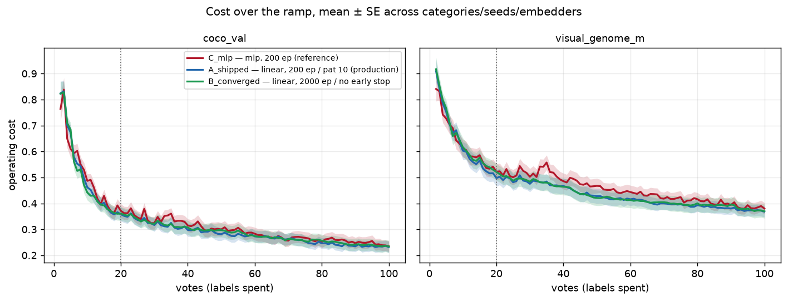
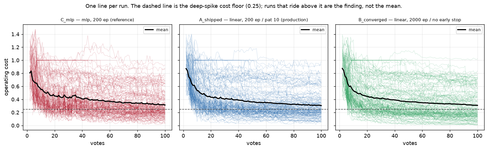
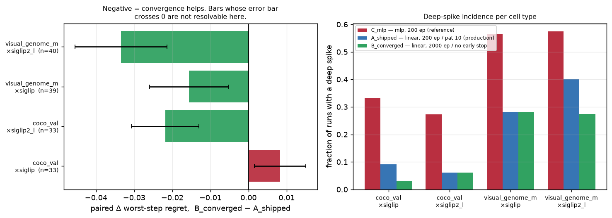
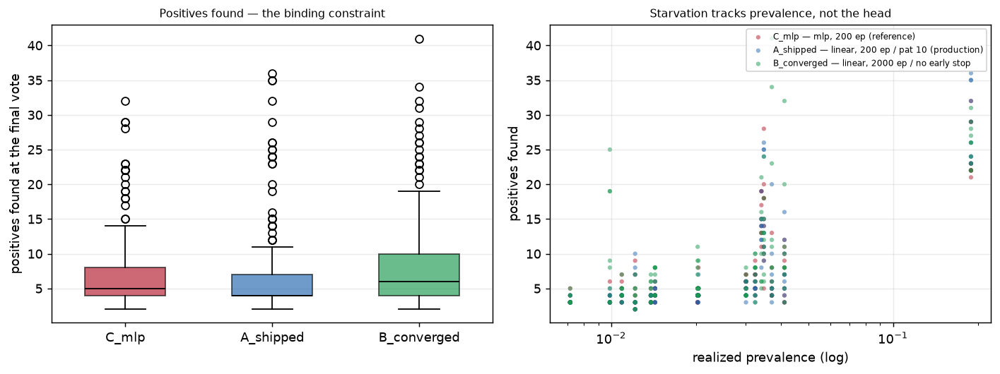

# #2808 — Is the linear head's spike reduction limited by early stopping?

> # ⚠️ SEEDING CAVEAT — these runs did not start the way the app does
>
> **Recorded 2026-08-26 (#3156).** Autopilot seeds its first three Good votes from
> a **text sort**: the user types a query and votes down that ranking. Until
> PR #3269 this harness instead ranked every item by cosine to a **crop of one
> boxed positive** — a ranking no user ever produces — and passed it as
> `seed_scores`, the argument that `al_strategies`, `EVAL.md` and
> `voting_iterations` all describe as "similarity to the **typed query**".
>
> **What to distrust here:** anything that depends on *how a run starts* —
> positive starvation, stuck or never-got-going runs, `n_good`, and
> early-trajectory cost. Measured on one cell after the fix, text seeding put the
> first positive at **rank 1** with five in the top 20, while the exemplar that
> crop-seeding made look like the dataset's hardest positive ranked **4006 of
> 7749** for its own class.
>
> **What still holds:** within-study contrasts where every arm seeded identically,
> which is most of what these reports conclude — the seeding is a shared baseline
> shift, not an arm-dependent one.
>
> See [the harness seeded from a crop](../../../scripts/experiments/lessons/2026-08-26-the-harness-seeded-from-a-crop.md).

**Verdict: no, and the question was built on a misread number.** The "the torch
head is only worth 0.79" figure that motivated this issue is #2847's
*conformal-threshold* pair. Under the threshold we actually ship, #2847's own
table says **0.46**, and this run reproduces that at **0.49** on a different
grid. Early stopping does not need to explain anything.

Convergence does buy a real but small improvement on top of the shipped head —
**−0.016 ± 0.005** in worst-step regret — but it **vanishes on the shipped
default embedder**, leaves the end state unchanged (`final_cost` +0.002 ± 0.010,
not resolvable), and costs **~5.3×** in training. **Do not raise `TRAIN_EPOCHS`
on this evidence.** The one result worth acting on points elsewhere: convergence
finds **+1.2 ± 0.5 more positives**, and positives — not spikes — are the
binding constraint.

- **Run:** 450 cells (150 per arm), 0 failures, 0 zero-byte, 0 unreadable.
- **Grid:** `coco_val` + `visual_genome_m` × `siglip` + `siglip2_l`, 13
  categories, 5 seeds, 100 votes, binary voting, production fold-anchored cut.
- **Data:** `/expscratch/$USER/linhead-2808`. Analysis:
  [`analyze_spikes.py`](../../../scripts/experiments/calibration/analyze_spikes.py)
  (`SPIKE_ARMS`), figures:
  [`make_linhead_figs.py`](../../../scripts/experiments/calibration/make_linhead_figs.py),
  launcher:
  [`launch_linhead_2808.sh`](../../../scripts/experiments/calibration/launch_linhead_2808.sh).

## The arms

All three ride today's production fold-anchored GMM cut. Only the head and its
training budget move, so every contrast below is a head/budget contrast and
never a threshold one.

| arm | head | budget | role |
|---|---|---|---|
| `C_mlp` | mlp | 200 ep / patience 10 | positive control (#2847's `B_mlp_fused`) |
| `A_shipped` | linear | 200 ep / patience 10 | **production**, and the fidelity check (#2847's `D_lin_fused`) |
| `B_converged` | linear | 2000 ep / no early stop | the fidelity test's convergence conditions |

Deep spike = a step at `t ≥ 20` with `cost ≥ 0.25` **and**
`cost − oracle_cost ≥ 0.20`, i.e. a threshold failure, not a ranking failure.
Pre-registered in #2847 and reused unchanged.

## The premise dissolves

`C_mlp` reproduces the phenomenon (45% of runs deep-spike), so the harness can
see what it is being asked about. The head contrast against it:

| contrast | this run | #2847 | agreement |
|---|---|---|---|
| head alone, **fold-anchored cut** (production) | 45% → 22% = **0.49** | 26.5% → 12.2% = **0.46** | ✅ |
| head alone, **conformal cut** (retired) | not run | 58.5% → 46.3% = **0.79** | — |

**The 0.79 everyone quoted is the second row.** It is the head's effect under a
threshold rule production replaced in #2852/#2861/#2865. Under the cut we ship,
the head is worth ~0.46–0.49 — roughly twice the effect the issue was written to
explain away. Reproducing 0.46 as 0.49 across a different dataset mix *and* a
different embedder is the strongest evidence in this report that the two studies
are measuring the same stack.

So the discrepancy that justified this issue is an artifact of which cell of a
2×2 gets quoted, not a property of the head. **Early stopping is not the
explanation, because there is no longer a gap to explain.**

## What convergence actually buys

Paired at the (dataset, embedder, category, seed) cell, `B_converged` −
`A_shipped`. Negative favours convergence. n = 145 pairs.

| metric | mean Δ ± SE | median Δ | frac lower | p | resolvable? |
|---|---|---|---|---|---|
| worst-step regret | **−0.016 ± 0.005** | −0.017 | 65% | 0.0007 | yes |
| max local jump | **−0.009 ± 0.004** | −0.009 | 62% | 0.005 | yes |
| worst-step cost | −0.000 ± 0.007 | −0.007 | 55% | 0.27 | **no** |
| final cost | +0.002 ± 0.010 | −0.008 | 54% | 0.30 | **no** |
| positives found | **+1.23 ± 0.51** | +1.0 | — | 0.001 | yes |

Deep-spike incidence falls 22% → 17%. But the two metrics a user actually
experiences — what the run *costs at the end*, and how bad its worst step is in
absolute terms — are **not resolvable at this sample size**. That is a finding,
not a gap: convergence reshapes the tail without moving the outcome.

*Cost over the votes the user spends, mean ± SE across categories, seeds and
embedders, split by dataset. The dotted line is the `t = 20` warm boundary; cold
start is a different phenomenon (no model yet) and is excluded from every spike
statistic. Read the separation, not the absolute level — the two datasets have
different prevalence and are not comparable to each other.*

*The same metric, one line per run. The mean (black) descends smoothly in all
three panels and is the least representative object in the figure: individual
runs plateau, spike, and some never leave the floor. The dashed line is the
deep-spike cost threshold (0.25). This does not license reading any single
trace as typical.*

## Where it does not hold: the shipped default

The pooled −0.016 is an average across a grid on which the effect is not
uniform. Broken out:

| dataset × embedder | n | paired Δ ± SE | deep-spike A → B |
|---|---:|---|---|
| `coco_val` × **`siglip`** (shipped default) | 33 | **+0.008 ± 0.007** | 9.1% → 3.0% |
| `coco_val` × `siglip2_l` | 33 | −0.022 ± 0.009 | 6.1% → 6.1% |
| `visual_genome_m` × **`siglip`** | 39 | −0.016 ± 0.010 | 28.2% → **28.2%** |
| `visual_genome_m` × `siglip2_l` | 40 | −0.033 ± 0.012 | 40.0% → 27.5% |

*Left: paired Δ worst-step regret per cell type, ± SE. Negative (green) favours
convergence; the one red bar is COCO on the shipped default, where converging is
marginally worse and the error bar crosses zero. Right: deep-spike incidence.
The bars are unpaired and are shown for shape, not for significance — the paired
panel on the left is what licenses a claim.*

On the **shipped default embedder**, COCO shows a small effect in the *wrong*
direction that the error bar does not resolve, and VG shows a regret improvement
with **incidence completely unchanged** (28.2% → 28.2%). The gains concentrate on
`siglip2_l`, an opt-in encoder. A config change justified by a benefit that is
absent on the default is not a config change worth its 5.3× price.

**The 5.3× is itself evidence.** Cells cost 10.5 min converged against 2.0 min
shipped — not the ~10× the epoch budget implies, because `TRAIN_PATIENCE = 10`
was already halting most fits well short of 200 epochs. The shipped head is less
under-trained than the issue's ~0.77 rank-correlation figure suggests.

## The surviving spikes changed *kind*

The aggregate says the linear head spikes less. It does not say the remaining
spikes are the same spikes. Median values **on spike steps only**:

| arm | FNR | FPR | positives held | what it is doing |
|---|---|---|---|---|
| `C_mlp` | 0.11 | **0.34** | 3 | **over-including** — sweeping in negatives |
| `A_shipped` | **0.75** | 0.04 | 3 | **starving** — missing nearly everything |
| `B_converged` | **0.79** | 0.04 | 3 | starving |

The head swap did not simply reduce a failure; it **traded an over-firing
failure for a starving one**. Both cost the same by the study's cost metric,
which is why an incidence count alone cannot see it. This matters because
starvation compounds — a run that finds no positives trains on nothing and
acquires worse — and it is consistent with #2847's open finding that production
finds half as many positives as the MLP era did.

It is also dataset-split: VG carries essentially all of it (834 spike steps for
`A_shipped` vs COCO's 36), so "production starves at its spikes" is a claim about
VG, not a universal one.

## The binding constraint is positives, not spikes

*Left: positives found at the final vote. Medians are mlp 5, shipped 4,
converged 6 — the shipped head finds the fewest. Right: the same quantity against
realized prevalence (log axis). The collapse at low prevalence is the constraint;
no arm escapes it, and arm differences are small beside it.*

Literal examples, so this is checkable rather than asserted. The categories that
starve are the rarest ones, and the ordering is prevalence, not semantics:

| dataset | category | realized prevalence | median positives (`A_shipped`) |
|---|---|---|---|
| `visual_genome_m` | `cat` | 0.0072 | 3.0 |
| `coco_val` | `bear` | 0.0099 | 3.5 |
| `coco_val` | `microwave` | 0.0109 | 4.0 |
| `visual_genome_m` | `ball` | 0.0122 | 3.0 |
| `visual_genome_m` | `laptop` | 0.0138 | 4.0 |
| `visual_genome_m` | `sink` | 0.0143 | 4.0 |

**5 of 150 cells per arm never found a positive at all** (100 votes, zero
positives, so the simulator never trained and the cell emits no step). They are
excluded from every paired test above, are the same 5 in each arm, and are the
extreme of exactly this regime rather than a failure.

**These are ordinary object classes, not the broken labels.** #3129 found VG's
`sky` and `nose` annotations missing on 6.6–9.5% of flagged images, which would
make "starvation" an annotation artifact. `nose` is in this grid and does *not*
appear among the starving or spiking categories; the categories that do are
`cat`, `bear`, `microwave`, `ball`, `laptop`, `sink`, `bed`, `bus`. So this is a
prevalence effect, not #3129's label defect.

**What is owed here and not delivered:** per-item dumps (score, threshold, file
id, every label the dataset carries) for the starving cells. They were not
collected, and without them "the model missed it" and "the label is missing"
cannot be separated *item by item* on VG — only ruled out at the category level
as above. `VTS_DUMP_TEST_SCORES` with `launch_errdump.sh` is the path; it needs a
profile matching this grid.

## What to do

- **Do not raise `TRAIN_EPOCHS` or relax `TRAIN_PATIENCE`.** The benefit is
  absent on the shipped default, invisible in final cost, and costs 5.3×.
- **Stop quoting 0.79 as the head's contribution.** It is threshold-conditional.
  Under the shipped cut the head is worth ~0.46–0.49, which is most of what
  #2790 originally claimed.
- **Chase positives, not spikes.** +1.2 positives from convergence is the only
  result here that moves the constraint #3129 identified as binding. The
  cheap next probe is whether *acquisition* changes (not head changes) recover
  it, since starvation compounds through acquisition.
- **The `logreg` reference arm (#2808 item 1) is arguably moot.** It existed to
  give the early-stopped torch head something to be early-stopped *relative to*.
  `B_converged` does that with the same objective and the same code path, which
  is a cleaner instrument than a cross-implementation sklearn comparison. The
  owner should decide whether anything is still owed.

## Caveats

- **The fidelity check crosses an embedder change.** #2847 ran `siglip2`, a
  middle rung the pile deliberately dropped (see the pile README); this study
  runs `siglip` and `siglip2_l`. 0.49-vs-0.46 is therefore an approximate
  agreement across a changed encoder, and a mismatch would not by itself have
  been a finding.
- **No cross-harness comparison to #2790.** That study's `whole` path ran the
  superseded min-cost argmin threshold rule, so a delta against its numbers
  would confound the head with the threshold rule. Nothing here is scored against
  it; the 0.46/0.49 agreement is within-codebase, against #2847.
- **Binary voting only.** No arm here region-votes: `siglip` and `siglip2_l` are
  single-vector embedders, so a boxed dataset runs as binary. Everything above is
  a binary-voting result and says nothing about the region path.
- **145 of 150 trajectories per arm.** The 5 no-positive cells are reported
  above rather than silently dropped.
