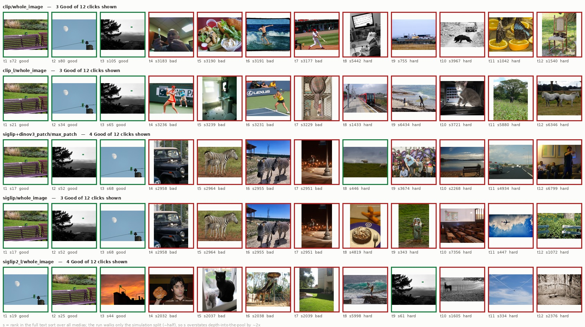
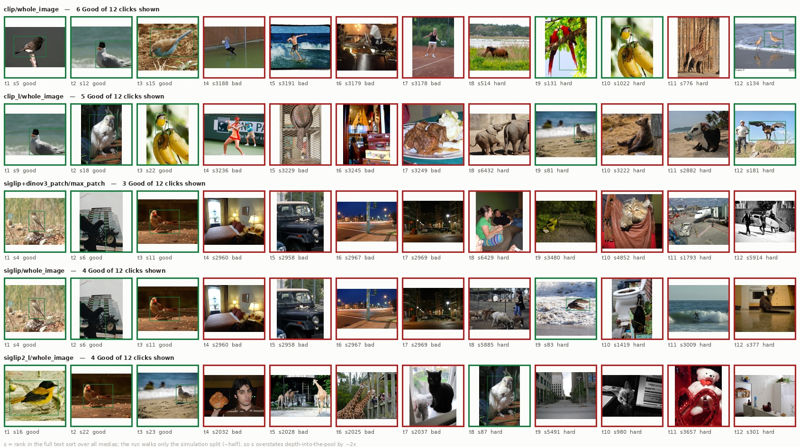
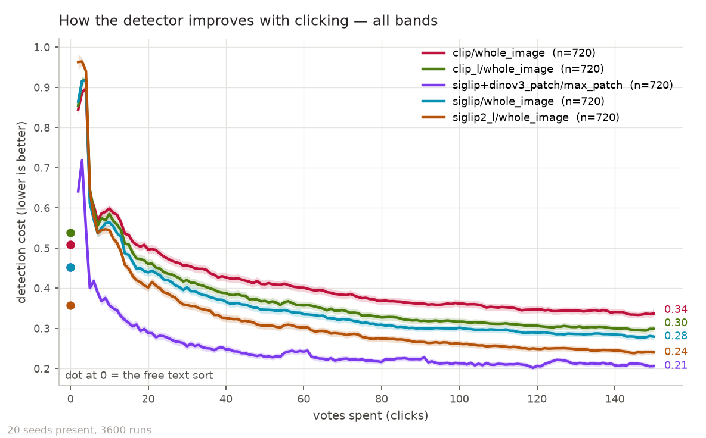
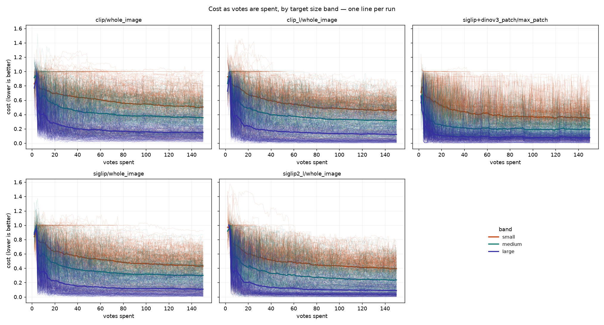
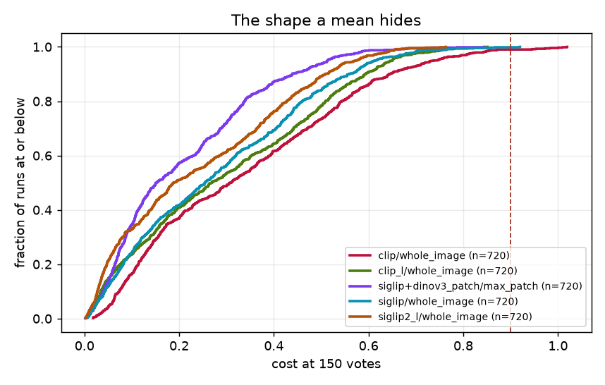
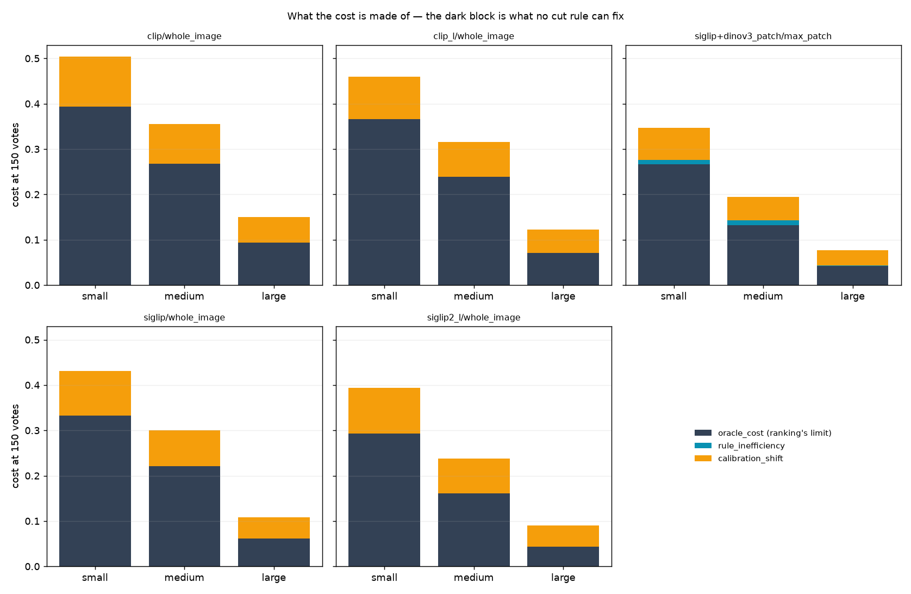
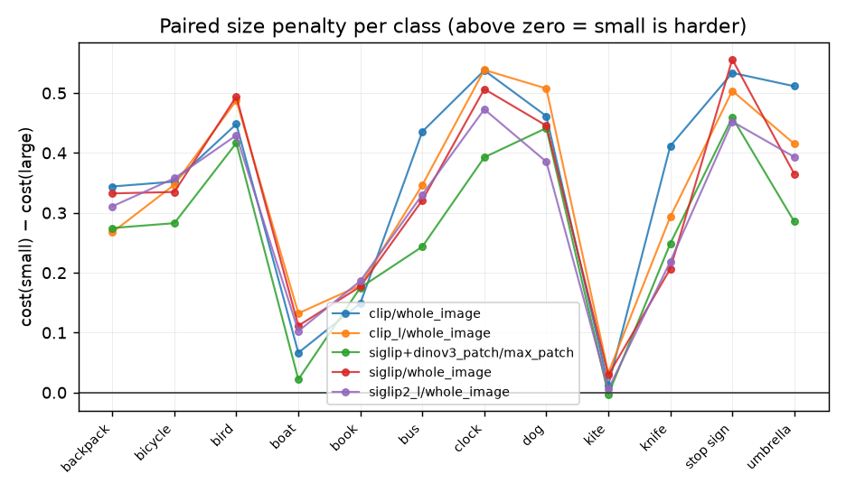
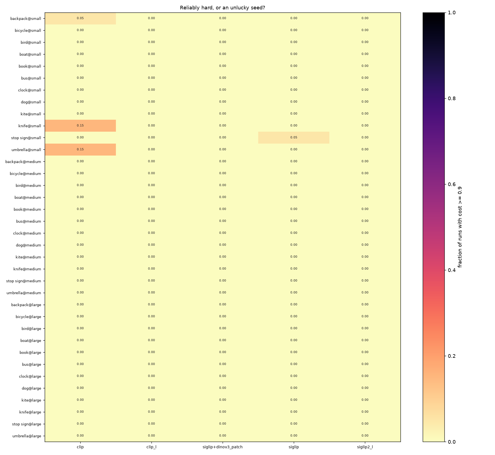

# Where VTSearch stands on `vg_scale`

**A map, not a decision.** Five configurations a user could be in, run over the
same twelve classes at three target sizes, under shipped defaults, and described
rather than ranked. Nothing here is a proposal to change anything.

**Grid:** array 582417, `/expscratch/$USER/scale-3156-map`, 2026-08-28.
**3600 / 3600 cells, 0 missing, 0 unreadable, 526,873 metric rows.**
36 cells (12 classes × {small, medium, large}) × 5 columns × 20 seeds, 150 votes
each. The dataset is [`DATASHEET.md`](DATASHEET.md): 7,747 images, exactly 100
positives per cell against one shared negative pool, prevalence 0.0250
everywhere by construction, so a difference between bands is a difference of
**size** and nothing else.

## The five columns

| column | what it is | a user can pick it? |
|---|---|---|
| `siglip` / whole image | the shipped default | yes |
| `siglip2_l` / whole image | the premium encoder | yes |
| `clip` / whole image | a second lineage (ViT-B/32, 512-d) | yes |
| `clip_l` / whole image | ViT-L/14, 768-d | **no — `eval_only`** |
| `siglip+dinov3_patch` / max_patch | region voting: SigLIP ranks the opening, DINOv3 learns | yes |

`clip_l` is a **reference column, not a mode**. It is not offered in the app; it
is here because its 768-d output matches `siglip`'s exactly, so a SigLIP-vs-CLIP
difference cannot be read as "CLIP's vectors are narrower". Read it as *what a
bigger CLIP would do*, never as advice.

Every column opens the same way — a typed query, text-sorted — which is what the
pair exists to make true (#3276). All 3600 cells record `seed_mode=text`.
Shipped defaults include the per-space Train/Calibrate split (#3290): 0.3 in the
four single-vector columns, 0.5 on the pair, resolved per cell and recorded in
the `calibration_fraction` column.

## Start here, not with this page

**[`viewer.html`](viewer.html)** carries every slice of this run — any metric
(cost, precision, recall, F1, FPR, FNR, AP, AUROC), any category, any band, any
subset of columns, seeds averaged or one line each. Everything below is one
slice of it, chosen in advance; the viewer is where you ask your own question
instead of asking for a re-run. Its **Target size** control is the axis this
study is about, and the notch in each chart's left margin is the free text sort.

Tick **overlay on one chart** to put all five columns on one pair of axes in
distinct hues — that is the five-way comparison this report keeps making in
tables, drawn. Off (the default) each column gets its own chart with the ±1 SD
spread of the population shaded under its line, which is the only arrangement
where that shadow is readable.

Two more of its controls carry quantities no PNG here does.

Tick **oracle threshold** and every solid line gains a dotted companion: the
same momentary model, cut where the test labels say it should have been cut.
The gap between the two is the **calibration regret** — what the threshold rule
left on the table with the model held fixed, which is a different quantity from
what a better model would have bought. It is offered on the six metrics that
are statements about one cut, and withheld on AP and AUROC, which integrate over
every threshold and so cannot move when the cut does; there the box disables
itself and says why.

The notch in each chart's **right** margin is the **supervised skyline**
(#3322): the same head, through the same trainer, handed every label in the
training split. It is the learnability floor of that column's embedding space,
so the drop from the curve to the notch is what better clicking could still buy
and the notch itself is what only a better space can move. It does not shift as
the reader clicks, which is why it is a notch and not a rule across the panel.

`siglip+dinov3_patch` has none. The v1 skyline is scoped to whole-image columns:
a patch column's floor needs a supervision decision — ground-truth boxes against
a multiple-instance problem — that is still open on #3321, and the harness skips
it rather than improvising one.

Both were added after the run (#3326). The oracle cut needed no new compute:
`oracle_cost`, `oracle_fpr`, `oracle_fnr` and the split's class counts are on
every base row this grid ever wrote, and the page reconstructs precision, recall
and F1 at that cut from them. The floor did, and it was collected by a second
pass over the same cells rather than by re-running the loop — the skyline is
vote-independent, so a later pass measures the same quantity, where a re-run
would have replaced the very curves the tables below are read off.

## What a session actually looks like

Twelve clicks of one `bird@small` session, the same seed in all five columns —
green is a Good vote, red a Bad one, `s` is the item's rank in the full text
sort:

Two things are visible here that no table shows. The first three clicks of
`siglip` and of the pair are **the same three images in the same order**
(`s17`, `s52`, `s68`) — the pair opens on SigLIP's sort by construction, so its
Good phase is SigLIP's Good phase, and the phase table below reports byte-for-byte
identical click counts for the two. And what the runs vote on after that is
mostly not birds: a sandwich, a surfer, a cat, zebras. That is the `bad` phase
doing its job, and it is what the small band costs.

The same class at the large end is a different product:

## Cost at 150 clicks

Cost is the harness's operating-point cost (weighted FPR+FNR); lower is better.
Distribution over the 720 runs in each column, because the tail is the product
problem and a mean hides it:

| column | p10 | median | p90 | worst |
|---|---:|---:|---:|---:|
| `siglip+dinov3_patch` / max_patch | 0.04 | **0.15** | 0.44 | 0.84 |
| `siglip2_l` / whole image | 0.03 | 0.19 | 0.51 | 0.76 |
| `siglip` / whole image | 0.04 | 0.25 | 0.56 | 0.92 |
| `clip_l` / whole image | 0.03 | 0.27 | 0.59 | 0.85 |
| `clip` / whole image | 0.07 | 0.31 | 0.64 | 1.02 |

*Mean over all 720 runs per column, ±SE shaded, endpoints labelled. The dot at
click 0 is that column's own free text sort — see the next section. `siglip`'s
dot and the pair's sit on top of each other because they are the same sort.*

Averages hide shape, so the same data one line per run, and as a distribution:

### Where the cost lives

`cost = oracle_cost + regret` — the best any threshold could do on that run's own
ranking, plus what the shipped cut gives away on top of it. Mean ± SE over 720
runs:

| column | cost | oracle | regret | regret share |
|---|---:|---:|---:|---:|
| `siglip+dinov3_patch` / max_patch | 0.21 ± 0.01 | 0.15 ± 0.00 | 0.06 ± 0.00 | 0.29 |
| `siglip2_l` / whole image | 0.24 ± 0.01 | 0.19 ± 0.01 | 0.05 ± 0.00 | 0.20 |
| `siglip` / whole image | 0.28 ± 0.01 | 0.23 ± 0.01 | 0.05 ± 0.00 | 0.19 |
| `clip_l` / whole image | 0.30 ± 0.01 | 0.25 ± 0.01 | 0.05 ± 0.00 | 0.18 |
| `clip` / whole image | 0.34 ± 0.01 | 0.27 ± 0.01 | 0.06 ± 0.00 | 0.19 |

**Four fifths of the cost is the ranking, in every column.** The columns are
separated almost entirely by their `oracle_cost` — the spread there is 0.15 to
0.27 — while `regret` is 0.05–0.06 everywhere and does not distinguish them.
Whatever a user experiences as the difference between these five configurations
is the order the items come back in, not where the cut lands.

A caution about that figure's two upper blocks. `regret` splits into
`rule_inefficiency` and `calibration_shift`, and on this grid the first is
**negative** in all four whole-image columns (−0.02 to −0.03) against a
`calibration_shift` of 0.07–0.08 — i.e. the shipped cut lands *better* out of
sample than the best cut on the calibration scores. That is worth knowing and
not worth building on: the two terms are constrained to sum to `regret` and
[#3287](../../../scripts/experiments/calibration/analyze_calfrac.py) measured
them moving 1.3–8.2× more than `regret` itself while anticorrelating −0.6 to
−0.999. Read the sum; treat a story about either half alone as unsupported.

## Did the clicking earn its keep?

Click 0 is not a zero. It is the product's cheap path — type the query, read the
ranked haystack under the same cut — and it costs nothing:

| column | free text sort | @20 clicks | @150 clicks | median cell crosses at | cells never crossing |
|---|---:|---:|---:|---:|---:|
| `siglip+dinov3_patch` / max_patch | 0.45 | **0.29** | 0.21 | **5** | 1 / 36 |
| `siglip2_l` / whole image | **0.36** | 0.40 | 0.24 | **29** | 4 / 36 |
| `siglip` / whole image | 0.45 | 0.44 | 0.28 | 17 | 1 / 36 |
| `clip_l` / whole image | 0.54 | 0.46 | 0.30 | 11 | 0 / 36 |
| `clip` / whole image | 0.51 | 0.50 | 0.34 | 13 | 2 / 36 |

*"Crosses at" is the median cell's first click whose mean cost is at or below its
own text sort.*

**The best free sort belongs to the column with the least to gain from
clicking.** `siglip2_l` starts at 0.36 where everything else starts at 0.45–0.54,
and it is *worse than its own text sort at 20 clicks* (0.40), taking a median of
29 clicks to get back to where typing had already put it — on 4 of its 36 cells
it never does inside 150. The pair is the opposite: it starts where `siglip`
starts, is ahead of it by click 5, and ends lowest.

Every column also gets **worse before it gets better** — the curves spike to
0.85–0.96 in the first handful of clicks, well above every anchor, before
descending. A user who types a query, votes a few times and looks at the result
is, at that moment, looking at something worse than what they had before they
started.

## Target size

The axis the dataset was built for. Cost at 150 clicks:

| column | small | medium | large | paired small − large |
|---|---:|---:|---:|---:|
| `siglip+dinov3_patch` / max_patch | 0.35 ± 0.01 | 0.19 ± 0.01 | 0.08 ± 0.00 | **0.27 ± 0.01** |
| `siglip2_l` / whole image | 0.39 ± 0.01 | 0.24 ± 0.01 | 0.09 ± 0.01 | **0.30 ± 0.01** |
| `siglip` / whole image | 0.43 ± 0.01 | 0.30 ± 0.01 | 0.11 ± 0.01 | **0.32 ± 0.01** |
| `clip_l` / whole image | 0.46 ± 0.01 | 0.32 ± 0.01 | 0.12 ± 0.01 | **0.34 ± 0.01** |
| `clip` / whole image | 0.51 ± 0.01 | 0.35 ± 0.01 | 0.15 ± 0.01 | **0.36 ± 0.01** |

Paired within `(class, seed)` over 240 pairs, so the only thing differing inside
a pair is the size of the thing being looked for. Every difference is many times
its standard error, and the ordering holds in all five columns.

**Small targets cost about four times what large ones do**, and the penalty is
again in the ranking: for `siglip`, `oracle_cost` runs 0.36 → 0.24 → 0.08 across
the bands while `regret` moves 0.07 → 0.06 → 0.03. Region voting has the
smallest size penalty of the five (0.27) and the lowest cost in every band, but
it does not remove the effect — a sub-patch target is below what the grid
resolves, and the pair's small band (0.35) is still worse than any column's
medium band.

Which classes carry it:

## Which class, not just which size

The penalty is not spread evenly, and the per-class numbers carry something the
band means hide. `siglip` / whole image, cost at 150 clicks, mean over 20 seeds,
ordered by the three-band mean:

| class | small | medium | large | small − large | small / large |
|---|---:|---:|---:|---:|---:|
| `kite` | 0.067 | 0.077 | 0.037 | 0.029 | 1.8x |
| `boat` | 0.163 | 0.156 | 0.051 | 0.112 | 3.2x |
| `knife` | 0.353 | 0.254 | 0.146 | 0.207 | 2.4x |
| `bird` | 0.520 | 0.239 | 0.026 | 0.494 | 20.2x |
| `stop sign` | 0.588 | 0.167 | 0.032 | 0.556 | 18.5x |
| `bicycle` | 0.422 | 0.347 | 0.087 | 0.335 | 4.8x |
| `clock` | 0.553 | 0.300 | 0.047 | 0.507 | 11.8x |
| `dog` | 0.538 | 0.280 | 0.093 | 0.446 | 5.8x |
| `bus` | 0.460 | 0.318 | 0.139 | 0.321 | 3.3x |
| `umbrella` | 0.471 | 0.396 | 0.106 | 0.365 | 4.4x |
| `book` | 0.411 | 0.504 | 0.234 | 0.177 | 1.8x |
| `backpack` | 0.627 | 0.560 | 0.294 | 0.333 | 2.1x |

**Inside a band, which class matters more than which band.** Every small-band
positive is under 1/196 of the frame by construction, so the **9.4x** spread
across classes at `small` (0.067 to 0.627) is not a size difference: it is the
same size, twelve different objects. The band effect on the pooled mean is
**4x** (0.43 to 0.11). The axis this dataset was built to isolate is the smaller
of the two effects in it.

**Easy-when-large does not predict easy-when-small.** Ranked over the twelve
classes, rho(small cost, large cost) = **-0.02**. `bird` is the cheapest cell in
the study at large (0.026) and 31st of 36 at small (0.520). The two ends of the
size axis behave more like two tasks than like two difficulties of one.

The steepest penalties therefore belong to the classes that are easiest when
large — rho(large cost, small − large) = **-0.40**, led by `bird` (20x),
`stop sign` (18x) and `clock` (12x). Part of that is a floor effect on a cost of
0.026; read it as an ordering, not as a magnitude.

**Two classes invert.** `book` costs more at medium (0.504) than at
small (0.411), and `kite` marginally so (0.077 against 0.067). Both replicate in
`siglip2_l` and in the pair, and `clip` inverts on `bicycle` as well. `kite`'s
0.010 does not deserve a mechanism — its three bands are flat. `book`'s 0.09
hump is real, and `book` is also the class carrying most of the measured
contamination of the negative pool (3 of the 4 residual positives among 200
reviewed negatives, [`DATASHEET.md`](DATASHEET.md)), so some part of its cost in
every band is label noise rather than detector failure. This grid cannot say
which part.

**What separates the classes is not something this run measured.** The two
flattest classes are the two whose scenes are near-exclusive to them — open sky
for `kite`, open water for `boat` — and the most expensive small cells
(`backpack` 0.627, `stop sign` 0.588, `clock` 0.553) are objects whose
surroundings *are* the negative pool: a street, a room. That reading fits the
ordering and is **not** a measurement: this grid varies size and class together
and carries no context-ablated arm to separate them.
[#3589](https://github.com/samggreenberg/VTSearch/issues/3589) proposes the
ablation that would, and
[#3588](https://github.com/samggreenberg/VTSearch/issues/3588) the class list
that would let it be fitted rather than eyeballed.

Region voting does not preserve this ordering. Rho between `siglip`'s per-class
ranks and the pair's is **0.67**, against 0.83–0.90 for the three other
whole-image columns. It buys the most where a compact object sits in a cluttered
frame (`backpack@large` 0.294 to 0.097, `knife@large` 0.146 to 0.064) and is
*worse* on five classes at large — `bird` 0.026 to 0.058, `kite` 0.037 to 0.056,
plus `boat`, `clock` and `umbrella`. Four of those five are among the five
cheapest large cells in the shipped default; the fifth of those cheapest,
`stop sign`, is one region voting improves (0.032 to 0.012). Where the frame was
doing the work, cutting it into patches takes it away.

## The tail

**8 runs of 3600 (0.2%) end at cost ≥ 0.9** — seven of them `clip`, one
`siglip`, none in the other three columns. What separates them from the other
3592 is not their threshold:

| | stuck (n=8) | healthy (n=3592) |
|---|---:|---:|
| positives ever seen (`n_good`) | 3.12 ± 0.64 | 10.57 ± 0.08 |
| average precision | 0.06 ± 0.01 | 0.59 ± 0.01 |
| AUROC | 0.61 ± 0.04 | 0.93 ± 0.00 |
| `oracle_cost` | 0.77 ± 0.05 | 0.22 ± 0.00 |
| `regret` | 0.21 ± 0.04 | 0.05 ± 0.00 |

A stuck run is one that never found positives to learn from; its ranking is
barely better than chance, so there is no threshold that would have saved it.

**No cell is hard as a cell.** Zero of 180 (category × column) cells have a
median cost ≥ 0.9, and zero are hard for one column but not others. The worst
per-cell rates are `knife@small` and `umbrella@small` on `clip`, at 3 stuck runs
in 20.

The columns do, however, fail the *same* categories. Ranking each column's
categories by its worst-decile rate, `siglip`, `siglip2_l` and the pair agree at
**ρ = 0.98–0.99**; `clip` agrees with them at 0.68–0.79. All 11 runs that sit in
every column's worst decile fall in ten categories, led by `backpack@small`
(0.65–0.95 across columns), `umbrella@small` and `stop sign@small`. A tail
concentrated in a few categories is a **data** property, not a harness one — and
`backpack@small` and `umbrella@small` are exactly the cells worth looking at by
eye before anything else is concluded about them.

## Where the clicks go

Clicks per run by Autopilot phase, and how often each phase's clicks land on a
positive:

| column | good | bad | hard | done | hit rate in `good` |
|---|---:|---:|---:|---:|---:|
| `siglip2_l` / whole image | 5.1 | 3.8 | 118.8 | 34.0 | **0.59** |
| `siglip+dinov3_patch` / max_patch | 8.2 | 3.7 | 116.0 | 37.0 | 0.36 |
| `siglip` / whole image | 8.2 | 3.7 | 119.6 | 28.6 | 0.36 |
| `clip_l` / whole image | 9.2 | 3.7 | 119.3 | 30.6 | 0.33 |
| `clip` / whole image | 12.4 | 3.5 | 121.1 | 23.7 | 0.24 |

The `good` phase is the opening: vote down the text sort until three positives
are found. `siglip2_l` needs 5.1 clicks to get them where `clip` needs 12.4 —
the same fact as its lower click-0 cost, seen from the user's side. `siglip` and
the pair are identical here to the click, which is the shared-opening design
working exactly as intended and is the cheapest available check that it does.

## Provenance

This replaces two reports drawn from a grid that is three defects behind this
one (job 540591: crop-seeded, the since-retired `linear` head, and the corrupt
boxes of #3281), plus the intermediate reruns that fixed them one at a time. The
history is in git and in
[`scripts/experiments/lessons/`](../../../scripts/experiments/lessons/); it is
deliberately not re-narrated here, because this report is about where the
product stands, not about how the measurement got fixed.

Produced by [`analyse_all.sh`](../../../scripts/experiments/calibration/analyse_all.sh):
[`analyze_overview.py`](../../../scripts/experiments/calibration/analyze_overview.py),
[`analyze_scale.py`](../../../scripts/experiments/calibration/analyze_scale.py),
[`analyze_phases.py`](../../../scripts/experiments/calibration/analyze_phases.py),
[`analyze_tail_overlap.py`](../../../scripts/experiments/calibration/analyze_tail_overlap.py),
[`figures_trajectory.py`](../../../scripts/experiments/calibration/figures_trajectory.py),
[`figures_overview.py`](../../../scripts/experiments/calibration/figures_overview.py),
[`figures_scale.py`](../../../scripts/experiments/calibration/figures_scale.py),
[`viewer.py`](../../../scripts/experiments/calibration/viewer.py) and
[`pick_sheets.py`](../../../scripts/experiments/calibration/pick_sheets.py).
Launched by [`launch_scale.sh`](../../../scripts/experiments/calibration/launch_scale.sh),
which records the grid's shape beside its results so a partial run cannot be
read as a complete one.

**Depth.** 20 seeds, not 60. The region column is ~890s a cell against 44–62s
for the whole-image ones, so it is ~89% of the grid and depth is the only knob
that moves the wall clock: this ran in 3h50m where 60 seeds would have taken
~11h. Every band contrast above pools 720 paired runs; what 20 seeds costs is
resolution on a single cell, where a stuck rate lands on a twentieth.

## What this does not tell you

- **Nothing about a mode a user cannot pick.** `clip_l` is a reference column.
- **Nothing about `bus`, `kite` or the other easy classes at large size**, where
  every column is already at 0.02–0.10 and the differences stop being
  interesting.
- **Nothing about why `backpack@small` is bad.** Ten categories carry the whole
  shared tail, and the next step there is looking at the images, not another
  grid. `figures/boxes_backpack_medium.jpg` and its siblings are the start of
  that.
- **Nothing about a change to the cut rule.** Regret is a fifth of cost and does
  not separate the columns; the ranking is where the remaining cost is.
