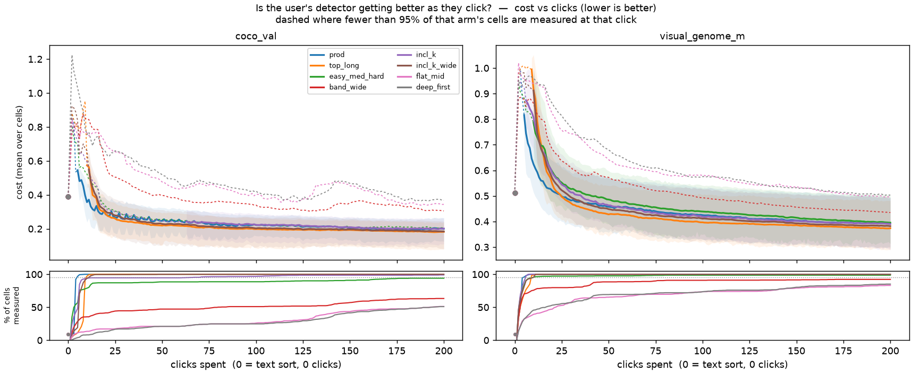
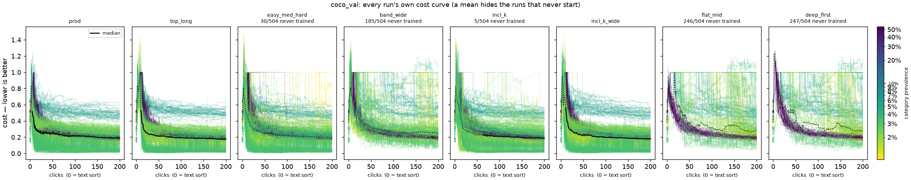
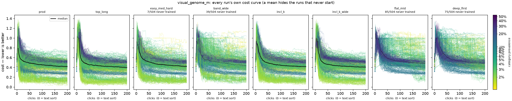
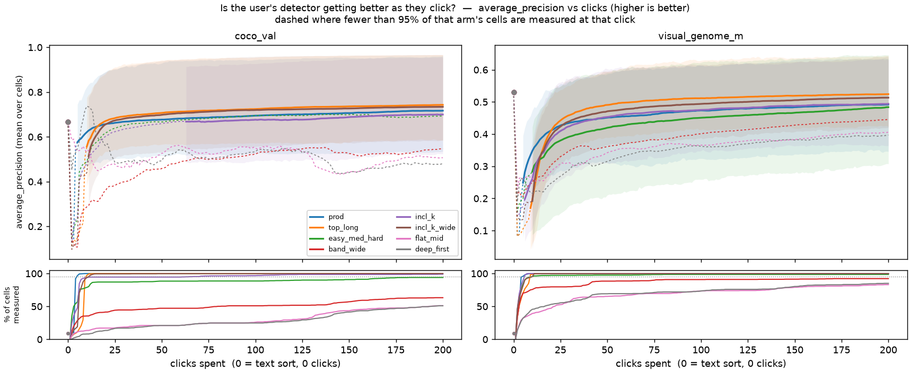
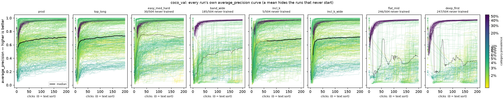
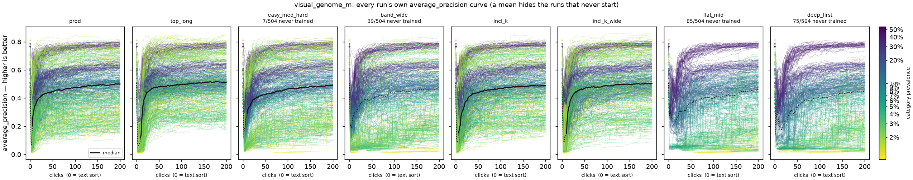
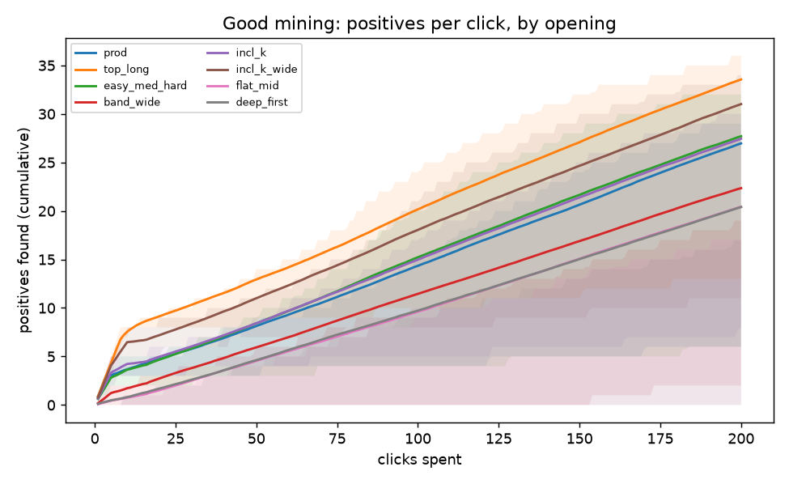
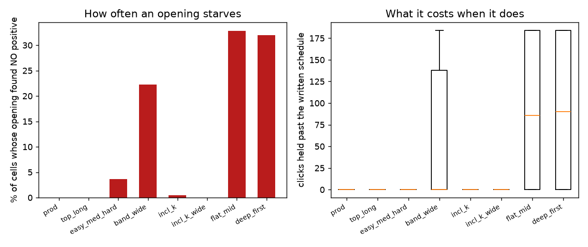

# Good Mining: does a different Autopilot opening find better positives?

Issue #3267.  Arms: `prod`, `top_long`, `easy_med_hard`, `band_wide`, `incl_k`, `incl_k_wide`, `flat_mid`, `deep_first`.  Control: `prod`;
length-matched control: `flat_mid`; falsifier: `deep_first`.

**Verdict.** CANDIDATE: top_long (g8@top,b4@mid) mines +5 more positives per 100 clicks with cost regression bounded at -0.014. It also beats the length-matched control (flat_mid) by +9 positives, so the gain is depth rather than budget.

## Coverage

| arm | schedule | cells (main) | cells (picks) | no detector trained | unreadable |
|---|---|---:|---:|---:|---:|
| `prod` | `(app default: g3@top,b4@mid)` | 1008 | 1008 | 0 | 0 |
| `top_long` | `g8@top,b4@mid` | 1008 | 1008 | 0 | 0 |
| `easy_med_hard` | `n5@q0.02,n5@q0.10,n6@mid` | 971 | 1008 | 37 | 0 |
| `band_wide` | `n5@q0.05,n5@q0.25,n6@mid` | 784 | 1008 | 224 | 0 |
| `incl_k` | `n5@k-6,n5@k-2,n6@k0` | 1003 | 1008 | 5 | 0 |
| `incl_k_wide` | `n5@k-10,n5@k-4,n6@k0` | 1008 | 1008 | 0 | 0 |
| `flat_mid` | `n16@mid` | 677 | 1008 | 331 | 0 |
| `deep_first` | `n10@q0.35,n6@mid` | 686 | 1008 | 322 | 0 |

Analysed on the **balanced** grid: 1008 cells present in all 8 arms, of 1008 seen (0 dropped). The paired contrasts would drop the unmatched cells
anyway; the per-arm columns would not, and they are read side by side as though they
described the same grid. Set `GM_BALANCED=0` to analyse every cell that exists.

A cell under **no detector trained** is a result, not a missing file: that opening never
found both vote classes inside the horizon, so it emitted no main row.  Those cells drop
out of every paired test below, which is why the count belongs here.

## Did each opening move?

| arm | aimed depth | landed depth | vs control | moved? |
|---|---:|---:|---:|:--:|
| `prod` | nan | 0.32 | 0 | **no** |
| `top_long` | 0 | 0.0027 | -0.31 | yes |
| `easy_med_hard` | 0.1 | 0.1 | -0.22 | yes |
| `band_wide` | 0.25 | 0.25 | -0.066 | yes |
| `incl_k` | 0.078 | 0.078 | -0.24 | yes |
| `incl_k_wide` | 0.024 | 0.025 | -0.29 | yes |
| `flat_mid` | 0.38 | 0.38 | 0.066 | yes |
| `deep_first` | 0.35 | 0.35 | 0.035 | yes |

Depth is a rank position in the seed sort (0 = the top).  An arm marked **no** sampled
within 0.01 of the control and therefore measured nothing - do not read its
outcome columns as evidence that the opening does not matter.

## Mining and outcome, paired against the control

| arm | open clicks (written) | held past it | starved | labelset @200 (good/bad) | open yield | positives@100 Δ | [95% CI] | median | final cost Δ | [95% CI] | median | AP Δ |
|---|---:|---:|---:|:--:|---:|---:|---|---:|---:|---|---:|---:|
| `top_long` | 12 | 0 | 0% | 20/1.8e+02 | 0.67 | 5.8 | [5.5, 6.2] | 5 | -0.018 | [-0.021, -0.014] | -0.011 | 0.029 |
| `easy_med_hard` | 16 | 0 | 3.7% | 12/1.9e+02 | 0.19 | 0.88 | [0.51, 1.3] | 0 | 0.0049 | [-7.1e-05, 0.01] | 0 | -0.022 |
| `band_wide` | 16 | 0 | 22% | 7/1.9e+02 | 0.062 | -2.9 | [-3.3, -2.6] | -2 | 0.045 | [0.036, 0.054] | 0.016 | -0.066 |
| `incl_k` | 16 | 0 | 0.5% | 12/1.9e+02 | 0.25 | 0.64 | [0.28, 0.97] | 1 | -0.00044 | [-0.0045, 0.0036] | 0 | -0.0061 |
| `incl_k_wide` | 16 | 0 | 0% | 17/1.8e+02 | 0.44 | 3.7 | [3.3, 4.1] | 3 | -0.013 | [-0.016, -0.0092] | -0.0076 | 0.019 |
| `flat_mid` | 16 | 86 | 33% | 4/2e+02 | 0.0098 | -4.7 | [-5.1, -4.4] | -4 | 0.083 | [0.07, 0.098] | 0.022 | -0.099 |
| `deep_first` | 16 | 90 | 32% | 4/2e+02 | 0.0094 | -4.6 | [-5, -4.3] | -4 | 0.097 | [0.083, 0.11] | 0.026 | -0.11 |

**open clicks (written)** is the opening the arm's schedule asked for; **held past it** is
the clicks it was then held on the last round for, because one vote class was still empty
and handing a learned sort a one-class labelset would leave the selector picking at random.
**starved** is the share of cells whose opening found no positive at all - the extreme of
the regime this study is about, and the reason the two click columns cannot be added.

A held click is **not** an idle one: every click labels an item and enters the training
data whatever phase the autopilot is in - the phase chooses which item is shown next, never
whether the answer counts. A held arm is piling up negatives at full rate. What it lacks is
a *positive*, and one class cannot be fitted, so no detector exists and no metric row is
emitted. `labelset @200` below reports what the model was actually handed.

The interval is a bootstrap of the **mean** paired delta, so the mean is what sits beside
it; the median is given too because these distributions are skewed - a third of some arms'
cells find no positive at all, and a mean and a median say different true things about
that. Reading a median against a mean's interval, as an earlier draft of this table did,
produces the nonsense of a point estimate outside its own interval.

Every delta is paired on the identical (dataset, embedder, category, seed).  A difference
smaller than twice its standard error is not resolvable here, and saying so is a finding.

## Against the length-matched control

Every banded arm spends more opening clicks than `prod`, so a win against it could be
budget rather than depth.  `flat_mid` spends the same budget with no mining round.

| arm | positives@100 Δ vs length control | [95% CI] | final cost Δ | [95% CI] |
|---|---:|---|---:|---|
| `top_long` | 11 | [10, 11] | -0.099 | [-0.11, -0.085] |
| `easy_med_hard` | 5.6 | [5.2, 6.1] | -0.075 | [-0.09, -0.062] |
| `band_wide` | 1.8 | [1.6, 2.1] | -0.035 | [-0.049, -0.021] |
| `incl_k` | 5.4 | [5, 5.8] | -0.081 | [-0.095, -0.067] |
| `incl_k_wide` | 8.4 | [8, 8.9] | -0.091 | [-0.11, -0.077] |
| `deep_first` | 0.12 | [-0.056, 0.29] | 0.015 | [0.0066, 0.024] |

## Is clicking worth it at all? — against the zero-click text sort

Typing the query and reading the ranked haystack is **free**, so it is the thing a
clicked detector has to beat. `baseline` is that zero-click value, `final` is the value
at the horizon, and `crossover` is the first click at which the arm's mean is better
than the baseline. An arm that never crosses is reported as `never`, which is a
finding about that arm and not a missing number.

The two metrics answer different questions and do not have to agree. **Cost** is where
the detector puts its threshold as well as how it ranks; **average precision** is the
ranking alone. An arm that beats the typed query on cost but not on AP has not learned
to rank better than the query the user already typed - it has learned where to cut.

`measured` is the fraction of that arm's cells that still have a detector at the
horizon. **A crossing on a low-`measured` arm is a crossing over the subset that
trained**, not over the grid: the starved cells emit no row and so cannot pull the mean
up, which flatters exactly the arms that starve. Read those rows as an upper bound.

### Cost (cost, lower is better)

| arm | dataset | text sort (0 clicks) | final | clicks to beat it | measured |
|---|---|---:|---:|---:|---:|
| `prod` | coco_val | 0.39 | 0.2 | 10 | 100% |
| `prod` | visual_genome_m | 0.511 | 0.392 | 23 | 100% |
| `top_long` | coco_val | 0.39 | 0.182 | 14 | 100% |
| `top_long` | visual_genome_m | 0.511 | 0.374 | 24 | 100% |
| `easy_med_hard` | coco_val | 0.39 | 0.205 | 17 | 94% |
| `easy_med_hard` | visual_genome_m | 0.511 | 0.395 | 36 | 99% |
| `band_wide` | coco_val | 0.39 | 0.305 | 53 | 63% |
| `band_wide` | visual_genome_m | 0.511 | 0.435 | 87 | 92% |
| `incl_k` | coco_val | 0.39 | 0.201 | 17 | 99% |
| `incl_k` | visual_genome_m | 0.511 | 0.39 | 32 | 100% |
| `incl_k_wide` | coco_val | 0.39 | 0.184 | 16 | 100% |
| `incl_k_wide` | visual_genome_m | 0.511 | 0.382 | 28 | 100% |
| `flat_mid` | coco_val | 0.39 | 0.344 | 104 | 51% |
| `flat_mid` | visual_genome_m | 0.511 | 0.495 | 172 | 83% |
| `deep_first` | coco_val | 0.39 | 0.368 | 114 | 51% |
| `deep_first` | visual_genome_m | 0.511 | 0.503 | 181 | 85% |

### Average precision (AP, higher is better)

| arm | dataset | text sort (0 clicks) | final | clicks to beat it | measured |
|---|---|---:|---:|---:|---:|
| `prod` | coco_val | 0.666 | 0.717 | 29 | 100% |
| `prod` | visual_genome_m | 0.53 | 0.492 | never | 100% |
| `top_long` | coco_val | 0.666 | 0.743 | 19 | 100% |
| `top_long` | visual_genome_m | 0.53 | 0.524 | never | 100% |
| `easy_med_hard` | coco_val | 0.666 | 0.693 | 45 | 94% |
| `easy_med_hard` | visual_genome_m | 0.53 | 0.484 | never | 99% |
| `band_wide` | coco_val | 0.666 | 0.548 | never | 63% |
| `band_wide` | visual_genome_m | 0.53 | 0.445 | never | 92% |
| `incl_k` | coco_val | 0.666 | 0.7 | 57 | 99% |
| `incl_k` | visual_genome_m | 0.53 | 0.494 | never | 100% |
| `incl_k_wide` | coco_val | 0.666 | 0.734 | 23 | 100% |
| `incl_k_wide` | visual_genome_m | 0.53 | 0.513 | never | 100% |
| `flat_mid` | coco_val | 0.666 | 0.507 | never | 51% |
| `flat_mid` | visual_genome_m | 0.53 | 0.406 | never | 83% |
| `deep_first` | coco_val | 0.666 | 0.48 | 8 | 51% |
| `deep_first` | visual_genome_m | 0.53 | 0.397 | never | 85% |

## The interactive viewer

[`viewer.html`](viewer.html) carries **every** slice of this run, not the handful the
figures below happen to show: one dataset or all of them, one category or each of them,
any subset of arms, seeds averaged or every seed as its own line, and any metric the run
emitted (cost, precision, recall, F1, FPR, FNR, average precision, AUROC). Open it when
the answer you want is a slice this report did not think to plot.

## Figures

***The headline: how good the user's detector is as they keep clicking.** One panel per dataset, one line per arm, mean over every seed and category on that dataset, with an inter-quartile band. **Click 0 is the free text sort** - what the typed query got for nothing - drawn as each arm's own leftmost point, so the far left is what typing was worth and the far right is what clicking was worth. Nothing is measured between click 0 and an arm's first trained click, which is why that stretch is dashed; the click at which an arm overtakes its own start is reported as a number in the crossover table rather than eyeballed off the curve. The lower strip is the denominator: what fraction of that arm's cells are measured at that click (all of them at click 0, which has a text sort; from click 1 only the ones with a detector). The mean is **dashed** wherever that is below 95% - there it is a level over the subset of cells that trained, not over the grid, and an arm that starves looks better than it is on exactly those clicks. Read a level only off a solid segment. Averaged across a wide prevalence range, so it says which arm, not how well any one category does.*

***The individuals, on `coco_val`: every seed of every arm as its own line** (cost, lower is better), coloured by the category's prevalence in the pool. A mean cannot show that two arms with the same level are 'every run is mediocre' and 'half the runs are excellent and half never start', and on this axis that is usually the finding. A run that never trained a detector draws **no line at all** - the panel title counts those, because an absent curve and a missing seed look identical otherwise. The black line is the median over the runs present at that click, dashed where that is a median over a subset. Each line starts at **that cell's own text-sort quality at click 0**, so the leftmost point is what the typed query was worth on that exact cell; a never-trained run is the lone `x` at click 0 with nothing to its right.*

***The individuals, on `visual_genome_m`: every seed of every arm as its own line** (cost, lower is better), coloured by the category's prevalence in the pool. A mean cannot show that two arms with the same level are 'every run is mediocre' and 'half the runs are excellent and half never start', and on this axis that is usually the finding. A run that never trained a detector draws **no line at all** - the panel title counts those, because an absent curve and a missing seed look identical otherwise. The black line is the median over the runs present at that click, dashed where that is a median over a subset. Each line starts at **that cell's own text-sort quality at click 0**, so the leftmost point is what the typed query was worth on that exact cell; a never-trained run is the lone `x` at click 0 with nothing to its right.*

*The same figure for **average precision** - the ranking, with the threshold taken out of it. Higher is better here. An arm that improves cost but not AP moved the *threshold*; one that improves both moved the *ranking*. Same dashed-means-subset rule.*

***The individuals, on `coco_val`: every seed of every arm as its own line** (average_precision, higher is better), coloured by the category's prevalence in the pool. A mean cannot show that two arms with the same level are 'every run is mediocre' and 'half the runs are excellent and half never start', and on this axis that is usually the finding. A run that never trained a detector draws **no line at all** - the panel title counts those, because an absent curve and a missing seed look identical otherwise. The black line is the median over the runs present at that click, dashed where that is a median over a subset. Each line starts at **that cell's own text-sort quality at click 0**, so the leftmost point is what the typed query was worth on that exact cell; a never-trained run is the lone `x` at click 0 with nothing to its right.*

***The individuals, on `visual_genome_m`: every seed of every arm as its own line** (average_precision, higher is better), coloured by the category's prevalence in the pool. A mean cannot show that two arms with the same level are 'every run is mediocre' and 'half the runs are excellent and half never start', and on this axis that is usually the finding. A run that never trained a detector draws **no line at all** - the panel title counts those, because an absent curve and a missing seed look identical otherwise. The black line is the median over the runs present at that click, dashed where that is a median over a subset. Each line starts at **that cell's own text-sort quality at click 0**, so the leftmost point is what the typed query was worth on that exact cell; a never-trained run is the lone `x` at click 0 with nothing to its right.*

## The openings themselves

The tables say *whether* an opening mined better.  The issue also asks **why**, and that
is a question about the items, so here are the items: every click of each arm's opening
on one cell, in the order it was made, captioned with its round, its rank in the seed
sort, and whether it turned out to be a positive, with the dataset's ground-truth box
drawn where it has one.  Read two arms side by side and the mechanism is visible rather
than inferred.  Rendered by `make_startup_sheets.py`; a starved arm shows its written
opening in full plus a sample of the clicks it was held for, and the caption says how
many are not shown.
