# Is anything in VTSearch a *good* fit? (issue #3329)

[#3329](https://github.com/samggreenberg/VTSearch/issues/3329) asked one
question — *"we have ways to get the BEST fit in each of these cases, but I
don't ever look to see if it's a GOOD fit"* — and listed eleven fits to check.
This is the answer for all of them: what was measured, what it costs, and what
to do.

Two runs, a day apart, pre-registered separately and reported together.

| | subject | grid | pre-registration |
|---|---|---|---|
| **Part 1** | the 2-component score mixture — the fit that sets every threshold | 192 cells × 100 clicks | [`PREREG.md`](PREREG.md) |
| **Part 2** | the Coverage Atlas, the kNN conformal rule, the UMAP layout, the compaction radius, the browse regions | 75 cells + 125 dataset pairs | [`PREREG-part2.md`](PREREG-part2.md) |

---

## The short version

**1. No fit in the inventory is costing anything in the click loop.** The score
mixture is mildly miscalibrated in exactly the place predicted and ~30× smaller
than predicted, and the misfit that exists goes with *lower* cost, not higher
([H1](#h1--the-tail-misfit-is-real-and-small),
[H4](#h4--the-gate-refuted-with-the-opposite-sign)). That is the outcome the
pre-registration was built to be able to return, and it closes this line cheaply.

**2. One fit is genuinely broken, and it is not one part 1 looked at.** The
Coverage Atlas's `domain_shift_report` documents a null — in-domain p-values
"roughly uniform" — that is false for every embedder, and for **`dinov3_patch`
the guard fires on 80 % of its own held-out data**
([B4](#b4b5--the-guards-actual-operating-point)). As a detector it is close to a
constant.

**3. But bound it correctly: nothing in the loop is gated on it.** Traced, not
assumed — `domain_shift_report` has exactly **one** production consumer, an
on-demand HTTP endpoint ([blast radius](#how-much-does-it-matter-the-blast-radius-traced)).
This also **corrects the issue's own framing**: the "typicality-tempered
diversity probes" it expected to be affected read the typicality *ordering*, not
the p-value, and are untouched.

**4. Both obvious repairs were priced, and both fail.** Removing the atlas's
path averaging makes calibration *worse*
([B2](#b1b3--the-atlass-null-and-why-it-fails)); calibrating α per embedder —
the first thing this report recommended — makes `dinov3_patch` worse still
([B6](#b6--the-obvious-repair-priced-it-does-not-work)). Kept in the report
rather than quietly swapped out, because a recommendation nobody prices is how
this issue started.

**5. Twice, on unrelated families, "fits badly" and "works badly" point in
opposite directions.** The arm with the worst distance-to-CDF statistics is the
only one whose fitted components land on the true classes
([worked cell](#the-worked-cell--the-figure-3329-asked-for)); the embedder with
the worst structural fit statistics is the one the click loop depends on.
**Distance to the fitted CDF is not a measure of whether a model is doing its
job** — which is the general answer to the question the issue asked.

**6. The browse canvas needs no change.** It is good at exactly what it is for
and bad at what it is not, and both halves were unmeasured until now:
neighbourhoods survive (trustworthiness **0.956** at k=10), global distance does
not (Shepard ρ **0.288**), the projection costs **1.7 points** of k-NN class
purity, and **all 2832 regions** are more self-similar than they are similar to
everything else ([C1–C2](#c1c2--the-browse-projection),
[C4](#c4--are-the-browse-canvass-named-regions-coherent-inventory-item-10)). The
one caveat is that coarse signs are weak.

**7. `dinov3_patch`'s geometry is the through-line, seen four independent ways.**
Atlas node r̄ 0.61 vs 0.66–0.70, a displaced Shepard distance range, and both
the within- and between-cluster region cosines. Its space is far less
concentrated than the four single-vector spaces, which is why a fixed α fails on
it — and a standing warning about any other threshold in the tree tuned on
cosine magnitudes.

---

## Action items

Ranked by value over effort. Nothing here is urgent; item 1 is a correctness bug
in a user-facing diagnostic, the rest are hygiene. Items 1 and 2 shipped with the
close of #3329; the rest carry their own issues, which are the live home for each
— this table is the record of what was recommended and why, not a task list to
keep updated.

| # | do | why | evidence | size | tracked |
|---|---|---|---|---|---|
| **1** | **Stop running `domain_shift_report` on patch embedders** — gate it at `registry.py:524` and return "not supported for this embedder" rather than a verdict | 0.13 separation between "my own data" and "a different corpus" is not carrying information; the endpoint currently answers a user's direct question with noise | [B4](#b4b5--the-guards-actual-operating-point), [B6](#b6--the-obvious-repair-priced-it-does-not-work) | one guard clause | **done** |
| **2** | **Delete the false null from `typicality_pvalues`' docstring** and say what the p-values actually are: under-dispersed (sd 0.250 vs 0.289), path-averaged, uncalibrated | The docstring's claim is the reason nobody checked for two years. It is false for all five embedders, not just the broken one | [B1–B2](#b1b3--the-atlass-null-and-why-it-fails) | one docstring | **done** |
| **3** | **Record one timing profile** with `VTSEARCH_RECORD_TIMING` on a real dataset load, and read the r² this PR started keeping | The r² is now persisted but has never been looked at; the fix is untested against real data | [Appendix A](#d--the-timing-statistic-that-was-computed-and-thrown-away) | one dataset load | #3345 |
| **4** | **Label coarse browse signs as approximate** in the UI, or stop showing signs below layer 2 | At layers 2–3, 45–48 % of regions have no ground-truth category holding even half their members — the sign names something no single label describes | [C4](#c4--are-the-browse-canvass-named-regions-coherent-inventory-item-10) | UX call, small | #3346 |
| **5** | **Audit other cosine-magnitude thresholds for patch embedders** — anywhere in the tree a constant is compared against a similarity | Four independent measurements say `dinov3_patch`'s absolute cosines live in a different range; `domain_shift_report` is the instance that was caught, not necessarily the only one | [§6 above](#the-short-version) | a grep and a think | #3347 |
| **6** | *If* the atlas guard is wanted on patch embedders: **fix the per-node vMF model**, not a threshold on top of it | r̄ = 0.61 says the mean-direction model describes this space poorly; every threshold repair was priced and failed | [B6](#b6--the-obvious-repair-priced-it-does-not-work) | real work, unbudgeted | #3348 |

### Do *not* do these

- **Do not launch a fit-replacement programme for the score mixture.** H1 and H4
  together say the tail error at the operating point is a few per cent and is
  associated with *lower* cost. The #2836 `misspecification` term (+0.0129) is
  real as an accounting entry, but this run finds no cost attached to it at the
  shipped operating point.
- **Do not switch the atlas to the `median` combiner on its own.** It is a
  two-line change and a third closer to uniform (KS 0.071 vs 0.103), but it
  over-flags at α (7.7 % against a nominal 5 %) and does not touch the
  per-embedder failure that matters.
- **Do not remove the atlas's path averaging.** The obvious suspect; measured;
  it makes calibration worse (KS 0.103 → 0.132).
- **Do not re-enable browse compaction on the strength of C3.** C3 says the
  packing radius is honestly fitted; it says nothing about the separability cost
  that switched compaction off. See [Appendix A](#c3--the-compaction-radius-dormant-code).
- **Do not read H2 as a licence to build a Gumbel-family fit.** Max-pooling
  really does manufacture a right-skewed Bad mode, but H4 says the payoff for
  modelling it is not visible here.

---

## Every claim, scored

**Twelve** pre-registered claims, **two** priced after the fact, and two
inventory items that were a fix and a blocker rather than a hypothesis. Bars
were fixed before each run was submitted; where this report departs from a
pre-registration, the section says so and why.

| # | claim | pre-registered bar | measured | verdict |
|---|---|---|---|---|
| [H1](#h1--the-tail-misfit-is-real-and-small) | misfit concentrated in the tail, Gaussian **under**-predicts | median `tail_ratio` > 1.5 region / > 1.2 binary | **1.02–1.05** | **refuted** — real, ~30× too small |
| [H2](#h2--confirmed-and-it-is-the-pooling-not-the-embedder) | Bad mode right-skewed under max-pooling | `shape_skew_neg` > 0.5 on `max_patch`; paired diff > 2 SE | **0.85**; paired **+0.78 ± 0.011** | **confirmed** |
| [H3](#h3--the-prediction-holds-the-argument-for-it-does-not) | shipped anchoring is inert | \|`anchored_dmu_lo`\| < 0.01 **and** mass < 1e-3 | **0.0004–0.0023** ✓; **0.0023–0.0038** ✗ | **prediction holds, mechanism refuted** |
| [H4](#h4--the-gate-refuted-with-the-opposite-sign) | misfit predicts regret | slope > 0 at > 2 SE, partial R² ≥ 0.05 | partial R² **0.053–0.089**; slope **negative** | **refuted, with the opposite sign** |
| [B1](#b1b3--the-atlass-null-and-why-it-fails) | in-domain p-values not uniform | median KS > 0.05 | **0.103 ± 0.0015** | **confirmed** |
| [B2](#b1b3--the-atlass-null-and-why-it-fails) | under-dispersed, and averaging is why | sd < 0.27; deepest widens on ≥ 4 embedders | **0.250 ± 0.0012**; widens on **5/5** | **confirmed** |
| [B3](#b1b3--the-atlass-null-and-why-it-fails) | dispersion tracks path length | Spearman ρ > 0.5 | **0.24** | **refuted** |
| [B4](#b4b5--the-guards-actual-operating-point) | the guard is conservative on its own data | 0 self-fires, median z ≤ 0 | **5 of 25 fire**; median z −0.85 | **refuted** |
| [B5](#b4b5--the-guards-actual-operating-point) | it still separates real domains | > 50 % of cross pairs fire | **64 %** different-source, 20 % same-source | **confirmed** |
| [B6](#b6--the-obvious-repair-priced-it-does-not-work) | *(priced after the fact)* the per-embedder α repair | — | separation 0.13 → **0.043** | **repair fails** |
| [C1](#c1c2--the-browse-projection) | local structure kept, global lost | trust > 0.95 **and** Shepard < 0.6 | **0.956** and **0.288** | **confirmed** |
| [C2](#c1c2--the-browse-projection) | projection costs class purity | drop > 0 on ≥ 4 embedders | **5/5**, median **0.017** | **confirmed (small)** |
| [C3](#c3--the-compaction-radius-dormant-code) | the 90th-percentile radius contains ~90 % | 0.85–0.95 | **0.894** | **confirmed** — *of code that is switched off* |
| [C4](#c4--are-the-browse-canvass-named-regions-coherent-inventory-item-10) | *(priced after the fact)* browse regions are coherent | — | **0 of 2832** below the diagonal | **coherent** |
| [D](#d--the-timing-statistic-that-was-computed-and-thrown-away) | the timing r² that was discarded | *(a fix, not a measurement)* | now kept and round-tripped | **fixed, unmeasured** |
| [§10, §11](#e--what-is-still-not-measured) | Toponymy warnings; SIFT/VLAD RANSAC | — | — | **blocked on data** |

---

# Part 1 — the score mixture

The fit that sets every threshold in the app.

## What was run (192 cells)

`vg_scale_any` × {`siglip`, `siglip+dinov3_patch`} × 12 categories × 8 seeds =
**192 cells**, 100 clicks, shipped defaults, `CALIB_SAFE_THRESHOLDS=1`.

| | |
|---|---|
| cells completed | **192 / 192**, 0 zero-byte, 0 unreadable |
| fit-quality rows | **23 064**, 0 dropped |
| `fit_ok` | **100 %** of rows — no degenerate-fit filter to report |
| positives per shape statistic | 132–170 (floor 30), so **0 %** of steps declined |
| prevalence | **7.1 % median, 6.2–8.0 %** on a constant 2100-item test set |

None of PREREG's uninterpretability conditions fired.

`CALIB_SAFE_THRESHOLDS=1` is what makes the **fold scope** populated, and that
matters more than it sounds: at the harness default those rows would be silently
empty and this study would have measured the unanchored sim fit twice.

**The array was run twice.** The first run could not score H3 — the instrument
was broken in two ways ([Appendix B](#b--instrument-defects-found-and-fixed)).
After the fix, H1, H2 and H4 came back **bit-identical**, which is the evidence
that the fix touched only the anchor columns. All numbers below are from the
second run.

## H1 — the tail misfit is real, and small

Median `tail_ratio` (empirical exceedance ÷ predicted, at the shipped cut):

| scope | `siglip/whole_image` | `dinov3_patch/whole_image` | `dinov3_patch/max_patch` |
|---|---|---|---|
| **`fold`** (the shipped fit) | 1.01 | 0.99 | 0.99 |
| `sim:pooled` (the labelled set) | 1.04 | 1.02 | 1.05 |

Standard errors are 0.0010–0.0016, so every sim figure is resolvably above 1.0 —
roughly 30 SE. The Gaussian does under-predict its own tail. It under-predicts
it by **2–5 %**, against a pre-registered bar of 20–50 %.

**The fold scope is the headline, and it is the first time anyone has looked.**
Nothing in `vtscore/eval/` had ever read `FoldAnchoredCut.fits`; every
measurement in this line has been the unanchored fit on the sim set. The fit the
app *actually cuts from* is calibrated in the tail to within 1 %, and on both
region arms it **over**-predicts — the opposite direction to the one predicted,
and better-behaved than the fit the whole prior line was measuring.

Distance to the fitted CDF on its own data, median:

| scope | arm | KS | CvM | AD |
|---|---|---|---|---|
| `fold0` | `siglip/whole_image` | 0.021 | 0.17 | 1.1 |
| `fold0` | `dinov3_patch/whole_image` | 0.019 | 0.12 | 0.8 |
| `fold0` | `dinov3_patch/max_patch` | 0.030 | 0.43 | 2.6 |
| `sim:pooled` | `siglip/whole_image` | 0.023 | 0.23 | 1.6 |
| `sim:pooled` | `dinov3_patch/whole_image` | 0.021 | 0.19 | 1.4 |
| `sim:pooled` | `dinov3_patch/max_patch` | 0.032 | 0.53 | **3.4** |

The max-pooled arm is the worst-fitting on every statistic, and the gap is
widest on **AD**, which weights the tails — the same direction H2 predicts.
(No p-values, deliberately: at these sample sizes every test rejects every
model, so a p-value would report the sample size. These are effect sizes.)

**The misfit grows as the user clicks**, which a median over the run hides:

| arm | t=5 | t=10 | t=20 | t=50 | t=100 |
|---|---|---|---|---|---|
| `siglip/whole_image` | 1.014 | 1.013 | 1.035 | 1.045 | 1.056 |
| `dinov3_patch/whole_image` | 1.000 | 0.996 | 1.008 | 1.038 | 1.037 |
| `dinov3_patch/max_patch` | 1.003 | 1.040 | 1.057 | 1.062 | 1.044 |

## H2 — confirmed, and it is the pooling, not the embedder

Median skewness of the **true Bad** class on the logit axis:

| arm | `shape_skew_neg` | role |
|---|---|---|
| `dinov3_patch / max_patch` | **0.85 ± 0.014** | region voting |
| `siglip / whole_image` | 0.58 ± 0.013 | binary control |
| `dinov3_patch / whole_image` | 0.33 ± 0.011 | same embedder, no pooling |

Paired `pooled − image` within each `max_patch` run — the same media, the same
model, only the pooling changed: **+0.78 ± 0.011**, about 72 SE. Both the level
contrast and the paired contrast agree, so the pre-registered tie-break (the
paired one governs) never had to be used.

**The third geometry is what makes this a finding rather than an observation
about DINOv3.** DINOv3 under whole-image pooling has the *least* skewed Bad mode
of the three — less than SigLIP's. So the skew is not a property of the
embedder; max-pooling manufactures it, which is what the extreme-value argument
predicts.

**The skew is not a constant of the arm — it changes sign early in the run:**

| arm | t=5 | t=10 | t=20 | t=50 | t=100 |
|---|---|---|---|---|---|
| `siglip/whole_image` | −0.37 | 0.37 | 0.64 | 0.62 | 0.52 |
| `dinov3_patch/whole_image` | **−1.48** | −0.25 | 0.18 | 0.39 | 0.37 |
| `dinov3_patch/max_patch` | 0.71 | **1.12** | 1.00 | 0.86 | 0.73 |

Early fits are *left*-skewed on both whole-image arms. Only `max_patch` is
right-skewed from the first trainable click. Any future work that assumes an
EVD shape from the start would be wrong for the first ~15 clicks of a
whole-image run.

## H3 — the prediction holds; the argument for it does not

The two halves split:

| half | `siglip/whole` | `dinov3/whole` | `dinov3/max_patch` | bar | |
|---|---|---|---|---|---|
| \|`anchored_dmu_lo`\| | 0.0019 | 0.0023 | 0.00044 | < 0.01 | **confirmed** |
| `anchor_mass_frac` | 0.0023 | 0.0036 | 0.0038 | < 1e-3 | **refuted** |

`anchor_mass_frac` runs from 2.9e-4 at click 5 to **7.4e-3 at click 100**,
crossing the pre-registered ceiling at about **click 20**. PREREG computed
1.2e-4 for 20 votes against a **50 000**-point haystack; `vg_scale_any` fits
about **2000**. The denominator, not the votes, was carrying that argument.

So the anchors carry roughly **7× the mass the pre-registration called
negligible, and still barely move the fit**: \|Δμ_lo\| is 0.0021 at click 100,
**1.3 % of the distance between the fitted components** (p90 12.8 %). The
conclusion survives on direct evidence; the mechanism offered for it does not.
What makes the anchors inert is the **one-hot E-step clamp**, not their M-step
mass share.

**They are not inert everywhere.** Median \|Δμ_hi\| is **0.012** — past the same
0.01 ceiling — and median \|Δw_lo\| is **0.032**. The anchors reweight the
mixture and shift the **Good** component; the Bad component, whose tail the cut
sits in, is the one they leave alone. Since the shipped cut is a midpoint rule,
a 0.012 shift in μ_hi is a ~0.006 shift in the cut, which is not nothing.

This also means the κ = 0.3 optimum found by the anchor-mass sweep
([#2861](../2026-08-05-population-anchored-calibration/)) still needs an
explanation, and "mass" is not it.

## H4 — the gate, refuted with the opposite sign

OLS of `regret_honest` on `log(tail_ratio)`, conditioned on `log(n_test_pos)`:

| arm | n | slope | partial R² |
|---|---|---|---|
| `dinov3_patch/max_patch` | 1924 | **−0.16 ± 0.012** | 0.089 |
| `dinov3_patch/whole_image` | 1924 | **−0.38 ± 0.034** | 0.062 |
| `siglip/whole_image` | 1924 | **−0.30 ± 0.029** | 0.053 |

Every arm clears the pre-registered partial-R² bar of 0.05, at 10–14 SE. **The
slope is negative on all three**: the cells where the Gaussian under-predicts
its tail most are the cells with the *lower* cost.

The pre-registered test is one-sided (`slope/SE > 2`), so the analyzer's canned
verdict reads "does not predict regret". That undersells it. Misfit predicts
regret about as well as pre-registered — in the direction opposite to the one
that would license replacing the fit.

The plain reading is that both quantities are downstream of how well the run is
going: a run that has separated its classes has a heavier, better-resolved tail
above the cut *and* a lower cost. `n_test_pos` does not absorb it, so it is not
simply prevalence. **What it is not is evidence that fixing the fit would buy
anything.**

## Figures

Generated by `figures_fitq_3329.py` from the same frames as the tables above.

### The mandatory quality-over-clicks pair

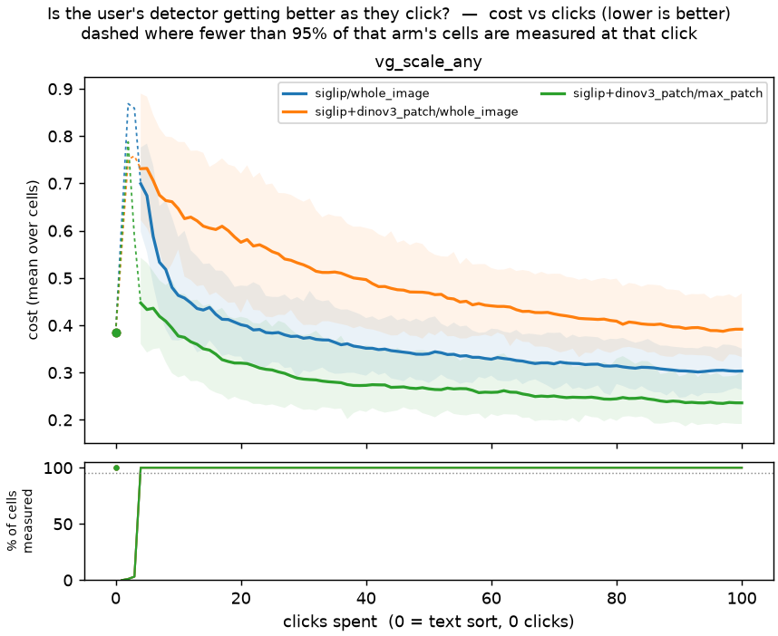

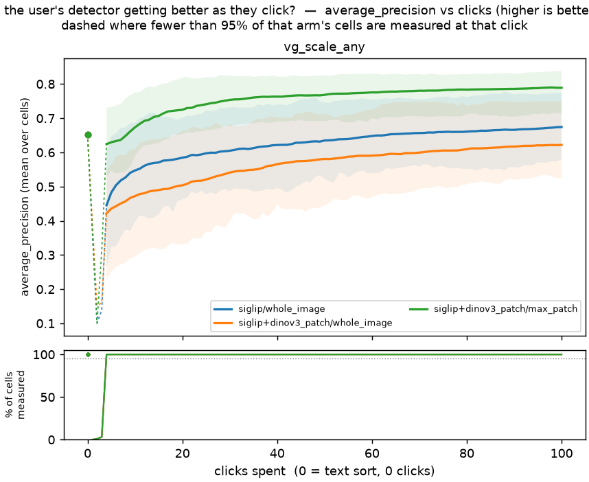

*Mean over all 96 cells per arm, with an inter-quartile band; click 0 is each
cell's own free text sort, and every curve is anchored there. Lower is better on
cost, higher on AP. Read the distance from the left-hand dot to the right-hand
end as what the clicking bought over what typing already gave. It does **not**
license a per-embedder claim: the arms differ in embedder and pooling together.*

| arm | text sort (0 clicks) | crossover | cost @ 100 | AP @ 100 |
|---|---|---|---|---|
| `dinov3_patch/max_patch` | 0.38 | **click 10** | **0.24** | 0.79 |
| `siglip/whole_image` | 0.38 | click 25 | 0.30 | 0.67 |
| `dinov3_patch/whole_image` | 0.38 | **never** | 0.39 | 0.62 |

**`dinov3_patch/whole_image` never beats the free text sort** — after 100 clicks
it is still worse on cost (0.39 vs 0.38) and on average precision (0.62 vs
0.65). This is the middle geometry, H2's "same voting mode, different embedder"
control. It does not invalidate H2's paired contrast, which is taken *within*
`max_patch` runs, but it does mean the level comparison against that arm is a
comparison against an arm that never learns, and should be read as such.

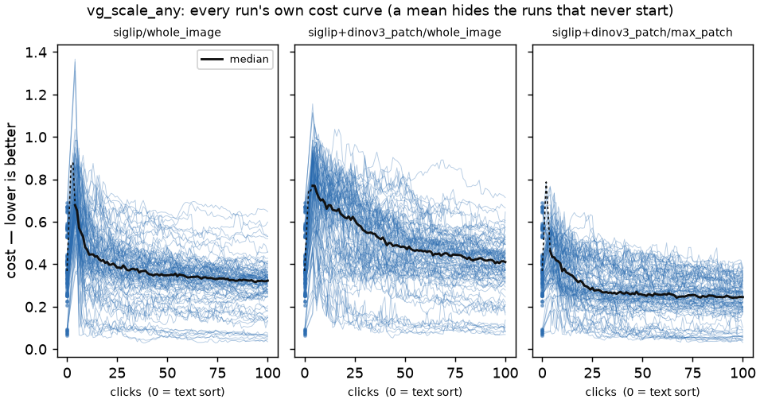

*Every seed of every category as its own line, one panel per arm. The spread is
the finding the mean hides: within each arm there are cells that never leave the
floor and cells that are excellent by click 20. The AP equivalent is
`figures/average_precision_vs_clicks_runs__vg_scale_any.png`.*

### The four pre-registered statistics over clicks

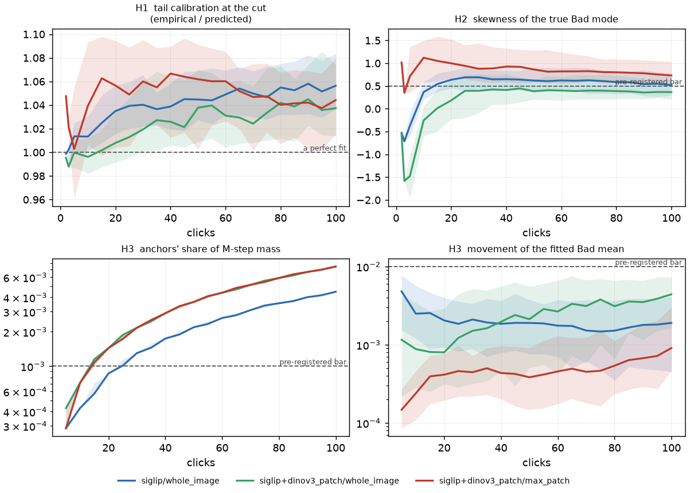

*Median and inter-quartile band against the axis the user spends. Both H3 panels
are log-scaled. This figure is the argument for not reporting these as single
medians: `anchor_mass_frac` (bottom left) crosses its pre-registered bar around
click 20–25, so "the median is 0.0038" describes an average across a crossing,
and the Bad mode's skew (top right) starts negative on both whole-image arms.*

### The worked cell — the figure #3329 asked for

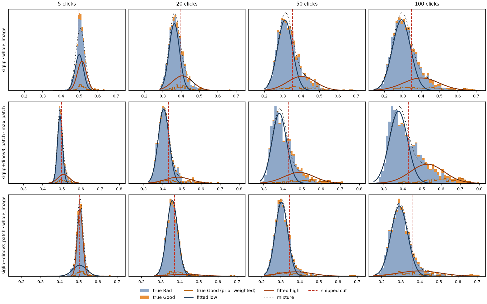

*One cell per geometry (`backpack`, seed 0), at four click checkpoints. The
histogram is the score distribution **coloured by ground truth** — the colouring
no user and no prior run has seen, because it needs labels the app does not
have. Since the Good class is only ~7 % of the mass, its prior-weighted
class-conditional density is drawn as a step line too, on the same scale as the
fitted components. Over that are the two fitted Gaussians and their sum; the
dashed red line is the threshold the app would ship at that click. It is **one
cell**, fixed before the results were read, and is illustrative — every
quantitative claim above is over all 192.*

**What it shows, and it is not what the summary statistics suggest.** The three
rows behave completely differently, and the difference is not fit quality in the
distance-to-CDF sense:

- **`max_patch` (middle row)** is the only geometry where the mixture becomes
  genuinely bimodal, and by 100 clicks its **fitted high component sits on the
  true Good mass** — the dark orange curve and the light orange step line up.
  The two-component model is describing the two classes.
- **`siglip/whole_image` (top row)** never separates. Its fitted high component
  is far broader than the true Good class and peaks well to the *left* of it: it
  is absorbing the right shoulder of the **Bad** distribution, not finding the
  Good one. The cut still lands in a reasonable place, which is why balanced
  accuracy stays at 0.84 — but for the wrong reason.
- **`dinov3_patch/whole_image` (bottom row)** barely moves at all across 100
  clicks, which is the picture behind its never crossing the text sort.

This is the sharpest thing in the run. The arm with the **worst** distributional
fit statistics (`max_patch`: KS 0.032, AD 3.4) is the one whose components
actually correspond to the classes, and the arm with the **best** ones
(`dinov3_patch/whole_image`: KS 0.021, AD 1.4) is the one that never learns
anything. A 2-Gaussian mixture fits an unseparated blob very well. **Distance to
the fitted CDF is not a measure of whether the model is doing its job**, and
that — more than any single bar — is the answer to "I never look to see if it's
a good fit."

Numerically, across all cells (`sim:pooled`), the components do land on the
classes:

| arm | balanced accuracy | ARI | μ_lo error | μ_hi error |
|---|---|---|---|---|
| `dinov3_patch/max_patch` | **0.87 ± 0.001** | 0.62 | −0.0034 | −0.0041 |
| `siglip/whole_image` | 0.84 ± 0.002 | 0.42 | −0.0085 | −0.025 |
| `dinov3_patch/whole_image` | 0.74 ± 0.003 | 0.49 | −0.0011 | 0.012 |

The fitted low component identifies the true Bad class at 74–87 % balanced
accuracy, and its mean sits within 0.009 of the true class mean. **The mixture
is recovering the classes, not merely fitting the histogram** — which is the
strongest single reason the misfit costs so little.

### Interactive viewer

[`viewer.html`](viewer.html) — filter by category, seed and arm; every cell's
own curve. Built with
`viewer.py --results $EXP --arms results=prod --baseline analysis/text_baseline.csv`.
It carries no supervised-skyline floor (#3322): this grid was not run with
`CALIB_SKYLINE_ARMS`, so there is no learnability ceiling drawn on it.

---

# Part 2 — embedding-space structure and the browse projection

The four fits the [#3329
inventory](https://github.com/samggreenberg/VTSearch/issues/3329) listed under
**B** (embedding-space structure) and **C** (browse projection), plus the one
item under **D** that was a fix rather than a measurement.

Part 1's fits are recomputed at every click, so they rode the voting loop for
free. **These do not.** The atlas, the conformal rule, the UMAP layout and the
compaction radius are each fitted **once per dataset**, so the axis that buys
information here is not clicks — it is dataset × embedder.

## What was run (75 cells + 125 pairs)

**75 cells** — 5 datasets × 5 embedders × 3 seeds — plus **125 cross-dataset
pairs** (every ordered build/query dataset pair under each embedder). All 75
`COMPLETED`, none dropped, max 104 s per cell.

| axis | values |
|---|---|
| datasets | `vg_scale_any`, `coco_val`, `caltech101_m`, `vg_box_large`, `visual_genome_m` |
| embedders | `siglip`, `dinov3_patch`, `clip`, `clip_l`, `siglip2_l` |

Three sources (Visual Genome, COCO, Caltech-101) is what makes B5 answerable:
two slices of Visual Genome are not the domain change the guard exists for, and
the report reads them apart. The atlas is built exactly as production builds it
(`k=3`, `auto_max_depth(n, k=3)` — the call in
`vtscore/detectors/labeling_progress.py`), so the null under test is the shipped
estimator's own.

**The conformal family is a positive control**, and it passes: split-conformal
support p-values are uniform by construction, and they read **KS 0.047** across
every cell. Part 1 lost a hypothesis to an instrument defect that emitted
plausible numbers, so this grid carries a family whose right answer is known in
advance. Its passing is what licenses reading the atlas numbers as the atlas's.

## B1–B3 — the atlas's null, and why it fails

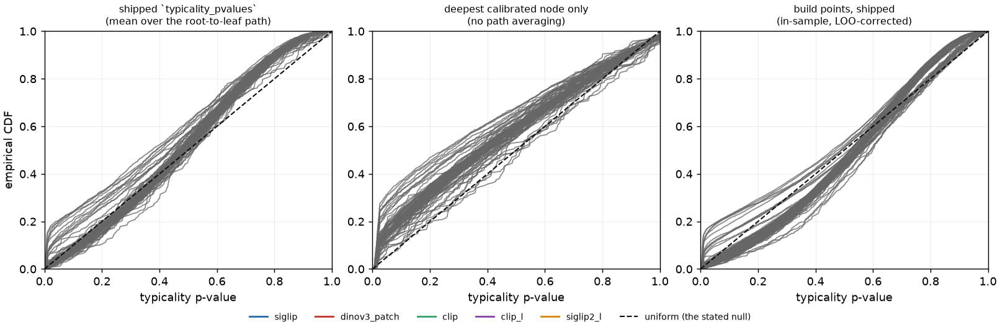

*Empirical CDF of in-domain typicality p-values against the uniform diagonal the
guard's docstring asserts, one line per cell, coloured by embedder. A calibrated
p-value lies on the dashed line. Left is what ships; middle removes the path
averaging; right is the in-sample build points. **The red lines are
`dinov3_patch`** — visibly the worst in all three panels. This is a PIT plot,
not a fit-quality plot: it says nothing about whether the atlas partitions the
space well, only whether its p-values mean what they claim.*

The shipped p-values are **under-dispersed**: sd **0.250 ± 0.0012** against
U(0,1)'s 0.289. The mechanism is visible in the code — `typicality_pvalues`
scores at *every* calibrated node along the root-to-leaf path and returns the
**mean**, and the mean of several correlated uniforms concentrates on 0.5.

**B2 confirmed, B3 refuted, and the pair is more interesting than either.**
Removing the averaging does widen the distribution on **5 of 5** embedders
(sd 0.250 → 0.313, now *over*-dispersed) — but it makes the overall calibration
**worse**, not better: KS 0.103 → 0.132. And across cells the under-dispersion
does not track path length (ρ = 0.24, against a pre-registered 0.5). So the
averaging is not simply "the bug". The per-node calibration is itself off, and
the averaging partially *masks* it.

### What a calibrated aggregation would look like

Pre-registration asked whether the averaging was to blame. That question has a
follow-up worth more than the answer, so every candidate combiner was priced on
the same paths in one pass:

| combiner | KS from uniform | sd | flag rate at α = 0.05 |
|---|---|---|---|
| **median** | **0.071 ± 0.0020** | 0.276 | 0.077 |
| `mean` (shipped) | 0.103 ± 0.0015 | 0.250 | **0.043** |
| deepest node only | 0.132 ± 0.0037 | 0.313 | 0.156 |
| Fisher | 0.186 ± 0.0029 | 0.381 | 0.198 |
| min | 0.329 ± 0.0025 | 0.234 | 0.226 |

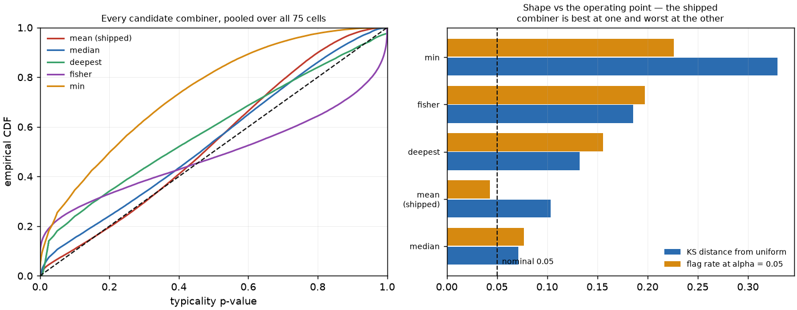

*Left: the pooled PIT of each candidate. Right: the two numbers that have to be
read together — distance from uniform over the whole distribution, and the flag
rate at the single α the guard actually uses. Neither alone is a verdict.*

**No combiner is calibrated, and the shipped one is best at exactly the number
anyone would check.** `mean` gives a 4.3 % flag rate against a nominal 5 % —
close enough that a spot check passes — while being second-worst in overall
shape. `median` is a third closer to uniform overall (0.071 vs 0.103, 16 SE
apart) but over-flags at α. That combination is precisely how the
`dinov3_patch` failure below stayed invisible: the guard's aggregate operating
point looks right while its distribution is wrong, and the average over
embedders hides the one that is badly wrong.

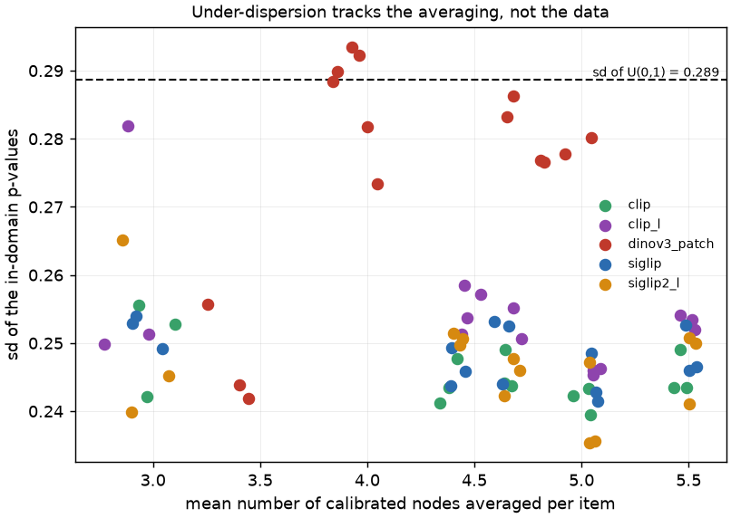

*Each point is one cell. If path averaging alone explained the under-dispersion,
this would slope down; it does not (ρ = 0.24). `dinov3_patch` (red) sits high at
every path length — its p-values are the least compressed and the least
calibrated, which is the combination that produces false alarms.*

## B4–B5 — the guard's actual operating point

Pre-registered as a pair, because a guard that never fires on its own data looks
correct and a guard that never fires on anything is broken; only both readings
say which.

| embedder | fires on its **own** held-out data | detects a **different corpus** | fires on a same-corpus slice | separation |
|---|---|---|---|---|
| **`dinov3_patch`** | **0.80** | 0.93 | **1.00** | **0.13** |
| `clip_l` | 0.20 | 0.50 | 0.00 | 0.30 |
| `clip` | 0.00 | 0.57 | 0.00 | 0.57 |
| `siglip` | 0.00 | 0.71 | 0.00 | **0.71** |
| `siglip2_l` | 0.00 | 0.50 | 0.00 | 0.50 |

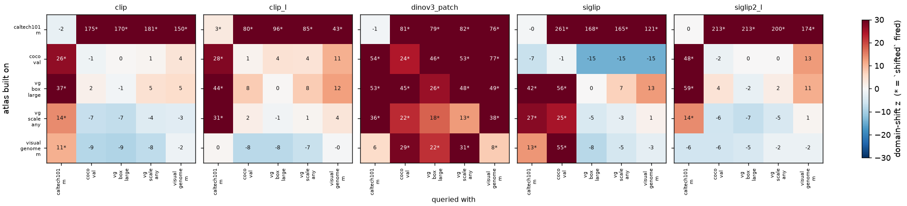

*Atlas built on the row, queried with the column; the number is the binomial z
and `*` means `shifted` fired. The diagonal is the null — a held-out split of
the atlas's own build data, where firing is a false positive. **Read the
`dinov3_patch` panel's diagonal**: 4 of its 5 cells fire on their own data.
Every other embedder's diagonal is quiet.*

**`dinov3_patch` fires on nearly everything** — 80 % of its own held-out
splits, 93 % of different-corpus queries, 100 % of same-corpus slices — leaving
a separation of 0.13 between "this is my own data" and "this is a different
corpus". As a detector it is close to a constant. `siglip`, by contrast,
separates cleanly: never fires on its own data, never on a sibling VG slice,
and fires on 71 % of genuine corpus changes.

**The mechanism is concentration.** The atlas fits a von Mises–Fisher mean
direction per node, and `dinov3_patch` is the least concentrated space in the
grid:

| embedder | node r̄ (median) | r̄ 10th pct | atlas depth | in-domain frac below α=0.05 |
|---|---|---|---|---|
| `clip` | 0.70 | 0.53 | 8 | 0.042 |
| `siglip` | 0.69 | 0.52 | 7 | 0.041 |
| `siglip2_l` | 0.67 | 0.49 | 8 | 0.032 |
| `clip_l` | 0.66 | 0.50 | 8 | 0.054 |
| **`dinov3_patch`** | **0.61** | **0.38** | **10** | **0.137** |

Lower r̄ means the per-node vMF model describes its own points worse; the atlas
compensates by splitting deeper (hitting the `max_depth` cap of 10), and the
p-values come out **2.7× more likely to fall below α** than nominal on data
drawn from the build distribution itself.

**B5 with the sources read apart:** 64 % of different-source pairs fire against
20 % of same-source slices. The guard does discriminate — but the misses are
structured. Caltech-101 is caught every time in both directions (z up to +261);
COCO against Visual Genome is caught **1 of 5 times**, and under `siglip` an
atlas built on `coco_val` reads Visual Genome as z = **−15**, i.e. *more*
typical than its own holdout. A corpus change that a human would call obvious is
invisible to it.

## How much does it matter? The blast radius, traced

Part 1 pre-registered H4 so that "the fit is wrong and it costs nothing" was a
reportable finding. Part 2's equivalent is not a regression — it is a question
about **reachability**, and it is answered by tracing consumers rather than by
another grid.

| symbol | production consumers |
|---|---|
| `domain_shift_report` | **one**: `vtsearch/routes/datasets/registry.py:524`, an HTTP endpoint that compares a named reference dataset against the active one on demand |
| `typicality_pvalues` | **none** outside `domain_shift_report` itself |
| `typicality_pvalue` (singular) | **none** — one test, no callers |

**So the entire calibrated-typicality machinery — the LOO correction, the
per-node quantile grids, the path averaging — is reachable only through one
on-demand diagnostic endpoint.** It is not in the click loop, not in
acquisition, and not in training. The finding above is real and the guard is
broken for `dinov3_patch`, but what it breaks is a report a user explicitly asks
for, not a decision the app takes on its own.

**This corrects the inventory's own framing.** The #3329 issue says that if the
p-values are not uniform then "the domain-shift verdicts and the
typicality-tempered diversity probes are both miscalibrated". The first half
holds. **The second does not.** `CoverageAtlas.next_sample` — the
typicality-tempered probe — reads `node["ids"]`, which is sorted by raw
`mu · x`, and gates on `node["rbar"]`. It never touches `t_quantiles` or a
p-value. The calibration defect lives entirely in the quantile grid and the
combiner, so **the diversity probe is untouched by it**: it depends on the
typicality *ordering*, which is unaffected, not on the calibrated *value*, which
is not.

That is worth stating plainly because it changes what to do. A miscalibrated
guard inside the acquisition loop would be urgent; a miscalibrated guard behind
one diagnostic endpoint is a correctness bug in a feature whose answer a user
might act on, and it should be fixed or disabled for patch embedders — but
nothing is silently going wrong in the loop because of it.

## B6 — the obvious repair, priced: it does not work

The recommendation this run first wrote down was "calibrate α per embedder",
since a fixed α clearly cannot serve all five. That is a recommendation nobody
had priced, so it was priced: for each embedder, read the α that *would* have
produced a 5 % false-alarm rate on its own held-out data, then re-score every
cross-dataset pair at that α under the same `z > 3 and frac >= 2α` rule. The α
is fitted on the **self** pairs and scored on the **cross** pairs; fitting and
scoring on the same pairs would guarantee a flattering answer.

| embedder | α\* | false alarms 0.05 → α\* | detection 0.05 → α\* | separation 0.05 → α\* |
|---|---|---|---|---|
| `siglip` | 0.059 | 0.00 → 0.00 | 0.71 → 0.71 | 0.71 → **0.71** |
| `clip` | 0.064 | 0.00 → 0.00 | 0.57 → 0.57 | 0.57 → **0.57** |
| `siglip2_l` | 0.067 | 0.00 → 0.00 | 0.50 → 0.50 | 0.50 → **0.50** |
| `clip_l` | 0.043 | 0.20 → 0.20 | 0.50 → 0.50 | 0.30 → **0.30** |
| **`dinov3_patch`** | **0.0068** | 0.80 → 0.60 | 0.93 → 0.64 | 0.13 → **0.043** |

**The repair fails, and it fails worst exactly where it was needed.** For the
four embedders that were already fine, α\* lands within a whisker of 0.05 and
nothing moves — which is itself a check that the procedure is sane. For
`dinov3_patch` the α that would buy a 5 % false-alarm rate is **0.0068**, seven
times smaller than shipped, and even there the false-alarm rate only falls to
0.60 while detection falls from 0.93 to 0.64. **Separation gets worse, 0.13 →
0.043.**

The reason is that no threshold separates these distributions: `dinov3_patch`'s
in-domain p-values overlap its out-of-domain ones almost completely, so moving
the cut trades false alarms for misses at roughly one for one. Lowering α also
loosens the guard's second condition — `frac >= 2α` is *easier* to satisfy as α
shrinks — which is why the false-alarm rate does not fall as far as the α
suggests it should.

**So the fix is not a threshold.** It has to be either the atlas's per-node
model — the vMF mean-direction fit that r̄ = 0.61 says describes this space
poorly — or, cheaply and immediately, **not running this guard on a patch
embedder at all**, since a detector with 0.04 separation is not carrying
information.

## C1–C2 — the browse projection

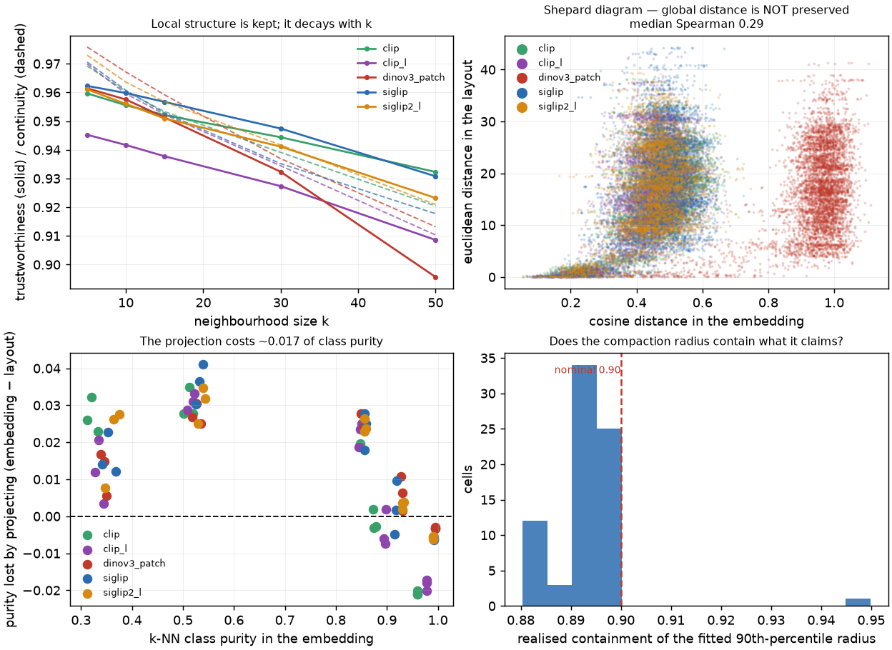

*Top left: trustworthiness (solid) and continuity (dashed) against neighbourhood
size, median over cells per embedder. Top right: the Shepard diagram — original
cosine distance against laid-out euclidean distance, pooled. Bottom left: k-NN
class purity lost by projecting. Bottom right: C3, the realised containment of
the compaction radius against its nominal 0.90 — see
[Appendix A](#c3--the-compaction-radius-dormant-code).*

**C1 confirmed as the split verdict it was pre-registered as.**
Trustworthiness is **0.956** at k=10 and decays to 0.90–0.93 by k=50; Shepard
ρ is **0.288**. The canvas is a neighbourhood-inspection tool and it preserves
neighbourhoods; it does not preserve global distance and never claimed to — but
nothing in the tree measured either until now, and a reader who believes the
picture shows global structure is being misled by it. The Shepard panel makes
that concrete: one embedding distance of 0.5 maps to laid-out distances from
0 to 40.

**C2 confirmed and small.** Purity drops on 5 of 5 embedders, median **0.017**
— from 0.85 in the embedding to 0.83 in the layout. Real, consistent, and not
worth acting on. It is not uniform, though: on the cells whose embedding purity
is already above ~0.95 the drop goes **negative**, i.e. the 2-D layout is
*cleaner* by class than the space it came from. That is what a projection which
throws away the dimensions the classes do not use looks like, and it is a
reason not to read the median as a cost paid everywhere.

**The Shepard panel also corroborates the atlas result independently.**
`dinov3_patch` (red) occupies a completely different cosine-distance range from
the other four — roughly 0.8–1.1 where they sit at 0.2–0.7. That is the same
low-concentration geometry the r̄ table above blames for its atlas
miscalibration, showing up in a measurement that has nothing to do with the
atlas.

## C4 — are the browse canvas's named regions coherent? (inventory item 10)

The inventory asks for "within-vs-between cosine coherence per named cluster".
The *naming* half needs the captioner stack, but the **regions** do not:
Toponymy clusters in its own dedicated ~5-D cosine UMAP
(`signpost_build._clusterable_vectors`), and that clustering is what decides
which items share a sign. Measuring it needs no texts, no namer and no LLM — so
nothing below is confounded by caption quality.

**2832 regions across all 25 environments**, with within- and between-cluster
mean cosine computed in the *original* embedding rather than the 5-D reduction
the clustering happened in.

| layer | regions | median size | within | between | gap | GT purity | share purity < 0.5 |
|---|---|---|---|---|---|---|---|
| 0 (finest) | 1850 | 42 | 0.68 | 0.49 | **0.22** | 0.79 | 0.19 |
| 1 | 696 | 133 | 0.63 | 0.49 | 0.17 | 0.65 | 0.25 |
| 2 | 244 | 328 | 0.59 | 0.49 | 0.12 | 0.54 | 0.45 |
| 3 (coarsest) | 42 | 703 | 0.54 | 0.48 | 0.065 | 0.51 | 0.48 |

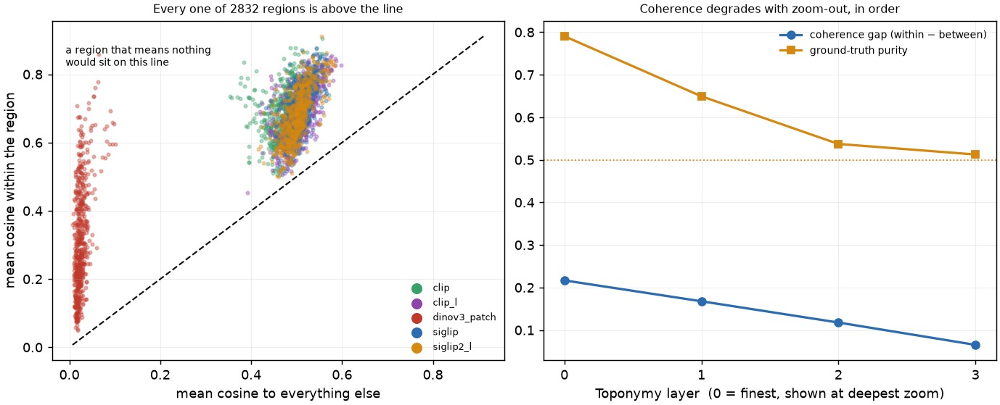

*Left: every region's within-cluster cosine against its between-cluster cosine.
A region that meant nothing would sit on the diagonal. Right: the coherence gap
and ground-truth purity against the Toponymy layer, which is the zoom band the
canvas shows each sign at.*

**Every one of the 2832 regions has within > between — none sits on the
diagonal.** The clustering is doing real work everywhere, which is the first
time anyone has checked.

**Coherence degrades with zoom-out, and it degrades in order.** The gap falls
0.22 → 0.065 and purity 0.79 → 0.51 from the finest layer to the coarsest. That
is the *desirable* shape — a sign shown at low zoom covers more ground and is
allowed to be broader — but it puts a number on where the signs stop meaning
much: at layers 2 and 3, **45–48 % of regions have no ground-truth category
holding even half their members**, so nearly half the coarse signs are naming
something no single label describes. That is [action item 4](#action-items).

**And `dinov3_patch` separates again — for the fourth time, independently.**
Its regions sit in a completely different band of the left panel (between-cosine
0.0–0.1 against 0.4–0.6 for the other four) while having the *largest* coherence
gap (0.31 at the finest layer). The same low-concentration geometry that the
atlas's r̄ = 0.61 flagged, that the Shepard panel showed as a displaced distance
range, and that drives its domain-shift false alarms, shows up here as well. Its
absolute similarities are compressed; its relative structure is the strongest in
the grid. **Any threshold tuned on cosine magnitudes from the other four
embedders will be wrong for it** — which is the general form of the
`domain_shift_report` failure, arrived at from four unrelated measurements.

---

# Appendices

## A — measured, no action needed

Two inventory items came back clean or inert. They are recorded here rather than
in the body so the findings above are not diluted by them.

### C3 — the compaction radius (dormant code)

The 90th-percentile core radius `_build_units` fits realises **0.894**
containment against a nominal 0.90, on every cell, independent of embedder. It
is the one fit in this whole inventory that does exactly what it says.

**But compaction is off in production.** `PROJECTION_COMPACT_DEFAULT` is `False`
and has been since the July UMAP-tuning sweep
([`2026-07-22-vtsbrowse-umap-tuning.html`](../2026-07-22-vtsbrowse-umap-tuning/report.html)),
which found `compact_layout` costs ~2 % taxonomy separability and ~5–6 %
neighbourhood structure on *every* dataset and embedder. `compact` is not a
user-facing setting: `resolve_projection_params` hard-wires it to that constant
with no override path, and all three production call sites
(`datasets/stages/projection.py`, `detectors/positives_browse.py`,
`routes/projection.py`) thread that one resolved value. So no shipped layout is
compacted, and the layout measured here was fit at the default — this is the
radius the packer *would* use, evaluated on the uncompacted layout users
actually see.

That is worth knowing in one direction only. The sweep rejected compaction on
what it *costs*, and a reasonable objection to that verdict would be that the
packing had been mis-fitted — that the circles were wrong and the cost was an
artefact. They are not. The radius statistic is sound, so the price the sweep
measured is the real price of the idea. **This is not evidence for turning
compaction back on**: nothing in this run re-examined the separability cost that
switched it off.

### D — the timing statistic that was computed and thrown away

`vtscore/timing/fit.py` was the one place in the tree that already computed a
goodness-of-fit statistic and discarded it: `affine_fit` returns an OLS r² and
`fit_step` unpacked it into `_r2` and dropped it. It is now kept on
`StepCoeffs`, serialized by `to_json`, and round-tripped by `from_json`.

**NaN means "not fitted as a line", which is a different statement from a bad
fit** — the byte-scaled path and the median fallback never draw one, so they
carry no r² rather than a misleading zero, and `to_json` omits the key entirely.

**No measurement accompanies this fix**, and that is a gap rather than a
finding: there is no recorded timing profile on this cluster to read an r² off.
Producing one needs a real dataset load with `VTSEARCH_RECORD_TIMING` set, which
this grid does not do — [action item 3](#action-items).

## B — instrument defects found and fixed

Three, in part 1, all of which emitted plausible numbers rather than failing.
They are recorded because the first run's output was *readable and wrong*.

1. **The baseline could not write.** `text_baseline.py` completes its whole pass
   before handing the path to pandas, so a missing `$CALIB_EXP/analysis` cost
   the entire run and surfaced as a write error 47 s in.
2. **The base-row filter emptied the main frame.** `load_main` filtered *both*
   variant columns to blank — right for `gmm_variant`, wrong for `pool_variant`,
   which the harness stamps with the base pooling's own name, `max`. All 192
   cells were dropped, and **H4 was written out as an empty CSV and scored as a
   null it had never computed.** The selftest passed because its fixture planted
   `pool_variant: ""`, a value nothing in the harness emits.
3. **H3 was unmeasurable, twice over.** `anchored_dmu_*` were filled only when
   handed an `anchored_fit` that no call site ever passed — 0 of 11 520 fold
   rows. And `anchor_mass_frac` was computed from `n_anchored`, which counts
   **folds** (0/1/2), where the formula needs the fold's **vote** count;
   `anchor_n` sat flat at 2.0 from click 5 to click 100.

**The common shape, worth carrying forward:** each of these produced a number a
reader would accept — a flat 2.9e-4, an empty CSV read as a null, NaN read as
"did not move". The existing test for the drift statistic checked only its
**null** (identical fits → zero drift), which passes whether or not the column
is ever computed. A test that a statistic is *finite* is not a test that it was
*measured*. The new tests assert the columns arrive populated and move with a
planted displacement.

## C — limits

Recorded so the next study does not over-read this one.

**Part 1**

- **One dataset, one prevalence.** `vg_scale_any` holds prevalence at 7.1 % by
  construction — chosen so the statistics are comparable, at the cost of saying
  nothing about how any of this moves with prevalence. Banding is the obvious
  follow-up.
- **One horizon.** 100 clicks. H1's tail ratio is still rising at click 100 on
  two of three arms, so a longer run may not stay under the bar.
- **Two folds.** `calibrate_count=2`, so every fold statistic is a median over
  two fits per cell.
- **H3's mass bar was set for the wrong haystack.** 1e-3 was derived for 50k
  points; at ~2k it is crossed by click 20 on every arm. The bar, not the
  finding, is what needs restating next time.
- **The middle geometry never learns**, so level comparisons against
  `dinov3_patch/whole_image` compare against an arm that does not beat typing.
- **`regret_honest` is a simulated quantity.** H4's negative slope is a
  within-harness association; nothing here measures a real user's regret.

**Part 2**

- **Five datasets, three sources.** B5's 64 % detection rate is over 70 ordered
  pairs of which many are Caltech-vs-something; a grid with more distinct
  corpora would estimate it better.
- **Seeds move the split, not the data.** Three seeds give the split's
  variability, not the dataset's; the SEs above are within-dataset.
- **The cross-dataset stage ran at one split seed**, so B4's per-embedder rates
  are over 5 datasets, not 15 cells. `dinov3_patch`'s 4-of-5 is a small
  denominator — the direction is unambiguous, the rate is not precise.
- **UMAP is scored on a 3000-point subsample** (trustworthiness is O(n²)), and
  it is fitted with a fixed `random_state`; production is unseeded by design, so
  these are one draw from a distribution of layouts.
- **`caltech101_m` is near the resolution floor** for B2/B3: its atlases average
  only ~2.9 calibrated nodes per item, and 9 of 75 cells fall below the path
  length of 3 that PREREG named as making the averaging claim vacuous.

## E — what is still not measured

Two inventory items are blocked on data rather than effort. They are left open
rather than answered badly, and each carries an issue so the blocker survives:
**#3349** (§11) and **#3350** (§10's naming half).

- **§11 — SIFT/VLAD RANSAC reprojection error and the MatchStats verification
  MLP.** Structural search is *instance* matching, and every corpus in the pile
  carries *category* labels, so a ground-truth-positive pair would be two
  different boats that legitimately share no structure. Needs an instance-level
  corpus — OpenLogo, or the #2351 screenshot set — neither of which is on the
  cluster.
- **§10 (the naming half) — Toponymy's suppressed warnings (#2558).** Capturing
  them needs a full fit including the namer, and the namer needs per-item texts,
  which on these datasets would have to be synthesised from the ground-truth
  categories. That would make the naming easier than production's and the
  warning rate unrepresentative — flattering the thing under test. The
  *clustering* half of §10 is answered above in [C4](#c4--are-the-browse-canvass-named-regions-coherent-inventory-item-10).
