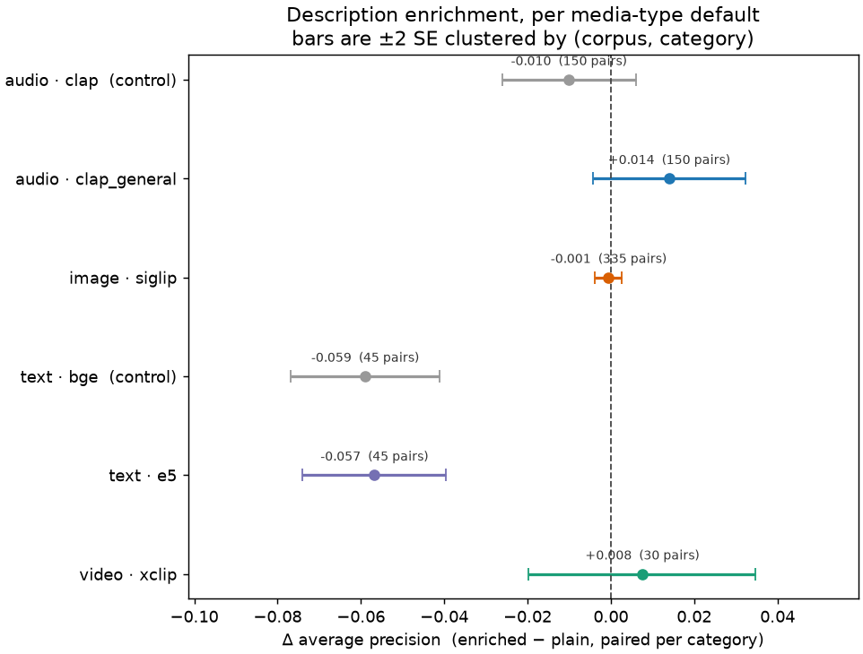
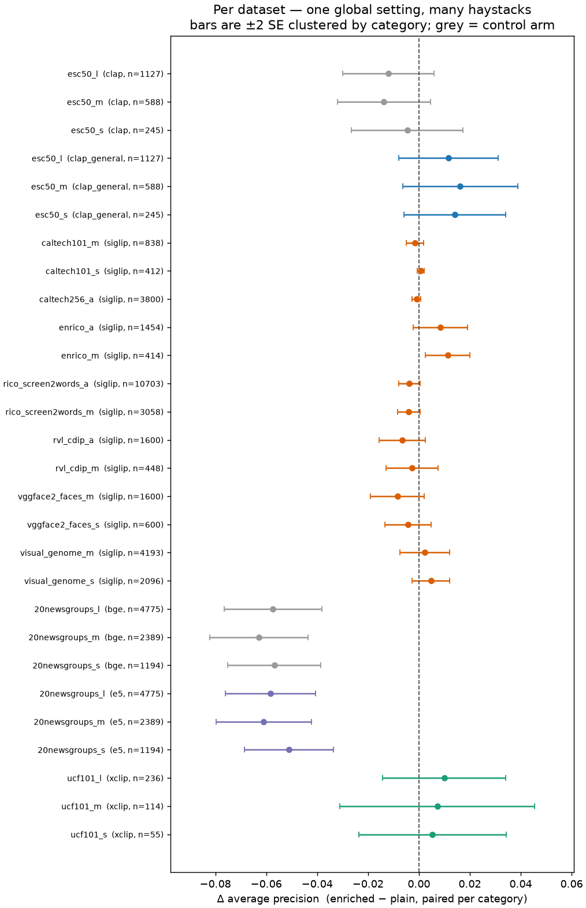
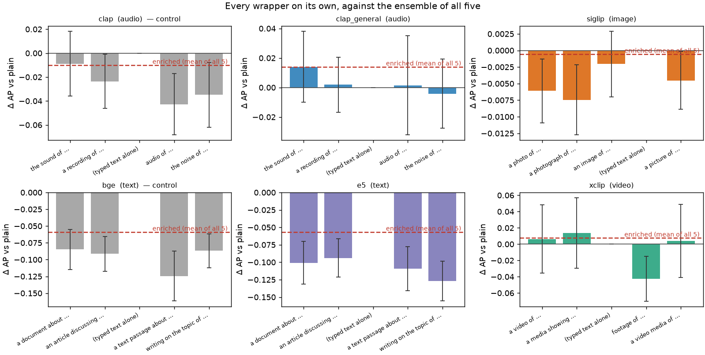

# `enrich_descriptions` stays `False` — and the setting is one boolean doing four jobs (#3127)

**Run 2026-08-31** · 28 cells, 22 eval datasets, 755 paired (dataset, category)
queries · plan pre-registered in [`PLAN.md`](PLAN.md) · harness
[`scripts/experiments/enrich/`](../../../scripts/experiments/enrich/)

## BLUF

**Do not flip the default.** Description enrichment helps exactly one of the
four media-type defaults, by less than this study can resolve, and it costs the
text default **four times** what it wins there:

| media type | default embedder | mAP plain | mAP enriched | Δ AP (paired) |
|---|---|---|---|---|
| audio | `clap_general` | 0.88 | 0.90 | **+0.014 ± 0.009** |
| image | `siglip` | 0.59 | 0.59 | −0.001 ± 0.002 |
| text | `e5` | 0.61 | 0.55 | **−0.057 ± 0.009** |
| video | `xclip` | 0.82 | 0.83 | +0.008 ± 0.014 |

Equal-weighted over the four defaults the setting is **negative**: −0.009 ±
0.005. The pre-registered rule (§6) returns `DO_NOT_FLIP__HARMS_A_DEFAULT`.

Three things behind that verdict are worth more than the verdict:

1. **#3077's premise reproduces exactly, and is smaller than it looks.** The
   sign flip between the CLAP checkpoints is real and lands inside the quoted
   range (`clap_general` +0.014, `clap` −0.010), but neither clears twice its
   own clustered standard error. The audio win that motivated this issue is a
   **point estimate, not a resolved effect**.
2. **The audio win is one template, not enrichment.** `the sound of {text}` is
   worth +0.014 on `clap_general` by itself; the other four are worth +0.002,
   +0.002, −0.004 and (the identity) 0.000 — and the five-way mean lands on
   +0.0139, i.e. exactly where the single good template already was. Enrichment is not ensembling
   here. It is carrying one good template and four passengers.
3. **Every wrapper hurts `siglip`, `e5`, `bge` and `clap`.** For those four
   embedders there is no member of the set that beats the typed text. The
   setting's value is a property of the **(embedder, corpus) pair**, and it is
   one global boolean.

Nothing ships as a behaviour change. What ships is documentation, a corrected
Settings tooltip that described a different feature entirely, and a follow-up
issue for per-embedder enrichment.

## 1. What the setting is, and how faithfully this measures it

`enrich_descriptions` has exactly one production consumer:
[`vtsearch/routes/sorting.py:271`](../../../vtsearch/routes/sorting.py) reads it
and hands it to `embed_text_query`, which swaps the query vector for the
L2-normalised mean over the embedder's `description_wrappers`
(`MediaEmbedder.embed_text_enriched`). Media vectors are untouched.

The harness calls that same function with the same arguments, so the arms differ
in the query vector and in nothing else: **one dataset load serves every arm**,
same medias, same encoder, same card, same process. The confounds other studies
have to pair away — host arithmetic (#3160), precision (#3143), cache state —
are shared here by construction rather than controlled.

Two checks that the instrument is the instrument:

- **The identity wrapper is a planted answer.** `{text}` is one of the five
  templates, so its solo arm must reproduce the plain arm exactly. It does, on
  all six embedders, to `max |Δ| = 0.0` — see
  [`tables/planted_answer.csv`](tables/planted_answer.csv). It sits at a
  *different index per embedder* (`w2` for CLAP/E5/BGE, `w3` for SigLIP), which
  is worth knowing before reading the per-wrapper figure.
- **The sizing cell reproduces #3077.** `esc50_s` on `clap_general` came back at
  mAP 0.8950 plain — the number #3077 published, to four decimals.

**Where the harness is *not* the app**: the simulated-user studies
(`run_cells.py`, `text_baseline.py`) call `embed_text_query` **without**
`enrich`, so every calibration study's opening and click-0 anchor is a plain
query regardless of this setting. Flipping the default would have moved the app
and left those studies where they are. That gap is worth a line in whichever
issue eventually changes this behaviour; it is not this study's to close.

## 2. Coverage

Every eval dataset whose media type has a text-capable default, which is every
media type except `face` (default `face`, no text tower — the setting is inert)
and `document` (no embedders at all; documents convert to other media types
before embedding). The `vggface2_faces_*` eval datasets are **image** media type
and are scored with `siglip`.

| media type | default | datasets | paired queries |
|---|---|---|---|
| audio | `clap_general` | `esc50_s/m/l` | 150 |
| image | `siglip` | caltech101 ×2, caltech256, enrico ×2, rico_screen2words ×2, rvl_cdip ×2, vggface2 ×2, visual_genome ×2 | 335 |
| text | `e5` | `20newsgroups_s/m/l` | 45 |
| video | `xclip` | `ucf101_s/m/l` | 30 |
| *control* | `clap` | `esc50_s/m/l` | 150 |
| *control* | `bge` | `20newsgroups_s/m/l` | 45 |

Differences are paired per (dataset, category) and their standard errors are
**clustered on (corpus, category)**: the S/M/L datasets are disjoint slices of
one corpus with the same categories and the same typed queries, so a category's
three slices are one question measured three times. The naive `sd/√n` is carried
beside it in every table and is 25–40% smaller, which is the size of the
mistake that clustering avoids.

## 3. Results

### 3.1 Per media type



*Each row is one embedder's paired mean Δ AP with ±2 clustered SE. Grey rows are
controls, not defaults — the rule in §6 reads only the four coloured ones. An
interval crossing the dashed zero is not resolvable at this sample; it is not
evidence of no effect.*

| media type | embedder | n | mAP plain | mAP enriched | Δ ± SE | helped / hurt |
|---|---|---|---|---|---|---|
| audio | `clap_general` **(default)** | 150 | 0.883 | 0.897 | **+0.014 ± 0.009** | 54 / 44 |
| audio | `clap` *(control)* | 150 | 0.860 | 0.850 | −0.010 ± 0.008 | 41 / 65 |
| image | `siglip` **(default)** | 335 | 0.589 | 0.588 | −0.001 ± 0.002 | 122 / 143 |
| text | `e5` **(default)** | 45 | 0.610 | 0.554 | **−0.057 ± 0.009** | 0 / 45 |
| text | `bge` *(control)* | 45 | 0.576 | 0.517 | −0.059 ± 0.009 | 0 / 45 |
| video | `xclip` **(default)** | 30 | 0.819 | 0.827 | +0.008 ± 0.014 | 8 / 12 |

Full table with both standard errors: [`tables/per_media_type.csv`](tables/per_media_type.csv).

**The text result is not close and it is not one model.** Every one of the 45
paired category-slices is worse under enrichment on `e5`, and every one of the
45 is worse on `bge` too. Two independently trained text encoders, 90 of 90
category-slices in the same direction: whatever is happening belongs to the
media type's wrappers, not to a checkpoint.

**On the first screen, the audio win is the only survivor.** P@10 — what a user
actually sees — moves +0.011 ± 0.009 on `clap_general`, −0.003 ± 0.003 on
`siglip`, −0.022 ± 0.017 on `e5`, and **−0.010 ± 0.011 on `xclip`**: video's
small AP gain is deeper in the ranking than the first page
([`tables/per_media_type_p10.csv`](tables/per_media_type_p10.csv)). An arm whose
AP rises while its P@10 falls has not improved anything the user was going to
look at.

### 3.2 Per dataset — the image default disagrees with itself



*One row per dataset, same pairing and same ±2 clustered SE. The image rows
(orange) are the point: within a single media type and a single embedder, the
sign of the effect changes with the corpus.*

The image mean of −0.001 is not "enrichment does nothing to images". It is an
average across a disagreement:

| corpus | what it is | Δ AP |
|---|---|---|
| `enrico` | UI screenshots | **+0.008 to +0.011** |
| `visual_genome` | photos, small targets | +0.002 to +0.005 |
| `caltech101` / `caltech256` | object photos, mAP ≈ 0.99 | ±0.002 (at ceiling) |
| `rvl_cdip` | scanned documents | −0.003 to −0.007 |
| `rico_screen2words` | UI screenshots | −0.004 |
| `vggface2_faces` | faces | −0.004 to −0.008 |

Two screenshot corpora land on opposite signs, which is a useful warning against
reading the domain labels as the mechanism. What survives is weaker and
sufficient: **the setting's value varies within the media type it would be set
for.**

### 3.3 Where the effect lives: one template, not an ensemble



*Each bar is one wrapper scored alone, against the plain typed query; the dashed
red line is `enriched`, the mean of all five. Error bars are ±2 clustered SE.
The reference bar (typed text alone) is zero by construction — it is the planted
answer of §1.*

| embedder | best single wrapper | Δ | worst | Δ | ensemble |
|---|---|---|---|---|---|
| `clap_general` | `the sound of {text}` | **+0.014** | `the noise of {text}` | −0.004 | +0.014 |
| `xclip` | `a media showing {text}` | +0.014 | `footage of {text}` | −0.043 | +0.008 |
| `siglip` | `an image of {text}` | −0.002 | `a photograph of {text}` | −0.008 | −0.001 |
| `e5` | `an article discussing {text}` | −0.094 | `writing on the topic of {text}` | −0.127 | −0.057 |
| `clap` *(control)* | `the sound of {text}` | −0.009 | `audio of {text}` | −0.043 | −0.010 |
| `bge` *(control)* | `a document about {text}` | −0.085 | `a text passage about {text}` | −0.125 | −0.059 |

Read the `siglip` row twice: **every photographic template is negative**, and
the ensemble is ≈0 only because the identity member drags the mean back to the
typed query. The same is true of `e5`, where the ensemble's −0.057 sits about
half way between the templates' −0.108 average and the typed query's 0, for the
same reason. Enrichment's headline number is, on three of the six embedders here,
mostly a measure of how much the `{text}` member dilutes the other four.

That matters for the fix. "Turn enrichment on" and "add `the sound of {text}` to
the CLAP query path" are different changes with different blast radii, and this
study only found evidence for the second one.

### 3.4 Literal examples

Every rate above is a mean over categories that move a great deal individually
([`tables/examples_by_media_type.csv`](tables/examples_by_media_type.csv)):

| media type | category | typed query | AP plain → enriched |
|---|---|---|---|
| audio | `insects` | *buzzing insects* | 0.50 → 0.96 (**+0.47**) |
| audio | `laughing` | *people laughing* | 0.44 → 0.69 (+0.25) |
| audio | `pouring_water` | *pouring water from a container* | 0.99 → 0.70 (**−0.28**) |
| image | `Martha Reeves` | *a photo of Martha Reeves* | 0.83 → 0.70 (−0.14) |
| image | `pizza` | *a pizza* | 0.67 → 0.78 (+0.11) |
| text | `business` | *buying and selling merchandise* | 0.47 → 0.34 (−0.14) |
| text | `cars` | *automobiles and car reviews* | 0.75 → 0.64 (−0.11) |
| video | `BalanceBeam` | *a gymnast on the balance beam* | 0.56 → 0.74 (+0.17) |
| video | `BaseballPitch` | *a baseball pitcher throwing a pitch* | 0.82 → 0.76 (−0.06) |

The audio column is the finding restated: a **+0.014 mean** sits on top of
per-category swings of ±0.3. Enrichment on `clap_general` is not a small
improvement to every query; it is a large, two-sided perturbation whose average
happens to be positive.

The face rows are also a caution about the eval, not only about the setting: the
VGGFace2 queries are *already* photographic prompts (`a photo of Martha Reeves`),
so enrichment embeds `a photo of a photo of Martha Reeves`. That stutter is the
most concrete version of what the wrappers do to a query that already has its
own frame — and it is 80 of the 335 image observations.

### 3.5 Cost

Enrichment replaces 1 text-encoder pass with 5, on the query only, against an
embedding pass over the whole haystack that has already happened. Measured:
**+18 to +32 ms per query** across every embedder
([`tables/arm_cost.csv`](tables/arm_cost.csv)), and `embed_text_query` caches by
`(embedder, media_type, enrich, text)`, so a repeated query costs nothing. As
pre-registered, cost does not gate this decision in either direction.

## 4. Mechanism: tested, and not found

The obvious explanation for the text collapse is in E5's own code. E5 is an
**asymmetric retrieval model**: `_embed_text_impl` encodes a query as
`query: <text>` and `embed_text_passage` encodes a document as
`passage: <text>` (`vtscore/media/text/embedder_e5.py:210-221`), trained so the
two sides sit apart and match across the gap. Every text wrapper — *a document
about*, *a text passage about* — rewrites the query to describe a document, i.e.
pushes it toward the side it is supposed to be searching *from*.

It is a good story and the measurement does not support it. Ranking the same
datasets with the **passage** encoder instead of the query encoder — crossing
the entire asymmetry gap, deliberately and completely
([`probe_text_prompt.py`](../../../scripts/experiments/enrich/probe_text_prompt.py),
[`tables/probe_query_vs_passage.csv`](tables/probe_query_vs_passage.csv)) —
costs **−0.015 ± 0.008**. Enrichment costs **−0.057**. The whole asymmetry is
about a quarter of the damage; three quarters of it is something else.

The second candidate, dilution — a generic prefix swamping a short query in a
mean-pooled sentence embedding — fares no better. It predicts more damage from
longer prefixes and from shorter queries. `e5` obliges on prefix length
(−0.101, −0.094, −0.109, −0.127 for 3, 3, 4, 5 added words) and `bge` does not
(−0.085, −0.092, −0.125, −0.087). Correlating each category's Δ against its
typed query length gives r = +0.14 (`e5`) and +0.31 (`bge`) — the *wrong sign*
for dilution — against −0.38 on `clap_general`
([`tables/mechanism_query_length.csv`](tables/mechanism_query_length.csv)).

So: **this study does not explain why the wrappers cost what they cost.** It
establishes that the cost is real, large, one-directional across 90 of 90
text observations, and reproduced on a second independent text encoder — and it
rules out the one explanation that was sitting in the source code. A per-embedder
design does not need the mechanism; a global default does, which is part of why
the global default should not move.

## 5. Threats

- **The queries are the harness's, not a user's.** One fixed phrasing per
  category, written as clean noun phrases for the eval. Enrichment rewrites what
  the *user* typed, so this measures it under favourable conditions; nothing
  here says what it does to a two-word or misspelled query. The VGGFace2 stutter
  in §3.4 is the one place the phrasing clearly interacts with the treatment.
- **Clustering handles the S/M/L repetition, not everything.** Categories within
  a corpus still share an annotation scheme; the effective sample is closer to
  "seven image corpora" than to "335 image observations".
- **Video is 10 categories.** Its ±0.014 is honest about that. The claim made
  from it is only the negative one — that it does not clear the margin.
- **Text is one corpus.** 20 Newsgroups is the only text eval dataset; the
  second text *encoder* is what makes the result more than a corpus quirk, and
  a second text corpus would make it more than that again.

## 6. The pre-registered rule, applied

From [`PLAN.md §5`](PLAN.md), fixed before the run and implemented as constants
in [`analyze_enrich.py`](../../../scripts/experiments/enrich/analyze_enrich.py):

1. **No default is harmed** — `Δ̄ > −2·SE` for all four. **FAILS**: `e5` is
   −0.057 against an SE of 0.009 (t = −6.6).
2. **Some default is helped and the pool is positive** — **FAILS** on both
   halves: no default clears +2·SE (`clap_general` t = 1.5, `xclip` t = 0.6),
   and the equal-weighted pool is −0.009 ± 0.005.

Verdict: **`DO_NOT_FLIP__HARMS_A_DEFAULT`**
([`verdict.json`](verdict.json)). The rule's own branch for this outcome is the
one the issue anticipated: the setting is being asked to do two incompatible
jobs, so say so and spin the per-embedder version out.

## 7. What ships

- **`enrich_descriptions` stays `False`.** No behaviour change.
  `tests/sorting/test_enrich_descriptions.py::test_default_is_false` now says
  *why*, and points here.
- **[`docs/ML.md`](../../ML.md#description-enrichment) gains a section on
  enrichment** — it had none — stating which embedders it helps and which it
  hurts, with the measured numbers, so the next default move starts from
  evidence instead of re-opening this.
- **The Settings tooltip is corrected.** It read *"Prepend item filenames to
  text-sort queries to improve matching for named items"*, which describes a
  different feature; enrichment does not touch filenames. Found by this study,
  fixed with it.
- **Follow-up filed: make enrichment per-embedder.** The per-wrapper table is
  the starting point — `the sound of {text}` on `clap_general` and
  `a media showing {text}` on `xclip` are the only templates in the tree with a
  positive point estimate, and four of the six embedders measured have no
  template that beats the typed query at all.

## 8. Reproducing

```bash
# 22 datasets + the clap control, four GPU chunks (~40 min of GPU total)
bash scripts/experiments/enrich/launch_enrich.sh chunks
bash scripts/experiments/enrich/launch_enrich.sh control bge 20newsgroups_s 20newsgroups_m 20newsgroups_l

# tables, verdict and figures, all from the cell CSVs
python scripts/experiments/enrich/analyze_enrich.py \
    --results /expscratch/$USER/enrich-3127/results \
    --out docs/experiments/2026-08-31-enrich-descriptions-3127

# figures alone, from the committed tables (no results dir needed)
python scripts/experiments/enrich/figures_enrich.py \
    --study docs/experiments/2026-08-31-enrich-descriptions-3127
```

Results root `/expscratch/$USER/enrich-3127`. Every cell records its commit,
host and SLURM job id in `logs/provenance-*.json`; `run_enrich.py` was written
once (commit `86786d90a`) and never changed during the run, so all 28 cells ran
identical measurement code.
