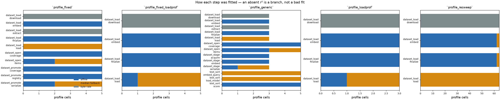
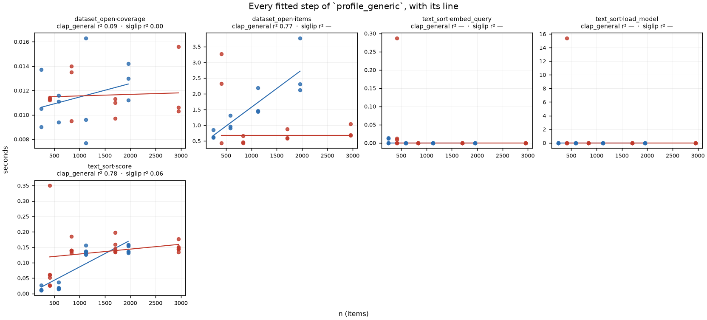
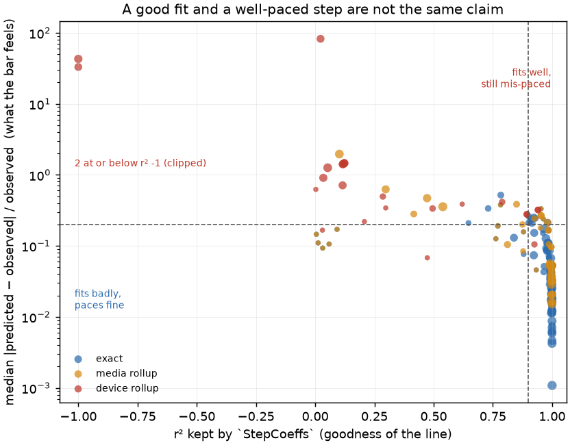
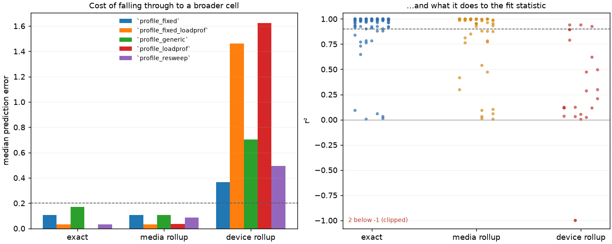
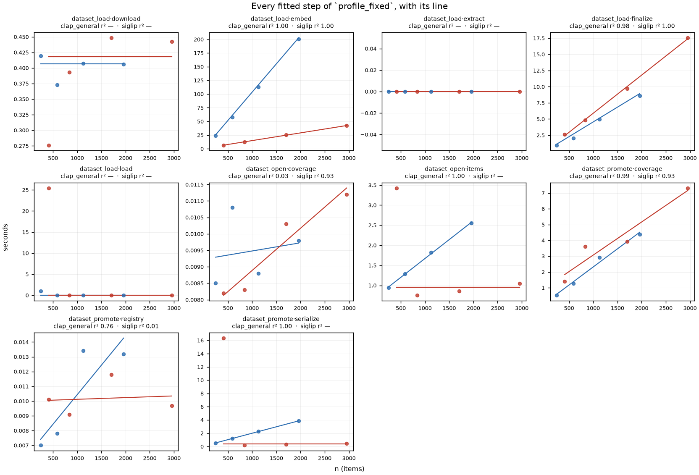

# Reading the r² the timing fitter keeps (#3345)

**Run 2026-09-02 on rack7n06** (V100-SXM2-32GB, Xeon E5-2698 v4, 8 CPUs, cuML
active → profile device key `cuda+cuml`), SLURM jobs **609428** (leg 1, the
measurement) and **609437** (leg 2, the same workload re-measured on the fixed
tree). Pre-registration in [`PREREG.md`](PREREG.md), written before the run.

## The short version

`vtscore/timing/fit.py` computes an OLS r² per `(task, cell, step)`. #3334 kept
it on `StepCoeffs` instead of discarding it. **Nothing had ever read one.** This
run recorded real profiles and read them.

The literal question has a dull answer: `embed` and `finalize` are cleanly
affine in *n* — r² **1.00** and **0.99** over 47 exact cells, prediction error
**3 %** and **7 %**. Nobody doubted those.

**The answer to the question behind it is not dull.** Every step the shipped
pacing considers *dominant* came back with **no r² at all**, and all of them for
the same reason: the tuning script's own `--drive` mode measures the **cheap
occurrence** of each once-per-process cost. The profile it produces is not
noisy. It is confidently, specifically wrong about the shape of the bar.

| the step a user actually waits on | what this sweep measured | fitted result |
|---|---|---|
| the model load, which really did cost **54.9 s** in this very run | `54.905`, then **0.000 s** × 3 | `load: {a: 0.0}` → **0.00** of the bar |
| `load_model` = **0.75** of a text sort ([`tasks.py`](../../../vtscore/timing/tasks.py)) | 15.4 s once, then **0.0 s** × 47 | median fallback, **100 %** prediction error |
| `coverage` = **0.85** of a dataset open (`tasks.py`) | **0.008–0.016 s** at every *n* from 245 to 2954 | r² **0.03**, ~2 % of the bar |
| staging `embed` — the reason staging is slow | **0.000–0.002 s** on all four image tiers | the import already cached every vector |

None of this is visible in a cell count. An admin reading the old coverage
report saw `dataset_open  5 cells, 72 step-samples` and would have deployed it.

**Six findings, in order of what they cost:**

| # | finding | status |
|---|---|---|
| **1** | `--drive` systematically measures the **warm** occurrence of every once-per-process cost, so the fitted profile zeroes the model load and the atlas rebuild | measured; **not fixed** — [#3520](https://github.com/samggreenberg/VTSearch/issues/3520), [#3521](https://github.com/samggreenberg/VTSearch/issues/3521) |
| **2** | Nothing in the tree read the r². A profile could be arbitrarily bad and say so nowhere | **fixed** — `coverage_report` now prints it |
| **3** | Both recorders stamped the caller's *blank* embedder, so no import could ever fill an exact `(device, media, embedder)` cell — and a cold CLAP load was marked warm because an image load had claimed the empty key | **fixed**, re-measured in leg 2 |
| **4** | `dataset_promote` was **silently unmeasurable**: its driver called `GET /api/medias`, an endpoint replaced by `/api/medias/ids` | **fixed**, re-measured in leg 2 |
| **5** | The rollup cells — the ones that *always match* — cost far more accuracy than the design admits: r² 1.00 / 3 % error exact, **0.29 / 50 %** at `(device, *, *)` | measured; [#3522](https://github.com/samggreenberg/VTSearch/issues/3522) |
| **6** | **The persisted r² described a line the profile does not store.** `seconds()` clamps a negative intercept to zero, but the r² was computed on the unclamped OLS line — in **58 of 195** affine cells | **fixed** — rescored against the stored coefficients, plus no r² from a two-point line |

**H5 held, in both directions.** `dataset_stage`'s `serialize` fits at r² **0.99**
and still mis-predicts by **69 %**; `dataset_open`'s `coverage` fits at r² **0.03**
and predicts within **17 %**. "Is this a good fit?" and "does this pace the bar?"
are different questions, and #3334 persisted the answer to the first one.

## Two corrections before anything could run

Both [#3345](https://github.com/samggreenberg/VTSearch/issues/3345) and the
[#3329 report](../2026-08-30-fit-quality-3329/REPORT.md) that spawned it were
wrong about the method, and neither error is cosmetic.

1. **The env var does not exist.** Both name `VTSEARCH_RECORD_TIMING`. The
   recorder's variable is **`VTSEARCH_TIMING_RECORD`**
   ([`recorder.py:53`](../../../vtscore/timing/recorder.py),
   [`DEPLOYMENT.md`](../../DEPLOYMENT.md)). An admin following the report would
   have armed nothing and recorded nothing — silently, because unarmed is the
   normal state.

2. **"One dataset load" produces no r² anywhere.** r² only survives `fit_step`'s
   OLS branch, and that branch needs spread in *n*. One load is one *n* per
   cell → `affine_fit` returns `(mean, 0, 0)` → `slope <= 0` → the median
   fallback, which deliberately drops the r². `fit_profile`'s `min_samples=2`
   would then drop most cells anyway. **The experiment as specified returns an
   empty answer that looks like a measurement** — which is the same failure
   #3329 catalogued three times in its own instrument.

The report's third claim, that "there is no recorded timing profile on this
cluster to read an r² off", was half right. There was no *profile*, but **2 345
rows** of recorded load timings from the [#3062
resweep](../../../scripts/profiling/fit_load_weights.py) were sitting on
`/exp/sgreenberg/resweep-3062/`, and `normalize_row` exists precisely to fold
that older row shape in. Refitting them cost nothing and covers 17 datasets
across 5 media types — wider than any fresh run of this size. It is the
strongest arm in the study.

Both corrections are now written into the #3329 report.

## Action items

| # | do this | why | evidence |
|---|---|---|---|
| **1** | **Record cold/warm on the generic recorder's rows and fit them apart**, as `_load_profiler` + `fit_load_weights.py` already do for loads | This one change fixes findings 1's three worst instances at once. Without it the documented tuning flow cannot produce a usable profile for any task with a model load | [§2](#2--every-step-that-carries-no-r²-is-a-different-defect), [#3520](https://github.com/samggreenberg/VTSearch/issues/3520) |
| **2** | **Make `--drive` measure the cold branch it is pretending to measure** — a fresh embeddings dir per family, and an atlas-rebuild case for `dataset_open` | Staging's `embed` measured 0.001 s because the import leg had just cached every vector; `coverage` measured 11 ms because the atlas restored every time | [§2](#2--every-step-that-carries-no-r²-is-a-different-defect), [#3521](https://github.com/samggreenberg/VTSearch/issues/3521) |
| **3** | **Do not deploy a profile fitted only from `--drive` output** until 1 and 2 land | It gives **0 %** of the bar to a step that took 55 s in the run it was fitted from | [§4](#4--what-this-does-to-the-bar) |
| **4** | **Mark rollup cells in the coverage report**, or refuse to emit a `(device, *, *)` cell from a sweep that spans media types | The cell guaranteed to match is the one with 50 % prediction error, and nothing says so at deploy time | [§3](#3--the-price-of-the-rollup-cells), [#3522](https://github.com/samggreenberg/VTSearch/issues/3522) |
| — | ~~Read the r²~~ | | **done** in this PR |
| — | ~~Record the resolved embedder~~ | | **done** in this PR |
| — | ~~Fix `dataset_promote`'s driver~~ | | **done** in this PR |
| — | ~~Score the r² against the coefficients the profile stores~~ | | **done** in this PR |

**Do NOT do these:**

- **Do not "fix" `dataset_open`'s r² of 0.03.** The step is genuinely flat on
  the path that was measured (11 ms at every size). The line is meaningless
  because there is nothing to fit, not because the fitter is wrong.
- **Do not raise `min_samples`.** Every cell that misled here was already
  well-sampled — 4 for `dataset_load`'s steps, 24 for `text_sort`'s and
  `dataset_open`'s. The problem is *which occurrence* was sampled, not how many.

## 1 — What the r² says where it exists

The one arm with wide *n* coverage is the #3062 resweep refit through this
fitter: 2 293 usable rows over 17 datasets and 5 media types — four size tiers
each for audio, image, text and video, and a single documents set.

| task | step | verdict | evidence |
|---|---|---|---|
| `dataset_load` | `embed` | **AFFINE** | r² median 1.00 over 47/47 fitted cells |
| `dataset_load` | `finalize` | **AFFINE** | r² median 0.99 over 47/47 fitted cells |
| `dataset_load` | `download` | not fitted as a line | byte-scaled by design (seconds per MB) |
| `dataset_load` | `load` | **never varied in *n*** | one *n* per cell in 47 cells — no line was attempted |

`embed` and `finalize` are the two steps whose cost really is "a constant plus
so-much per item", and the fit says so at 3 % and 7 % median prediction error.
That is the good news, and it is the whole of it.



*Every profile cell, coloured by which branch of `fit_step` produced it. The
blue band — the only one with an r² — is a minority of the steps in every
profile.*

## 2 — Every step that carries no r² is a different defect

A missing r² has three causes, and reading them apart is most of the value here.

**Byte-scaled — by design.** `download` and `extract` are fit as seconds per MB,
because 500 videos and 500 text files are the same *n* and two orders of
magnitude apart in bytes. Median prediction error **8 %**. Working as intended.

**Never varied in *n* — the instrument never tried.** The legacy profiler writes
a `model_load` row only on the *cold* load, so each cell holds exactly one
sample and OLS has no x-variance. 47 of 47 cells. This is a coverage gap, not a
bad fit.

**Measured as free — the sweep caught the cheap occurrence.** This is the one
that matters, and it appears four times:

| step | what was recorded | fitted to |
|---|---|---|
| `dataset_load` · `load` | `54.905`, then `0.000`, `0.000`, `0.000` | `{a: 0.0}` |
| `text_sort` · `load_model` | `15.397` on the first sort, `0.0` on the other 47 | median fallback, **100 %** prediction error |
| `dataset_open` · `coverage` | `0.011 0.011 0.011` @412 … `0.011 0.010 0.016` @2954 | r² **0.03** over all five cells, **0.09** over the two exact ones |
| `dataset_stage` · `embed` | `0.000 0.001 0.001 0.002` across all four image tiers | median fallback |

Each has a single mechanism: **`run_drivers` measures the second and subsequent
occurrences of a once-per-process cost.** The encoder is resident after the
first import, so the next seven pay nothing. The coverage atlas is cached in the
pickle, so every `dataset_open` restores instead of rebuilding — `tasks.py`'s
own comment calls the rebuild "a minutes-long hierarchical k-means", and this
sweep never saw one. `dataset_stage` runs *after* `dataset_load` in
`run_drivers`, by which time every demo's vectors are cached.

**The four numbers are not noise around the truth; they are the truth about a
branch nobody waits on.** A 55-second model load and an 11-millisecond atlas
restore are both real measurements. Only one of them is the number a progress
bar needs.



*The exact cells of the generic recorder's run — one colour and one line per
cell (blue `clap_general`, red `siglip`), each line drawn only through its own
cell's points. Note the y-axes: `dataset_open · coverage` spans 8–16
**milliseconds** across a 7× range of `n`, which is what an r² of 0.09 is
fitting. `text_sort · load_model` is a single point at 15.4 s with a flat line
at zero through the other 47 — the picture of a once-per-process cost measured
47 times after it was paid. `dataset_load` has no panel here at all, because
leg 1 produced no exact cell for it; that is finding 3.*

## 3 — The price of the rollup cells

`fit.py`'s docstring justifies the rollups plainly: *"an admin who measures three
exemplar datasets still improves the pacing of every task on every dataset that
host will ever see, because the least-specific cell always matches."* True, and
this is what it costs.

| profile | specificity | affine steps | median r² | median prediction error |
|---|---|---|---|---|
| `profile_resweep` | exact | 94 | **1.00** | **0.03** |
| `profile_resweep` | media rollup | 24 | 0.98 | 0.09 |
| `profile_resweep` | device rollup | 6 | **0.29** | **0.50** |
| `profile_generic` | media rollup | 14 | 0.99 | 0.11 |
| `profile_generic` | device rollup | 7 | 0.12 | **0.70** |
| `profile_loadprof` | device rollup | 3 | 0.12 | **1.62** |

Same rows, same fitter: **the cell that is guaranteed to match is 17× worse than
the exact one it backs up**, and on one arm it is 162 % out. The mechanism is
not subtle — `(cuda+cuml, *, *)` pools an image import at 0.014 s/item with an
audio one at 0.102 s/item and fits one slope through both — but nothing at
deploy time distinguishes a rollup from an exact cell, and the profile format
does not mark them.

This is a real limit on the design, not a bug in it. It does argue that a
`(device, *, *)` cell fitted across media types is worse than no cell at all,
since falling through to the shipped defaults would at least be honest.

### The r² was scoring a line the profile does not store

**The sharpest single example in the run lives here, and chasing it down found
the study's most general defect.** The `cuda+cuml|*|*` cell for
`dataset_load`'s `load` step had exactly two samples — the cold image load at
54.905 s (n=412) and the cold audio load at 1.774 s (n=245) — and shipped as:

```
"load": {"a": 0.0, "b": 0.318, "r2": 1.0}
```

**r² = 1.000, and a median prediction error of 4290 %.** Two things were wrong
at once, and only the second generalises.

The line through two points is exact, so `ss_res` is 0 and r² is 1.0 whatever
the points are — arithmetic, not evidence. But that is not where the 4290 %
comes from. OLS through those two points has intercept **−76.1 s**, and
`fit_step` clamps it: `StepCoeffs(a=max(0.0, intercept), …)`, because
`seconds()` must never hand the bar a negative slice. **The stored model is
therefore `0 + 0.318·n`, which is not the line the r² scored.** At n=245 it
predicts 77.9 s against an observed 1.774 s — exactly the 4290 % measured.

**That is not a two-point curiosity: 58 of the 195 affine cells in this run
stored a clamped intercept**, including `profile_resweep`'s `dataset_load ·
finalize` at r² 0.98 on coefficients 52 % out. Wherever the clamp fires, the
persisted goodness describes a model the profile does not contain — the same
species of defect as #3329's original one, a statistic that annotates something
other than what it was computed from.

`fit_step` now **rescores a clamped fit against the coefficients it actually
stores** (and still withholds the r² from an unclamped two-point line). The
score can come back negative, meaning "worse than predicting the mean", which is
a true statement worth persisting. The effect is visible in the table above:
the device-rollup rows that used to read r² 0.89 and 0.96 beside prediction
errors of 162 % and 146 % now read **0.12**. The statistic and the error stopped
contradicting each other, because they are finally describing the same line.

Everything else in this report was regenerated with both guards in place.



*Every affine cell in every profile, after both guards. The mass now runs down
the right-hand edge — high r², low error — which is what agreement looks like.
The two quadrants that remain populated are the finding: `dataset_stage ·
serialize` and `dataset_promote · serialize` sit top-right (r² 0.99–1.00,
69–92 % error), and the flat millisecond steps sit bottom-left (r² near zero,
error under 20 %). Point size is the step's median cost, so the large points are
the ones a user would notice.*



## 4 — What this does to the bar

r² and prediction error describe coefficients. This describes the consequence:
the normalized weight vector `step_weights` hands the tracker.

Normalized `step_weights` for `dataset_load`, generated on the same GPU node the
sweep ran on (job 609456) — `load_step_weights` reads the device from the
*process*, so a table built anywhere else would not be comparable. Step 2 is the
model load.

| profile | case | step 1 | **step 2 (model load)** | step 3 (embed) | step 4 (finalize) |
|---|---|---|---|---|---|
| shipped `LOAD_COST_MODEL` (`cuda`) | image/siglip, n=412 | 0.60 | 0.02 | 0.28 | 0.10 |
| `profile_resweep` | image/siglip, n=412 | 0.01 | **0.75** | 0.16 | 0.08 |
| `profile_generic` | image/siglip, n=412 | 0.04 | **0.00** | 0.61 | 0.35 |
| `profile_fixed` | image/siglip, n=412 | 0.04 | **0.00** | 0.70 | 0.26 |
| shipped `LOAD_COST_MODEL` (`cuda`) | audio/clap_general, n=245 | 0.58 | 0.20 | 0.21 | 0.01 |
| `profile_resweep` | audio/clap_general, n=245 | 0.01 | **0.45** | 0.52 | 0.03 |
| `profile_generic` | audio/clap_general, n=245 | 0.01 | **0.00** | 0.95 | 0.04 |

**The strict claim first, because it needs no comparison at all: the profile
fitted from this run gives 0 % of the bar to a step that took 54.9 seconds
inside that same run.** A user importing 412 images with it deployed watches the
bar sit at 4 % for the better part of a minute and then sweep.

**The available answers for that one step are 0.00, 0.02 and 0.75 — a factor
of 37 between the two non-zero ones — and the reason is not error. Each priced
a different branch.**

| profile | model load it priced | download it priced |
|---|---|---|
| `profile_resweep` | **cold** (the legacy profiler writes `model_load` only on a cold load) | cached archive |
| shipped `LOAD_COST_MODEL` | **warm** (`a_model` is a 0.5 s floor) | a real 131 MB fetch — hence its 0.60 on step 1 |
| `profile_generic` / `profile_fixed` | **warm**, because the sweep's one cold load was averaged away | cached archive |

Every one of those numbers is a correct measurement of something. Nothing in the
profile format records *which* — there is no field for it, and the coverage
report cannot infer it. That is the whole of finding 1, stated as a table:
**"which branch did this sweep see?" is the question the profile most needs to
answer and the only one it cannot.**

The same shape hits `dataset_open`, where `tasks.py`'s shipped default is
`(0.15, 0.85)` — 85 % to the coverage atlas — and the fitted profile is roughly
`(0.98, 0.02)`, because the atlas restored from its cache on all 16 measured
opens and never once rebuilt.

## 5 — The fix, measured

Three of the six findings had a fix that could be re-measured; leg 2 re-ran the identical
eight imports on the fixed tree, on the same node, so the before/after is a
property of the code and not of the machine or the day.

**The embedder now reaches the row, so the exact cells exist.** Both recorders
had been stamping the caller's blank. `drive_dataset_load` passes
`embedder: ""` — it lets each media type's default stand — so the documented
`--drive` flow was *structurally* incapable of filling an exact
`(device, media, embedder)` cell for the one task whose cost most depends on
the encoder. #3062 measured a 4.75× spread in `finalize`'s slope across
embedding dimension; all of it was being averaged into one media cell.

| | leg 1 | leg 2 |
|---|---|---|
| `dataset_load` cells | 3 | **5** |
| of which exact `(device, media, embedder)` | **0** | **2** |
| recorded embedder | `""` | `siglip`, `clap_general` |
| affine steps (median r²) | 6 (0.98) | **10 (1.00)** |

**And the cold/warm flag is no longer decided by a different media type.** With
a blank name, `_seen_embedders` held one empty key, so the first image import
claimed it and the genuinely cold CLAP load that followed was written
`cold_model: false`. That is not a cosmetic mislabel: #3339's fitter drops warm
rows from the model-load fit and keeps them for embed and finalize, so a
mis-flagged row lands in the wrong regression. The set is now keyed
`(media_type, embedder)`.



*The same picture for leg 2, and the fix is the top row: `dataset_load` now has
panels at all, because its rows carry `siglip` and `clap_general` instead of a
blank. `embed` is the clearest single argument for exact cells over rollups —
two clean lines at 0.10 and 0.014 s/item, both r² 1.00, that a media rollup
would have averaged into one wrong slope. `load` is still the lone cold point
above a row of zeros: finding 1 is not fixed here.*

**`dataset_promote` went from unmeasurable to measured.** Its driver called
`GET /api/medias`, an endpoint replaced by `GET /api/medias/ids` + a batch
fetch. Every dataset returned a non-200, every one was skipped, and the family
reported `NOT MEASURED — using built-in defaults` on every run anyone had ever
done. With the endpoint corrected:

```
  dataset_promote  5 cells, 24 step-samples
                   12 affine (median r² 0.93, 5 below 0.90), 3 median-fallback (no credible slope)
```

**Two of the three were invisible; the third was visible and still not seen.**
A blank embedder looks exactly like a rollup cell, which looks like coverage,
and nothing printed an r² to contradict it. The two-point r² of 1.000 looked
like the best fit in the profile. `dataset_promote` is the interesting one: it
*did* log `SKIPPED … cannot list medias` on every dataset, and the coverage
report *did* say `NOT MEASURED`. But `NOT MEASURED` is also what a family nobody
drove looks like, and the skip line named a symptom rather than a dead endpoint,
so the signal was there and carried no urgency. The coverage report now prints
the status code alongside it.

## Scoreboard against the pre-registration

[`PREREG.md`](PREREG.md) declared which numbers had already been seen before it
was written (the #3062 refit) and which were genuine predictions. Scored
honestly, both halves:

| # | pre-registered claim | bar | outcome |
|---|---|---|---|
| H1 | `embed` and `finalize` are genuinely affine in *n* | median r² ≥ 0.90 across exact cells | **HELD** — 1.00 and 0.99. Declared as *seen* for the resweep arm; held as a prediction for the generic recorder too |
| H2 | the model-load step is never fitted as a line | median fallback in ≥ 80 % of exact cells | **HELD** — 100 %. `dataset_load · load` and `text_sort · load_model` are median fallbacks in every cell of every arm |
| H3 | the generic recorder fits `load` **worse** than the legacy profiler, on the same loads | more affine cells, or lower error, for `profile_loadprof` | **HELD** — same eight loads: the legacy profiler fits `load` in 1 of 3 cells at 0 % error; the generic recorder fits it in 0 of 3 at 100 % |
| H4 | the rollup cells cost real accuracy, monotonically | error rises exact → media → device, and device > 0.20 | **HELD** — 0.03 → 0.09 → 0.50 on the resweep arm; monotonic on every arm that has all three levels |
| H5 | a high r² does not imply a well-paced step | at least one step with r² ≥ 0.90 and error > 0.20, **or** the converse | **HELD IN BOTH DIRECTIONS**, and survives the finding-6 fix — `dataset_stage · serialize` at r² 0.99 / 69 % error, and `dataset_open · coverage` at r² 0.03 / 17 % error. Both are unclamped cells, so neither is an artefact of the defect that fix removed |

**One caveat on H5, raised against myself.** Part of the r²/error disagreement
this run first measured *was* an artefact: 58 cells were scoring the wrong line
(finding 6). After rescoring, the two statistics agree far better — the worst
rollup rows moved from r² 0.89–0.96 to 0.12, beside errors of 146–162 %. H5
still holds on cells the clamp never touched, which is what makes it a real
claim rather than a bug's shadow. The bar was pre-registered as "at least one
step in either quadrant", and the surviving examples clear it.

**Nothing was refuted, and that is itself worth flagging.** Five for five is
usually a sign the bars were set where the answer already was, and two of them
(H1, H4) were declared pre-seen for exactly that reason. The three genuine
predictions — H2, H3, H5 — were about the *instrument* rather than the data,
which is a much easier thing to be right about from a reading of the code. The
findings this run did not predict are the ones worth weighting: the `--drive`
sequencing (finding 1), the blank embedder (3), the dead endpoint (4) and the
two-point r² (6) were all discovered, not anticipated.

## Limits

Recorded so the next study does not over-read this one.

- **One node, one afternoon.** rack7n06 (V100-SXM2, E5-2698 v4, 8 CPUs,
  `VTSEARCH_TORCH_THREADS=8`). The resweep arm's GPU rows came from the same
  node family, which is what makes the two comparable; nothing here transfers to
  the L40S or H200 nodes, and cpu coefficients are thread-bound (#3062).
- **Prediction error is in-sample.** Every residual is measured against the
  samples its coefficient was fit from, so it is a **floor** on the error a real
  load would see, never an estimate of it. It answers "does this fit describe
  its own data"; it does not answer "how far off will the bar be".
- **Two media types in the fresh run**, image and audio, at their default
  embedders. The text and video sources are not in the shared demo cache, and
  `drive_dataset_load` measures one encoder per media type — so nothing here
  says how `finalize`'s slope moves across embedding dimension, which #3062
  measured at a 4.75× spread.
- **`find`, `detector_load` and `train_and_score` were never measured.** All
  three need a detector, and a scratch data dir has none. Declared in the
  pre-registration, not discovered afterwards.
- **The `dataset_open` verdict is about the cached path only.** No measured open
  rebuilt its atlas, so this run says nothing about whether the rebuild is
  affine in *n* — only that the shipped 0.85 weight and the measured 11 ms
  cannot both describe the same step.
- **One rep for the imports.** The spread that makes an r² possible came from
  the four size tiers, not from repetition, so a per-*n* noise estimate is not
  available for `dataset_load` or `dataset_stage`. The read-only families ran
  two reps and their scatter is visible in the figures.

## Reproducing

```bash
sbatch scripts/experiments/timing_r2/run_timing_3345.sbatch          # leg 1
sbatch scripts/experiments/timing_r2/run_timing_3345_fixed.sbatch    # leg 2
sbatch scripts/experiments/timing_r2/analyze_timing_3345.sbatch      # refit, tables, figures
```

Completion is a file — `DONE.run`, then `DONE.analyze` — never a live process.

Two things the analysis job does on purpose. It **refits every profile from the
recorded rows** before reading them, so the tables always describe the fitter in
the tree rather than whichever version happened to run during the sweep: the
rows are the durable artefact and the profiles are derived. And it runs **on a
GPU node**, because `load_step_weights` reads the device from the *process* — on
a login node the shipped-baseline row of §4 silently becomes a CPU row compared
against `cuda+cuml` profiles. The table prints the device it resolved, so this
is checkable rather than assumed.
