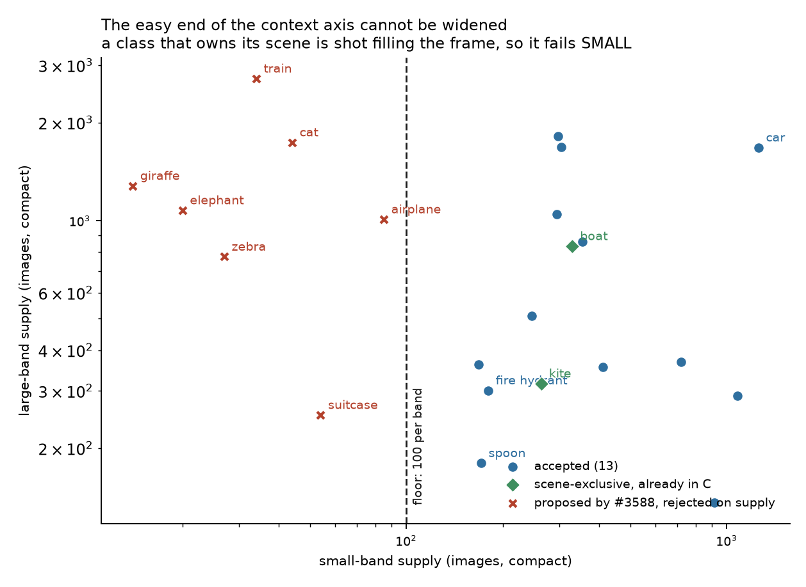

# Expanding `vg_scale`'s class list — what VG will actually support (#3588)

**2026-09-03.** Issue #3588 asks for the class list to sample *context
exclusivity* on purpose instead of by accident. This is the measurement pass
that decides which classes can serve, plus the review material for the ones that
can: 13 slates, 13 datasets, 13 empty detectors and an
[annotation guide](ANNOTATION_GUIDE.md).

**Nothing about the class list has been changed.** `SCALE_CLASSES` is untouched
and `vg_scale` is not rebuilt. What is added is the candidate list, the rules
they would be reviewed under, and the tooling behind them.

## Three results, in order of how much they change the plan

### 1. The issue's own proposal does not survive the gate the issue specifies

Step 0 of #3588 is right that the measured shortlist, not the proposal, is
ground truth — and run against it, most of the proposal fails:

| proposed | binding failure |
|---|---|
| `airplane` (and `plane`, `jet`) | 85 / 81 / 21 images in the **small** band (floor 100) |
| `train`, `zebra`, `elephant`, `giraffe` | 34 / 27 / 20 / **14** small-band images |
| `cat`, `suitcase` | 44 / 54 small-band |
| `handbag`, `purse` | 21 / 89 **large**-band |
| `potted plant` | 1 small-band image in all of VG |
| `motorcycle` | measured **alias** of `bike` (box IoU 0.38) |
| `surfboard`, `snowboard`, `skateboard` | measured **alias** of `board` (0.45 / 0.50 / 0.52) |
| `traffic light` | 58 large-band **and** head noun `light` already barred by `scale_study_exclusion` |
| `cell phone` | 98 large-band under that spelling — but the VG name `phone` clears it |

The issue predicted the binding band correctly for large objects ("the binding
band is `small`") and then predicted the supply would be fine ("distant vehicles
are common"). For `truck` it is; for `train` and `airplane` it is not.

### 2. The easy end of the context axis cannot be widened — and that is structural



Every scene-exclusive class the issue wanted fails on the **small** band
specifically, and by a wide margin: `giraffe` has 14 small-band images against
1,279 large, `train` 34 against 2,730. That is not a sampling accident. **A
class that owns its scene is photographed filling the frame** — which is close
to what "scene-exclusive" means — so context exclusivity and small-band supply
are anti-correlated in VG.

So the achievable expansion is asymmetric: it adds same-scene partners and
widens the *hard* end, and it cannot widen the easy end at all. The two
scene-exclusive anchors the study has (`kite`, `boat`) stay the only two. Any
design that needs a wider easy end needs a different image source, not a
different query — filed as **#3603**.

### 3. Definition risk is measurable before anyone labels, and `book` proves it

This is the part that answers "we screwed up with magazines vs books."

`book` split because COCO has no magazine class, so COCO's annotators put
magazines in `book` while the human pass applied the narrower English reading —
21 verdicts on one definition, 49 on another, with every structural check
passing. **That split was visible in the data the whole time.** On the ~51k
images that are both VG and COCO, both vocabularies annotate the same pixels, so
asking *which VG names land on a COCO class's boxes* enumerates the boundary
cases before a reviewer meets one. `coco_folds.py` does that. Run against
`book` it prints `magazine` (79 boxes) and `magazines` (30).

The reverse direction gives a **risk score**: the share of VG boxes of a name
that land on *no* COCO class, on images COCO annotated exhaustively. COCO is
exhaustive over these 80 classes, so a high share means the VG name covers
objects COCO does not have.


`book`, the class that actually broke, scores **43%** — which is what calibrates
the column. Exactly one candidate scores worse:

- **`cell phone` at 46%.** VG's `phone` boxes land on a COCO `cell phone` only
  54% of the time. The other 46% are landlines, desk phones and payphones,
  which COCO has no class for. This is the same failure as `book`, one class
  earlier, and it is why the dataset is named `cell phone not landlines`.
- **`cup` carries the largest fold-in measured anywhere**: 1,136 VG `glass`
  boxes — 14% of every COCO `cup` box — are COCO cups. That is ten times the
  size of the `magazine` fold-in. A reviewer applying narrow English to `cup`
  would repeat the `book` failure at ten times the scale.
- **`bowl` folds in `plate` (212) and `dish` (146)**, because COCO has no
  `plate` class. `plate` is separately barred here as polysemous (dinner plate
  / licence plate), which is precisely why it lives inside `bowl`.
- **`fire hydrant` is the cleanest class measured** (7% unmatched, 81% of COCO
  boxes carrying a VG box) — and it only works merged, since the `hydrant`
  spelling is 266 of its 835 COCO boxes.

Every rule in the annotation guide is one of these measurements, and the rule
travels in the **dataset name**, because a reviewer cannot see a manifest while
voting and an unstated convention is what caused this in the first place.

## A cost the issue did not price: the shared negative pool does not survive

The shared pool was drawn as "holds none of the **current twelve**". It is
therefore not a negative pool for a candidate — an image can sit in it and hold
a car. Measured against the 4,200-image pool:

| class | evicted | | class | evicted |
|---|---:|---|---|---:|
| `car` | 331 (7.9%) | | `bench` | 155 (3.7%) |
| `chair` | 284 (6.8%) | | `cell phone` | 152 (3.6%) |
| `bottle` | 184 (4.4%) | | `sink` | 123 (2.9%) |
| `bowl` | 182 (4.3%) | | `vase` | 86 (2.1%) |
| `cup` | 178 (4.2%) | | `spoon` | 81 (1.9%) |
| `truck` | 155 (3.7%) | | `fork` | 71 (1.7%) |
| | | | `fire hydrant` | 67 (1.6%) |

**The union is 1,430 — 34% of the pool.** Survivors: 2,770, against
`SCALE_N_NEG` = 3,900. The 300 spares exist to absorb exactly this and are an
order of magnitude short.

So adding all thirteen forces ~1,430 **fresh** negatives into the pickle, and a
negative that is not already in it has to be embedded — i.e. a full `vg_scale`
rebuild, dragging `vg_scale_any` and `vg_scale_deep` with it, and orphaning the
part of the negative review pinned to the evicted images. The issue priced
compute per class (+8% of the grid) and did not price this at all.

Where it breaks is sharp:

```
+fire hydrant  survivors 4133      +truck        survivors 3526
+fork          survivors 4062      +bench        survivors 3398
+spoon         survivors 4001      +cup          survivors 3299
+vase          survivors 3917  <-- last one above SCALE_N_NEG (3900)
+sink          survivors 3806      ... +car      survivors 2770
```

**Four classes can be added without redrawing the negative pool. The fifth
cannot.** That is the decision this expansion actually turns on, and it is a
choice between a cheap 4-class addition and a rebuild — not, as the issue
framed it, a smooth +8% per class. Filed as **#3604**.

## What is built and ready

13 slates × 300 images = **3,900 images**, at #3156's proportions (200 ranked
negatives, 70 random, 30 boxed positives), each imported as a VTSearch dataset
with an empty detector of the same name, in `/exp/sgreenberg/projects/VTSearch/data`.

| dataset / detector name | class | small | medium | large |
|---|---|---:|---:|---:|
| `truck incl vans not SUVs` | truck | 455 | 1535 | 1359 |
| `car incl SUVs and minivans` | car | 1297 | 2922 | 1511 |
| `fork incl plastic` | fork | 256 | 1275 | 355 |
| `spoon incl plastic not spatulas` | spoon | 365 | 908 | 197 |
| `cup incl mugs and glasses not stemware` | cup | 969 | 1775 | 491 |
| `bowl incl plates and dishes` | bowl | 456 | 1460 | 911 |
| `bottle incl jars` | bottle | 1125 | 1762 | 375 |
| `vase incl pots and planters` | vase | 515 | 701 | 408 |
| `bench not chairs` | bench | 487 | 1457 | 1681 |
| `chair incl stools not couches` | chair | 323 | 2953 | 1798 |
| `sink basin not counter` | sink | 374 | 1647 | 556 |
| `cell phone not landlines` | cell phone | 1767 | 1307 | 257 |
| `fire hydrant not standpipes` | fire hydrant | 351 | 520 | 532 |

Supply is per band, after COCO anchoring and after the alias merges, so it is
what a build would actually have. Every class clears the 100-per-band floor with
margin; the thinnest is `spoon@large` at 197.

Vote Good (drag a box) / Bad, export with `server_json_file`, then
`ingest_slate.py --export <file> --slates /expscratch/sgreenberg/classes-3588/slates`.

## Two things that cost time, recorded

- **A positive and a negative collided in seven of the thirteen slates.** The
  same image was drawn as a ranked negative *and* as a boxed positive, and the
  boxed render silently overwrote the bare one — one file on disk, two
  contradictory manifest rows, and `ingest_slate.load_manifests` keys on
  `(image_id, class, detector)`, so one row would have won silently. The cause
  is the finding above: the shared pool is not a negative pool for a candidate.
  The builder now excludes any image holding the class before drawing, and
  *reports the count*, which is where the 1,430 number came from. **A defect
  and a measurement were the same fact.**
- **The positives loop rebound `pool`**, the name holding the shared negative
  pool, so every class after the first drew its negatives from the previous
  class's last band. It failed loudly (`KeyError`) only because the two id
  spaces are disjoint; had they overlapped it would have produced a full,
  plausible, wrong slate for twelve of thirteen classes.

## Follow-ups

- **#3603** — the easy end of the context axis needs a source where
  scene-exclusive objects appear small; VG cannot supply it.
- **#3604** — decide between the 4-class addition that keeps the negative pool
  and the rebuild that does not, and price the rebuild.
- **#3605** — `bicycle` is built from the VG name `bicycle` alone, but `bike`
  accounts for 638 of COCO's 3,683 bicycle boxes against `bicycle`'s 775. On
  the non-COCO half the current class is missing roughly half its positives.
