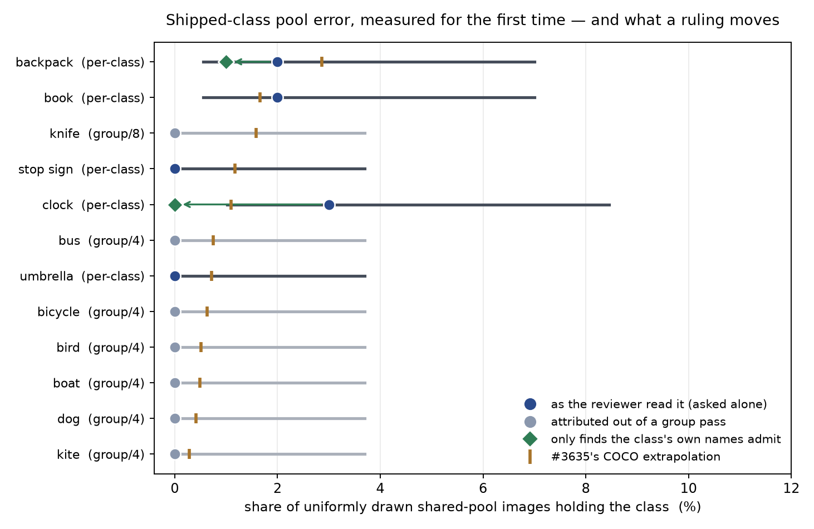
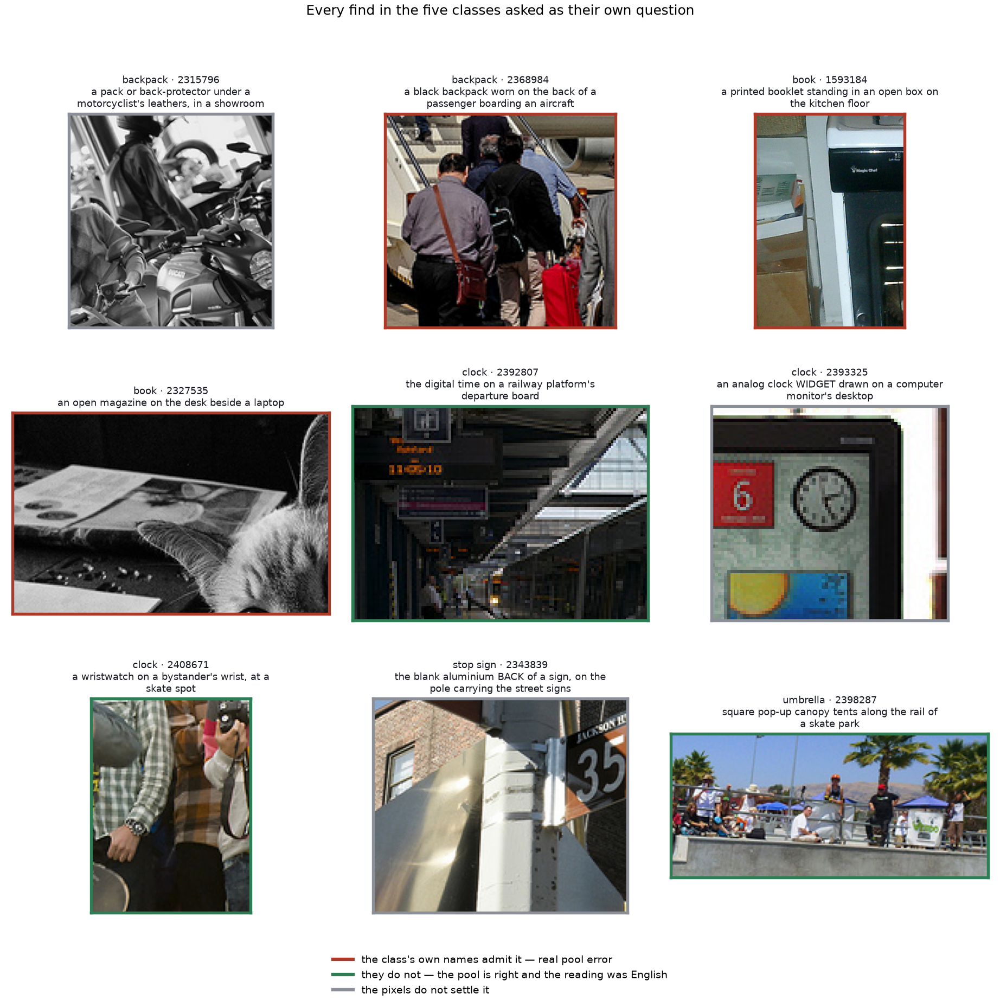
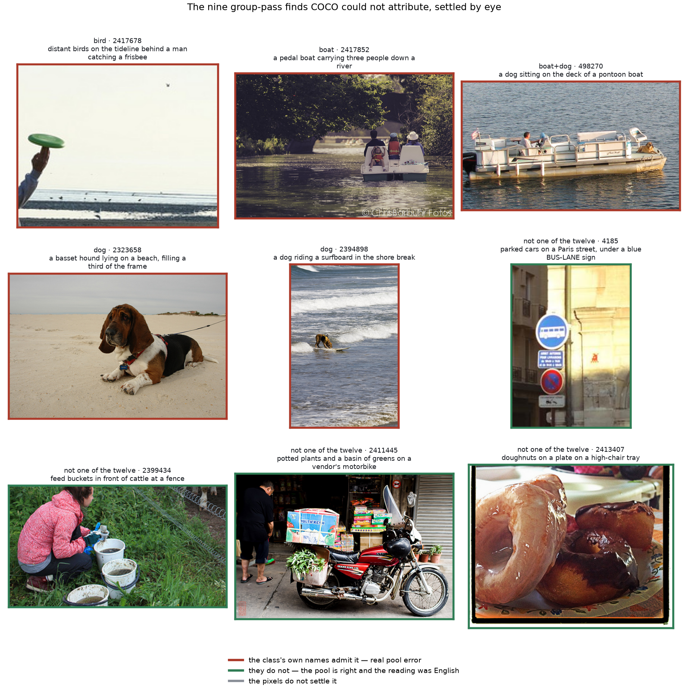
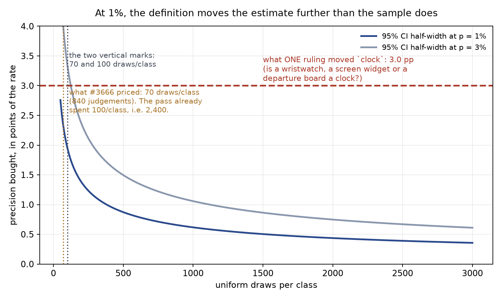

# Pool error for the shipped twelve is measured — and most of it is a definition nobody wrote (#3666)

**2026-09-06.** Branch `claude/issue-3666-pool-error-shipped`, worktree
`/exp/sgreenberg/projects/vts-pool-3666`, artifacts
`/expscratch/sgreenberg/pool-3666/`. Nothing rebuilt; `pile_config` untouched;
no verdict changed. The instrument is
[`shipped_pool_error.py`](../../../scripts/experiments/pile/shipped_pool_error.py)
and every number below comes out of it, off the committed
[`verdicts.csv`](verdicts.csv).

## The answer, first

#3666 says the `pool error` column #3588 reported for thirteen candidate classes
— 0.0% to 7.1% — was never produced for the twelve classes `vg_scale` ships, so
adding the thirteen would leave the benchmark with two tiers of label quality.
It prices the fix at **840 uniform draws**, 70 per shipped class.

| the issue says | measured |
|---|---|
| "nobody has ever measured its error the same way" | the negative pass did, at **100 uniform draws per class** against the thirteen's 70. Five of the twelve were asked as their own question; the other seven needed an **attribution**, not another pass |
| the cheap version is 70 uniform draws per shipped class (840 judgements) | the attribution cost **9 images**: COCO settles every group find on its own half for free, and only the off-COCO ones need an eye |
| "if shipped pool error is of the same order, every vg_scale number carries an unquantified bias" | it is of the same order and *slightly lower*: **1.40%** [0.68, 2.86] pooled against the candidates' **2.09%** [1.34, 3.24] — a difference of **−0.69 ± 1.39** pp. The two tiers are not separable |
| the worry is that the twelve are dirtier than the thirteen | the finds are **6 of 9 boundary calls on definitions that do not exist for these classes** (3 the class provably cannot hold, 3 the pixels do not settle) — a wristwatch, a clock drawn on a monitor, a station departure board, a pop-up canopy, the blank back of a sign. Ruling those out moves the union from **7.0%** to **3.0–5.0%** |
| — (not asked) | on the **45%** of the pool COCO scores, COCO reports a shipped class present in **0 of 1,888** images and a *candidate* class in **692**. The shipped 0.0% there is by construction, so a uniform draw spends 45% of a reviewer's attention on rows already settled |

**Recommendation: do not buy the 840 draws.** At a 1% rate, 380 extra uniform
draws per class buy ±1.0 pp, and one sentence about wristwatches moved `clock`
by 3.0 pp. The twelve's remaining gap against the thirteen is not sample size —
it is the annotation guide and the 360 positive taps the thirteen got and the
twelve did not (**#3673**, **#3674**), and a next slate should be drawn from the
off-COCO half only (**#3675**).

---

## 1. The measurement already existed; what was missing was attribution

The negative pass built for #3588 put **200 shared-pool images** — 100 drawn
uniformly, 100 ranked by the text tower — in front of one reviewer twelve times,
**2,400 judgements** in all, of which 10 rows were COCO-seeded by
`seed_pos.py` and are excluded here. It covered all twenty-five classes, so the
shipped twelve were in it from the start; what it did not do is report them.

Five were asked alone, and those are per-class rates directly. The rest were
asked inside a group, and a group verdict is asymmetric:

> A *clean* verdict is a negative for **every** member. A *present* verdict names
> **no** member.

So the seven grouped classes need only their group's *present* rows attributed,
and there were 16 of those. COCO settles most of them for nothing: on an image
COCO annotated exhaustively, COCO's silence about `knife` means the Table
Objects find was not a knife. That leaves **nine images** for a human eye, which
is what §4's second figure is.

| class | asked as | uniform stratum | 95% CI | admissible | ranked | #3635 predicted |
|---|---|---:|---|---:|---:|---:|
| `clock` | per-class | 3/100 = 3.0% | [1.0, 8.5] | 0–1 | 0 | 1.10% |
| `book` | per-class | 2/100 = 2.0% | [0.6, 7.0] | 2 | 0 | 1.65% |
| `backpack` | per-class | 2/100 = 2.0% | [0.6, 7.0] | 1–2 | 0 | 2.87% |
| `umbrella` | per-class | 0/100 = 0.0% | [0.0, 3.7] | 0 | 1 | 0.71% |
| `stop sign` | per-class | 0/100 = 0.0% | [0.0, 3.7] | 0 | 1 | 1.17% |
| `knife` | group of 8 | 0/100 = 0.0% | [0.0, 3.7] | 0 | 0 | 1.58% |
| `bus` | group of 4 | 0/100 = 0.0% | [0.0, 3.7] | 0 | 0 | 0.75% |
| `bicycle` | group of 4 | 0/100 = 0.0% | [0.0, 3.7] | 0 | 0 | 0.63% |
| `bird` | group of 4 | 0/100 = 0.0% | [0.0, 3.7] | 0 | 1 | 0.51% |
| `boat` | group of 4 | 0/100 = 0.0% | [0.0, 3.7] | 0 | 2 | 0.49% |
| `dog` | group of 4 | 0/100 = 0.0% | [0.0, 3.7] | 0 | 3 | 0.41% |
| `kite` | group of 4 | 0/100 = 0.0% | [0.0, 3.7] | 0 | 0 | 0.28% |

*`admissible` is §4's column: the finds the class's own name tables would have
accepted as a positive, given as a range because two of the nine are
unverifiable from the pixels. `ranked` is the text-ranked stratum, which is
chosen to be wrong and estimates nothing — it is reported because what it found
is the subject of §5.*

## 2. #3635's extrapolation survives a second, per-class test

`pool_contamination.py` (#3635) measures per-class contamination on the VG–COCO
overlap with COCO held back as the answer key, then extrapolates to the half
COCO cannot reach — an assumption its own docstring flags. #3588's negative pass
tested it **in union** (14% ± 7 measured against 12.7% predicted). This tests it
**per class**, on the classes the extrapolation was computed for:

> Pooled over the five asked alone: **1.40%** [0.68, 2.86] measured against
> **1.50%** predicted.

Class by class the intervals are far too wide to rank anything — at 100 draws a
1% rate and a 3% rate are two photographs apart — so the pooled agreement is the
result, and the per-class column is an existence proof rather than a ranking.
`backpack`, the class #3660 singles out as the worst at 2.87% predicted, comes
back at 2.0% as read and 1–2 admissible: real, and not the outlier the
prediction made it.

## 3. The two tiers #3666 worried about are not separable

Recomputed from #3588's own verdicts rather than transcribed from its table, the
thirteen candidates' uniform stratum is **19/910 = 2.09%** [1.34, 3.24]. The
shipped five are **7/500 = 1.40%** [0.68, 2.86].

> **shipped − candidate = −0.69 ± 1.39 pp** (95%). The tier a class sits in does
> not predict its pool error, and the sign is the opposite of the worry.

That does not make #3666 wrong about the asymmetry — it locates it. What the
thirteen have and the twelve do not is **an annotation guide** and **30 reviewed
positives each**, and §4 is what that costs.

## 4. Six of the nine finds are rulings, not errors

A 2% rate over 100 draws is two photographs, so here they all are. The border
colour is not the reviewer's verdict — it is a mechanical question asked of
`pile_config`: **would this object ever have become a positive for this class?**

| find | what it is | does the class admit it? |
|---|---|---|
| `clock` 2408671 | a wristwatch on a bystander's wrist | **no** — `clock` reads `clock`, `clock face`, `clocks`; `watch` is in neither table |
| `clock` 2392807 | the digital time on a railway departure board | **no** — VG names that `sign` or `board` |
| `clock` 2393325 | an analog clock *widget* drawn on a monitor | unverifiable — a depiction; the guide rules on pictograms for `bicycle` and says nothing about screens |
| `umbrella` 2398287 | square pop-up canopy tents at a skate park | **no** — `umbrella` reads `parasol` and four umbrella spellings, no canopy or tent |
| `stop sign` 2343839 | the blank aluminium **back** of a sign | unverifiable — a sign seen from behind has no shape to read |
| `backpack` 2315796 | a pack or back-protector under a motorcyclist's leathers | unverifiable |
| `backpack` 2368984 | a black backpack worn on a passenger's back | **yes** — the one find of the nine that needs no ruling |
| `book` 2327535 | an open magazine on a desk | **yes** — `magazine` is a *shipped fold-in* for `book`, because COCO has no magazine class |
| `book` 1593184 | a printed booklet standing in an open box | **yes** — same fold-in, and COCO scored this image and missed it |

`book` is the instructive pair. Its two finds look like the softest calls in the
table and are the two hardest: `SCALE_VG_NAMES["book"]` contains `magazine`
precisely because COCO annotates magazines as books, so the reviewer is not
reading English at the class — the class already agreed. The clocks look like
the firmest calls and are the softest: nothing in `clock`'s construction has ever
claimed a wristwatch.

> **Pool error is only a defect relative to the class's own definition.** Scored
> against English it is 7 finds per 100 uniform draws; scored against the names
> the build actually reads, 3 to 5.

This has a concrete consequence before anything is rebuilt. A boxless *present*
verdict is ingested as `negative_excluded` — the image leaves that class's pool
without becoming a positive (`verdicts_to_corrections.py`). Ingesting these nine
as they stand would therefore spend three good negatives on a watch, a departure
board and a canopy — objects their classes provably cannot hold — and a fourth
on the back of a sign nobody can read. Filed as **#3676**.

## 5. The ranked stratum finds a different *kind* of contamination

Every uniform-stratum find above is marginal — small, peripheral, or a category
boundary. Every **unambiguous** find in the whole pass is in the *ranked* half
and belongs to the Outdoor group: two dogs filling a third of the frame, a dog on
a pontoon boat, a pedal boat, a line of distant birds. The uniform stratum, in
100 draws, turned up not one object of that kind.

That is not a coincidence, and it changes what each stratum is for:

> The **uniform** stratum is the rate instrument, and the objects it can afford
> to find are the marginal ones. The **ranked** stratum is the repair
> instrument: it surfaces the contamination that is actually costing the
> benchmark, and it estimates nothing.

The two are usually presented as sample and control. They are better read as two
different jobs, which is why #3660's plan — extend the *ranked* review to repair
the pool — is right and independent of anything here.

The Vehicles group is the cleanest attribution: all four of its finds are `car`
or `truck` (three confirmed by COCO, one by eye — parked cars in Paris under a
blue **bus-lane pictogram**, the same failure mode as the bike-crossing signs in
#3588). **Zero** are attributable to `bus` or `bicycle`. Likewise **none** of the seven
non-seeded Table Objects finds is a `knife`: four are settled by COCO's own
exhaustive answer, and the three seen by eye are a plate of doughnuts, feed
buckets and potted plants — `bowl` and `vase` under the widened definitions, all
candidate classes.

## 6. Which half of the pool the error lives in

`vg_scale`'s pool is anchored to COCO wherever COCO has an answer, so the two
halves are not the same kind of negative:

| | images | COCO says a **shipped** class is present | COCO says a **candidate** class is |
|---|---:|---:|---:|
| the whole shared pool | 4,200 | — | — |
| …with an exhaustive COCO answer | 1,888 (45.0%) | **0** (0.00%) | 692 (36.7%) |

The 0 is a tautology and the 692 is the control that proves it: pool membership
was *defined* by COCO's silence for the twelve and by VG's for the thirteen.
(Read off `vg_scale__siglip.pkl` on 2026-09-06, before #3667's rebuild lands.
That rebuild changes which cells may *score* an image, not which images are in
the pool, so these two counts should survive it — worth re-running the script
after it to confirm.) So:

| the uniform stratum | as read | admissible |
|---|---|---|
| whole (n=100) | 7 = 7.0% [3.4, 13.7] | 3–5 = 3.0–5.0% |
| COCO-scored half (n=41) | 4 = 9.8% [3.9, 22.5] | 1–2 = 2.4–4.9% |
| off-COCO half (n=59) | 3 = 5.1% [1.7, 13.9] | 2–3 = 3.4–5.1% |

Four of the seven uniform finds sit on a COCO-scored image, where the pool label
*is* COCO's — a find there is the reviewer's English measured against COCO's
boxes, not an inconsistency inside the benchmark. Exactly one survives as a
genuine COCO miss: `book` 1593184, the booklet, which COCO's own vocabulary
should have caught. **1 in 41** is the measured reliability of the anchored half.

The practical consequence is a sampling one. For the shipped twelve, 45% of any
uniform draw lands on a row already settled, so the same 70 judgements buy about
**1.8×** the information if the frame is the off-COCO half. Filed as **#3675**.

## 7. What another 840 draws would buy

| to get… | uniform draws per class |
|---|---:|
| ±1.0 pp at p = 1% | 380 |
| ±0.5 pp at p = 1% | 1,521 |
| ±1.0 pp at p = 2% | 753 |
| ±0.5 pp at p = 2% | 3,012 |

The negative pass already spent 100. #3666's 70 would *lower* the precision it
already has. And the comparison that decides it is the one drawn on the figure:
**a single ruling on whether a wristwatch is a `clock` moved that class by
3.0 pp** — more than 3,000 extra draws per class would buy at this rate.

> At a 1% rate, the definition is the measurement. Buy the ruling first.

## What is still owed for the twelve

Not the negatives. Two things, both named by #3666's own comment and neither
touched here:

- **360 positive taps.** The thirteen each had 30 pre-boxed COCO positives
  confirmed (rejections 0–6 per 30, almost all definitional). The twelve have had
  none. Filed as **#3674**.
- **The rulings.** Every boundary this pass hit — watch / screen / departure
  board for `clock`, canopy for `umbrella`, the back of a sign for `stop sign`,
  booklet-and-magazine for `book`, rider's pack for `backpack` — is a sentence
  that does not exist anywhere, and §4 measures what their absence costs. Filed
  as **#3673**.

## Follow-ups

- **#3673** — write the boundary rulings for the shipped twelve into
  `SCALE_CLASS_RULES` and the annotation guide; §4 lists the nine that are
  already owed, with the evidence.
- **#3674** — 360 positive taps for the shipped twelve, the other half of
  #3666's two-tier gap.
- **#3675** — draw the next shipped-class negative slate from the off-COCO half
  only; 45% of a uniform draw is spent on rows COCO already settles.
- **#3676** — `verdicts_to_corrections.py` should not spend a negative on a find
  the class's own name tables would never have admitted; four of these nine
  would do exactly that.
