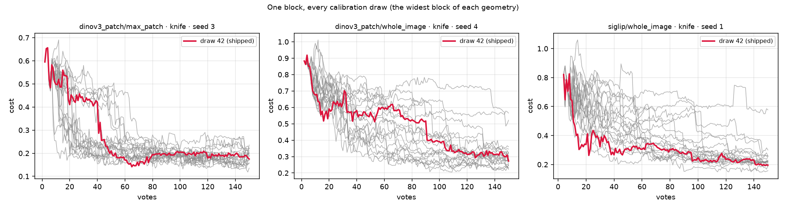
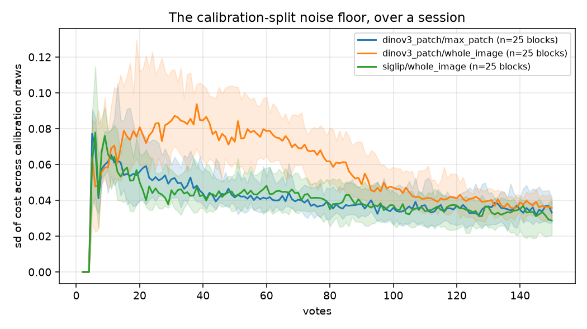
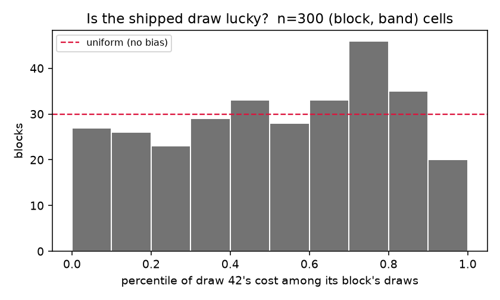

# How wide is the distribution the pinned calibration split draws from? (#3796)

Production splits each calibration fold's labelset off a fresh
`RandomState(CALIBRATION_SPLIT_SEED)` — 42 — on every fit. The pin is
deliberate and #2934 put it there on purpose: before it, the uncached threshold
paths drew from the unseeded global `np.random`, and a detector's verdicts moved
between two runs on identical votes.

So every user gets the same arbitrary draw, and every eval number this repo
quotes is one sample from a distribution nobody had measured. This measures it.

Design and pre-registered readings: [`PLAN.md`](PLAN.md). Every number here comes
from [`agg/`](agg/), written by
[`analyze_calseed_3796.py`](../../../scripts/experiments/calibration/analyze_calseed_3796.py)
(planted-answer check:
[`selftest_analyze_calseed_3796.py`](../../../scripts/experiments/calibration/selftest_analyze_calseed_3796.py)).

## The answer, in six lines

- **The split is the larger half of the noise every study here already lives
  with.** Of the cell-to-cell variance a study bootstraps over, **70%** is the
  calibration draw — the one axis no study varies — and **30%** is the cell seed,
  the axis every study does vary. Pooled `sd_draw` **0.047** against `sd_seed`
  **0.031**.
- **It is big against the effects this repo calls findings.** Median sd of cost
  across draws is **0.022–0.060** depending on geometry and vote band, and **75–83%
  of draw pairs inside a single block differ by more than 0.013** — the headline
  #3287 reported as its result.
- **Most of it is not the cut.** `cost = oracle_cost + regret` telescopes, and the
  *ranking* term carries **0.59–1.15** of the variance against **0.13–0.73** for the
  cut. A redrawn split moves the threshold a little (sd **0.011–0.019**), the
  threshold moves the next pick, and **75 of 75 blocks are voting on different
  media by click 8**. Reseeding a *calibration* split mostly changes the data the
  session goes on to collect, not the decision made on it.
- **It shrinks with votes, and does not close.** Median sd falls from **0.050–0.081**
  at 20 votes to **0.029–0.036** at 150 — still **12–17%** of the cost level there.
- **42 is an ordinary sample.** Its percentile among its own block's draws is
  **0.52 ± 0.02** over 75 blocks (z = 1.2); two SE bounds any bias at 0.04. It is
  the best of twenty in some blocks and the worst in others.
- **Do not add this to published error bars.** A study that bootstraps over cells
  at the pinned draw already resamples cells each carrying their own realisation of
  it — measured here, not argued: the cell-to-cell sd a single-draw study sees is
  **0.056** against the **0.057** the decomposition predicts. What the sweep changes
  is where precision comes from, and what a *user* is handed.

No production change is proposed here. The change this evidence argues for is
#3806, which is a different measurement.

## What was run

| | |
|---|---|
| grid | 5 classes × 5 cell seeds × **20 calibration draws** × 2 embedder arms = **1,000 cells** |
| cells completed | **1,000 / 1,000, zero failures, zero zero-byte** (array 640527), 221,100 base rows |
| dataset | `vg_scale_any`, 18,049 medias, every class at exactly 300 positives (**1.66%** prevalence) |
| classes | `fork`, `bicycle`, `knife`, `bird`, `kite` — the harness's own prevalence-spread selection |
| geometries | `siglip/whole_image`, `dinov3_patch/whole_image`, `dinov3_patch/max_patch` |
| draws | `42` (production's pin) first, then `0…18` |
| horizon | 150 votes, `inclusion=0`, fused thresholds, production linear-SVM head, the app's per-space `calibration_fraction` |
| held fixed | the **cell seed** — same medias available, same order, same held-out test split |

The only knob off production is the draw itself, declared to
`preflight.sh --diverges calibration_seed`.

**The grid is inverted on purpose.** Every other sweep here varies a knob to find
a better setting. This one varies a knob that is already decided, to find out
what a single sample from it was worth believing. A "best" draw is not a result:
42 is not better than 7.

## 1. The spread

Median over blocks of the across-draw sd of `cost`, computed on cell-band means —
150 steps of one trajectory are 150 readings of one draw, so an sd over steps
would measure the trajectory's own wobble and report it as the split's.

| geometry | early 1-25 | mid 26-60 | late 61-100 | deep 101-150 |
|---|---|---|---|---|
| `siglip/whole_image` | 0.022 | 0.031 | 0.037 | 0.029 |
| `dinov3_patch/whole_image` | 0.039 | 0.060 | 0.055 | 0.035 |
| `dinov3_patch/max_patch` | 0.033 | 0.035 | 0.029 | 0.025 |

Median *range* over the 20 draws runs 0.10–0.23, with a maximum of 0.49. Full
table: [`agg/draw_spread.csv`](agg/draw_spread.csv).

The sd is a summary; the question a reader actually has is whether a contrast the
size of a published finding fits inside one cell's noise. Fraction of draw
**pairs** within a single block differing by more than 0.013 — median over blocks,
IQR in [`agg/pair_exceedance.csv`](agg/pair_exceedance.csv):
**0.77** (`siglip/whole_image`), **0.83** (`dinov3_patch/whole_image`), **0.75**
(`dinov3_patch/max_patch`).

**Literal examples**, all at clicks 101–150, all on data that could not move:

| block | best draw | worst draw | the shipped pin |
|---|---|---|---|
| `dinov3_patch/whole_image` · `knife` · seed 4 | 12 → **0.232** | 14 → **0.683** | 42 → 0.325 |
| `siglip/whole_image` · `knife` · seed 1 | 0 → **0.166** | 17 → **0.618** | 42 → 0.225 |
| `dinov3_patch/max_patch` · `bicycle` · seed 2 | 13 → **0.192** | 14 → **0.431** | 42 → 0.241 |
| `siglip/whole_image` · `kite` · seed 1 | 1 → **0.074** | 9 → **0.099** | 42 → 0.080 |

Every block's ends, not only the four quoted: [`agg/worked_blocks.csv`](agg/worked_blocks.csv).

The last row is there because the first three are not the whole story: on `kite`
the twenty draws span 0.025 and the question barely exists.

*Every calibration draw of the widest block of each geometry; the shipped draw in
red. The data is identical in each panel — same medias, same order, same test
split.*

### It is a property of the class, not a constant

| class | `dinov3_patch/max_patch` | `dinov3_patch/whole_image` | `siglip/whole_image` |
|---|---|---|---|
| `bicycle` | 0.048 | 0.046 | 0.040 |
| `bird` | 0.026 | 0.037 | 0.033 |
| `fork` | 0.025 | 0.058 | 0.024 |
| `kite` | 0.033 | 0.015 | 0.018 |
| `knife` | 0.032 | 0.083 | 0.068 |

A factor of 4–5 between `kite` and `knife`. Quoting one number as "the noise
floor" would be wrong for both ends.

### What does *not* transfer

The obvious mechanism — a conformal threshold is a quantile of the held-out
votes, and the positives are its anchors, so the spread should fall as the
positives accumulate — holds **within** a trajectory (§3) and **fails across
classes**. Spearman ρ between a block-band's positives found and its spread is
only **−0.13 to −0.34**, and the tercile table is not monotone
([`agg/spread_vs_positives.csv`](agg/spread_vs_positives.csv)). At 1.66%
prevalence a block has a median of 4–34 positives to anchor on; the *class* moves
the spread more than the count does.

**So the levels in this report are this environment's.** They were measured at
1.66% prevalence on a rebuilt 18,049-media pile; #3287 ran the same dataset name
at 7.1%. Carrying these numbers to another prevalence is the mistake #3679 banked
about cost estimates, one axis over — see #3807.

## 2. Against the axis studies *do* vary

The two are nested — draws inside cell seeds — so the question "is the split
noise a rounding error next to the data noise, or a fraction of it?" is a
question about components of one variance. Two unrelated sds would get the ratio
wrong by the number of draws.

| geometry | `sd_draw` | `sd_seed` | share owned by the draw | what a single-draw study sees | predicted |
|---|---|---|---|---|---|
| `siglip/whole_image` | 0.043 | 0.032 | **0.65** | 0.053 | 0.054 |
| `dinov3_patch/whole_image` | 0.059 | 0.032 | **0.78** | 0.066 | 0.067 |
| `dinov3_patch/max_patch` | 0.037 | 0.030 | **0.61** | 0.048 | 0.048 |
| **pooled** | **0.047** | **0.031** | **0.70** | **0.056** | **0.057** |

The last two columns are the pre-registered reading, checked rather than argued.
"What a study sees" is the sd across cell seeds at one draw, averaged over which
draw it happened to be; "predicted" is `sqrt(var_draw + var_seed)`. They agree to
1%, which is the identity that says **the split noise is already inside every
bootstrap SE this repo publishes** — and must not be added to them a second time.

This table is [`agg/study_variance.csv`](agg/study_variance.csv); per class and
band it is [`agg/variance_components.csv`](agg/variance_components.csv). The two
are different computations rather than one summarised — sds do not average, so
the study-level row pools **variances** and takes the square root once.

## 3. Does it shrink with votes?

Yes, roughly halving over the horizon, with a hump rather than a monotone decay:
the spread is zero until the first trainable step, peaks around clicks 20–40, and
then falls.

| geometry | 20 votes | 50 | 100 | 150 |
|---|---|---|---|---|
| `dinov3_patch/max_patch` | 0.056 | 0.042 | 0.036 | 0.033 |
| `dinov3_patch/whole_image` | 0.081 | 0.073 | 0.047 | 0.036 |
| `siglip/whole_image` | 0.050 | 0.042 | 0.037 | 0.029 |

*Median across 25 blocks per geometry, IQR shaded.*

Against the cost levels in the deep band — 0.19 (`max_patch`), 0.25
(`siglip/whole`), 0.34 (`dinov3/whole`) — the sd at 150 votes is still **12–17%**
of what is being measured. #3794's synthetic probe predicted a comparable
starting size (F1 sd ≈ 0.03 at 20 labels) but expected it to halve by 60 labels;
on real embeddings with the shipped GMM fusion it takes the full 150.

## 4. Was it the cut, or the run the cut steered?

This is the part the issue anticipated ("the loop is closed, so a threshold that
moves moves the next pick too") and it turns out to be most of the answer.

`cost = oracle_cost + regret` row by row — the oracle is the best cut available
on **this** trajectory's ranking — so across draws the variance telescopes into a
ranking term, a cut term, and a covariance. Shares are pooled, so they sum to
exactly 1.

| geometry | ranking | cut | covariance |
|---|---|---|---|
| `siglip/whole_image` | **1.11** | 0.18 | −0.29 |
| `dinov3_patch/whole_image` | **0.72** | 0.35 | −0.07 |
| `dinov3_patch/max_patch` | **0.74** | 0.43 | −0.17 |

**The terms are sum-pinned and slide against each other** — the covariance is
negative everywhere, which is why a share can exceed 1 — so no term may be read
alone. That is #2897's trap, quantified by #3287, and it applies here verbatim.
Read together they say the same thing at every band
([`agg/cost_decomposition.csv`](agg/cost_decomposition.csv)): what moves is
mostly **what the session found**, not **where the line was drawn**.

Three measurements agree:

- `threshold` sd across draws is **0.011–0.019**, the smallest spread of any
  metric reported.
- `auroc` — a property of the ranking alone — has sd **0.008–0.019**, which cannot
  happen unless the trajectories diverged.
- The pick log settles it outright: **75 of 75 blocks** have two draws voting on
  different media, first at a median click of **8** (min 8, max 10).

So the mechanism is: the split moves the conformal quantile slightly → the
acquisition cut moves → a different item is the next Hard pick → from click ~8
the twenty runs are twenty different sessions. That compounding is the measurand,
as the issue said, not a confound — but it does mean this is **not** a
measurement of "how much does the cut rule wobble".

## 5. Is the shipped draw lucky?

No, and this is the only part of the question a per-cell bootstrap could never
answer — every study reuses the *same* 42, so a systematic effect of 42 would be
common-mode and invisible to resampling.

Draw 42's percentile among its own block's draws, with the four bands of a block
averaged first (they are four readings of one trajectory pair):

**0.52, SE 0.02, n = 75 blocks, z = 1.2.** Two SE bounds any bias at 0.04 in
percentile terms.

Concretely: 42 is the *best* of twenty on `max_patch`·`fork`·seed 0 (0.108) and
the *worst* of twenty on `dinov3/whole`·`knife`·seed 2 (0.608). It is a sample.

## 6. What this does and does not do to the rest of the tree

**It does not add an error bar.** §2 measures the identity directly: the
cell-to-cell variation a study resamples already contains one split realisation
per cell. Restating every published number as "±0.047" would double-count the
same variance.

**It does put a floor under a paired contrast that pairing cannot lift.** Two
arms paired on (class, seed) are *not* paired on the split — a different knob is
a different trajectory, so each arm draws its own realisation — and the paired
difference therefore carries the draw variance twice. At `sd_draw` = 0.047 and
N cells per arm, no design can do better than `sqrt(2)·0.047/sqrt(N)`: **0.009**
at N = 60, **0.007** at N = 100, **0.002** at N = 1,000. Per geometry and band:
[`agg/implications.csv`](agg/implications.csv). This is not a criticism of any
published SE — those bootstraps already include it — it is a statement that
**more cells is the only lever**, because pairing, seeds and longer horizons all
leave it standing.

**It changes what "a contrast smaller than the spread is not a finding" means.**
That reading — which [`PLAN.md`](PLAN.md) pre-registered *against* — is wrong as
arithmetic: a mean over N cells is not one cell. But it is right as a statement
about a **single cell**, and single cells are what users are. Which brings the
finding that is actually actionable:

**A user's detector carries a lottery worth ~0.03–0.05 in cost that has nothing
to do with their labels.** Two people who vote identically, in the same order, on
the same collection, get detectors that differ by the amounts in §1 because a
pinned constant split their votes differently. The threshold is read off *one*
draw of a nuisance parameter, and nothing about the product requires that. The
obvious remedy — average the conformal threshold over K draws of the split — is
cheap on the axis that matters (calibration is a minority of a step's cost;
#3314 measured it) and is not something this grid can evaluate, because every
draw here is a whole trajectory and the ensembling has to happen *inside* one.
Filed as #3806.

## Limits

- **One dataset, one prevalence.** Every level here is `vg_scale_any` at 1.66%.
  The class-to-class factor of 4–5 inside this grid is the warning against
  reading the numbers as a constant; §1's failed portability check is the reason
  they cannot simply be rescaled. #3807.
- **Five classes, chosen by prevalence spread on a set where prevalence is
  uniform** — every `vg_scale_any` class holds exactly 300 positives, so the
  selector's evenly-spaced pick is deterministic but arbitrary. The classes
  differ in *difficulty*, not in prevalence.
- **The horizon can exhaust the positives.** Preflight's own note: the sim half
  holds ~150 positives against a 150-step horizon, so the deep band is a
  thin-anchor regime. That is a real part of why the spread is what it is at 150
  votes, and it is not separable here.
- **`calibrate_count = 2`.** The split is drawn twice per fit; a study at K = 6
  (#3314's arm) would average over more splits and should show less of this.
  Untested.
- **This measures the split's effect on a *session*, not on a *cut*.** §4 is the
  reason: by click 8 the draws are different sessions. A measurement of the cut
  alone would have to re-cut one trajectory under many splits, which is a
  different instrument.

## Provenance

- Branch `claude/calibration-seed-noise-3796`; pile as rebuilt 2026-09-08
  (`vg_scale_any__dinov3_patch.pkl`, 18,049 medias, commit `836a105`).
- Cells: `/expscratch/sgreenberg/calseed-3796/run/results`; analysis:
  `/expscratch/sgreenberg/calseed-3796/analysis`.
- Sizing measured on this pile before the array: 6m45s / 1.60 GB binary,
  35m52s / 16.05 GB region. #3287's pins for the same dataset name — 21.8 min,
  12G — would have been 2.1× too short and would have OOM-killed every region
  cell. **A per-cell cost or a memory limit does not survive a pile rebuild.**
- The generated tables the prose is drawn from: [`agg/REPORT_generated.md`](agg/REPORT_generated.md).
- One tooling defect found on the way and filed rather than fixed mid-study:
  `_cells_io.describe_load` reports **zero** starved cells when handed
  `load_arm`'s provenance, because `load_arm` renames `header_only` to
  `no_positive_found` and the shared sentence still looks for the old key. Six
  studies print that sentence. #3808.
