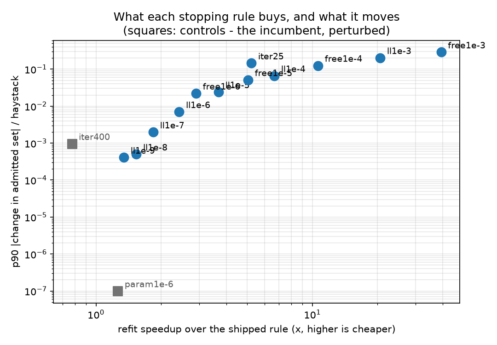
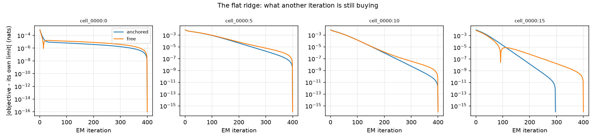
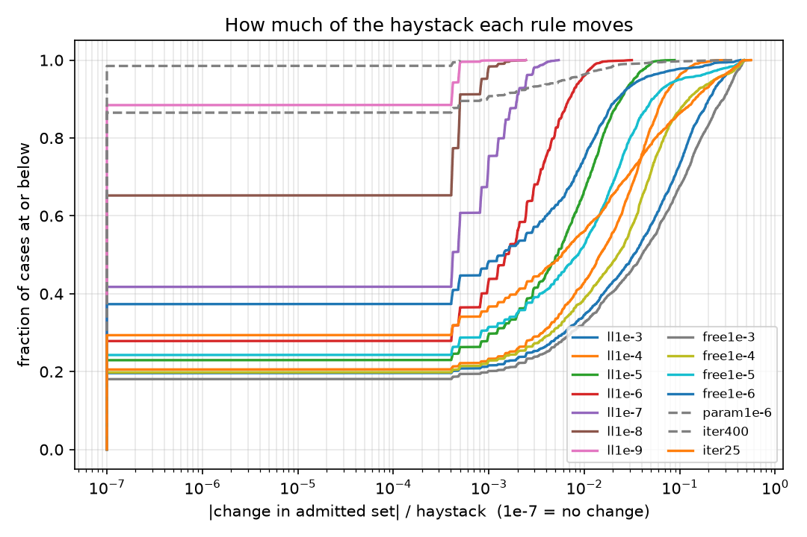
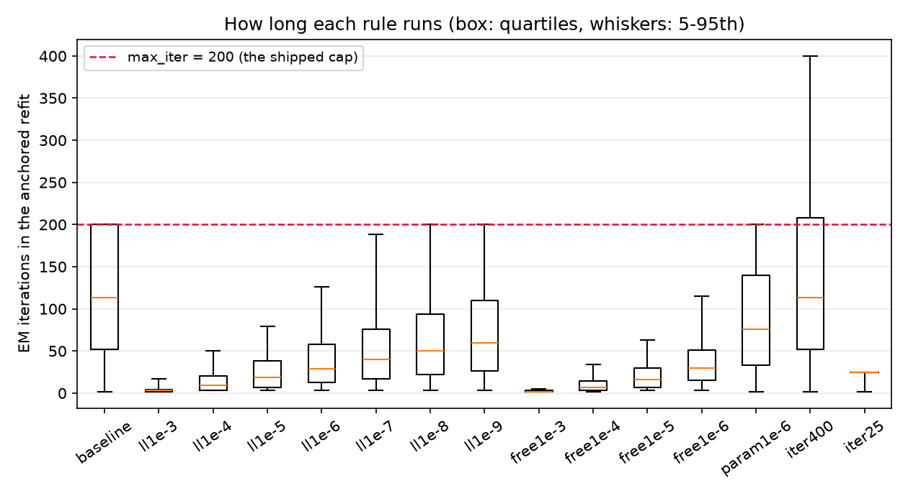

# The anchored refit was never converging, and 1e-3 is not the fix (issue #3825)

> **⚠️ Raw-cell note (#4128, 2026-09-23).** The `coco_val × siglip` environment read **un-normalised** vectors (#4099), and it drove the adverse `ll1e-8` A/B headline: +0.035 ± 0.017 on its 14 cells. Without it the headline is +0.00069 ± 0.0033, which only strengthens shipping `ll1e-8`. See the [#4128 recheck](../2026-09-23-coco-siglip-recheck-4128/REPORT.md).

[#3825](https://github.com/samggreenberg/VTSearch/issues/3825) came out of
[#3585](https://github.com/samggreenberg/VTSearch/issues/3585)'s own
measurement. Having made the *initialiser* five times cheaper, #3585 timed the
loop next door and found that `_anchored_em` — the refit that **is** the shipped
threshold — had become ~90% of a calibration fold's fit, running 97-200
iterations of a parameter-delta criterion at 1e-8 where the init took ~15, and
on 2 of the 5 folds it sampled never converging at all.

The issue proposed the fix #3585 had already found — stop on the log-likelihood
at sklearn's 1e-3, which `_anchored_em` already takes as an opt-in `loglik_tol`
— and was explicit that it would need the same gate, because the cushion is
gone: *"there is no second estimator between it and the cut, and no `snap`
upstream of it to absorb a tolerance-level move."*

That warning was right, and both halves of the answer are worse than the issue
expected. The incumbent is in worse shape than the five-fold sample showed:
over 4,493 real fold refits it runs a **median of 113 iterations** and
**26.5% of them exit on `max_iter`**. And the proposed fix is a **regression** —
at 1e-3 the trajectory A/B measures Δcost **+0.026 ± 0.006** over 114 paired
cells, four standard errors the wrong way.

## The short version

**Ship the log-likelihood rule at 1e-8, on the anchored objective, and ship the
convergence reporting unconditionally.** The tolerance that ported from the sort
path does not survive contact with this one; the *criterion* does.

1. **The incumbent does not converge on a quarter of real folds.** 4,493
   anchored refits from the shipped path: median **113** EM iterations, p90 at
   the **200** cap, **26.5%** leaving on the cap rather than on the criterion,
   and the refit is **92.9%** of a fold's fit. On
   `visual_genome_m`/`siglip`/whole_image the median fold *is* 200 iterations
   and **51.1%** never converge. On `caltech101_m`'s 366-score haystacks it is
   2 iterations and 2.3%. The loop is expensive exactly where the mixture is
   hard to identify, and there it does not finish.

2. **The criterion is not slow on those folds, it is unreachable.** `iter400` —
   the incumbent's own rule given twice the budget — *still* exits on its cap
   **10.7%** of the time. A parameter delta of 1e-8 is not a tolerance this
   estimator can meet on a barely identified fold haystack, at any budget worth
   spending.

3. **Borrowing the sort path's *rule* would have been wrong for a reason with
   nothing to do with tolerance.** An anchored EM ascends a *weighted
   semi-supervised* objective; the free sample's likelihood is a different
   quantity, and under an anchored M-step it is **not monotone** — traced
   iteration by iteration on real folds it **falls on 36.6% of iterations**
   (883 of 2,410; 6 of 8 folds). The objective this loop actually maximises
   never falls (0 of 1,989). Stopping on a quantity that goes *down* on one
   iteration in three is not a convergence criterion. The two coincide exactly
   when there are no anchors, so `fit_score_gmm` is untouched, bit for bit.

4. **1e-3 does not stop a converged fit; it stops a fit that has not started.**
   The worked case below is the general shape: at 1e-3 the refit halts after
   **10** iterations with both component means still bunched at 0.34-0.36 and
   weights 0.63/0.37 — near its 2-means init, before the minority component has
   migrated out to the high mode at 0.436 where 140 iterations put it. The
   likelihood gains only 0.025 nats over those 130 iterations (0.0002 per
   iteration), so a 1e-3 rule cannot see the migration happening. The admitted
   set goes from **70 to 925 of 2,031**.

5. **The gate says every fast candidate is a calibration change, and the
   CONTROLS are what make that readable.** Over 2,258 real fold cases at the
   shipped inclusion, `ll1e-3` changes the admitted set on **80.4%** of them by
   a median of **3.3% of the haystack**. Loosening the incumbent's own criterion
   a hundredfold (`param1e-6`) changes **1.5%**, by never more than one media in
   two thousand. This is the exact inverse of #3585, where the candidate was
   *more* faithful than the smallest perturbation of the incumbent.

6. **No early-stopping arm ever finds a better fit — not once in 4,493 folds.**
   Scored on the objective both are climbing, `obj_better` is literally **0**
   for all eleven of them, while `iter400` beats the incumbent on **597** folds
   and loses on none. There is no "different local optimum" story here: the
   incumbent is under-converged *and still climbing*, so stopping earlier is
   strictly leaving likelihood on the table. The only question is how much.

7. **At 1e-8 the answer is: not enough to see.** Numerically the incumbent's own
   tolerance, applied to the likelihood instead of the parameters. The refit is
   **1.9x** cheaper at fold sizes, the admitted set moves on 34.8% of cases **by
   a median of zero and a p90 of one media in two thousand**, the largest move
   anywhere in the corpus is **0.24%** of a haystack, no anchored fit is lost,
   and non-convergence falls from **26.5% to 7.4%**. For scale, merely *letting
   the incumbent finish* (`iter400`) moves the line by up to **35.6%** — a 146x
   larger perturbation than adopting this rule.

8. **The trajectory A/B rejects 1e-3 and cannot resolve 1e-8.** Four 84-cell
   grids, 114 paired cells each, Δ = candidate − shipped, positive is worse:

   | arm | refit | Δcost | Δregret | ΔFNR | ΔFPR |
   |---|---|---|---|---|---|
   | `ll1e-3` | 33x | **+0.0260 ± 0.0062** | **+0.0226 ± 0.0044** | −0.0183 ± 0.0050 | **+0.0443 ± 0.0062** |
   | `ll1e-6` | 2.4x | +0.0044 ± 0.0031 | +0.0008 ± 0.0022 | +0.0008 ± 0.0026 | +0.0036 ± 0.0027 |
   | `ll1e-8` | 1.9x | +0.0049 ± 0.0037 | **−0.0022 ± 0.0019** | +0.0081 ± 0.0028 | −0.0032 ± 0.0027 |

   `ll1e-3` is not noise: it drops the cut and pays a +0.044 FPR for a −0.018
   FNR. `ll1e-8` sits at the instrument's floor — and **the floor is about
   ±0.004 of cost**, which is why `ll1e-6` and `ll1e-8` are indistinguishable
   from each other despite `ll1e-6` moving fourteen times as much haystack.
   Read §5 for what that does and does not license.

9. **A fit that ran out of iterations can now say so.** `stats` carries
   `n_iter` / `converged` / `loglik`, `FoldAnchoredCut.n_unconverged` counts the
   folds, and the provenance names them — `fold_anchored_maxiter2[2/2]`, with
   the `[a/k]` group kept last and unchanged because `folds_used` parses it with
   an end-anchored regex. `_fused_threshold` logs it. This is the half of the
   issue with no trade-off in it: the shipped estimator has been failing to
   converge on a quarter of folds, and the only reason anyone found out is that
   a cost measurement went looking.


---

## The worked case: 10 iterations, 140 iterations, and 855 medias

`visual_genome_m` / `dinov3_patch` / whole_image, cell 13, step 60 — the 99th
percentile of the `ll1e-3` movement distribution, so: bad, but not the freak.
Fold 0's haystack is 2,031 scores, 90% of them between 0.27 and 0.38 with a thin
right tail to 0.47.

The same fold, fitted by the same loop from the same init, stopped three ways:

| | iterations | `w_lo` | `mu_lo` | `mu_hi` | midpoint | mean log-lik |
|---|---|---|---|---|---|---|
| `baseline` (parameter delta 1e-8) | 140 | 0.9916 | 0.3464 | **0.4360** | 0.3912 | 2.09284 |
| `ll1e-3` | **10** | 0.6291 | 0.3412 | **0.3573** | 0.3493 | 2.06780 |
| `ll1e-8` | 96 | 0.9916 | 0.3464 | **0.4359** | 0.3911 | 2.09284 |

At 10 iterations the two components have barely separated — 0.341 and 0.357,
split 63/37, which is roughly where a 2-means init on this sample puts them.
Over the next 130 iterations the high component walks out to 0.436 and sheds
almost all its mass (`w_hi` 0.37 → 0.008): it is *finding the tail*. The whole
migration is worth 0.025 nats, about 0.0002 per iteration, so a criterion that
stops when an iteration buys less than 1e-3 stops in the middle of it.

Then the shipped chain amplifies it, exactly as designed:

| | fold cuts | quantile in each fold | combined *q* | realised + snapped | admits |
|---|---|---|---|---|---|
| `baseline` | 0.3912 / 0.4771 | 0.9311 / 1.0000 | 0.9655 | **0.373011** | **70** / 2031 |
| `ll1e-3` | 0.3493 / 0.3679 | 0.5534 / 0.5357 | 0.5446 | **0.307498** | **925** / 2031 |
| `ll1e-8` | 0.3911 / 0.4768 | 0.9311 / 1.0000 | 0.9655 | **0.373011** | **70** / 2031 |

This is not a tolerance-level wobble magnified by a dense haystack. The cut
itself moves 0.042 — from the 93rd percentile of the fold haystack to the 55th —
because the two fits are genuinely different fits. `ll1e-8` reproduces the
incumbent's threshold **exactly**, to the last bit, on this case.

And that is the difference between this issue and #3585. There, the flat ridge
was real and the extra iterations bought nothing. Here the loop looks flat for a
long stretch **while it is still doing the work**, so the same rule at the same
tolerance stops in a qualitatively different place.



*Every arm's refit speedup against how much haystack it moves at the 90th
percentile. The two squares are the controls — the incumbent perturbed, not
replaced — and the candidates have to be read against them rather than against
zero. `ll1e-8` is the last point before the curve turns up.*

---

## What was measured, and on what

**The corpus was already on disk.** #3585 captured 84 cells of real
`fit_fold_anchored_cut` inputs — every array the shipped fold path saw, on a
stride of 5 steps — precisely so a candidate nobody had thought of yet could be
gated against inputs nobody re-ran. This issue is that candidate. Not one cell
was re-run to answer it; `CORPUS` in `launch_3825.sh` points at
`/expscratch/sgreenberg/gmm-3585/corpus`.

2,258 fold cases over six environments, spanning the shapes the refit sees:

| environment | cases | haystack | anchors | median iters | p90 | **hits `max_iter`** | refit share |
|---|---|---|---|---|---|---|---|
| `visual_genome_m` / `siglip` / whole | 319 | 2,040 | 16 | **200** | 200 | **51.1%** | 94.5% |
| `visual_genome_m` / `dinov3_patch` / whole | 317 | 2,040 | 27 | 183 | 200 | **47.0%** | 92.8% |
| `coco_val` / `siglip` / whole | 280 | 2,420 | 16 | 156 | 200 | **35.5%** | 93.7% |
| `coco_val` / `dinov3_patch` / whole | 279 | 2,420 | 26 | 156 | 200 | 31.1% | 92.4% |
| `coco_val` / `dinov3_patch` / max_patch | 279 | 2,420 | 26 | 93 | 200 | 13.6% | 93.0% |
| `visual_genome_m` / `dinov3_patch` / max_patch | 317 | 2,040 | 26 | 88 | 200 | 17.1% | 93.0% |
| `caltech101_m` / `dinov3_patch` / whole | 228 | 366 | 27 | 5 | 30 | 0.7% | 72.8% |
| `caltech101_m` / `siglip` / whole | 239 | 366 | 16 | **2** | 43 | 2.3% | 79.8% |
| **all** | **2,258** | 2,060 | 21 | **113** | **200** | **26.5%** | **92.9%** |

**Two axes of arms, not one.** The issue named a tolerance; the corpus made
clear there was a second choice underneath it — *which likelihood*. Both are
arms, and so are two controls that perturb the incumbent rather than replace it,
because #3585's most valuable arm was the one that was never a candidate.

| arm | rule |
|---|---|
| `baseline` | parameter delta 1e-8, cap 200 — what shipped until #3825 |
| `ll1e-3` … `ll1e-9` | the **anchored** objective, at each tolerance |
| `free1e-3` … `free1e-6` | the **free sample's** likelihood — the sort path's rule, borrowed |
| `param1e-6` | CONTROL — the incumbent's own rule, loosened 100x |
| `iter400` | CONTROL — the incumbent's own rule, twice the budget |
| `iter25` | a cap without a criterion — cost reference, not a candidate |

The 1e-7…1e-9 arms were added **after** the first gate ran, and the reason is
recorded in `arms_3825.py` rather than smoothed over: the first grid stopped at
1e-6 because it was designed around "how loose can this be", and the controls
showed that was the wrong question.

### Two defects in this harness, both caught, both worth the shape

**The estimator frame was fitting at the wrong anchor mass.**
`fit_anchored_score_gmm`'s own default is `ANCHOR_WEIGHT_DEFAULT` = 10.0, but
nothing on the shipped path calls it bare — `fit_fold_anchored_cut` passes
`FOLD_ANCHOR_WEIGHT` = **0.3**, which the 2026-08-06 anchor-mass sweep picked.
The first run's decision frame went through the shipped function and was
correct; its estimator frame called the bare default and so described fits at an
anchor mass nobody runs. Nothing crashed. The numbers were merely wrong, and
wrong in the flattering direction: at κ=10 the incumbent looks like 43 iterations
and 5.7% non-convergence, against the shipped path's **113** and **26.5%**. It
was caught by building the worked case above and finding that its arithmetic did
not reconcile — which is the argument for putting one in every report.

**A mid-run refactor, checked rather than argued.** `_anchored_em` was
refactored (two helpers lifted out to clear the complexity gate) *while* the
first gate and the A/B grids were running, so some array tasks imported the code
before that edit and some after. Rather than assert the refactor was
arithmetically identical, the gate was re-run and the two runs compared row by
row: **27,096 rows, 12 shared arms, zero differences** in threshold, admitted
count, provenance or convergence at any of the three inclusions.

---

## 1. Which likelihood: the axis the issue did not name

`_anchored_em`'s opt-in `loglik_tol` computed the mean log-likelihood **of the
free sample**. That is the right quantity for `fit_score_gmm`, where there are
no anchors. For an anchored refit it is not the objective being maximised: the
M-step counts each clamped point `anchor_weight` times and divides by the total
mass, so what ascends is the weighted semi-supervised likelihood.

Running the loop one iteration at a time on real folds and recording both:

| objective | traced iterations | iterations that **decreased** it | folds affected |
|---|---|---|---|
| anchored (weighted) — shipped | 1,989 | **0** | 0 of 8 |
| free sample only | 2,410 | **883 (36.6%)** | 6 of 8 |



*Distance from each objective's own limit, per iteration, on four captured
folds. The anchored objective descends smoothly; the free sample's is the ragged
one.*

A criterion that fires when \|Δobjective\| < tol, watching a quantity that moves
down on one iteration in three, will stop on a downswing. Because both anchor
terms vanish and `total_mass` is `n` when there are no anchors, the two
objectives are the *same arithmetic on the same values* for `_plain_em`;
`TestAnchoredEmStopping::test_the_anchored_objective_is_inert_without_anchors`
asserts bit-for-bit equality rather than leaving that as an argument, because
the whole licence for touching this loop is that the unanchored fit #3585
shipped this morning did not move.

---

## 2. The gate: does the admitted set change?

2,258 cases, the shipped chain end to end — per-fold anchored fit, per-fold
quantile, `qmean` combine, realise on the final haystack, `snap_cut_to_sample`.
Δ is against `baseline` on the identical captured input, so pairing is exact.
"Move" is \|Δ admitted\| as a fraction of that case's own haystack, so the column
is comparable across a 366-media environment and a 2,420-media one.

| arm | admitted set moves | median | p90 | **max** | fits lost | non-convergence |
|---|---|---|---|---|---|---|
| `ll1e-3` | 80.4% | 3.3% | 20.3% | 46.8% | 2 | 0% |
| `ll1e-4` | 79.5% | 1.5% | 6.6% | 30.2% | 5 | 0% |
| `ll1e-5` | 77.1% | 0.53% | 2.4% | 8.8% | 0 | 0.2% |
| `ll1e-6` | 72.1% | 0.15% | 0.70% | 3.2% | 0 | 1.5% |
| `ll1e-7` | 58.2% | 0.042% | 0.20% | 0.54% | 0 | 4.5% |
| **`ll1e-8`** | **34.8%** | **0** | **0.050%** | **0.24%** | **0** | **7.4%** |
| `ll1e-9` | 11.6% | 0 | 0.041% | 0.24% | 0 | 10.0% |
| `free1e-3` | 81.9% | 4.0% | 28.8% | 54.9% | 2 | 0% |
| `param1e-6` *(control)* | 1.5% | 0 | 0 | 0.050% | 0 | 15.4% |
| `iter400` *(control)* | 13.5% | 0 | 0.096% | **35.6%** | 2 | 10.7% |
| `baseline` | — | — | — | — | — | **26.5%** |

**Read the candidates against the controls, which is the lesson #3585 paid for.**
`param1e-6` says the incumbent's answer is not delicately balanced — loosening
its own criterion a hundredfold moves 1.5% of cases and never more than one
media in two thousand. So when `ll1e-3` moves 80% of them by 3.3% of the
haystack, that is the estimator being changed, not a tolerance being rounded.

**And `iter400` is the more interesting control.** It moves *fewer* cases than
`ll1e-8` (13.5% vs 34.8%) and moves them **146x further** at the tail (35.6% vs
0.24%). The incumbent's own answer is, on a handful of cases, decided by where
the iteration cap happens to sit — the sharpest possible statement of why a fit
exiting on `max_iter` deserved to be reported. `ll1e-8`'s moves are a different
kind of thing: its p90 in every environment is one media in two thousand, i.e. a
single order statistic, i.e. the granularity of the snap.



*How much of the haystack each rule moves, as a cumulative distribution — a
median hides whether an arm is uniformly small or usually zero with a bad tail,
and those are different risks. `iter400` (dashed) is the arm with the worst tail
of any here, and it is the incumbent merely allowed to finish.*

### Where the changes are

The gate rate tracks the iteration count from the table above.

| environment | `ll1e-3` moves | `ll1e-8` moves | `ll1e-8` p90 |
|---|---|---|---|
| `visual_genome_m` / `siglip` / whole | 99.4% | 45.8% | 0.050% |
| `coco_val` / `dinov3_patch` / whole | 98.6% | 56.3% | 0.083% |
| `coco_val` / `siglip` / whole | 95.4% | 47.1% | 0.082% |
| `visual_genome_m` / `dinov3_patch` / max_patch | 98.4% | 29.3% | 0.050% |
| `caltech101_m` / `siglip` / whole | 11.3% | **0.8%** | 0 |
| `caltech101_m` / `dinov3_patch` / whole | 11.0% | **0** | 0 |

`caltech101_m` converges in 2-5 iterations, so where the loop stops cannot
matter and does not. Everywhere else it decides the line.

### At other inclusions

The gate turns on inclusion 0, but `mid_tilt` mixes in the rate cut off-centre,
which reads the fitted *variances* — a difference invisible at the midpoint can
appear there. It does, monotonically, and it changes no ordering: `ll1e-3` moves
76.7% / 80.4% / 81.0% of cases at inclusion −3 / 0 / +3, and `ll1e-8`'s p90 stays
at or under one media in a thousand across all three.

---

## 3. The estimator: which fit is better?

Both arms ascend the same objective, so its sign says whether an arm's cut moved
toward the data or merely elsewhere. Over the 4,493 folds where both the arm and
the baseline produced an anchored fit:

| arm | better | worse | median Δ (nats) | median \|Δ midpoint\| |
|---|---|---|---|---|
| `ll1e-3` | **0** | 3,786 | −1.1e-3 | 6.7e-3 |
| `ll1e-6` | **0** | 3,604 | −2.1e-6 | 4.5e-4 |
| `ll1e-8` | **0** | 3,248 | −1.7e-8 | 3.7e-5 |
| `ll1e-9` | **0** | 2,651 | −1.5e-9 | 1.0e-5 |
| `param1e-6` *(control)* | 0 | **0** | 0 | 1.3e-6 |
| `iter400` *(control)* | **597** | **0** | 0 | 0 |

This is unambiguous and it is the least comfortable table here. Every arm that
stops earlier lands at a *worse* value of the objective — never once better, on
any of 4,493 folds. `iter400` shows why there is no consoling story available:
the incumbent has not finished climbing, so stopping early is not finding a
different local optimum, it is stopping short of the one the loop was heading
for. `param1e-6` is the other bookend — loosening the parameter rule 100x
changes the objective on **zero** folds, which is what "this criterion is not
what is doing the work" looks like.

What makes `ll1e-8` shippable anyway is the *size*: 1.7e-8 nats and a median
midpoint move of 3.7e-5 are below what the quantile-and-snap chain downstream
can resolve, and §2's admitted-set columns say so independently. What makes
`ll1e-3` unshippable is the same table read at 1.1e-3 — five orders of magnitude
larger — and §5 confirming it.

Note the free-objective columns, which do **not** line up: `free1e-3` is better
on the free objective 868 times and worse 3,039, while being worse on the real
objective 3,870 of 3,870. Scoring every arm under **both** objectives, whichever
it stopped on, is what keeps the comparison from being a tautology.

---

## 4. What it costs



*The shipped rule's box sits against the 200 cap; a quarter of folds are on the
line itself.*

Min-of-5 per call, BLAS pinned to one thread, init and refit timed in the same
process on the same array so the ratio is not a claim about two machines.

| n | init | refit `baseline` | its iters | refit `ll1e-8` | its iters | **speedup** | refit `ll1e-3` |
|---|---|---|---|---|---|---|---|
| 351 | 0.48 ms | 0.62 ms | 3 | 0.70 ms | 3 | **0.87x** | 0.70 ms |
| 2,080 | 1.87 ms | **30.1 ms** | 134 | 16.1 ms | 65 | **1.93x** | 0.67 ms (2 iters) |
| 20,000 *(resampled)* | 5.45 ms | 98.5 ms | 142 | 44.7 ms | 56 | **1.63x** | 1.81 ms |
| 50,000 *(resampled)* | 13.7 ms | 189 ms | 132 | 97.9 ms | 57 | **1.36x** | 4.52 ms |

Three things this table says that the headline does not:

- **On a small haystack the new rule is a small loss** (0.87x at 351 scores):
  computing the objective costs an extra reduction per iteration, and at three
  iterations there is nothing to amortise it against. In absolute terms it is
  0.08 ms on a fold, and `caltech101_m` is the only environment in the corpus
  where it applies.
- **`ll1e-3`'s 30-40x is not a speedup, it is a non-fit.** Two iterations. The
  cost column and the §3 objective column are the same fact told twice.
- **The 20k and 50k rows are bootstrap resamples** of a real fold haystack — the
  shape that drives the iteration count is preserved, the granularity is not,
  and they carry `resampled=1` in `bench3825.csv` so no table can quote one as a
  measurement. They matter because `_GMM_MAX_SAMPLES` is 50k.

---

## 5. The trajectory A/B

The gate holds everything else fixed, which is the right instrument for "does
the admitted set change" and the wrong one for "does the detector end up better
or worse". The threshold is not output-only: Autopilot's Hard phase picks the
unlabelled item nearest the decision threshold, so two arms vote on different
items from their second Hard pick onward.

Four 84-cell grids, identical but for the stopping rule, paired on
(environment, category, seed); 114 paired cells each; Δ = candidate − shipped,
positive is worse; ± is one standard error of the paired mean.

| arm | Δcost | Δregret | ΔFNR | ΔFPR | ΔAP |
|---|---|---|---|---|---|
| `ll1e-3` | **+0.0260 ± 0.0062** | **+0.0226 ± 0.0044** | −0.0183 ± 0.0050 | **+0.0443 ± 0.0062** | −0.0158 ± 0.0061 |
| `ll1e-6` | +0.0044 ± 0.0031 | +0.0008 ± 0.0022 | +0.0008 ± 0.0026 | +0.0036 ± 0.0027 | −0.0076 ± 0.0048 |
| `ll1e-8` | +0.0049 ± 0.0037 | −0.0022 ± 0.0019 | +0.0081 ± 0.0028 | −0.0032 ± 0.0027 | −0.0047 ± 0.0048 |

**`ll1e-3` fails, and fails legibly.** Four standard errors of cost, five of
regret, seven of FPR. Stopping the refit before the minority component has
migrated leaves the means bunched, the midpoint lands low, and the cut
over-admits: −0.018 of FNR bought with +0.044 of FPR, a net loss under equal
inclusion-0 weights. That is §2's 3.3%-of-haystack median arriving at the metric.

**`ll1e-8` is at the instrument's floor, and the floor deserves stating.**
`ll1e-6` moves fourteen times as much haystack as `ll1e-8` (p90 0.70% vs
0.050%) and the two are indistinguishable here — +0.0044 ± 0.0031 against
+0.0049 ± 0.0037. **The A/B cannot resolve anything below about ±0.004 of
cost**, so for these two arms the gate is the tighter instrument, not this. What
the A/B does establish is a ceiling: whatever `ll1e-8` costs, it is smaller than
what this many cells of simulated clicking can see, and one-fifth of what
`ll1e-3` costs.

**One sub-metric is worth flagging rather than burying.** `ll1e-8`'s ΔFNR is
+0.0081 ± 0.0028 — 2.9 standard errors, the only sub-metric outside twice its
own error, and it points the wrong way. Against it: Δregret is *negative*
(−0.0022 ± 0.0019) and ΔFPR is negative, i.e. the arm raises the cut slightly and
trades FPR for FNR, which is a direction the Inclusion knob exists to set. With
fifteen comparisons in this table a 2.9σ result is roughly p=0.06 after
correction. It is not a reason to withhold the change; it is a reason to say so
here rather than let the cost column speak alone.

---

## What this does not license

- **It does not license 1e-3 anywhere on this path.** #3585's tolerance is
  correct for `fit_score_gmm` and was measured there. This report is the
  measurement that it does not transfer, and the two constants stay separate in
  the code for that reason.
- **It does not say the incumbent's cut was wrong.** The parameter rule was
  converging toward a better fit than anything that stops sooner. What it was
  doing wrong was taking 113 iterations to get there, failing to arrive on 26.5%
  of folds, and not saying so.
- **It does not fix non-convergence, it reduces it.** 26.5% → 7.4%. Folds still
  exit on the cap; they are now a twentieth of the fit's cost when they do, and
  they are now *reported*.
- **`_GMM_MAX_SAMPLES` is still where the money is.** At 50k the refit is 189 ms
  and 93% of the fit; this change takes it to 98 ms. Fitting on fewer samples is
  worth several times more and is unmeasured — that is
  [#3827](https://github.com/samggreenberg/VTSearch/issues/3827), untouched here.
- **The corpus is six environments at ≤2.4k medias**, two seeds, 100 steps. The
  20k/50k rows are projections with a preserved shape and are labelled as such.
- **"Inside noise" is not "identical".** See §5 on the A/B's ±0.004 floor.

## Follow-ups

- **[#3839](https://github.com/samggreenberg/VTSearch/issues/3839)** — the
  anchored refit still exits on `max_iter` on 7.4% of folds at 1e-8, and
  `iter400` shows the parameter criterion is unreachable on 10.7% even at twice
  the budget. Neither number has a target; the estimator should either have a
  convergence guarantee, or a documented tolerance for not having one, or a
  ruling that a capped fit is a degeneracy like the two it already names.
- **[#3840](https://github.com/samggreenberg/VTSearch/issues/3840)** — this A/B
  could not separate two arms differing 14x in how much haystack they move, so
  its floor is ~±0.004 of cost at 114 cells. That is coarser than several
  shipped decisions have turned on, and every study rediscovers it at the end.
  The cells-to-resolution curve comes out of paired-cell frames that already
  exist.

---

## Reproducing this

```bash
cd scripts/experiments/gmm_init
bash launch_3825.sh gate       # 15 arms over the #3585 corpus, ~35 min
bash launch_3825.sh bench      # min-of-5 per-call cost
AB_ARMS="baseline ll1e-3 ll1e-6 ll1e-8" bash launch_3825.sh ab
bash launch_3825.sh abanalyze
bash launch_3825.sh analyse
python selftest_analyze_3825.py
```

Frames, tables and figures: `/expscratch/sgreenberg/anchem-3825/analysis/`. The
corpus is `/expscratch/sgreenberg/gmm-3585/corpus`, unchanged and reusable for
the next candidate — which is the point of it.
