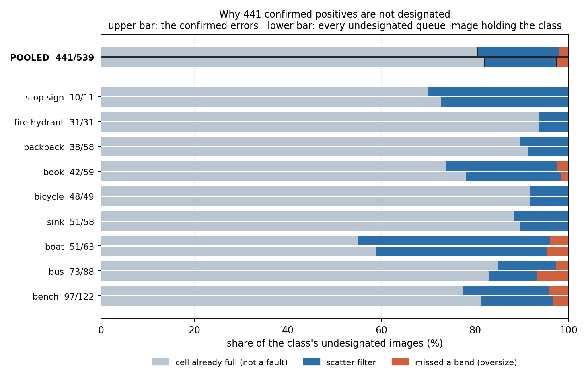
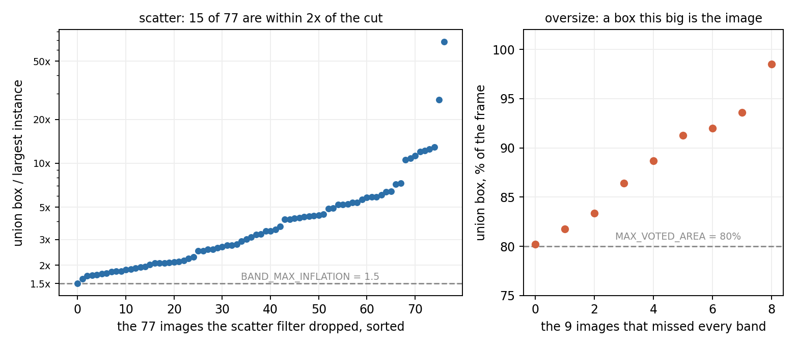
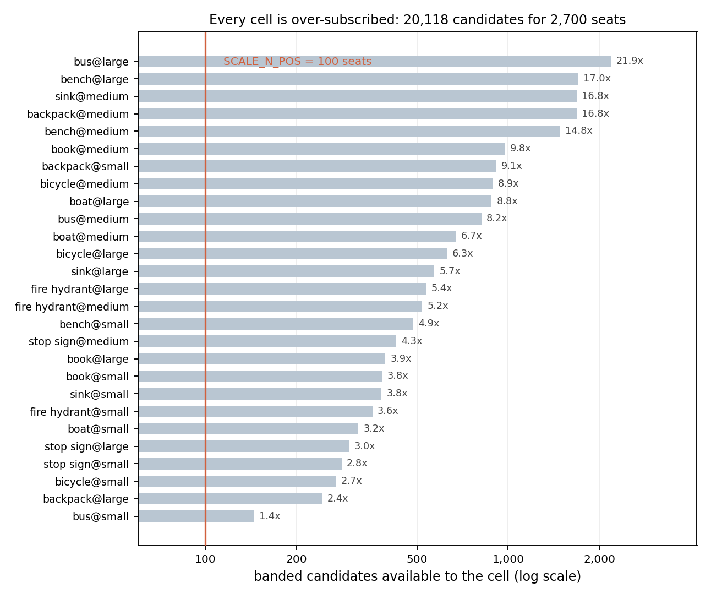

# 441 confirmed positives the pile does not designate (#3818)

**2026-09-13.** #3696 split every confirmed error of the exhaustive pass by what
VG actually said, and **441 of 815 landed in the `folded` bucket**: a human
confirmed the class is present, VG named it under the class's own spelling or one
`SCALE_VG_NAMES` folds, and the image is still not among that class's designated
positives. #3696 reported that as one count and said nothing more about it, on
purpose. This apportions it.

```bash
python folded_supply.py --rate silence_rate.json --source silence_source.json \
                        --per-outcome 1 --out folded_supply.json   # ~3 min CPU, no GPU
```

| | |
|---|---:|
| folded pairs, over the 9 rule-current classes | **441** |
| …the cell was already full (`designate_cells` never reached them) | **355 (80%)** |
| …the scatter filter dropped them | **77 (17%)** |
| …their box missed every band (oversize) | **9 (2.0%)** |
| …anything else — a lost label, a dropped image, a stale correction | **0** |
| the same split over every undesignated queue image holding the class | 82% / 15% / 2.6% of 539 |
| banded candidates available to the 27 cells, for 2,700 seats | **20,118 (7.5x)** |

**The answer is #3818's option (3), and it is not a fault.** Four fifths of the
441 are images that reached their cell's supply and lost a seat to a hash rank,
in cells over-subscribed between **1.4x** (`bus@small`) and **22x**
(`bus@large`). Nothing is being left on the table: every one of those 355 images
is *already* a candidate a rebuild would consider, and the cell has between 45
and 2,085 more of them than it has room for.

**The other two are the band rules working, not failing**, and the report below
prices each rather than asserting it. **No repair issue is filed against either**
— see "Neither filter is worth moving".

**One follow-up is filed, and it is not about the 441**: #3822, the VG dimension
cache that has been silently inert since the image directory grew by 170 files.

## The apportionment, and the control it needs



| class | folded | cell full | scattered | oversize | undesignated in the queue | designated |
|---|---:|---:|---:|---:|---:|---:|
| backpack | 38 | 34 | 4 | 0 | 58 | 112 |
| bench | 97 | 75 | 18 | 4 | 122 | 125 |
| bicycle | 48 | 44 | 4 | 0 | 49 | 124 |
| boat | 51 | 28 | 21 | 2 | 63 | 160 |
| book | 42 | 31 | 10 | 1 | 59 | 126 |
| bus | 73 | 62 | 9 | 2 | 88 | 148 |
| fire hydrant | 31 | 29 | 2 | 0 | 31 | 150 |
| sink | 51 | 45 | 6 | 0 | 58 | 141 |
| stop sign | 10 | 7 | 3 | 0 | 11 | 73 |
| **POOLED** | **441** | **355** | **77** | **9** | **539** | **1,159** |

**A share of the 441 is not a finding on its own, and the first draft of this
measurement was wrong about exactly that.** The 441 are undesignated *by
construction* — `silent_pairs` is defined that way — and a scattered image **can
never be designated**, so scatter is over-represented among undesignated pairs
however the build behaves. Take the obvious denominator — every queue image
holding one of these classes, the 539 + 1,159 = **1,698** of the last two columns
— and the filter's rate there is 83/1,698 = **4.9%**, against which the folded
bucket's 17% reads as a **3.6x excess**. Every bit of that excess is the
conditioning rather than anything about these images.

So the control carries the same condition the numerator does: queue images,
holding the class after every pass, **not designated for it**. On that denominator
the two splits are the same split — 80/17/2.0 against 82/15/2.6 — and they track
class for class, including the two classes that are nothing like the pooled
figure (`boat` 55% cell-full against a control of 59%, `bicycle` 92% against
92%). What separates the 441 from the 539 is the OWLv2 screen and a reviewer's
eye, and neither leaves a mark on which of the three outcomes an image gets.

That is the whole result. **The confirmed errors are an unremarkable sample of
the supply the build already has and does not need.**

## Neither filter is worth moving



The 86 images the band rules dropped are the only part of the 441 that a change
to `vg_scale` could recover, so each is plotted against the cut that dropped it
rather than counted.

**Scatter (77).** `band_for` refuses an image whose union box is more than
`BAND_MAX_INFLATION` = 1.5x its largest single instance, because the union then
describes the scatter rather than the object (#3156). The median dropped image is
at **3.3x** (quartiles 2.1 / 3.3 / 5.4, max 68x), and 47 of the 77 carry just two
instances. Only **15 of 77** sit within 2x of the cut, and of those 15 only
**two** have a union small enough to land anywhere but `large` — so even a
deliberate loosening of the guard buys two images, in cells with 500 to 2,000
spare candidates. The ratio is scale-free and that is a real property worth
knowing (two small instances a little apart trip it while their union is still a
perfectly draggable region — `sink` 2317970 is 1.94x on a union covering 0.3% of
the frame), but it is not costing this dataset supply.

**Oversize (9).** These are boxes covering **80.2% to 98.5%** of the frame, against
a `MAX_VOTED_AREA` of 80%. Eight of the nine are 82% or more. A box that size is
not a region, it is the image, which is the entire content of the rule; one image
at 80.2% is a genuine near-miss and one image is not a reason to move a cut.

## Every cell is over-subscribed



`cell_full` is only a finding if a seat was available, and none was. The 27 cells
of these nine classes have **20,118 banded candidates for 2,700 seats**. The
tightest is `bus@small` at **1.4x** and the loosest `bus@large` at **22x**; no cell
in the nine is under-supplied, so none of them logged `UNDER-SUPPLIED` and none
would gain a positive from a repair.

`bus@small` is the one row worth watching rather than dismissing: it has 45 spare
candidates, and `bus` contributes 9 scattered and 2 oversize images of its own. If
a future ruling tightens `bus`'s supply, those 11 stop being irrelevant. Nothing
to do today.

## Nothing is lost before the band, and that is a measured zero

The apportionment runs the loader's front half in its own order —
`read_vg_labels`, `anchor_to_coco`, `canonicalise`, `apply_corrections`,
`lift_ambiguous`, `band_candidates`, `designate_cells` — and asks after each pass
whether the class is still on the image, so the first pass to drop a pair is the
answer rather than a guess. #3818 named three outcomes; the script carries
**eleven**, because the interesting failure would have been one nobody
anticipated being charged to the nearest one that was.

All seven of the pre-band outcomes came back **zero**: no image the build failed
to read, no degenerate VG box, no pair the COCO anchor overwrote, no pair
`apply_corrections` had already answered, none dropped by `lift_ambiguous`, and
none lost in the fold. The 441 all survive to `band_for` intact.

**The alarm did not fire either.** A folded pair that this replay *designates*
would mean the queue and the build disagree — almost always because
`corrections.json` moved after the queue was written, which it may do at any time
since every build of this family shares it (872 rows on file today). That count is
**0 of 441**, so the table above describes the build the queue was written
against and not a later one.

### Literal examples

One per class per outcome, first by image id — an arbitrary order, so the
examples cannot be the ones that make the point. The last column is the VG
spelling that put the image in the `folded` bucket, so each row can be checked
rather than taken. Full rows in
[`measurements/folded_supply.json`](measurements/folded_supply.json).

| class | image | outcome | boxes | union | inflation | cell | VG's spelling |
|---|---:|---|---:|---:|---:|---|---|
| backpack | 1592153 | scattered | 2 | 0.115 | 1.91 | — | **backpack** |
| bench | 2319048 | scattered | 2 | 0.021 | 2.23 | — | **benches** |
| bicycle | 2328891 | scattered | 2 | 0.348 | 4.18 | — | **bicycle** |
| boat | 498166 | scattered | 6 | 0.163 | 1.71 | — | **boat**, **boats** |
| book | 1231 | scattered | 2 | 0.186 | 6.06 | — | **book** |
| bus | 2276 | scattered | 2 | 0.074 | 1.87 | — | **bus** |
| fire hydrant | 3104 | scattered | 2 | 0.011 | 5.21 | — | **hydrant** |
| sink | 2317970 | scattered | 2 | 0.003 | 1.94 | — | **sink** |
| stop sign | 2369006 | scattered | 2 | 0.127 | 5.67 | — | **stop sign** |
| bench | 2320096 | oversize | 1 | 0.818 | 1.00 | — | **bench** |
| boat | 2353866 | oversize | 1 | 0.864 | 1.00 | — | **boat** |
| book | 2362319 | oversize | 1 | 0.887 | 1.00 | — | **magazine** |
| bus | 2380420 | oversize | 1 | 0.920 | 1.00 | — | **bus** |
| backpack | 2004 | cell_full | 1 | 0.043 | — | backpack@medium | **backpack** |
| bench | 364 | cell_full | 1 | 0.010 | — | bench@medium | **bench** |
| bicycle | 90 | cell_full | 1 | 0.036 | — | bicycle@medium | **bicycle** |
| boat | 673 | cell_full | 1 | 0.000 | — | boat@small | **boats** |
| book | 13 | cell_full | 1 | 0.060 | — | book@medium | **book** |
| bus | 55 | cell_full | 1 | 0.072 | — | bus@medium | **bus** |
| fire hydrant | 311 | cell_full | 1 | 0.002 | — | fire hydrant@small | **hydrant** |
| sink | 36 | cell_full | 1 | 0.018 | — | sink@medium | **sink** |
| stop sign | 150491 | cell_full | 1 | 0.002 | — | stop sign@small | **stop sign** |

Two rows are worth reading twice. `book` 2362319 is `oversize` on the strength of
**magazine**, a folded spelling — the fold is what put the image in the class, and
the box it brought covers 89% of the frame. And `backpack` 2004 is the image that
exposed #3696's denominator bug; here it is again, a perfectly ordinary
`backpack@medium` candidate that lost a seat in a cell holding 1,682 of them.

## What this does not settle

- **The nine classes, not the 25.** The pass has finished nine, and `dog`, `fork`
  and `vase` are still excluded for having been voted under a superseded rule
  (#3814, #3819). The apportionment is a property of the build rather than of a
  class, so there is no reason to expect the split to move — but it has not been
  measured on the other sixteen.
- **It is a statement about supply, not about the reviews.** The 441 human
  answers remain the one input the pile cannot regenerate, and they are banked in
  `human_record/`. Nothing here retires any of them; what it establishes is that
  no membership has to move before the next rebuild, which was the reason #3818
  asked now rather than later.
- **The 98 undesignated queue pairs that are not in the 441** were either below
  the screen's cut, never reviewed, or ruled absent. Which, this does not say.

## Reproducing it

`scripts/experiments/pile/folded_supply.py` on the GRID; three minutes of CPU,
~12 GB, no GPU and no rebuild. It reads VG's object table once and shares that
parse between `silence_source`'s classification and the loader's own read.

```bash
source scripts/experiments/pile/pile_env.sh
cd scripts/experiments/pile
M=../../../docs/experiments/2026-09-13-vg-silence-3696/measurements
python folded_supply.py --rate "$M/silence_rate.json" --source "$M/silence_source.json" \
                        --per-outcome 1 --out folded_supply.json
python ../../../docs/experiments/2026-09-13-folded-supply-3818/figures.py --json folded_supply.json
```

`--source` is not decoration: it refuses to run unless the folded bucket it
recovers matches #3696's published counts class for class, so the study cannot
quietly apportion some other 441.

Refs #3696.
