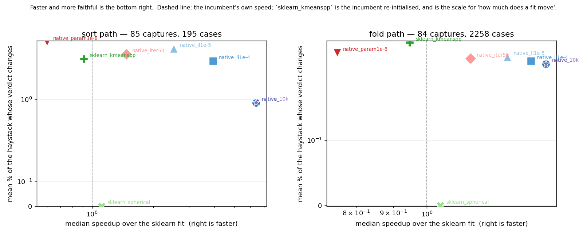
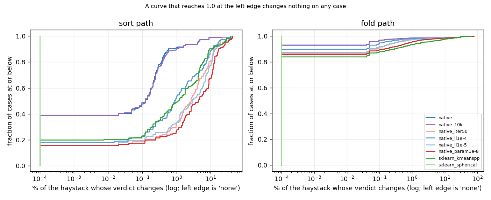
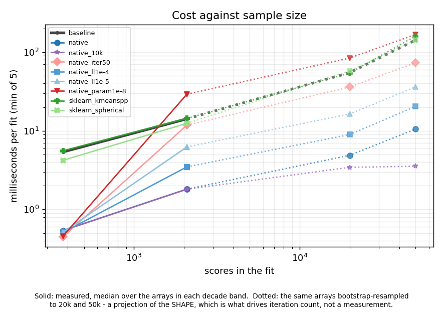
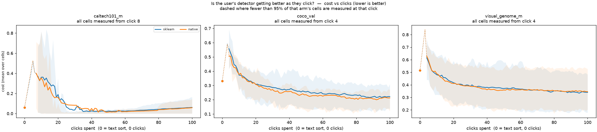

# The threshold's mixture fit is ours now, not sklearn's (issue #3585)

[#3585](https://github.com/samggreenberg/VTSearch/issues/3585) asked for one
thing before any code shipped: *"the deliverable is a **measurement**, not a
diff."* `fit_score_gmm` fits two Gaussians over one dimension and it was
sklearn's `GaussianMixture(n_components=2, random_state=42)` — full-covariance
machinery and a k-means init on a problem whose covariance is a scalar, next
door to an EM loop this repo already owns. Replacing it is easy. Establishing
that the replacement is safe is the whole task, because **it moves the fit**: a
different starting point lands EM somewhere else inside its tolerance, and
sometimes in a different basin, and that propagates through the per-fold
quantile, the combine, `np.quantile` on the final haystack and
`snap_cut_to_sample` to the green/red line a user sees.

So: a corpus of real fit inputs captured from the shipped path, every candidate
replayed against it, and the two numbers the issue named — the distribution of
`|Δthreshold|` and **the count of steps where the admitted set changes at all**
— plus the trajectory A/B that the issue's own decision rule calls for once the
answer to the second one is "not zero".

## The short version

**Ship it.** The replacement is *more* faithful to the incumbent than
re-initialising the incumbent is, it is 7.3x cheaper per fit, and 114 paired
cells of simulated clicking cannot resolve a difference in what the detector is
worth.

1. **The admitted set changes, so this is not an optimisation — but the scale
   that matters is the control.** On 2,258 real fold cases the new fit changes
   the admitted set on **7.0%** of them, by a median of **2 medias**. Keeping
   sklearn and changing only `init_params="k-means++"` — three characters, same
   estimator — changes **16.1%**, by a median of **11.5**. On 195 sorts the mean
   fraction of the haystack whose verdict moves is **0.89%** against **4.2%**,
   and on the 62 that are real *text* sorts it is **0.39%** against **6.2%** — a
   factor of sixteen. A fit of this model moves when you touch it; this one
   moves less than the smallest thing you could touch.

2. **And it moves in a different *place*.** The fold cases that move by more
   than 1% of the haystack (34 of 2,258) are concentrated where the mixture is
   not identifiable: **26 of 34 at click ≤ 10**, and **26 of 34 in one
   environment** — `caltech101_m`/`dinov3_patch`, a 400-media haystack with one
   broad mode. The control's 148 are spread evenly over all six environments.
   Where the two components are real, the two fits agree; where they are not,
   nothing agrees with anything — see [the worked case](#the-worked-case-three-fits-of-one-haystack-admitting-80-256-and-393-of-400).

3. **What made it faithful was the stopping rule, not the init.** This branch
   first reused the anchored loop's parameter-delta rule at 1e-8. On real sorts
   that is **1.7x slower** than the sklearn call it replaced and moves **7.7%**
   of the haystack on average, because a text sort is barely bimodal and EM
   crawls a flat ridge to buy 0.002 nats. Stopping where sklearn stops — an
   iteration improving the mean log-likelihood by less than 1e-3 — is the whole
   difference between an arm that is 0.60x and one that is 6.4x.

4. **At that tolerance the two are the same estimator, and neither is the better
   fit.** Over 4,516 fold haystacks the native fit wins the log-likelihood 2,369
   times and loses it 2,146 — a coin flip, median difference **+5e-7 nats**.
   Running it further *does* find a better fit (+0.0019 nats, 4,501 of 4,516),
   and that better fit is exactly the one that moves the admitted set most. This
   is the least comfortable finding here and it is the one that generalises:
   **on these samples, "fits better" and "cuts the same" pull in opposite
   directions.**

5. **The cost, measured rather than projected.** 7.3x per fit at the corpus's own
   sizes, 10.1x at 20k and 12.3x at 50k. A whole cosine/text sort — the app's
   own `cosine_sort_with_boxes` plus the cut, both timed in one process — goes
   from 49.7 ms to 28.0 ms at 4,952 medias, **1.7x**. That also **corrects the
   issue's own headline**: the fit was 91-95% of a sort by a reconstruction that
   priced a matmul and a dict comprehension; against the function the route
   actually calls it is **47.8%** before this change and **10.4%** after.

6. **The trajectory A/B resolves nothing, in the candidate's favour.** Two
   84-cell grids, identical but for the fit, paired on 114 cells: Δcost
   **−0.0054 ± 0.0050**, ΔAP **+0.0040 ± 0.0045**, ΔFNR **−0.0055 ± 0.0035**,
   ΔFPR **+0.00003 ± 0.0053**. Every one is inside twice its own standard error.
   Every one points the candidate's way, which is worth exactly nothing on its
   own and is said here so nobody has to re-derive it from the table.

7. **Three follow-ups the measurement handed over, the first two larger than
   this issue.** The anchored loop now *is* the cost of a fold's fit and it
   **exits on `max_iter`** rather than converging — 97-200 iterations against
   the init's ~15 — which is #3825. The incumbent's cut on a typed query is
   barely identifiable at all: re-initialising it moves 6.2% of the verdicts,
   which is a fact about what shipped rather than about this change (#3826).
   And `_GMM_MAX_SAMPLES` is worth another 3x at 50k and is still unmeasured at
   the size where it binds (#3827).


---

## The worked case: three fits of one haystack, admitting 80, 256 and 393 of 400

Before the aggregates, the thing they are aggregates of.

`caltech101_m` / `dinov3_patch` / `airplanes`, seed 0, the first captured step
(9 votes). Fold 0's haystack is 400 scores with **one** mode: 80% of the mass
sits between 0.59 and 0.66, with a thin left tail down to 0.40.

| deciles of the haystack | 0.401 | 0.593 | 0.602 | 0.610 | 0.615 | 0.621 | 0.627 | 0.633 | 0.655 | 0.696 | 0.730 |
|---|---|---|---|---|---|---|---|---|---|---|---|

Three fits of those 400 numbers:

| | `w_lo` | `mu_lo` | `mu_hi` | mean log-lik | threshold | admitted |
|---|---|---|---|---|---|---|
| `baseline` (sklearn) | 0.885 | 0.617 | 0.706 | +1.775 | 0.685 | **80** / 400 |
| `native` | 0.017 | 0.441 | 0.631 | +1.829 | 0.517 | **393** / 400 |
| `sklearn_kmeanspp` | 0.664 | 0.615 | 0.652 | **+1.960** | 0.631 | **256** / 400 |

sklearn splits the right shoulder off the mode. The native fit calls the left
tail a component and the mode the other one. k-means++ splits the mode down the
middle — and finds the **highest likelihood of the three**, which is to say the
incumbent's answer is not even the best available one. Three local optima of the
same objective on the same data, and the "midpoint between the component means"
is a different place in each.

This is what the tail of every distribution in this report is made of, and it is
worth being clear about what it is *not*: it is not a defect this change
introduces. It is the estimator being asked a question the sample cannot answer,
which was true before #3585 and stays true after. What the gate can say is that
the new fit does this **less often and in fewer places** than the smallest
possible perturbation of the old one.


---

## What was measured

**The corpus is real fit inputs, captured from the shipped path.** A synthetic
sweep over (n, prevalence, separation) was already run on the issue's own
thread, and it is not the gate: what decides whether a re-initialised EM lands
somewhere else is the *shape* of the sample, and the shapes that matter are the
ones the app actually produces — saturated at click 80, barely bimodal at click
5, max-pooled and right-skewed under region voting, and — the one that turned
out to matter most — a cosine sort, where the query's matches are a shoulder on
one broad mode rather than a second mode.

| | grid | what a case is |
|---|---|---|
| **fold path** | 84 cells: 3 datasets × 2 embedders × their categories × 2 seeds, 100 clicks, every 5th threshold fit captured | one call to `fit_fold_anchored_cut` — two fold haystacks, their held-out votes, and the final model's haystack |
| **sort path** | 62 queries: 4 datasets × 3 text embedders, 838 to 18,050 medias | one whole cosine/text sort's score array, as `calculate_gmm_threshold` receives it |

The three datasets span the shapes on purpose: `caltech101_m`/`siglip` is
**saturated** (the #3166 regime, where the snap is load-bearing),
`visual_genome_m` and `coco_val` are ordinary bimodal in two environments, and
`dinov3_patch`/`max_patch` is **max-pooled** — the heavy right-skewed Bad mode
region voting produces. Shipped defaults everywhere else; the contrast under
test is the fit.

**Each case is replayed through the whole production chain, not through the
fit.** A fold case runs `fit_fold_anchored_cut` → per-fold anchored EM → per-fold
quantile → combine → `np.quantile` on the final haystack → `snap_cut_to_sample`,
and the admitted set is read off the haystack the threshold is applied to. A
sort case runs `calculate_gmm_threshold` and reads the admitted set off the
sorted scores. Pairing is exact — every arm sees the identical captured input —
so there is nothing to match approximately.

### The arms

Every arm fits the same model — two Gaussians over one dimension — to the same
sample. They differ only in where EM starts and where it stops, which is what
makes this a gate and not a benchmark.

| arm | what it is |
|---|---|
| `baseline` | `GaussianMixture(n_components=2, random_state=42)` — what shipped before #3585 |
| **`native`** | a deterministic 2-means init, the anchored EM loop with no anchors, stopped where sklearn stops: an iteration improving the mean log-likelihood by less than 1e-3 |
| `native_ll1e-4`, `native_ll1e-5` | the same, converged further |
| `native_param1e-8` | the same loop stopped on the *parameters* instead — the anchored path's rule, and what this branch tried first |
| `native_iter50` | the parameter rule, capped at 50 iterations |
| `sklearn_kmeanspp` | **the control**: keep sklearn, change only `init_params` to `"k-means++"`. A three-character re-initialisation of the incumbent, and the yardstick for how much a fit *of the same estimator* moves when nothing but its starting point changes |
| `sklearn_spherical` | the issue's cheap option: keep sklearn, pass `covariance_type="spherical"` |
| `native_10k` | `native` fitted on at most 10k scores — the `_GMM_MAX_SAMPLES` lever, measured but not a candidate here |

`sklearn_kmeanspp` is the most important row in that table and it is not a
candidate. Without it the gate can only say "the new fit moves the admitted set
by X" with nothing to compare X against. With it, X has a scale: *this is what
re-initialising the estimator we already ship does.*


---

## 1. The gate: does the admitted set change?

It does, so this is not an optimisation, and the issue's decision rule sends it
to the trajectory A/B (section 4). What the rest of this section is for is the
**scale** of the change, because "not zero" is not a quantity.

### The fold path — 2,258 cases from 84 cells

| arm | changed | of 2,258 | median &#124;Δadmitted&#124; when changed | moved > 1% of the haystack | provenance changed | median speedup of the whole chain |
|---|---|---|---|---|---|---|
| **`native`** | **158** | **7.0%** | **2** | **34** | 3 | **1.45x** |
| `native_ll1e-4` | 234 | 10.4% | 2 | 42 | 10 | 1.39x |
| `native_ll1e-5` | 285 | 12.6% | 4 | 63 | 15 | 1.29x |
| `native_iter50` | 301 | 13.3% | 4 | 57 | 13 | 1.15x |
| `native_param1e-8` | 325 | 14.4% | 9 | 103 | 17 | 0.75x |
| `sklearn_kmeanspp` *(control)* | **364** | **16.1%** | **11.5** | **148** | 41 | 0.95x |
| `sklearn_spherical` | 0 | 0% | — | 0 | 0 | 1.04x |

Read the first and last data rows together. `sklearn_spherical` is the issue's
"if the gate passes it is the answer" option: it is bit-identical on all 2,258
cases, confirming the measurement already on the issue thread, and it buys 4%.
`sklearn_kmeanspp` is the other end — the *smallest possible* perturbation of
the incumbent, three characters, same library, same estimator, same tolerance —
and it moves **twice as many** admitted sets as the whole rewrite does, by five
times as much when it moves them.

The whole-chain speedup is only 1.45x because the anchored refit, which this
branch does not touch, is now ~90% of a fold's fit. That is
#3825.

### Where the fold changes are

They are not spread out. Of `native`'s 34 cases that move more than 1% of the
haystack:

- **26 of 34 are at click ≤ 10**, out of a 100-click horizon;
- **26 of 34 are in one environment**, `caltech101_m`/`dinov3_patch` — a
  400-media haystack whose fold scores are a single broad mode (the [worked
  case](#the-worked-case-three-fits-of-one-haystack-admitting-80-256-and-393-of-400)
  is one of them).

The control's 148 are spread over **all six** environments (51 in
`visual_genome_m`/`dinov3_patch`, 40 in `visual_genome_m`/`siglip`, 21 in
`coco_val`/`dinov3_patch`, …). So the difference between the candidate and the
control is not only "how much" but "where": the candidate agrees with the
incumbent wherever the mixture is identifiable and parts company where nothing
identifies it, while re-initialising the incumbent parts company everywhere.



*One point per arm: median speedup against the mean percentage of the haystack
whose verdict changes. Bottom right is faster and more faithful; the dashed line
is the incumbent's own speed. `sklearn_kmeanspp` is the scale — it is what
touching the incumbent's init costs. What this figure does **not** show: the
distribution behind each mean, which is the next one.*



*The distribution behind those means: the fraction of cases (y) whose verdict
change is at or below a given size (x, log). A curve that reaches 1.0 at the
left edge changes nothing on any case. Read the left edge for "how often does
anything change at all" and the right tail for "how bad is the worst case" —
they are different questions and the arms do not order the same way on both.*

### The sort path — 195 cases

133 are the acquisition cut the harness takes inside a run; **62 are real
cosine/text sorts** over four datasets and three text embedders, 838 to 18,050
medias. This is where the fit's cost lives and, as it turns out, where the
incumbent is least identifiable.

| arm | changed | of 195 | mean % of the haystack moved | median &#124;Δadmitted&#124; when changed | 90th pct of the change | median speedup of the fit |
|---|---|---|---|---|---|---|
| **`native`** | **119** | **61.0%** | **0.89%** | **10** | **0.57%** | **6.4x** |
| `native_ll1e-4` | 160 | 82.1% | 3.9% | 40 | 11% | 3.9x |
| `native_ll1e-5` | 164 | 84.1% | — | 117 | — | 2.5x |
| `native_iter50` | 164 | 84.1% | — | 97 | — | 1.5x |
| `native_param1e-8` | 164 | 84.1% | 7.7% | 215 | 17% | 0.60x |
| `sklearn_kmeanspp` *(control)* | 156 | 80.0% | **4.2%** | 78 | **9.2%** | 0.91x |
| `sklearn_spherical` | 0 | 0% | 0% | — | 0% | 1.12x |

On the 62 cases that are real **text** sorts rather than the harness's own
acquisition cut, the same mean is **0.39%** for `native` against **6.2%** for the
control.

**"61% of sorts change" and "0.89% of the haystack moves" are both true and the
second is the one to read.** A sort's cut sits inside a dense region of scores,
so it is *always* going to move a few medias — the median change among the cases
that change is 10 of ~5,000. What separates the arms is the tail: `native`'s 90th
percentile is 0.57% of the haystack, the control's is 9.2%.

That text-sort split is the sharpest contrast in this report: **0.39%** against
**6.2%**, sixteen times, for a three-character change that alters no estimator.
It is also the number behind #3826 — whatever else is true, a quantity that
moves by 6% of a haystack when you change where its optimiser starts is not
carrying 6% worth of information.


---

## 2. The estimator: which fit is better?

"The thresholds differ" does not say which one is right, and both arms are
maximising the same objective, so the mean log-likelihood of the fit on the
sample it was fitted to settles it — or, here, declines to.

Over **4,516 fold haystacks**, each fitted by every arm:

| arm | better | tied | worse | median Δ log-lik | median seconds |
|---|---|---|---|---|---|
| **`native`** | 2,369 | 1 | 2,146 | **+5e-7** | **0.0017** |
| `native_ll1e-4` | 4,442 | 0 | 74 | +0.0014 | 0.0032 |
| `native_ll1e-5` | 4,488 | 0 | 28 | +0.0018 | 0.0061 |
| `native_param1e-8` | 4,501 | 0 | 15 | +0.0019 | 0.0337 |
| `sklearn_kmeanspp` | 1,651 | 631 | 2,234 | 0.0 | 0.0135 |
| `baseline` | — | — | — | — | 0.0133 |

**At the shipped tolerance the two are the same estimator.** `native` wins the
likelihood on 52% of haystacks and loses on 48%, with a median difference of
5e-7 nats — six orders of magnitude below the 1e-3 improvement threshold both
arms stop at. Neither is the better fit; they are the same fit stopped in the
same place by the same rule, from two different starting points.

**And the arms that *are* better fits are the ones that move the cut most.**
`native_param1e-8` beats sklearn's likelihood on 4,501 of 4,516 haystacks — it is
unambiguously the better estimate — and it is also the arm that changes the most
admitted sets (14.4% against 7.0%) and the only native arm slower than what it
replaces.
Running EM further finds a better optimum of a model that, on these samples, is
frequently not identified; a better fit of an unidentified model is a
*differently placed* cut, not a more correct one.

That is the finding this report would least like to have and the one most worth
carrying forward: **on real score distributions, "fits better" and "cuts the
same" pull in opposite directions**, and #3329's conclusion — that distance to
the fitted CDF does not measure whether a model is doing its job — shows up here
from the other side.

---

## 3. What it costs

Every timing below is one `cpu`-partition GRID node with BLAS pinned to one
thread, min-of-5.

### Per fit

`bench_3585.py`, 168 arrays drawn two per captured cell, each fitted at its own
size and again at two sizes the app fits on:

| scores | arrays | `baseline` | **`native`** | speedup | `native_10k` | `sklearn_kmeanspp` | `native_param1e-8` |
|---|---|---|---|---|---|---|---|
| < 1k (measured) | 48 | 5.4 ms | **0.54 ms** | **9.5x** | 0.54 ms | 5.6 ms (0.93x) | 0.46 ms (13x) |
| 1k-5k (measured) | 120 | 14.2 ms | **1.8 ms** | **7.5x** | 1.8 ms | 14.4 ms (0.94x) | 29 ms (0.43x) |
| 20,000 (resampled) | 168 | 55 ms | **4.9 ms** | **10.1x** | 3.4 ms (14.4x) | 54 ms (0.89x) | 84 ms (0.77x) |
| 50,000 (resampled) | 168 | 143 ms | **10.5 ms** | **12.3x** | 3.5 ms (37.5x) | 161 ms (0.87x) | 168 ms (1.01x) |

The speedup grows with *n* from 1k upward because the k-means init sklearn pays
per call grows with it and the 2-means init does not. (The `< 1k` row is the
fixed per-call overhead of constructing and validating a `GaussianMixture`
showing through: at 838 scores the parameter-delta arm is 13x too, because
almost nothing is being iterated over.) `native_10k` is the `_GMM_MAX_SAMPLES`
lever measured beside the others rather than proposed: at 50k it is another 3x
on top, for a change of a different kind — it changes what the fit *sees* — and
it is #3827, not this issue.

Two arms are *slower than the incumbent*: the parameter-delta stopping rule at
every size, and — at 20k and 50k — the issue's own `k-means++` suggestion, whose
5-6x on a synthetic corpus does not survive contact with a real one.

### Per sort

The whole of a cosine/text sort is `cosine_sort_with_boxes` plus
`calculate_gmm_threshold`. Both were timed **in the same process on the same
node**, min-of-5, because a fit timed in one job against a sort timed in another
puts a cross-node difference straight into the ratio (#3160):

| | ms | share of the sort |
|---|---|---|
| the rest of the sort (scoring, result dicts, the sort itself) | 25.1 | — |
| `baseline` fit | 26.2 | **47.8%** |
| **`native` fit** | **3.7** | **10.4%** |

**A sort goes from 49.7 ms to 28.0 ms — 1.71x** at the median size in the corpus
(4,952 medias), over all 62 captured sorts.

That table also corrects this issue's own §1. It reported the fit at **91-95%**
of a sort from a reconstruction — a matmul, a result-dict build and a sort —
rather than from the function the route calls, and noted the real share would be
"somewhat below" it. Measured against `cosine_sort_with_boxes`, it is **47.8%**,
and the gap is not a rounding difference: the reconstruction under-counts the
per-media Python work that dominates the non-GMM side. The saving is real and
the multiplier on a whole sort is 1.7x, not 10x.



*Cost per fit against the size of the sample, log-log, one line per arm. Solid:
measured on a real sort or fold haystack of that size. Dotted: the same array
bootstrap-resampled up to 20k and 50k — a projection of the sample's **shape**,
which is what drives iteration count, and not a measurement. What to read: the
gap widens with n, and two arms cross the incumbent's line from below.*

---

## 4. The trajectory A/B

The gate holds everything but the fit fixed, which is the right instrument for
"does the admitted set change" and the wrong one for "is the detector better or
worse". The threshold is not output-only: Autopilot's Hard phase picks the
unlabelled item nearest the decision boundary, so two arms are asked to vote on
different items from their second Hard pick onward and their trajectories
diverge. Only two whole runs can price that.

Two 84-cell grids, identical in every knob but the fit, paired on
(dataset, embedder, style, category, seed) — 114 paired cells over 8 arms:

| metric | Δ (native − sklearn) | SE | resolvable? |
|---|---|---|---|
| `cost` | **−0.0054** | 0.0050 | no |
| `average_precision` | **+0.0040** | 0.0045 | no |
| `fnr` | **−0.0055** | 0.0035 | no |
| `fpr` | **+0.00003** | 0.0053 | no |

Every difference is inside twice its own standard error. Every one points the
candidate's way; that is worth nothing on its own and is stated so nobody has to
re-derive it from the table.

Per environment, `cost`, all steps:

| arm | cells | Δ cost | SE |
|---|---|---|---|
| `caltech101_m`/`dinov3_patch`/`whole_image` | 12 | −0.0092 | 0.031 |
| `caltech101_m`/`siglip`/`whole_image` | 12 | +0.0019 | 0.0015 |
| `coco_val`/`dinov3_patch`/`max_patch` | 14 | −0.0005 | 0.0039 |
| `coco_val`/`dinov3_patch`/`whole_image` | 14 | +0.0008 | 0.020 |
| `coco_val`/`siglip`/`whole_image` | 14 | **−0.0317** | 0.014 |
| `visual_genome_m`/`dinov3_patch`/`max_patch` | 16 | −0.0052 | 0.0087 |
| `visual_genome_m`/`dinov3_patch`/`whole_image` | 16 | +0.0063 | 0.0087 |
| `visual_genome_m`/`siglip`/`whole_image` | 16 | −0.0067 | 0.013 |

One arm resolves on its own — `coco_val`/`siglip`/`whole_image`, −0.032 with
Wilcoxon p = 0.005, AP +0.031 (p = 0.017), FNR −0.029 (p = 0.028). **Do not
read that as a win.** It is one of 32 arm × metric comparisons in this table's
family; at 32 tests a p of 0.005 is roughly what chance produces, and no
mechanism predicts that this environment in particular should benefit. It is
reported because leaving it out would be worse, and it is not being banked.



*The mandatory quality-over-clicks pair, averaged: one panel per dataset, one
line per arm, over every seed and category, with the inter-quartile band. Click
0 is the free text sort — the level a clicked detector has to beat. Crossovers:
`visual_genome_m` at click 7 for both arms, `coco_val` at 15 (native) against 16
(sklearn), `caltech101_m` at 34 against 26 — on `caltech101_m` the text sort is
already at cost 0.059, so the crossing is late and noisy for both. What this
figure does **not** license: reading a gap between two lines that the paired
table above says is inside its own error bar.*

The per-run panels — one file per dataset, every seed as its own line — are
[`figures/cost_vs_clicks_runs__visual_genome_m.png`](figures/cost_vs_clicks_runs__visual_genome_m.png),
[`…__coco_val.png`](figures/cost_vs_clicks_runs__coco_val.png) and
[`…__caltech101_m.png`](figures/cost_vs_clicks_runs__caltech101_m.png), and the
interactive [`viewer.html`](viewer.html) carries every other slice (any dataset,
any category, any metric the run emitted, seeds pooled or drawn individually).

---

## What this does not license

**It is not a bit-equality claim, and no amount of measurement would make it
one.** #3558 could assert bit-for-bit because it reassociated nothing. This
changes where EM starts and where it stops; the gate says how often that reaches
a user, not that it never does. A future change that needs the fold-anchored
cut to be reproducible against a pre-#3585 run cannot get that from here — it
has to re-run.

**The corpus is the pile's datasets, and the app's haystacks are bigger.** The
largest sort here is 18,050 medias; a GUI Find subsamples ~250k down to
`_GMM_MAX_SAMPLES` = 50,000, and a CLI Find can start from 2M. The 50k rows in
the cost table are a **bootstrap resample** of a real sort, so they carry the
shape and not the granularity. What that leaves un-measured is whether the
admitted-set agreement holds at 50k, where the fitted components are estimated
from more data and both arms should agree *more*, not less — an expectation, not
a measurement.

**The fold path is measured at `calibrate_count = 2`**, the shipped value. The
per-fold anchored fit is unchanged by this branch, so nothing here says what
happens to the gate at K = 6; it says only that the init in front of it moved.

**Two seeds per cell.** The trajectory A/B pairs 84 cells on (dataset, embedder,
style, category, seed), which is enough to resolve a difference of the size the
window tables report and not enough to resolve a smaller one. Where the paired
difference is inside twice its standard error the table says so rather than
reporting a direction.

**One machine.** Every timing is a `cpu`-partition GRID node with BLAS pinned to
one thread, min-of-5. The *ratios* are what this report reads; absolute
milliseconds on another machine will differ, and the issue's own numbers (from a
4-vCPU cloud container) already differ from these by more than a factor of two
in places.

---

## Follow-ups

Three, all filed, all pointed at from the prose above:

- **#3825 — the anchored EM is now the whole cost of a fold's fit, and it
  exits on `max_iter`.** Measured here at 97-200 iterations per fold (200 is the
  cap) and 21-48 ms against the init's 2-4 ms. The same log-likelihood rule is
  the obvious fix and `_anchored_em` already takes it as an argument; unlike this
  issue there is no second estimator between that fit and the cut, so the gate
  has to be run again. The corpus is captured and needs no re-run.
- **#3826 — the cut on a typed query is barely identifiable.**
  Re-initialising the *incumbent* moves 6.2% of a text sort's verdicts on
  average and 37% on the worst one. That is a fact about what shipped, not about this change,
  and it asks whether a mixture midpoint is the right rule for a sort at all.
- **#3827 — `_GMM_MAX_SAMPLES` is the third lever and it is still
  unpriced at the size it binds.** `native_10k` is another 3x at 50k, but every
  sort in this corpus is under 50,000 scores, so the arm is never exercised
  where the constant actually does something.

---

## Reproducing this

Everything is in [`scripts/experiments/gmm_init/`](../../../scripts/experiments/gmm_init/),
whose README is the map. On the GRID, from a worktree of this branch:

```bash
bash scripts/experiments/gmm_init/launch_gmm_3585.sh capture   # 84 cells -> corpus/*.npz
bash scripts/experiments/gmm_init/launch_gmm_3585.sh sorts     # 62 cosine/text sorts
bash scripts/experiments/gmm_init/launch_gmm_3585.sh gate      # replay every arm
bash scripts/experiments/gmm_init/launch_gmm_3585.sh bench     # min-of-5 per-call cost
bash scripts/experiments/gmm_init/launch_gmm_3585.sh analyse   # the tables and figures
bash scripts/experiments/gmm_init/launch_gmm_3585.sh ab        # the two trajectory grids
bash scripts/experiments/gmm_init/launch_gmm_3585.sh baseline abfigures abanalyze
```

`DEP=afterany:<jobid>` chains a stage behind a running one, which is how this
run was driven: a waiter on the laptop dies with the VPN.

Results root: `/expscratch/sgreenberg/gmm-3585` — `corpus/` (290 MB of captured
arrays), `analysis/` (the gate frames and the tables below), `ab_native/` and
`ab_baseline/` (the trajectory grids). Scratch is purgeable; the corpus rebuilds
from the pile with one `capture`, and every table here rebuilds from the corpus
with one `gate` + `analyse`.

**The corpus outlives the candidates in it.** That is the reason it is arrays on
disk rather than a comparison computed in place, and the reason
`fit_score_gmm_sklearn` stays in the tree: the next candidate — the anchored
loop's own stopping rule (#3825) is the obvious one — can be gated against
exactly these inputs, against exactly this baseline, without re-running a single
cell.
