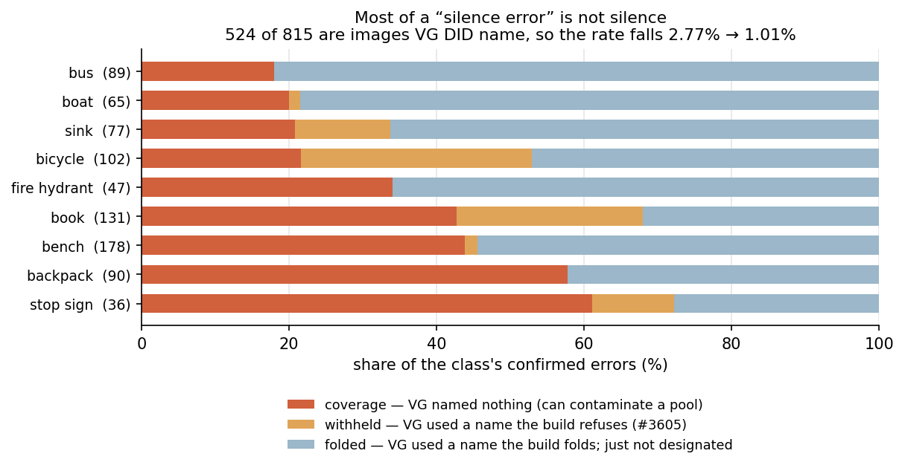
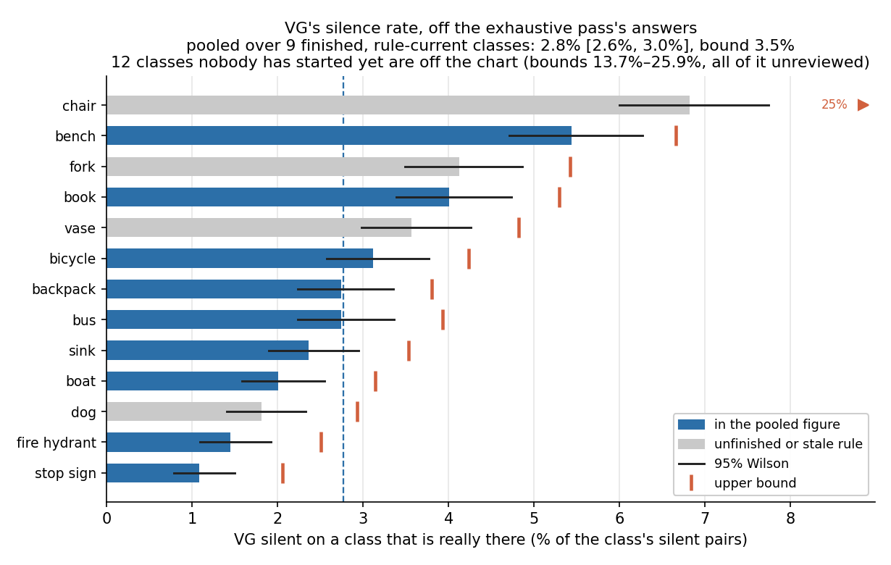
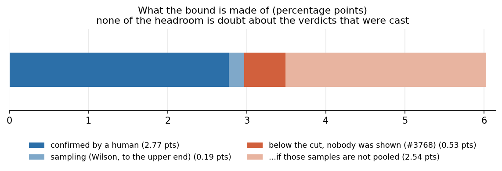

# VG's silence rate, off the exhaustive pass's own answers (#3696)

**2026-09-13, 9 of 25 classes finished.** How often VG fails to name a class
that is really in the picture — the rate that justified `vg_scale`'s negative
pool composition (#3670) and that the composition then made unmeasurable, by
drawing all 9,900 shared negatives from the COCO-scored half.

The exhaustive pass supplies it as a by-product at no extra labour: every class
VG did **not** name in a queue image is a measurement of its silence against a
human reference. Two scripts, because they cost three orders of magnitude
apart:

```bash
python silence_rate.py   --deep-unprovable 6264 --out silence_rate.json     # ~20s, three small JSONs
python silence_source.py --rate silence_rate.json --deep-unprovable 6264 \
                         --out silence_source.json                          # ~2min, reads VG's objects.json
```

| | |
|---|---|
| silent `(image, class)` pairs in the queue | **81,363** over 3,397 images |
| …over the 9 finished, rule-current classes | 29,414 |
| errors a human confirmed | 815 |
| **of which VG had actually named the class** | **524 (64%)** |
| VG-silent pairs, the population a negative pool draws from | **28,720** |
| **VG's silence rate** | **1.0%** [0.90%, 1.1%] |
| **upper bound** | **1.7%** |
| `vg_scale_deep`: of its 6,264 unprovable negatives (#3723) | **at most 104 contaminated** |

The headline to quote is **1.0%, bound 1.7%**. The uncorrected,
designation-based reading is 2.8% [2.6%, 3.0%] with a bound of 3.5% — valid but
loose by a factor of ~2, for the reason in "Most of it is not silence" below.

**It lands where an independent instrument already was.** #3666 measured the
shipped twelve's pool error at **1.40%** [0.68, 2.86] by a completely different
route. The corrected 1.0% sits near the middle of that interval; the
designation-based 2.8% [2.6%, 3.0%] sat at the very top of it, overlapping only
over [2.59, 2.86]. The two readings were never formally in conflict, but one of
them agrees comfortably and the other only just, and the difference between them
is ours rather than the data's.

## Most of it is not silence



`silence_rate.py` has to call a pair silent when the queue does not **designate**
that image for that class, because a designation is all a cell pickle carries
(#3678). That is not the same fact as "VG never named it", and the gap is 64% of
the number:

| | count | what it means |
|---|---:|---|
| **coverage** | **291** | no name on the image belongs to the class under any spelling the tables know. The reading that matters — and itself an upper bound, since an unaudited name lands here (see the examples). |
| **withheld** | 83 | VG used a name `SCALE_VG_AMBIGUOUS` refuses on purpose — `bike`, `stop`, `sailboat` (#3605). VG spoke; the build declined to listen. |
| **folded** | 441 | VG used the class's own name, or one `SCALE_VG_NAMES` already folds. Nothing to do with VG: the image is simply not among the class's *designated* positives — a missed band, the scatter filter, or a cell `designate_cells` filled from higher ranks before reaching it. Apportioning the three is #3818. |

**Only `coverage` can contaminate a negative pool**, which is the rate's only
live consumer. That is enforced in one place and is stricter than it needs to be
for this argument — `band_candidates` admits an image to `clean` only when it
holds no instance of **any** class in *C* *and* has no pair in `unbanded`:

```python
if not by_name:
    # Only a true negative for every class in C may join the shared pool.
    if not any((iid, c) in unbanded for c in classes):
        clean.append(iid)
```

A folded name leaves `by_name` non-empty, and `lift_ambiguous` puts a withheld
pair in `unbanded` ("too weak to band as a positive, and far too strong to leave
in the shared negative pool"). So an image in either bucket is never drawn as a
negative for *any* class, let alone its own.

Both halves of the fraction are corrected on the same test — dividing 291
coverage errors by the uncorrected 29,414 would understate the rate by exactly
the share just removed from the top. The denominator barely moves (29,414 →
28,720, −2.4%) while the numerator falls 64%, which is why the correction is
almost entirely a numerator story.

| class | found | coverage | withheld | folded | VG-silent | designation | **VG-silence** |
|---|---:|---:|---:|---:|---:|---:|---:|
| backpack | 90 | 52 | 0 | 38 | 3,222 | 2.7% | **1.6%** |
| bench | 178 | 78 | 3 | 97 | 3,146 | 5.4% | **2.5%** |
| bicycle | 102 | 22 | 32 | 48 | 3,161 | 3.1% | **0.70%** |
| boat | 65 | 13 | 1 | 51 | 3,171 | 2.0% | **0.41%** |
| book | 131 | 56 | 33 | 42 | 3,161 | 4.0% | **1.8%** |
| bus | 89 | 16 | 0 | 73 | 3,160 | 2.7% | **0.51%** |
| fire hydrant | 47 | 16 | 0 | 31 | 3,216 | 1.5% | **0.50%** |
| sink | 77 | 16 | 10 | 51 | 3,179 | 2.4% | **0.50%** |
| stop sign | 36 | 22 | 4 | 10 | 3,304 | 1.1% | **0.67%** |
| **POOLED** | **815** | **291** | **83** | **441** | **28,720** | **2.8%** | **1.0%** |

The correction is not uniform, and it re-ranks the classes. `bench` and
`backpack` stay near the top because their errors really are coverage; `bus`
drops from 2.7% to 0.51% because 73 of its 89 errors are images VG called a bus
that never became designated positives. **A class that looks dirty on the
designation reading can be clean on the one that matters.**

Those 441 are not nothing, though: they are images a human has now confirmed hold
a class the pile does not designate them for. Whether they are supply the build
is leaving on the table or ordinary over-subscription is #3818; either way they
are already safe from the negative pool.

### Literal examples

Three per class, first by image id (an arbitrary order, so the examples cannot
be the ones that make the point). Full list in
[`measurements/silence_source.json`](measurements/silence_source.json).

| class | image | kind | VG names | what VG said instead |
|---|---:|---|---:|---|
| backpack | 587 | coverage | 26 | white, sign, road, building., street, people, sidewalk., van |
| backpack | 611 | coverage | 26 | person, car, pole, carriage, sign, arrow, light, street |
| backpack | 2004 | **folded** | 16 | artwork, **backpack**, bench, brochures, chair, desk lamp, lamp shade |
| bench | 29 | coverage | 34 | grass, woman, words, outside, beach, women, ocean, clouds |
| bench | 56 | coverage | 8 | window, building |
| bench | 75 | coverage | 32 | window, blue window, light, countertop, seat, stove, oven, counter |
| bicycle | 364 | **withheld** | 33 | pole, light, tree, banner, flag, person, city, leaves |
| boat | 1159484 | coverage | 5 | woman, clouds, kite |
| book | 12 | coverage | 20 | computer keyboard, inbox tray, desk, office chair, computer monitor, cpu, composition book |
| sink | 67 | coverage | 21 | leg of a chair, an outlet, l shaped counter top, ceiling, picture frame, flowers |
| stop sign | 3833 | **withheld** | 67 | street, road, car, grass, sidewalk, leaves, tree, line |

Three things a reader should take from these.

**Density, not vocabulary, is the usual cause.** `bench 56` carries eight object
annotations spanning **two distinct words** — `window` and `building` — for the
whole photo. No name table reaches a bench nobody wrote down.

**One image can be silent about several classes at once.** `bench 75` and
`book 75` are the same picture: a kitchen with 32 annotations over 14 distinct
names, holding a confirmed bench *and* a confirmed book, neither named. Dense
scenes are not exhaustively described, which is the property `vg_scale` exists
to work around.

**`coverage` is itself an upper bound, and that image shows why.** Among those
14 names are `seat` and `white cushion`. Neither is in `bench`'s tables, so the
classifier calls the pair coverage — correctly, since the tables are the only
authority on what counts as the same object and a resemblance rule here would
manufacture findings out of `bike rack`. But it means the coverage bucket still
holds some vocabulary misses under names nobody has audited (#3618's loop), and
the true VG-silence rate is at or below 1.0% rather than at it.

## What the rate is, and is not



**An upper bound on the *uniform* off-COCO rate, not an estimate of it.** The
queue's images are selected for holding a class of *C*, so they are cluttered
scenes, and clutter correlates with holding more classes (#3667 excluded 3,247
images for holding a *different* class; #3679 measured the scene-clutter
shortcut at 2.5x `@small`). Silence measured on cluttered scenes is at least as
high as silence on a uniform draw.

Three things push the other way, and each is counted rather than argued:



- **Screening.** The pass is screened (#3760), so a positive below a class's cut
  was never shown to anyone. #3768's 600 random below-cut images found **zero**,
  which bounds that mass at 0.64% pooled — 0.53 points of the bound, and the
  whole of the gap between the interval top and the bound. The pooling is an
  assumption (six sampled classes speaking for nineteen); holding every class to
  the loosest single sample instead costs 2.5 points on the designation scale.
  The allowance is carried onto the corrected rate **unsplit**, because #3768's
  slates asked whether the object was there and never which name VG gave it.
- **The question asked.** A slate asks *is this box one?* of the screen's best
  box, so a second instance the detector never boxed reads as absent. Only
  #3768's below-cut slates ask the wider image question.
- **Coverage of the pass.** `chair` is banked at 300 of 841, so its 541
  unreviewed candidates enter its bound at their worst case — which is why it
  reads 25% and stays out of the pool. The twelve unstarted classes read the same
  way, and that is the point: a class nobody has looked at must never read as
  clean.

**Three classes were voted under a rule that has since moved** — `dog`
(`dog` → `dog not wolves`, #3771), `fork` (`fork incl plastic` → `fork incl
sporks not strainers`), `vase` (`vase incl pots and planters` → `vase not
planters`, #3784). They are reported and kept out of the pooled figure rather
than dropped (#3814). `vase` is the one to watch: the planter recheck retired
**20 of 31** of the *old* positives, and it does not overlap these 394 at all.
Rechecking all three would take the pooled figure from 9 classes to 12 — #3819.

## What was given up

The original ask was a designated off-COCO stratum, which would have measured the
uniform rate rather than bounding it. It was dropped because it needs hand
annotation to be a reference and the pass supplies a bound free. If a decision
ever turns on the uniform rate specifically, this cannot supply it, and drawing
the stratum afterwards means a different annotator cohort under a different
protocol.

## Re-running

The number moves as the pass finishes classes, so re-run both scripts rather
than quoting this page. `figures.py` redraws every figure here from the two
files in `measurements/`, with no pile, no GPU and no cluster.
