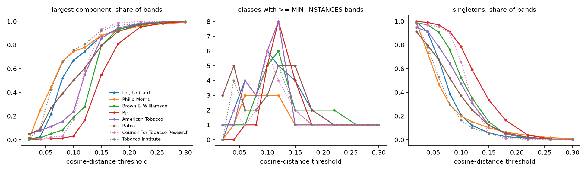
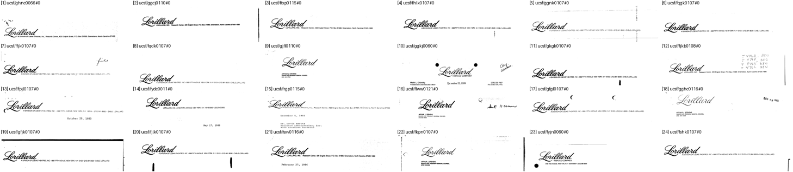
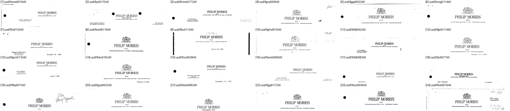

# DocMarks — can SigLIP turn UCSF letterhead bands into classes? (#3902)

**2026-09-16.** v2 found no `phash` threshold that turns UCSF letterhead bands
into classes: the largest component was already 12% at the grid's lowest value.
#3901 then showed the marks are there, since half of sampled bands carry a
printed mark and it repeats within an author. So the question is whether a
semantic descriptor finds the marks that a perceptual hash of band *layout*
could not.

**Verdict: yes, as candidates rather than classes.** Clustered per author at
cosine distance **0.10**, SigLIP proposes **11 classes that are each one printed
mark**: 10 distinct marks over **~2,300 bands**, where `phash` produced none. The
same partition also holds 6 junk classes (blank bands, typed text, noise; ~1,600
bands), 2 typeset-layout classes, one mixed class (the 1,357-band Philip Morris
class is crest *or* typeset heading), one mark split across two authors, and one
mark that barely clusters at all. None of it is roster-ready without the human
passes. What it gives the audit is a slate worth reviewing, which `phash` never
did.



## What was run

`scripts/experiments/docmarks/band_siglip.py`, reading the manifest and page
rasters and writing only outside the corpus:

1. **embed** — the top `LETTERHEAD_BAND_FRAC` = 22% of each of the **14,002**
   `letterhead_author` pages, one SigLIP vector each (A100, 9 min, 0 declined);
2. **sweep** — single linkage at cosine distance 0.02–0.30, per author and
   pooled: class count, largest-component share, singleton share, classes with
   `>= MIN_INSTANCES` bands ([`measurements/band_sweep.json`](measurements/band_sweep.json));
3. **sheets** / **purity** — at 0.06 and 0.10, the largest classes per author,
   then **a random 24 members of every class with ≥ 20 bands**, each called by
   eye ([`measurements/purity_calls.txt`](measurements/purity_calls.txt),
   members in [`measurements/purity.json`](measurements/purity.json)).

## The sweep

Per author, the largest component stays under ~25% up to 0.04–0.10 and then
chains. By 0.15, 55–93% of an author's bands are one component (Council for
Tobacco Research 93%, RJR 55%). Usable classes peak at **3–8 per author**, mostly
at 0.10–0.12. Pooled over all 14,002 bands, 0.10 gives 27 usable
classes with the largest at 14%.

That is not a clean plateau. Unlike `phash`, though, there is a window in which
the large components are *marks*: at 0.10 Lorillard's largest class (1,213 bands,
67%) is its script wordmark on every sampled band. A dominant component is only
a failure when it is not one mark.

## What the classes are (threshold 0.10, classes ≥ 20 bands)

| author | one mark | mixed | layout | junk |
|---|---:|---:|---:|---:|
| LOR, LORILLARD | 2 | 0 | 1 | 1 |
| PHILIP MORRIS | 1 | 1 | 0 | 1 |
| BROWN & WILLIAMSON | 3 | 0 | 0 | 1 |
| RJR | 2 | 0 | 0 | 1 |
| AMERICAN TOBACCO | 2 | 0 | 0 | 1 |
| BATCO | 1 | 0 | 1 | 1 |
| **all** | **11** | **1** | **2** | **6** |

**One mark, with a literal example each:**
- *Lorillard* script wordmark: 1,213 bands, 24/24 sampled.
- **A 1960s *P. Lorillard Company* engraved crest** (30 bands, 24/24). #3901's
  sample never saw this mark.
- The Philip Morris crest alone (20 bands), where the band cut off the wordmark.
- Three distinct Brown & Williamson marks: the old leaf monogram (329, 23/24),
  the 1990s tobacco leaf (70) and a 1950s oval emblem (26).
- *RJReynolds* script (31) and the *RJR* block logo (20).
- The BAT leaf (440 under `AMERICAN TOBACCO`, 103 under `BATCO`).
- The American Tobacco Company chief's-head block (27).

**Mixed:** `PHILIP MORRIS` class 1 (1,357 bands) has the crest on 13 of 24 sampled
bands and a typeset *PHILIP MORRIS* heading without it on 11. They share the
wordmark, so SigLIP chains them.

**Layout:** a typed *LORILLARD, INC. / 666 Fifth Avenue / Tax Department* block
(63), and a typeset *TOBACCO ADVISORY COUNCIL* heading (31).

**Junk:** blank bands, typed references and toner-black scans, in six classes
totalling ~1,600 bands. The largest is 920 of BATCO's 1,837. These are the 20%
"no letterhead" of #3901, and they cluster *well*, because blank looks like blank.





## Three defects no threshold fixes

1. **Junk clusters.** A blank band is a confident class. Bands need a
   mark-presence gate before clustering, or the audit spends its time rejecting
   whitespace.
2. **One mark split by author.** The BAT leaf is two classes, because
   `AMERICAN TOBACCO` and `BATCO` both return British American Tobacco pages
   (#3901's author-query leak). Pooled clustering or a merge-slate pass across
   authors joins them.
3. **Low recall on memo layouts.** #3901 saw the *RJR* block logo on 17 of 40 RJR
   bands, which implies ~550 in the pool, yet only **20** cluster together. The
   rest sit in memo-form layouts (*Interoffice Memorandum*, subject lines) that
   pull each band toward its layout. A band embedding measures the band, and the
   mark is a small part of it. A class built from these bands has the positives
   it clustered, not the positives the pool holds, so every unclustered instance
   is an unlabelled positive in the distractor pool.

## What the owner must do before any of this is a class

- **Treat the 11 one-mark classes as audit candidates, not roster entries.** Run
  them through the merge slate (which will pair the two BAT-leaf classes) and
  membership. `split` the Philip Morris class into crest and typeset.
- **Draw query crops by hand.** Band-located classes have none
  (`needs_hand_crop`), and auto-cropping a band hands the query a whole
  letterhead.
- **Settle recall before scoring.** Point 3 means a band class undercounts its
  own positives badly enough to turn correct retrievals into false positives, the
  same failure #3904 found for the contamination rule. Searching the pool for
  each mark with its hand-drawn crop is the obvious way to find the rest.

## Follow-ups

- #3921 — put the 11 one-mark band classes through the audit, with a junk gate first
- #3922 — band classes miss most of their own mark on memo layouts; find positives in the pool, not the clustering

## Caveats

- **Purity is judged from 24 members a class.** 24/24 bounds a class's impurity
  at roughly 12% (95%), not zero.
- **One threshold, per author.** The pooled clustering was swept but not looked
  at.
- **One reviewer**, not countersigned; every call is in `purity_calls.txt`
  against its sheet.

## Reproduce

```
source scripts/experiments/pile/pile_env.sh
cd scripts/experiments/docmarks
python band_siglip.py embed  --out <out>                    # GPU, ~9 min
python band_siglip.py sweep  --out <out>                    # CPU, ~1 min
python band_siglip.py purity --out <out> --threshold 0.10
```
