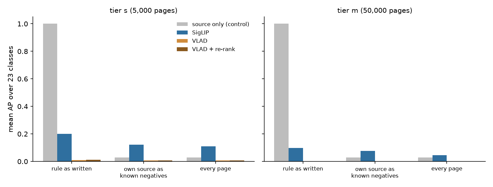
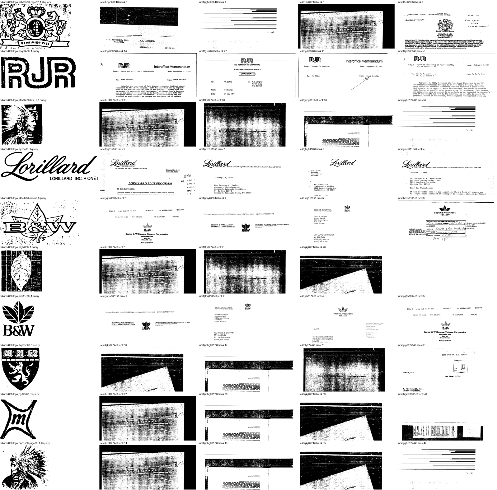
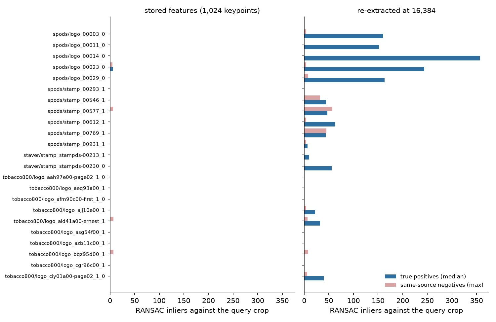

# DocMarks — the first roster evaluation (#3904)

**2026-09-16.** The corpus was built, adjudicated and embedded, and nothing had
ever been scored on it. This is the first scoring: each of the 23 roster classes
searched once with its query crop over tiers `s` (5,000 pages) and `m` (50,000),
three ways — SigLIP cosine, `sift_vlad`'s VLAD cosine (structural Stage 1), and
VLAD followed by the app's own geometric re-rank of the top 50 — through the
contamination rule the issue asked to be wired in.

**Four findings, and none of them is the number the eval was built to produce:**

1. **The contamination rule was not applied at the grain it was written at.** It
   excludes UCSF's *Tobacco* pages for Tobacco800 classes, but `classes.json`
   can only record `ucsf`, so every UCSF page was scored. Fixed per page. The
   excluded pages are not hypothetical: looked at, SigLIP's top-ranked ones carry
   the class's own mark unlabelled.
2. **The rule as written makes the task trivial.** Excluding every same-source
   non-member leaves the positives the only pages in their source's style, and a
   ranker that knows nothing about the mark scores **AP 1.00**. Those pages have
   to come back as known negatives.
3. **Structural search as shipped is at chance on documents** — VLAD AP 0.006 on
   tier `s`, 0.001 on `m`. For SPODS and StaVer the cause is the
   **1,024-keypoint page budget**: a crop gets ~0 inliers against its true
   positives with the stored features in all 13 classes, and 8 of them separate
   cleanly from negatives once the same pages are re-extracted at 16,384.
4. **SigLIP is the only method above chance**, at mean AP **0.12** on tier `s`
   and **0.076** on `m`, against 0.029 for the source-only control.



## What was scored

`scripts/experiments/docmarks/eval_retrieval.py` reads the existing cells and
writes only outside the corpus. For each class and tier:

- **positives** — the class's adjudicated pages, minus the page its query crop
  was cut from (finding that page measures nothing);
- **three pools**, all containing the positives:
  - `eligible` — the contamination rule as written, through
    `roster.eligible_pages`, now decided per page;
  - `own_verified` — the same, with the class's own source counted as *known*
    negatives rather than excluded;
  - `naive` — every page in the tier.
- **four rankers** — `siglip`, `vlad`, `vlad_rerank` (`structural_rerank` with
  the cold-start inlier gate and the crop as the one template, top 50), and
  `source_prior`, a control that ranks the class's own source first and knows
  nothing about the mark. Tier `s` also ran `rerank_all`, which verifies every
  page rather than a shortlist, to separate Stage 2 from Stage 1's recall.

Classes hold 5–79 positives (median 23); pools hold 4,841–4,998 pages on tier
`s` and 46,659–49,968 on `m`. Per-class rows are in
[`measurements/rows_s.csv`](measurements/rows_s.csv) and
[`rows_m.csv`](measurements/rows_m.csv).

## 1. The contamination rule, at the grain it was written

`docmarks_config.CONTAMINATES` says a Tobacco800 class must not be scored against
`ucsf:Tobacco` — the same IIT-CDIP archive — while UCSF's Food, Opioids and other
industries are safe. `build_corpus.py` resolves that per class with no industry,
so `eligible_distractor_sources` records plain `ucsf`, and `eligible_pages` read
only that list. **All 158 / 3,182 / 10,662 UCSF Tobacco pages in tiers
s / m / l were eligible negatives for all ten Tobacco800 classes.**

`eligible_pages` now takes `industry_of` and puts each page to
`docmarks_config.eligible_distractor`. Tested in
`tests_lib/datasets/test_docmarks_eval.py`.

**The pages it removes are real positives, not a precaution.** SigLIP's
highest-ranked excluded pages for each Tobacco800 class, beside its query crop:



The *Lorillard* script class has its own wordmark on the UCSF pages SigLIP ranks
1, 2, 3 and 4; the B&W three-leaf class has it at 1, 2, 4 and 5; the *RJR* block
logo is on UCSF pages at 14, 22, 41 and 50; the Philip Morris crest is on a PM
fax at 9. Scored against them, SigLIP was being marked wrong for being right:
on tier `m` its mean AP over the Tobacco800 classes is **0.015** over every page
and **0.083** with the exclusion. For those classes the two pools differ only by
the UCSF Tobacco pages, so the whole gap is theirs.

The rest of the top excluded hits are toner-black, unreadable scans, which are
ordinary confusers.

## 2. The rule as written is a shortcut

Excluding a class's own source removes every page that looks like its positives.
On the `eligible` pool the `source_prior` control — "is this a SPODS page?" —
scores **AP 1.00 on both tiers**, and SigLIP (0.20 on `s`) is well below a ranker
that ignores the mark. Any number from that pool measures page style.

`own_verified` puts the own-source pages back as known negatives. That is what
`eligible_pages`' `verified_negative_sources` exists for, and it rests on one
claim: **every mark on an anchor-source page is boxed and was clustered**, so a
same-source page that is not a member is verified not to carry the mark. That
holds for SPODS (ground-truth masks), Tobacco800 (GEDI boxes) and StaVer
(masks), and the #3561 merge slate compared every candidate class. On it,
`source_prior` falls to 0.029, which is within-source chance. **This report
quotes `own_verified` as the headline, and that choice wants the owner's
countersignature** before it becomes the default.

## 3. Structural search is starved by the page's keypoint budget

VLAD reaches **mean AP 0.006** on tier `s` and 0.001 on `m`; re-ranking its top 50
changes nothing, because no positive reaches the top 50. Verifying *every* page
lifts it only to 0.044. So Stage 2 cannot rescue it either. That does not
reproduce the 2026-07-13 result that structural search beats the deep embedder
on the 1,088 SPODS pages; that study's feature configuration was not re-checked
here, and is the first place to look.

`diag_structural.py` asks the direct question: RANSAC inliers between each query
crop and (a) 8 of its true positives, (b) 8 same-source negatives, with the
stored features and with the pages re-extracted at larger budgets.



**Stored pages hold exactly 1,024 keypoints** (median), taken by response from a
300 dpi page that is mostly text, and the mark gets almost none of them:

| class | stored: positives median / negatives max | at 16,384 |
|---|---|---|
| `spods/logo_00003_0` | 0 / 0 | **160** / 4 |
| `spods/logo_00014_0` | 0 / 0 | **356** / 0 |
| `spods/stamp_00612_1` | 0 / 0 | **62** / 4 |
| `staver/stamp_stampds-00230_0` | 0 / 0 | **56** / 0 |
| `tobacco800/logo_ciy01a00-page02_1_0` | 0 / 0 | **40** / 6 |
| `tobacco800/logo_azb11c00_1` | 0 / 0 | 0 / 0 |

- **SPODS and StaVer (13 classes):** with stored features the positive median is
  0 in 12 classes and 6 in the thirteenth. At 16,384:
  - **all 5 SPODS logos separate widely** — positive medians 150–360 against
    same-source negative maxima of 8 or less;
  - **both StaVer stamps and `spods/stamp_00612_1` separate** (medians 10–62
    against negative maxima of 0–4);
  - **three SPODS stamps overlap** — a same-source negative reaches 32–57
    inliers against a positive median of 44–47, plausibly because round stamps
    share ring text and borders;
  - `spods/stamp_00931_1` is weak (6 against 4) and `spods/stamp_00293_1` gets 0
    at every budget.
- **Tobacco800 (10 classes) is a different problem.** Three separate at 16,384
  (positive medians 22–40), two reach only a few positives, and five get none at
  any budget — three of which (`azb11c00`, `bqz95d00`, `cgr96c00`) do not even
  match *the page their crop was cut from*. Their crops carry 117–566 keypoints,
  on pages that are small, binarised fax scans. That is not a budget.

**Raising the budget is not a fix on its own.** Local features are stored per
page; at 16,384 keypoints a tier-`l` `sift_vlad` cell is ~16× today's ~34 GB. The
lever the 2026-07-13 screenshot study found — tile the page, so a mark competes
with its neighbourhood rather than the whole page — is the likelier shape.

## 4. SigLIP

On `own_verified`: **0.12** on tier `s` (SPODS 0.13, Tobacco800 0.12, StaVer
0.063) and **0.076** on `m`. It falls by about 40% from 5,000 to 50,000 pages,
which is what a tenfold haystack should do to a ranker with real but modest
signal. It ranges from 0.88 (`tobacco800/logo_ajj10e00_1`, the *Lorillard*
script) down to 0.002 (`tobacco800/logo_cgr96c00_1`, a small binarised device).

## Caveats

- **One query crop per class, one query each.** No bootstrap over crops; a class
  with a poor crop scores poorly regardless of the embedder. 23 classes is too
  few for per-source numbers to carry much weight — StaVer is two classes.
- **`own_verified` rests on the anchor sources being exhaustively boxed**, which
  is true of how they were built and was not re-verified here.
- **The per-page rule protects Tobacco800 classes from UCSF Tobacco only.** The
  config's own comment says Philip Morris reaches UCSF *Food* through Kraft, and
  Food pages stay eligible for a Philip Morris crest class. Not checked here.
- **The diagnostic samples 8 positives and 8 negatives per class** from tier `s`
  only.

## Follow-ups

- #3911 — a page-feature scheme that gives the mark keypoints at a storable cell size
- #3912 — three Tobacco800 query crops that do not match their own page
- #3913 — the owner decision on counting a class's own source as known negatives
- #3914 — whether the Philip Morris crest reaches UCSF Food pages through Kraft

## Reproduce

```
source scripts/experiments/pile/pile_env.sh
cd scripts/experiments/docmarks
python eval_retrieval.py --tiers s --rerank-all --out <out>/s    # ~30 min, 8 CPUs
python eval_retrieval.py --tiers m --out <out>/m                 # ~3 min
python diag_structural.py <out>/diag_structural.json            # ~20 min
python excluded_sheet.py <out>/m/excluded_hits.json m <out>/excluded.png
```
