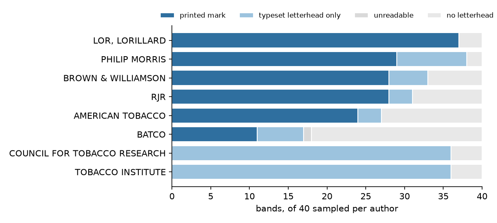
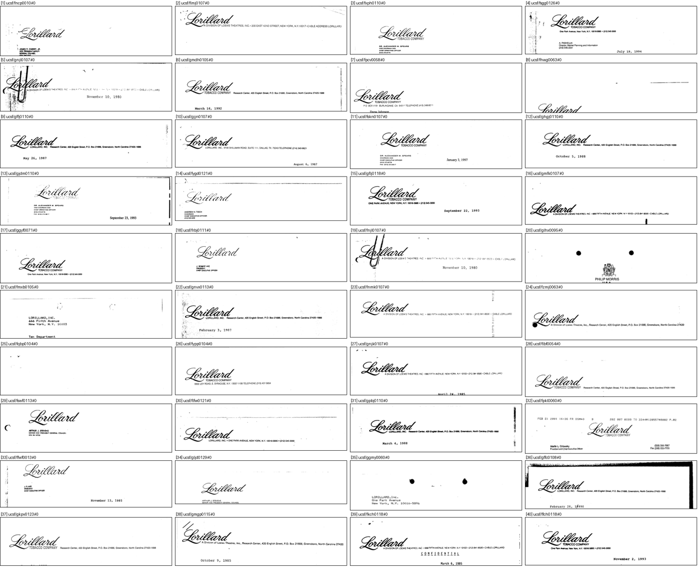
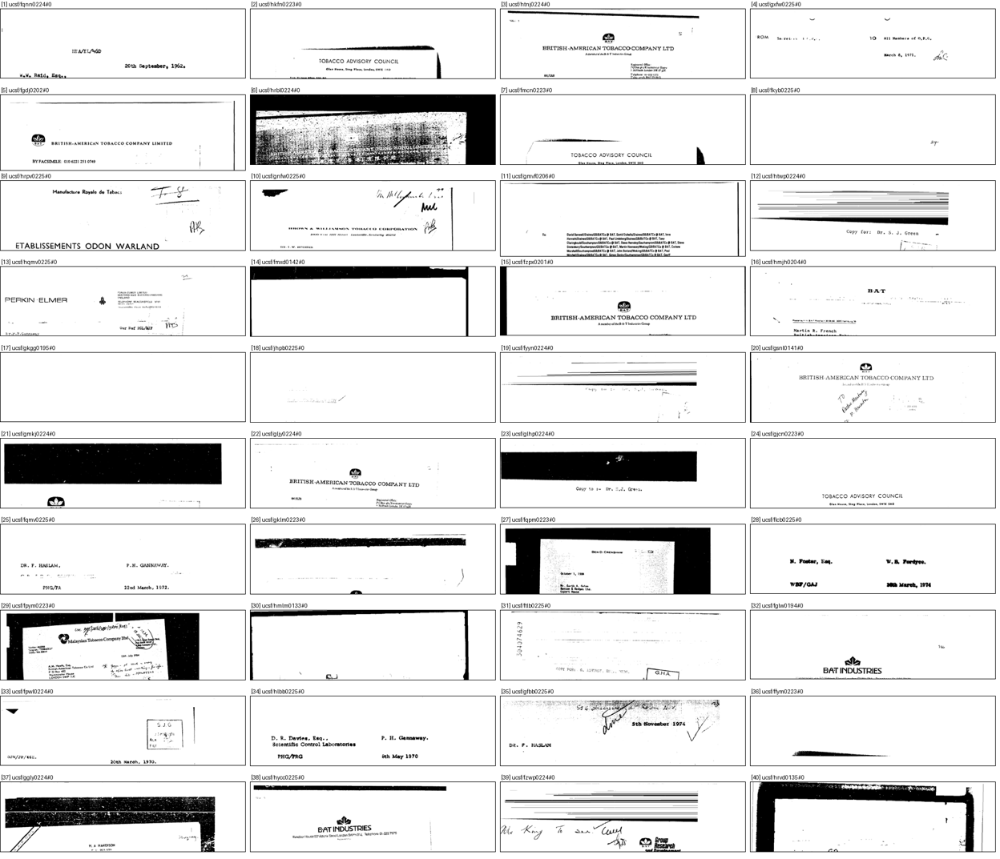

# DocMarks — do UCSF letterhead bands carry a mark? (#3901)

**2026-09-16.** The `letterhead` pass in `scripts/experiments/docmarks/README.md`
(item 6) had never run. v2 found that no `phash` threshold turns UCSF's
letterhead bands into classes, and the open question was which of two things
that means: **the bands rarely carry a mark**, so no descriptor will help and
UCSF stays distractors-only, or **the marks are there and the hash cannot see
them**, so a better descriptor (#3902) is worth building.

**Verdict: the marks are there.** Half the bands carry a printed mark, and within
an author it is usually *the same* mark again and again — Lorillard's script
wordmark is on 37 of 40 bands. What `phash` failed to separate is a pool that is,
for six of the eight authors, dominated by a handful of repeated marks. #3902 is
worth running.

## What was counted

A fixed-seed sample (`random.Random(3901)`) of **40 bands per candidate author**,
320 in all, from the 14,002 UCSF pages tagged `letterhead_author` in
`corpus.jsonl` (1,314–1,855 per author). A band is the top
`LETTERHEAD_BAND_FRAC` = 22% of the page, exactly what the build clusters.
Sheets are rendered by `scripts/experiments/docmarks/letterhead_sheets.py`;
every call, with the number it has on its sheet, is in [`calls.txt`](calls.txt),
and [`sample.json`](sample.json) maps each number back to its page.

Each band got one call:

| call | meaning | example |
|---|---|---|
| **printed mark** | a logo, device, emblem or designed wordmark | Lorillard's script *Lorillard*; the Philip Morris crest; the B&W leaf monogram |
| **typeset letterhead only** | a fixed printed heading with no artwork | *THE COUNCIL FOR TOBACCO RESEARCH–U.S.A., INC.* in engraved caps |
| **no letterhead** | blank, typed text, a memo form, a fax header, scan noise | a typed *Your ref.* line; a blank strip |
| **unreadable** | too degraded to call | one BATCO band, black with toner |

## Result

| author | printed mark | typeset only | none | unreadable |
|---|---:|---:|---:|---:|
| LOR, LORILLARD | 37 | 0 | 3 | 0 |
| PHILIP MORRIS | 29 | 9 | 2 | 0 |
| BROWN & WILLIAMSON | 28 | 5 | 7 | 0 |
| RJR | 28 | 3 | 9 | 0 |
| AMERICAN TOBACCO | 24 | 3 | 13 | 0 |
| BATCO | 11 | 6 | 22 | 1 |
| COUNCIL FOR TOBACCO RESEARCH | 0 | 36 | 4 | 0 |
| TOBACCO INSTITUTE | 0 | 36 | 4 | 0 |
| **all** | **157 (49%)** | **98 (31%)** | **64 (20%)** | **1** |

At 40 bands per author, a per-author share carries roughly ±15 percentage points
of sampling error (95%); the pooled 49% is good to about ±6.

**The marks repeat.** Grouping the printed-mark calls by eye (recorded as `R`
lines in `calls.txt`):

- **Brown & Williamson** — the old leaf-and-monogram device on 21 of 40 bands,
  plus three later B&W marks on 6 more.
- **Philip Morris** — the crest over *PHILIP MORRIS* on 26, the black *Philip
  Morris USA Research Center* block on 3.
- **RJR** — the block *RJR* on 17, the *RJReynolds* script on 7, and small
  numbers of an oval *RJR*, *Sports Marketing Enterprises* and *Winston*.
- **American Tobacco / BAT** — the chief's-head device on 6, the BAT leaf on 8,
  the *American Tobacco Company* script memo head on 5.

That is the shape a class source needs: a few marks, each with dozens of
instances in the sample and so hundreds in the pool.

## Three things the sheets showed that the count does not

**The author query leaks.** The UCSF Solr `author` match is loose.
`AMERICAN TOBACCO` returns *British* American Tobacco pages (its BAT-leaf bands
are those); a Lorillard-tagged band carries the Philip Morris crest (sheet 5,
[20]); a Tobacco Institute band carries a typeset *PHILIP MORRIS* (sheet 8, [14]).
So `letterhead_author` is a hint about the mark, not a label, which is what the
README already says about weak labels.

**Typeset letterheads are a second, separate question.** The Council for Tobacco
Research and the Tobacco Institute never use artwork, but each uses one or two
fixed printed headings on essentially every band. Those are instance-matchable
in principle, and they are also exactly what the README's `distinctive` pass
calls a *shape* rather than a mark: "find this line of engraved capitals" is a
text query in disguise. They should not be admitted by default.

**A fixed 22% band cuts marks.** A few marks sit on the band edge and are cut
(sheet 5, [8]; sheet 2, [21]), and a fifth of bands hold no letterhead at all —
some pages are continuation pages, fax covers or memos. A band is a coarse
locator, as `docmarks_config.py` says; any class built from bands still needs
the hand-drawn query crop `needs_hand_crop` already asks for.

## What this means for #3902

`phash` did not fail because the marks are absent. It failed on a pool where the
*same* mark recurs across a band whose other contents — address lines, dates,
typed references, the mark's own position — vary from letter to letter. A hash
of the whole band measures that variation. #3902's SigLIP descriptor is worth
running, and it should be judged on the six authors with printed marks; the
two typeset-only authors are a separate `distinctive` decision.

## Caveats

- **One reviewer, not countersigned.** Every call is in `calls.txt` against a
  numbered sheet, so a second pass can check any of them.
- **The sample is per author, not per page.** Pools run from 1,314 (RJR) to
  1,855 pages, so the pooled share is close to the page-weighted one, but it is
  not the same number.
- **Only the 14,002 candidate pages were sampled**, not UCSF's 197k distractor
  pages, which were pulled by industry rather than by letterhead author.

## Example sheets

Lorillard (37 of 40 printed marks), and BATCO (11 of 40), the least consistent
of the six authors with artwork:

