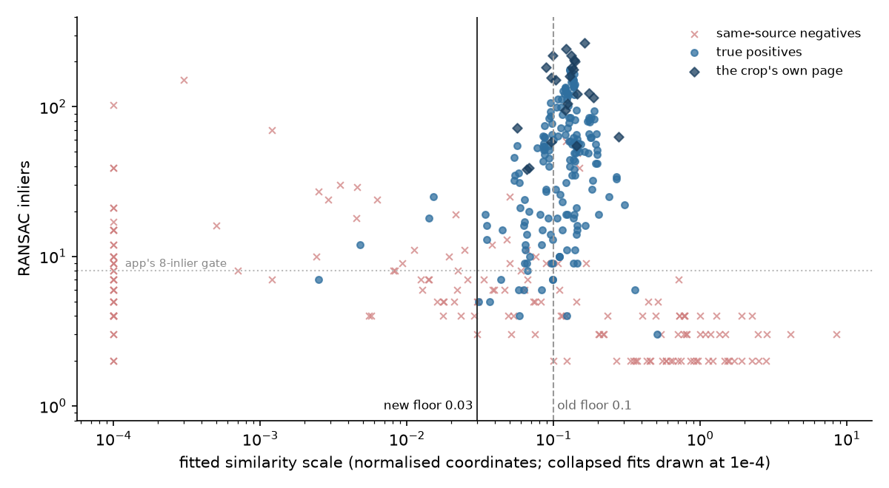
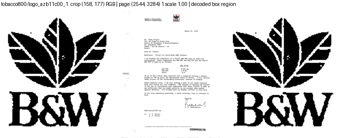

# DocMarks: why some query crops wouldn't match their own page (#3912)

**2026-09-17.** Three Tobacco800 query crops got 0 RANSAC inliers against the
page they were cut from, at every keypoint budget. A crop is that page's own
pixels, so this can't be an ordinary matching failure.

**Cause: the matcher's scale floor, not the crops.** `SiftMatcher` fits a
similarity model in normalized coordinates and rejected any fit with
`scale < 0.1`. A crop fits its own page at roughly crop width ÷ page width:
158 / 2,544 = 0.062 for `azb11c00`. **Fix: the floor is 0.03.** The SuperPoint +
LightGlue path fits through `structural_geometry.fit_model`, which imports the
same constant, so it had the same floor.

## The crops are right

For all 8 classes checked (5 failing, 3 working), `diag_crop_page.py` found the
stored crop identical to a re-cut from the raw TIFF, a decode scale of 1.0, and
the box on the mark. Every Tobacco800 page is a 1-bit Group 4 TIFF, the working
classes included.

| class | crop | page | crop w / page w | fitted scale | own page, old floor |
|---|---|---|---:|---:|---|
| `logo_azb11c00_1` | 158×177 | 2,544×3,284 | 0.062 | 0.057 | rejected |
| `logo_cgr96c00_1` | 195×223 | 2,624×3,584 | 0.074 | 0.068 | rejected |
| `logo_bqz95d00_1` | 258×277 | 2,504×3,112 | 0.10 | 0.096 | rejected |
| `logo_afm90c00-first_1_0` | 274×274 | 2,400×3,150 | 0.11 | 0.098 | rejected |
| `logo_asg54f00_1` | 206×209 | 1,728×2,292 | 0.12 | 0.10 | accepted |
| `logo_ciy01a00-page02_1_0` | 367×327 | 2,400×3,150 | 0.15 | 0.12 | accepted |
| `logo_ajj10e00_1` | 766×246 | 2,560×3,295 | 0.30 | 0.28 | accepted |

On the stored tier-`s` features the fits were there and thrown away: `bqz95d00`
38 inliers, `aeq93a00` 26, `cgr96c00` 13. `asg54f00` and `afm90c00` sit on the
line, so their smaller positives were rejected.

## Choosing the floor

`diag_scale_floor.py`: 23 classes, own page plus 8 positives and 8 same-source
negatives each, 16,384-keypoint pages, one fit per pair judged at four floors.

| floor | own page | positives with 8+ inliers | negatives with 8+ inliers | classes with positive median > 0 |
|---|---:|---:|---:|---:|
| 0.1 (old) | 16/23 | 111 (61%) | 5 (2.7%) | 15 |
| 0.05 | 23/23 | 162 (89%) | 11 (6.0%) | 22 |
| **0.03** | **23/23** | **166 (91%)** | **13 (7.1%)** | **23** |
| 0.01 | 23/23 | 168 (92%) | 18 (9.8%) | 23 |

- **Collapsed fits are what the floor catches.** They sit at scale ~0 and reach
  151 inliers (`staver/stampds-00305`, scale 0.0003). 19 negative fits with 8+
  inliers sit at exactly 0.
- **0.03 is the knee.** From 0.1 it recovers 55 positives for 8 negatives, and
  every Tobacco800 class verifies its positives (median 5–70, where 7 of 10 were
  0). `spods/stamp_00293_1` goes from 0 to 60.
- **The negatives it admits are SPODS pages at scale 0.038–0.089 with 8–25
  inliers.** Examples: `spods/00639` for `logo_00011_0` (25 at 0.050) and
  `spods/00659` for `stamp_00612_1` (13 at 0.048), against positive medians of
  46–160.

## Scope

- **No corpus change or cell rebuild.** `model_ok` is computed at verify time.
- **This does not rescue structural search on the stored cells**, which get 0–25
  of their 1,024 keypoints in the mark's box (#3911).
- **The #3904 and #3911 structural diagnostics ran under the old floor**, so
  their Tobacco800 rows understate what the matchers find; #3911 re-runs on top
  of this fix.
- **Follow-up:** a scale window in pixels needs the image size stored in
  `StructuralFeatures`, which is a cell-format change, so it goes with #3911.
- **Out of scope:** `asg54f00`'s query page has four leaf logos labelled with
  three different class ids, a roster membership question.
