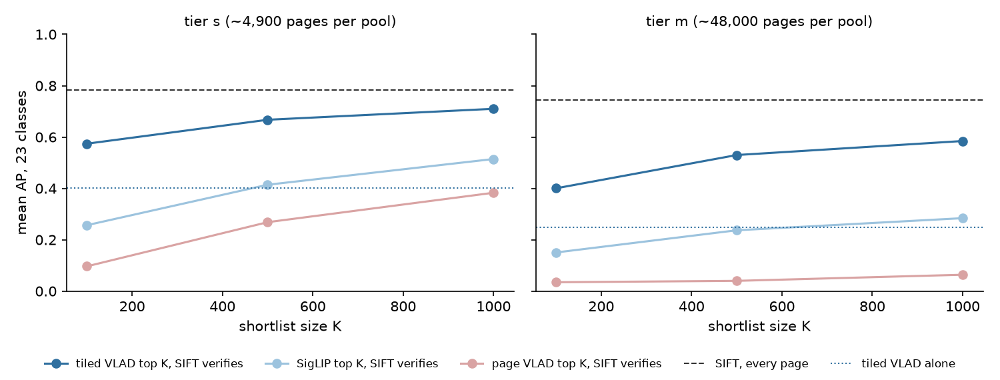

# DocMarks — tiled VLAD as the structural Stage 1 (#3928, first probe)

**2026-09-17.** #3911 showed SIFT verification ranks the roster at AP 0.78 (tier
`s`) and 0.75 (tier `m`) when every page is verified, but that nothing could
narrow the pages down first: VLAD over a whole page ranks at chance, and a SigLIP
shortlist of 1,000 keeps 0.28 at tier `m`. This probes the lever the 2026-07-13
screenshot study found — **VLAD per overlapping tile, max over tiles** — on
documents.

**Verdict: tiled VLAD is the right shape, and at K = 2% of the tier it lands just under the #3928 bar (78% of exhaustive AP, against ~80%).**

- **On its own** it ranks at **0.40 / 0.25** (tier `s` / `m`), against page VLAD
  0.029 / 0.003 and SigLIP 0.12 / 0.076.
- **As a shortlist that SIFT verifies**, it keeps **0.71 / 0.59 at K = 1,000**:
  **91% / 78% of exhaustive verification**, with K = 20% / 2% of the tier.
- **Paired against a SigLIP shortlist of the same size**, it is **+0.30 ± 0.07 at
  tier `m`, K = 1,000** (18 classes up, 3 down), and ahead at every K on both
  tiers.
- **What it does not yet do:** Tobacco800 (0.47 at tier `m`, K = 1,000, against
  0.75 exhaustive) and round SPODS stamps (0.46 against 0.61) lose the most, and
  three classes get nothing from Stage 1 at all.



## What was run

`scripts/experiments/docmarks/eval_stage1_tiles.py`, CPU only:

- **Features:** each page's SIFT features at `max_features=8192`, the #3911 knee.
- **Tiles:** split in normalised coordinates into overlapping tiles of 0.25 × 0.18
  of the page (`t4`), stride half a tile. A median page keeps 57 tiles on tier `s`
  and 50 on `m` with at least 20 keypoints.
- **Scoring:** one VLAD vector per tile against the shipped codebook, and a page
  scores the max over its tiles of the cosine with the query crop's VLAD. Workers
  return per-class scores, never the vectors.
- **Stage 2 is not re-run.** Each tiled shortlist is re-ordered by the SIFT inliers
  #3911 saved at the same tier and budget, so every number is paired class for
  class with #3911's SigLIP and page-VLAD shortlists.
- **Scale:** tier `s` on 32 CPUs in 14 min; tier `m` on 40 CPUs in 39 min.

Tier `s` also ran a coarser layout (`t3`, 0.34 × 0.25, 26 tiles/page), slightly
worse at every K (0.35 alone, 0.69 at K = 1,000). The tier-`s` run was repeated
with the per-class-score workers used for tier `m` and reproduced every number.

## Results

| tier `m` (~48,000 pages per pool) | K = 100 | 500 | 1,000 | alone |
|---|---:|---:|---:|---:|
| page VLAD → SIFT | 0.035 | 0.040 | 0.064 | 0.003 |
| SigLIP → SIFT | 0.15 | 0.24 | 0.28 | 0.076 |
| **tiled VLAD → SIFT** | **0.40** | **0.53** | **0.59** | **0.25** |
| tiled VLAD, Stage-1 recall@K | 0.42 | 0.61 | 0.69 | |
| *SIFT, every page* | | | *0.75* | |

| tier `s` (~4,900 pages per pool) | K = 100 | 500 | 1,000 | alone |
|---|---:|---:|---:|---:|
| page VLAD → SIFT | 0.098 | 0.27 | 0.38 | 0.029 |
| SigLIP → SIFT | 0.26 | 0.41 | 0.51 | 0.12 |
| **tiled VLAD → SIFT** | **0.57** | **0.67** | **0.71** | **0.40** |
| *SIFT, every page* | | | *0.78* | |

**By group, tier `m`, K = 1,000** (exhaustive in brackets): SPODS logos **0.89**
(0.98), SPODS stamps **0.46** (0.61), StaVer **0.78** (0.55), Tobacco800 **0.47**
(0.75). Tiled VLAD *alone* ranks the SPODS logos at 0.72.

**The shortlist sometimes beats exhaustive verification.**
`staver/stamp_stampds-00213_1` scores 0.10 exhaustively on tier `m` and 0.52
behind a tiled shortlist: the form box's printed confusers match SIFT but not the
tile ranking, so the shortlist keeps them out. `tobacco800/logo_asg54f00_1` is
ranked perfectly by tiled VLAD alone (1.00) and less well once SIFT re-orders it
(0.76).

**Where Stage 1 fails outright:** `spods/stamp_00612_1` (0.00 at every K),
`tobacco800/logo_cgr96c00_1` (0.00; its crop is a small binarised device with
117 SIFT keypoints) and `tobacco800/logo_aeq93a00_1` (0.02). These are Stage-1
losses: exhaustive SIFT ranks the first two at 0.44 and 0.82. Only `aeq93a00`
(0.14) is also weak for Stage 2.

## What this means for #3928's design

- **Cost.** Tiled VLAD is ~50–57 × 8,192 fp16 per page, **~0.9 MB**. That is as
  large as the local features Stage 2 needs, so a deployable version needs the
  vectors compressed. PCA or product quantisation of tile VLADs is standard, and
  was not tried here.
- **The query side is free.** One VLAD of the crop, and the page score is a max of
  dot products. This is also what the app's Stage 1 already is, per tile.
- **Tobacco800 is the weak group, and part of that is labels.** Its roster classes
  miss members (#3927), which penalises any ranker that finds the unlabelled
  copies. Its binarised fax scans also yield few keypoints per tile.
- **Not tried:** tile sizes between and below the two layouts, inverted-file
  retrieval over local descriptors, and region-level SigLIP. All three are still
  open in #3928.

## Caveats

- **One query crop per class**, 23 classes; per-group means rest on 2–11 classes.
- **Stage 2 is exhaustive-SIFT inliers restricted to the shortlist**, which is
  exactly what verifying the shortlist would compute. Timing a real shortlist
  pipeline is not measured here.
- **The headline pool (#3913) still counts Tobacco800 pages that carry a class's
  mark as negatives (#3927)**, so Tobacco800 numbers are lower bounds for every
  ranker.

## Reproduce

```
source scripts/experiments/pile/pile_env.sh
cd scripts/experiments/docmarks
# Stage-2 inliers first (#3911):
python eval_sift_rank.py --tier m --budget 8192 --out <out>/sift-m-8192
DOCMARKS_TILE_LAYOUTS=t4 python eval_stage1_tiles.py --tier m --budget 8192 \
    --inliers <out>/sift-m-8192/inliers.json --out <out>/tiles-m-8192
python docs/experiments/2026-09-17-docmarks-tiled-vlad-3928/figures.py
```
