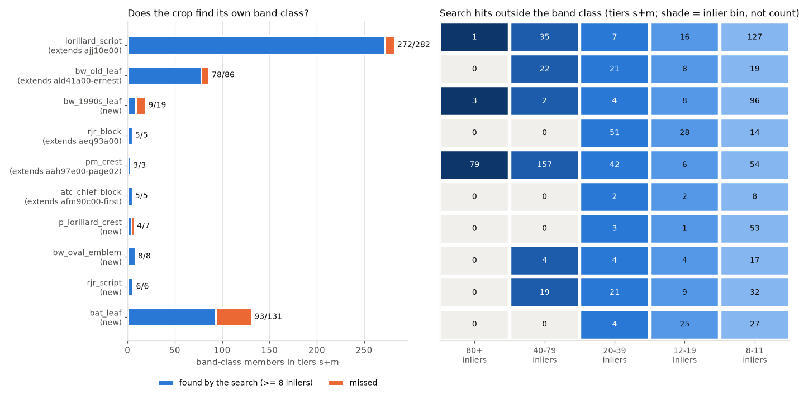
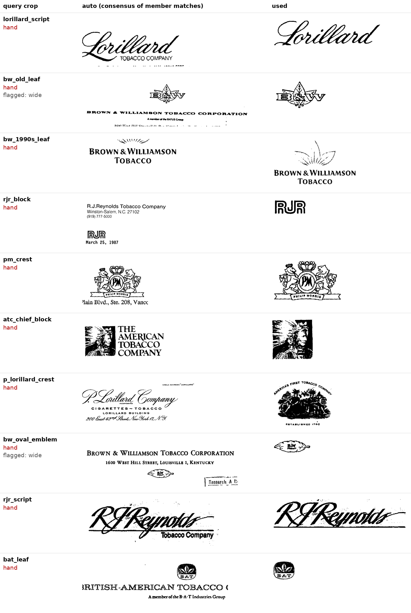
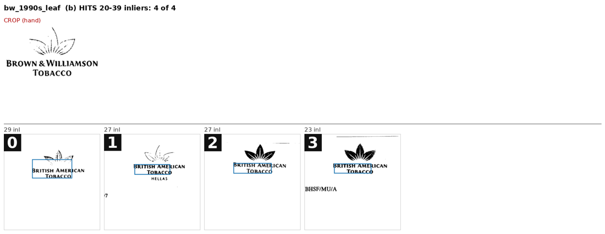

# DocMarks: UCSF band classes as roster proposals (#3921, #3922)

**2026-09-17.** #3902 found 11 SigLIP band classes that are each one printed mark
on UCSF letterheads. The roster has 23 classes: 11 SPODS, 10 Tobacco800 and 2
StaVer. This study turns those band classes into proposals an owner can rule on.
Each proposal gets a query crop, a SIFT member search over every UCSF tier
`s`/`m` page, and one-screen review sheets. **Nothing is applied to the corpus.**
The slate is `corpus/audit/ucsf_classes/`, and the first-pass answers in it are
suggestions only.

**Verdict: 10 proposals. 5 extend a Tobacco800 roster class and 5 are new.**
Checking crop against crop settles each relation. The five extensions match
their roster crops with 14–160 inliers. The five new marks match no roster
crop with more than 6 inliers. #3922 is real and runs both ways:

- **Pages the band class missed.** A band class holds only the bands SigLIP
  happened to cluster. The Philip Morris crest class has 20 bands, yet the
  search finds ~280 more crest pages in tiers `s`+`m` alone. The RJR block class
  has 20, and the search finds ~87 more.
- **Band-class pages the search missed.** Some real members are too small or
  faint to match. The BAT leaf search finds 93 of the 131 band-class members in
  `s`+`m`.

On the first pass, hits with **20+ inliers** carried the mark on 189 of 196
sheet cells. Five of the seven that did not are one ambiguous case: the BAT
letterheads under `bw_1990s_leaf`. Hits with **8–11 inliers** are mostly text,
except for the two smallest marks.

## The proposals

| proposal | band class(es) at 0.10 | relation | crop-to-crop inliers with its roster crop (best other roster crop) | band-class members in `s`+`m` the search finds | first-pass estimate, hits outside the band class that carry the mark (`s`+`m`) |
|---|---|---|---:|---:|---:|
| `lorillard_script` | LOR c1 (1,213) | **extends** `logo_ajj10e00_1` | 17 (9) | 272 / 282 | ~48 |
| `bw_old_leaf` | B&W c1 (329) | **extends** `logo_ald41a00-ernest_1` | 54 (7) | 78 / 86 | ~53 |
| `rjr_block` | RJR c3 (20) | **extends** `logo_aeq93a00_1` | 14 (4) | 5 / 5 | ~87 |
| `pm_crest` | PM c3 (20) | **extends** `logo_aah97e00-page02_1_0` | 100 (4) | 3 / 3 | ~280 |
| `atc_chief_block` | AT c3 (27) | **extends** `logo_afm90c00-first_1_0` | 160 (6) | 5 / 5 | ~8 |
| `bw_1990s_leaf` | B&W c3 (70) | **new** (uncertain) | — (5) | 9 / 19 | ~4 |
| `p_lorillard_crest` | LOR c3 (30) | **new** | — (5) | 4 / 7 | ~4 |
| `bw_oval_emblem` | B&W c4 (26) | **new** | — (5) | 8 / 8 | ~9 |
| `rjr_script` | RJR c2 (31) | **new** | — (6) | 6 / 6 | ~48 |
| `bat_leaf` | AT c1 (440) + BATCO c2 (103) | **new** | — (0) | 93 / 131 | ~56 |

The estimate is computed per (b) sheet, from `measurements/first_pass_tally.json`:
the share of the sheet accepted, times the bin's population, summed over the
proposal's (b) sheets. It is exact where the bin fits on one sheet.

`bat_leaf` merges the leaf that #3902 split across two author queries: 528
distinct pages, because 15 are in both. `bw_1990s_leaf` was listed in the
issue as a possible `azb11c00` extension. It matches that roster crop with **0**
inliers: `azb11c00` is a bold, geometric three-leaf B&W icon, a different piece
of artwork. It is proposed as new; see the owner questions below. The chief in
`atc_chief_block` faces right, as in `afm90c00`; `ciy01a00` faces left.

If every proposal is accepted, the roster becomes **28 classes: 11 SPODS,
10 Tobacco800 (5 of them spanning UCSF), 2 StaVer and 5 UCSF**.

## What was run

`scripts/experiments/docmarks/ucsf_classes.py`, driven by the committed
`ucsf_proposals.json`:

1. **crops.** Take each proposal's medoid band, SIFT-match 32 members against
   it, and keep the grid cells that at least half the verified matches put
   inliers on (`consensus_box`). A crop wider than half the band, or supported
   by fewer than 8 matches, is flagged `needs_hand_crop`. A `crop` in the
   proposal (page, box, why) overrides the auto crop, and the auto result is kept
   beside it in `crops.json`.
2. **search.** SIFT at 8,192 keypoints over the top 25% of **50,223 pages**:
   every UCSF tier `s`/`m` page (47,222), every Tobacco800 page (1,290), and
   every band-class member in tier `l`. Each band is resampled to 2,480 px wide,
   because a UCSF page is 1,240 px (150 dpi) and its marks are often under
   100 px. There are 20 queries: the 10 proposal crops and the 10 Tobacco800
   roster crops. Every proposal crop is also verified against every roster crop
   (`cross.json`). The run took 57 min on 96 CPUs, 21 min of it extraction. Four
   re-cut crops were re-verified with `--only`.
3. **slates.** `completeness.render` gained `refs`, `title`, `unboxed_label`
   and `min_context`. Each proposal gets three kinds of one-screen sheet of at
   most 18 cells, with big boxed numbers:
   - (a) *one mark?*: 18 band-class members, spread across both components for
     `bat_leaf`;
   - (b) *hits outside the band class*: one sheet per inlier bin (80+, 40–79,
     20–39, 12–19, 8–11), showing the whole bin or a random 18 from it;
   - (c) *band-class members in `s`/`m` the search missed*.

   Extensions skip Tobacco800 pages and existing roster members. The completeness
   pass (#3927) already covered Tobacco800. The slate holds **54 sheets and 10
   relation rows** in `verdicts.jsonl`.

A hit counts only if its inlier box covers at least 25% of the query's size on
that page (`plausible`). The first search showed why: RANSAC fits that collapse
onto one spot carry up to 80–150 inliers in boxes as small as 17 × 11 px, the
#3912 failure, and they rendered as blank cells. The filter dropped 48–2,500 such
fits per proposal (`collapsed_fits_dropped` in `summary.json`).

## What went wrong on the way, literally

**Every auto crop was cut again by hand (10 of 10); the flag caught 2.**
Member bands agree on the *whole printed letterhead*, not on the mark, so the
consensus box covered the mark plus its typeset name and address:

Typeset text in a query matches typeset text anywhere. Counts of pages with
8+ raw inliers, auto crop vs hand crop:

| proposal | auto crop | hand crop |
|---|---:|---:|
| `atc_chief_block` (THE AMERICAN TOBACCO COMPANY lockup vs portrait) | 4,700 | 380 |
| `lorillard_script` (with TOBACCO COMPANY and the address) | 6,000 | 2,700 |
| `rjr_script` | 2,300 | 1,100 |

One cut went too far. The `bw_1990s_leaf` leaves alone, drawn in thin lines,
found **0 of 19** band-class members, so the proposal uses leaves plus wordmark
(9 of 19). The widths flag fired only on `bw_old_leaf` and `bw_oval_emblem`.
The consensus rule is useful for *locating* the letterhead and not for cutting
the mark.

**The bottom bin is mostly text.** Among 8–11-inlier hits, the first pass
accepted:

| proposal | accepted |
|---|---:|
| `lorillard_script` | 0 / 18 |
| `pm_crest` | 0 / 18 |
| `p_lorillard_crest` | 0 / 18 |
| `bw_oval_emblem` | 0 / 17 |
| `bw_1990s_leaf` | 0 / 18 |
| `rjr_script` | 2 / 18 |
| `bw_old_leaf` | 3 / 18 |
| `atc_chief_block` | 4 / 8 |
| `rjr_block` | 8 / 14 |
| `bat_leaf` | 18 / 18 |

The small marks are the exception: the BAT roundel is ~75 px and the RJR block
~110 px. `lorillard_script`'s 12–19 sheet is a literal example: 5 of 16 are the
script, and the rest are a PHILIP MORRIS heading, email headers and handwriting.

**What the band class could not see.** `pm_crest`'s 40–79 bin holds 157 pages,
all 18 shown carry the crest, and none are in the 20-band class. They sit in
#3902's *mixed* 1,357-band Philip Morris class instead:

**Missed members are small.** Each (c) sheet shows the mark at a reduced scale
on a different letterhead layout: the B&W lockup at ~40% size, the P. Lorillard
Research Division letterhead with the crest at the far left, and the BAT
roundel at ~20 px. The search does not reach those, so the band class still
contributes pages the crop alone would miss.

## First pass (suggested answers, not rulings)

Every sheet PNG was looked at. Each `verdicts.jsonl` row carries a prefilled
`verdict` (or `relation`), `uncertain`, a `note`, and
`suggested_by: "claude first pass"`. The grammar is `all`, `none`, `0,3,7` or
`all but 3,7`, checked by `parse_verdict`; `tally()` gives the estimates. There
are **13 uncertain rows**:

- `bw_1990s_leaf` relation, (a), 40–79, 20–39 and 12–19: the leaf-spray
  question below.
- `bw_oval_emblem` relation: 26 members plus ~9 more, small for a class.
- `bw_old_leaf` (a) #4: no leaf visible at thumbnail size.
- `lorillard_script` (c): 5 of 10 marks are cut by the page edge. Is a partial
  mark an instance?
- `rjr_block` 8–11 #4 and #9: RJR in the R.J. Reynolds *International* lockup.
- `p_lorillard_crest` (a): the reduced Research Division crest.
  `p_lorillard_crest` 20–39 #1 and #2: the same engraving in other frames.
- `bat_leaf` (a) and (c): roundels too small to confirm, and 4 missed members
  with no roundel visible.

Copies are in `measurements/`: `verdicts_first_pass.jsonl`, `summary.json`,
`crops.json`, `cross.json` and `first_pass_tally.json`.

## What the owner has to decide

1. **Extend vs new.** Accept the five extensions (`ajj10e00`, `ald41a00`,
   `aeq93a00`, `aah97e00`, `afm90c00`), so that those Tobacco800 classes gain
   UCSF members, and the five new classes.
2. **`bw_1990s_leaf`: is the mark the leaf spray or the B&W lockup?** The same
   spray heads BRITISH AMERICAN TOBACCO letterheads (literal example below). If
   it is the spray, the 20–39 and 12–19 BAT hits are members and the class spans
   two companies. If it is the lockup, they are not.

   

3. **Can the search license negatives?** A UCSF-sourced class needs negatives
   from its own source, or #3913's `source_prior` shortcut returns. The search
   covered every `s`/`m` page, but a page under 8 plausible inliers is *not
   looked at*, and the (c) sheets show real members there. Options:
   - count only reviewed-and-rejected pages as known negatives;
   - treat unreviewed below-floor pages as presumed negatives;
   - keep UCSF classes out of the own-source pool.
4. **Scope of UCSF Tobacco eligibility for extended classes.** Tobacco800 classes
   currently exclude every `ucsf:Tobacco` page. Extending one means its accepted
   UCSF members become positives. Should *all* UCSF pages become eligible for
   that class, with the same negative question as 3, or only the accepted ones?
5. **Sampled bins.** A bin larger than 18 is shown as a random 18. Accepting
   `all` on such a sheet licenses the unshown pages of that bin. That applies to
   `pm_crest` 80+ (79) and 40–79 (157), `lorillard_script` 40–79 (35) and
   `rjr_block` 20–39 (51). Rule whether that is acceptable or whether those bins
   need every page shown.

**Not done here:** tier `l` was not searched, so accepted classes know nothing
about their tier `l` pages outside the band class. Nothing applies these verdicts
yet: an apply step belongs after the rulings above, because 3 and 4 decide what
it writes.
