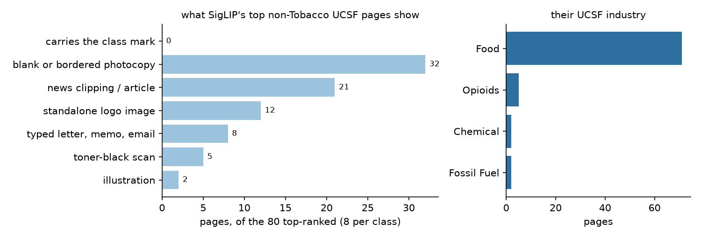
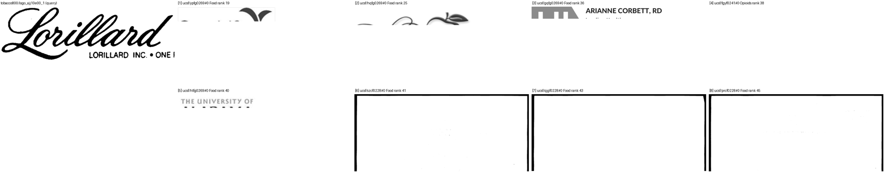
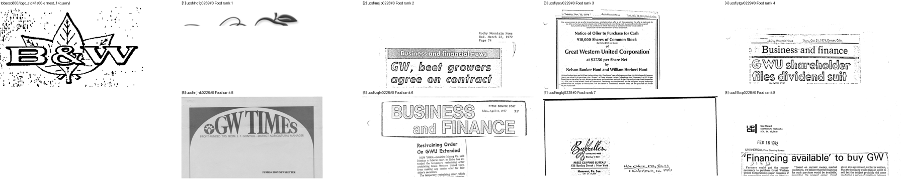
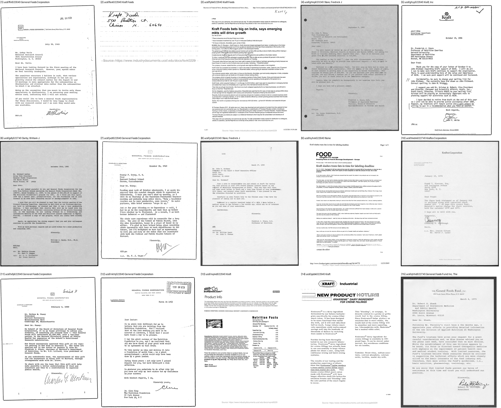

# FullMarks — do Tobacco800 marks leak into UCSF's non-Tobacco pages? (#3914)

**2026-09-17.** #3904 fixed the contamination rule to work page by page. A
Tobacco800 class is no longer scored against UCSF's *Tobacco* pages, which come
from the same IIT-CDIP archive and did carry its marks unlabelled. The rule still
scores UCSF's Food, Opioids, Chemical, Drug and Fossil Fuel pages as negatives.
`fullmarks_config.py` itself notes that "Philip Morris reaches Food through
Kraft", and RJR owned Nabisco. So a company mark could sit on a Food page with no
label, and a correct retrieval of it would be scored as wrong.

**Verdict: no leak found, and `CONTAMINATES` is left as it is.** Two independent
looks found no roster mark on a non-Tobacco UCSF page:

- **SigLIP's 80 highest-ranked non-Tobacco UCSF pages**, 8 for each of the 10
  Tobacco800 classes on tier `m`, are exactly where an unlabelled copy of the
  mark would rank. **0 of 80** carry it.
- **All 49 non-Tobacco UCSF pages in tiers `s` and `m` whose metadata names one
  of the companies** (Kraft, General Foods, Nabisco, Reynolds, Brown &
  Williamson), looked at whole. **0 of 49** carry a roster mark.



## What SigLIP ranks highest instead

For each class, `scripts/experiments/fullmarks/food_sheet.py` ranks the tier-`m`
headline pool (#3913) exactly as `eval_retrieval.py` does. It then draws the
query crop beside the eight highest-ranked UCSF non-positives from outside the
Tobacco industry, first as the top 35% of each page, then the top four as whole
pages. Every call is in [`measurements/calls.json`](measurements/calls.json).

| what the page shows | pages |
|---|---:|
| carries the class mark | **0** |
| blank or near-blank bordered photocopy | 32 |
| news clipping or article | 21 |
| a standalone logo image (CropLife, Becky Dorner & Associates, a Facebook icon, PENNSAID) | 12 |
| typed letter, memo or email | 8 |
| toner-black scan | 5 |
| illustration | 2 |

These are the ranker's confusers, not hidden positives, and they are part of why
SigLIP's AP is low:

- **Blank bordered photocopies** outrank real marks for 5 of the 10 classes.
  `logo_cgr96c00_1`'s top eight include six of them.
- **A logo-shaped query pulls in anything that is only a logo.** The *Lorillard*
  class's top five non-Tobacco pages are all standalone logo images, from ranks
  19 to 40.
- **71 of the 80 pages are Food**, although Food is only 36% of the UCSF pages in
  the pool (15,796 of 43,882) and Opioids is 61%. The Food collections are older
  paper scans, and SigLIP ranks paper texture close to a scanned mark.

The first non-Tobacco UCSF page lands at rank 1 or 2 for nine classes, and at
rank 19 for *Lorillard*, whose own positives fill most of the top of its ranking.





## The pages that name the companies

`meta_scan.py` scans `corpus.jsonl` for non-Tobacco UCSF pages in tiers `s`/`m`
whose author, collection or title matches the company names. It finds 30 matching
Philip Morris / Kraft / General Foods, 18 matching RJR / Reynolds / Nabisco, and 1
matching Brown & Williamson, all but 3 in Food. `meta_sheets.py` draws them
whole:

- **Kraft and General Foods pages carry their own marks**: the Kraft oval, the
  *GF* monogram, the *General Foods Consumer Center* banner. None carries the
  Philip Morris crest. Parent and subsidiary did not share letterhead.
- **The "Reynolds" matches are almost all people named Reynolds** (a state
  public-health officer, a Harvard fellow, a sugar-beet lobbyist), plus one
  National Biscuit Company letterhead and a press clipping about RJR.
- **The Brown & Williamson match** is a letter that mentions a B&W case study.
  There is no mark on it.



## Limits

- **SigLIP ranks what it can see.** A mark SigLIP scores poorly would not reach
  the top 8. The metadata scan is the check that does not depend on SigLIP, but
  it only reaches pages whose metadata names a company. Neither is an exhaustive
  pass over the 15,796 Food pages in the pool.
- **Tier `m` only for the ranking; `s` and `m` for the metadata scan.** Tier `l`
  adds ~50k Food pages and was not checked.
- **One reviewer, by eye**, with two sheets re-checked by a second pass. Every
  call is recorded against its sheet position.

## Reproduce

```
source scripts/experiments/pile/pile_env.sh
python scripts/experiments/fullmarks/food_sheet.py ...            # ranked sheets (see --help)
python docs/experiments/2026-09-17-fullmarks-food-3914/meta_scan.py measurements/meta_hits.json
python docs/experiments/2026-09-17-fullmarks-food-3914/meta_sheets.py measurements/meta_hits.json <out>
python docs/experiments/2026-09-17-fullmarks-food-3914/figures.py
```
