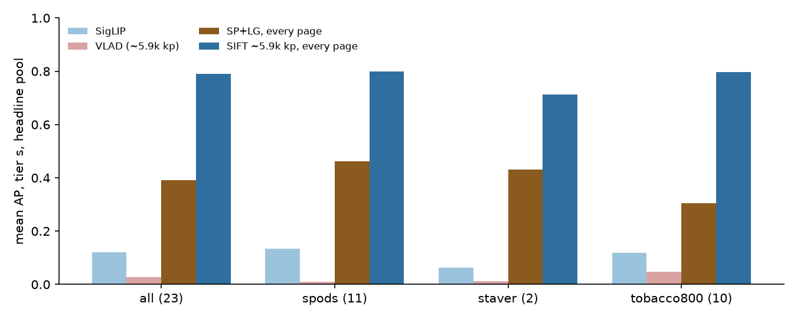
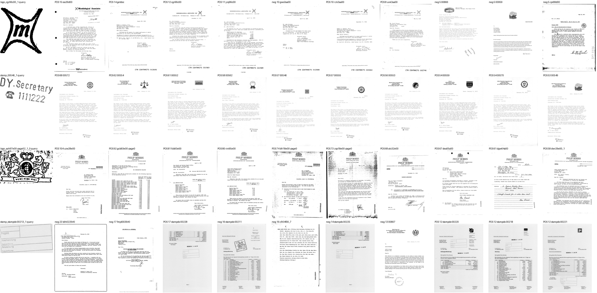
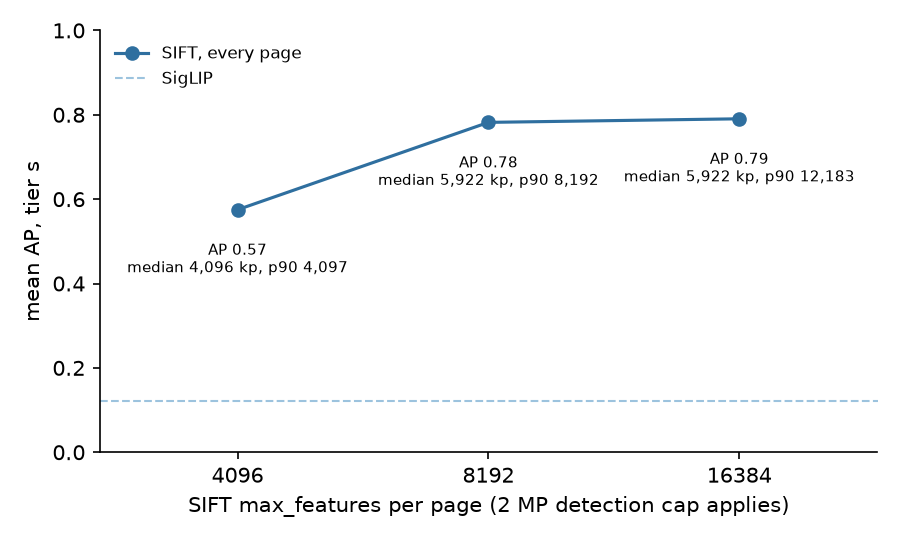
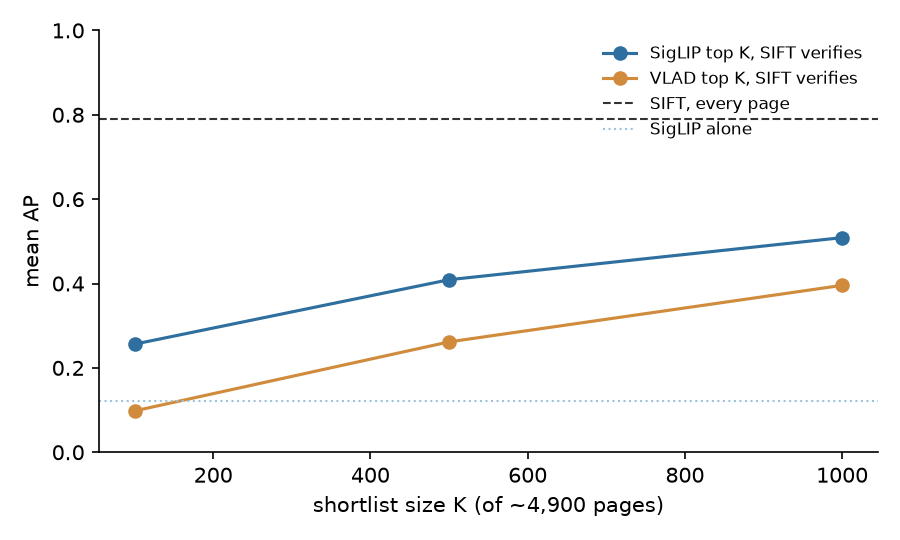
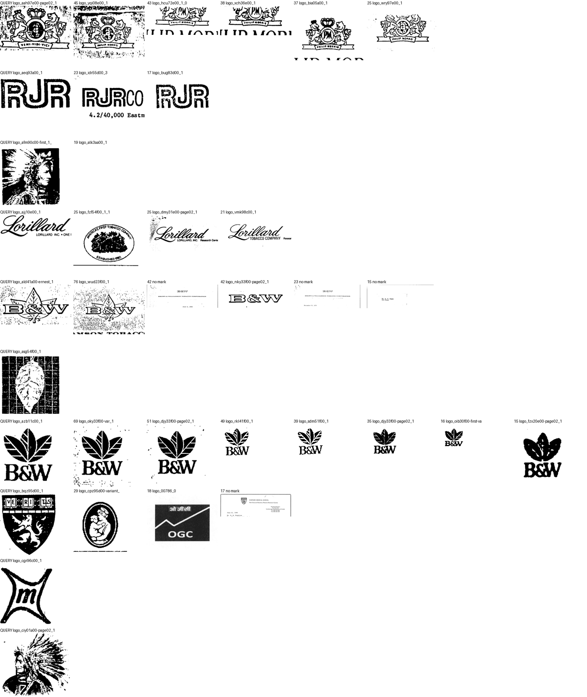

# FullMarks — why structural search was at chance, and what fixes it (#3911)

**2026-09-17.** #3904 found `sift_vlad` at chance on the FullMarks roster (VLAD AP
0.006 on tier `s`) and traced it to pages keeping only 1,024 SIFT keypoints. This
study asks what fixes it: the SuperPoint + LightGlue backend that beat SigLIP in
the 2026-07-13 study, or simply a larger SIFT budget. It then asks whether either
can be *deployed*, which is a different question.

**Findings:**

1. **The shipped SIFT matcher ranks the roster at mean AP 0.78** once a page keeps
   up to 8,192 keypoints (median 5,922 under `dev`'s 2 MP detection cap) and every
   page is verified. That is **+0.66 ± 0.06 over SigLIP (better on all 23
   classes)** and **+0.39 ± 0.07 over SuperPoint + LightGlue** (21 of 23). It
   **holds at ten times the haystack**: 0.75 on tier `m`'s ~50,000 pages (−0.04 ±
   0.02 from tier `s`), still better than SigLIP on all 23 classes. The defect #3904
   found is a budget, not the backend.
2. **8,192 is the knee.** 4,096 gives 0.57 (−0.21 ± 0.04); 16,384 gives 0.79
   (+0.01 ± 0.01, not resolved).
3. **Stage 1 is now the bottleneck.** VLAD built from the same features ranks at
   **0.029** on tier `s` and 0.003 on `m`. Verifying a SigLIP top-1,000 shortlist
   keeps 0.51 on `s` (20% of the tier) but only **0.28 on `m`** (2%). Exhaustive
   verification — ~100 s per query on 40 cores at 50,000 pages — is not an app
   design → #3928.
4. **The prerequisite was a matcher bug.** #3912 (PR #3919, merged) lowered the
   similarity-scale floor from 0.1 to 0.03; before it, every mark narrower than a
   tenth of its page failed to verify, for both backends.
5. **Looking at the top hits found a label defect.** Tobacco800 roster classes
   miss members that sit in off-roster classes or carry no box, so some "known
   negatives" are positives. This *understates* SIFT → #3927.



## What was run

All on tier `s` (5,000 pages), the 23 roster classes, the headline pool
(`own_verified`, #3913), the query crop's own page excluded — the same pools and
metrics as `eval_retrieval.py`. Each ranker scores every page in the pool:

| ranker | script | where |
|---|---|---|
| SigLIP cosine | `eval_retrieval.py` functions | the existing cell |
| SIFT inliers, every page | `eval_sift_rank.py --budget {4096,8192,16384}` | CPU, 32 workers, ~20 min |
| VLAD cosine from those features | same run | — |
| SigLIP / VLAD top K, then SIFT | same run, replayed from the saved inliers | — |
| SuperPoint + LightGlue inliers, every page | `eval_splg_rank.py --budget 2048` | one A100, ~25 min |

Pages are ranked by fitted inlier count (a failed model counts 0), ties broken by
tentative matches. Features are compacted to uint8 exactly as a cell stores them.

## 1. SIFT with enough keypoints

| group | SigLIP | VLAD | SP+LG @2,048 | **SIFT @8,192** |
|---|---:|---:|---:|---:|
| SPODS logos (5) | 0.28 | 0.02 | 0.87 | **0.98** |
| SPODS stamps (6) | 0.02 | 0.00 | 0.12 | **0.61** |
| StaVer stamps (2) | 0.06 | 0.01 | 0.43 | **0.72** |
| Tobacco800 logos (10) | 0.12 | 0.05 | 0.31 | **0.80** |
| **all (23)** | **0.12** | **0.029** | **0.39** | **0.78** |

Per class, SIFT @8,192 ranges from 1.00 (`spods/logo_00014_0`, `logo_00023_0`,
`logo_00029_0`, `staver/stampds-00230`, `tobacco800/logo_bqz95d00_1`) down to
**0.16** (`tobacco800/logo_aeq93a00_1`, the RJR block logo, whose crop carries 211
keypoints) and 0.37–0.45 for three round SPODS stamps and one StaVer form box.

**The top of the ranking is the mark, not a shortcut.** For the four classes most
likely to fool a ranker — a small binarised device, a round stamp, a crest, a
form box — the ten highest-ranked pages are:



The *DY.Secretary* stamp and the Philip Morris crest: ten of ten positives, each
carrying the mark. `cgr96c00` (the Microbiological Associates "m"): four
positives, then `gwo3aa00` at 10 inliers — which **also carries the mark** and is
labelled as another class (see §4). The StaVer form box: positives mixed with
StaVer invoices carrying other stamps in the same position.

**Why SuperPoint + LightGlue loses here, where it won on 2026-07-13:** at 2,048
keypoints on a 1,536 px page it separates logos (0.87) but not stamps (0.12), and
its features cost ~1.0 MB/page as fp16 against SIFT's ~0.83 MB as uint8. The
2026-07-13 comparison ran SIFT under the old 0.1 scale floor, which #3912 showed
rejects small marks for SIFT and SP+LG alike, and its SIFT keypoint budget is not
recorded in that report. It was very likely the production one, so that study
probably measured these two defects rather than SIFT itself; this was not
re-checked. SP+LG was not re-run at other budgets here, and the inlier
diagnostic (below) gave no sign that more keypoints fix stamps.

## 1b. Tier `m`: ten times the haystack

`eval_sift_rank.py --tier m --budget 8192`: 50,000 pages (median 5,420 keypoints,
p90 8,192, ~0.76 MB/page), 40 CPUs, 1 h 47 min — 63 min of it extraction.

| group | SigLIP | VLAD | SigLIP top-1,000 → SIFT | **SIFT, every page** |
|---|---:|---:|---:|---:|
| SPODS logos (5) | 0.16 | 0.00 | 0.47 | **0.98** |
| SPODS stamps (6) | 0.00 | 0.00 | 0.05 | **0.61** |
| StaVer stamps (2) | 0.04 | 0.00 | 0.63 | **0.55** |
| Tobacco800 logos (10) | 0.08 | 0.00 | 0.27 | **0.75** |
| **all (23)** | **0.076** | **0.003** | **0.28** | **0.75** |

**Paired, SIFT − SigLIP: +0.67 ± 0.06, better on all 23 classes.** Nine classes
lose something from `s` to `m` and none gain (−0.04 ± 0.02 overall); the two real
drops are `staver/stampds-00213_1` (0.44 → 0.10, a printed form box; the added
pages were not inspected, but ruled forms among them are the obvious suspect)
and `tobacco800/logo_asg54f00_1` (0.66 → 0.34, five positives). Every SPODS logo and stamp scores the same on both tiers to two
decimals.

**The shortlists do not scale.** At K = 1,000, SigLIP's shortlist keeps 0.51 on
`s` but 0.28 on `m`, because 1,000 pages is a tenth of the fraction; VLAD's keeps
0.064. Verification is linear in the pool: ~25 s per query at 5,000 pages on 32
cores, ~100 s at 50,000 on 40.

## 2. The budget



| `max_features` | keypoints / page (median, p90) | stored / page (median) | AP |
|---:|---|---:|---:|
| 1,024 (shipped) | 1,024 | ~0.14 MB | 0.07 (every page, old cell) |
| 4,096 | 4,096, 4,097 | ~0.58 MB | 0.57 |
| **8,192** | **5,922, 8,192** | **~0.83 MB** | **0.78** |
| 16,384 | 5,922, 12,183 | ~0.83 MB | 0.79 |

The median stops at 5,922 whatever the budget above 8,192. The likely reason is
`dev`'s 2 MP detection cap: a 300 dpi A4 page is downscaled before detection, and
the downscaled page yields no more strong keypoints.
16,384 only adds keypoints to the heaviest tenth of pages and buys nothing. At the
median, a tier-`l` cell at 8,192 is **~170 GB**, against ~34 GB today and 84 GB
free on `/expscratch/sgreenberg`; that is a real constraint for #3928's design,
and one reason a Stage 1 that avoids storing every page's full features is worth
finding.

## 3. Stage 1



(Tier `s`; tier `m` is in §1b.)

| Stage 1, top K of ~4,900 | K = 100 | 500 | 1,000 |
|---|---:|---:|---:|
| SigLIP, then SIFT verifies | 0.26 | 0.41 | 0.51 |
| VLAD (from the same 5.9k keypoints), then SIFT | 0.10 | 0.27 | 0.38 |
| *every page verified* | | | *0.78* |

VLAD stays at chance at every budget (0.013 / 0.029 / 0.027): a global average of
rootSIFT residuals over a page of text does not see a mark that is 1% of it.
SigLIP is a better Stage 1 but at K = 1,000 still loses a third of the AP, and a
fixed K is a shrinking fraction of a larger tier. Exhaustive verification costs
~25 s per query on 32 cores at 5,000 pages. Hence #3928.

## 4. A label defect the ranking surfaced

Same-source pages SIFT ranked strongly but that are labelled negative were
checked mark by mark ([`measurements/strong_negatives_sift_16384.json`](measurements/strong_negatives_sift_16384.json)):



- `tobacco800/logo_azb11c00_1` (B&W three-leaf): **seven** "negatives" carry the
  identical mark, labelled as six different off-roster classes.
- The Lorillard script, the RJR block, the B&W leaf and the Microbiological
  Associates device each have one or two; the B&W leaf and the Harvard shield also
  appear on pages with **no box at all**.
- The Philip Morris crest query ("Veni Vidi Vici") ranks five PM-monogram crest
  variants — same mark or a different version is an owner call.

The #3343 confusable pass compared roster pairs only, so a duplicate left off the
roster was never beside its roster twin, and unboxed marks are invisible to the
pipeline. SPODS shows none of this: its strong negatives are *different* round
stamps, which are the genuine confusers behind its stamps' 0.37–0.90. Filed as
#3927; until it is fixed, Tobacco800 numbers here are lower bounds.

## The inlier diagnostic that pointed here

`diag_structural.py` (extended with `DIAG_BACKEND=splg`) verifies each crop
against 8 positives and 8 same-source negatives. Classes where the positive median
is ≥ 8 inliers and above every sampled negative, after the 0.03 floor:

| group | SIFT stored 1,024 | SIFT 16,384 | SP+LG 1,024 | SP+LG 2,048 |
|---|---:|---:|---:|---:|
| SPODS logos (5) | 0 | **5** | 4 | 5 |
| SPODS stamps (6) | 0 | **5** | 2 | 2 |
| StaVer (2) | 0 | **2** | 1 | 1 |
| Tobacco800 (10) | 0 | **9** | 4 | 4 |

Measurements: [`diag_sift_inliers.json`](measurements/diag_sift_inliers.json),
[`diag_splg_inliers.json`](measurements/diag_splg_inliers.json).

## Caveats

- **Budgets, SP+LG and the diagnostics are tier `s` only**; the tier-`m` check
  (§1b) was run at 8,192 only.
- **One query crop per class.** The weakest class (`aeq93a00`, 0.16) has a
  211-keypoint crop; better crops may lift it.
- **SP+LG was run at one budget and one resize** (2,048 keypoints, 1,536 px; a
  3,072 px resize changed nothing in the diagnostic).
- **The SP+LG dependencies** (`lightglue`, `kornia`) are not in the install; they
  were loaded from a private `--no-deps` directory for this study.
- **Tobacco800 labels are incomplete** (#3927), which biases every ranker that
  finds the unlabelled copies — SIFT most.

## Follow-ups

- #3928 — a Stage 1 that retrieves marks (VLAD is at chance; SigLIP shortlists lose a third)
- #3927 — Tobacco800 roster classes miss members
- Changing the shipped `sift_vlad` budget and rebuilding cells is deliberately
  **not** done here: it multiplies cell size ~6× and is only worth it together
  with #3928's Stage 1. Tier `l`'s `sift_vlad` cell stays unbuilt until then.

## Reproduce

```
source scripts/experiments/pile/pile_env.sh
cd scripts/experiments/fullmarks
python eval_sift_rank.py --tier s --budget 8192 --out <out>/sift-s-8192          # CPU
python eval_splg_rank.py --tier s --budget 2048 --out <out>/splg-s-2048          # GPU, lightglue + kornia
DIAG_BUDGETS="stored 16384" python diag_structural.py <out>/diag_sift.json
DIAG_BACKEND=splg DIAG_BUDGETS="1024 2048" python diag_structural.py <out>/diag_splg.json
python top_sheet.py --run <out>/sift-s-16384 --classes <ids> --out top.png
python docs/experiments/2026-09-17-fullmarks-structural-3911/figures.py
```
