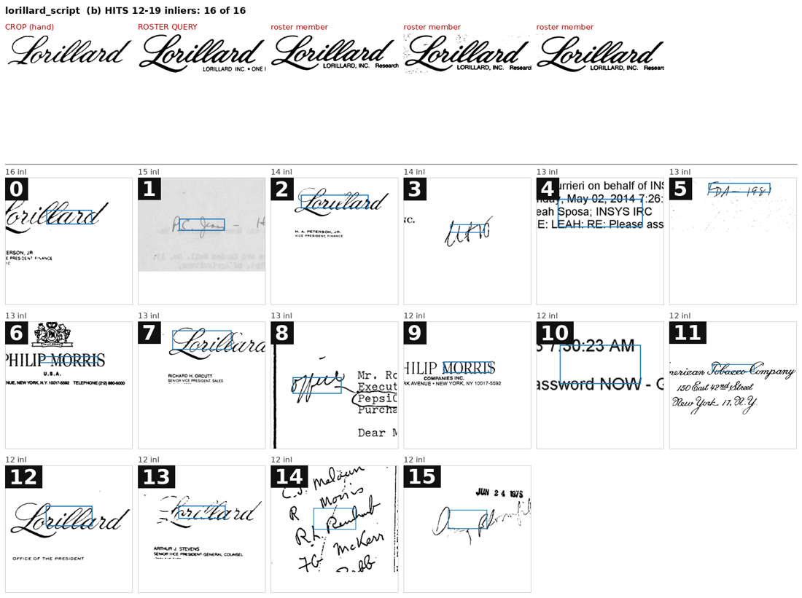
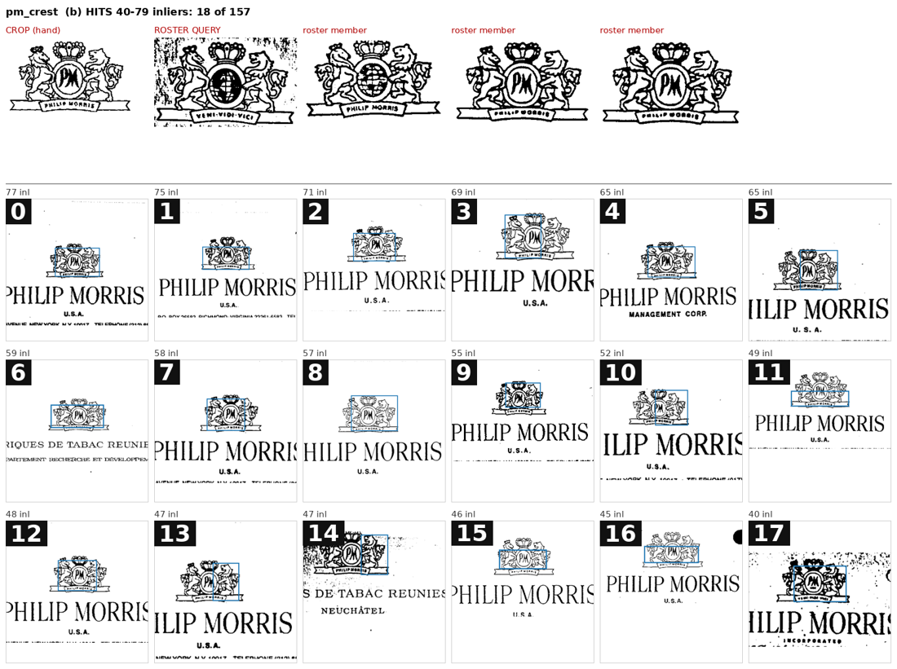

# FullMarks: UCSF band classes as roster proposals (#3921, #3922)

**2026-09-17.** #3902 found 11 SigLIP band classes that are each one printed mark
on UCSF letterheads. The roster has 23 classes: 11 SPODS, 10 Tobacco800 and 2
StaVer. This study turns those band classes into proposals an owner can rule on.
Each proposal gets a query crop, a SIFT member search over every UCSF tier
`s`/`m` page, one-screen review sheets, and an apply path.
**Nothing is applied to the corpus.** The slate is `corpus/audit/ucsf_classes/`.
Its first-pass answers are in `suggestion`, which is never applied; only an
owner's `verdict` and `relation` are.

**Verdict: 9 proposals. 5 extend a Tobacco800 roster class and 4 are new**,
after the owner dropped a tenth (`bw_1990s_leaf`, below). Checking crop against
crop settles each relation. The five extensions match their roster crops with
14–160 inliers. The new marks match no roster crop with more than 6 inliers.
#3922 is real and runs both ways:

- **Pages the band class missed.** A band class holds only the bands SigLIP
  happened to cluster. The 20-band Philip Morris crest class misses **289**
  crest pages in tiers `s`+`m` that the first pass accepted. The 20-band RJR
  block class misses **87**.
- **Band-class pages the search missed.** Some real members are too small or
  faint to match. The BAT leaf search finds 93 of 131 band-class members in
  `s`+`m`, and the first pass accepted 30 of the 38 it missed.

Every page the search put on a sheet is now shown (**1,641 cells on 118
sheets**). On the first pass, hits with **20+ inliers carried the mark on 470 of
472 cells**. Hits with **8–11 inliers carried it on 50 of 351**, and 35 of those
50 are the two smallest marks.

## The proposals

| proposal | band class(es) at 0.10 | relation | crop-to-crop inliers with its roster crop (best other roster crop) | band-class members in `s`+`m` the search finds | first pass: hit pages outside the band class that carry the mark (`s`+`m`) | instances if the first pass were applied |
|---|---|---|---:|---:|---:|---:|
| `lorillard_script` | LOR c1 (1,213) | **extends** `logo_ajj10e00_1` | 17 (9) | 272 / 282 | 49 | 396 |
| `bw_old_leaf` | B&W c1 (329) | **extends** `logo_ald41a00-ernest_1` | 54 (7) | 78 / 86 | 53 | 204 |
| `rjr_block` | RJR c3 (20) | **extends** `logo_aeq93a00_1` | 14 (4) | 5 / 5 | 87 | 119 |
| `pm_crest` | PM c3 (20) | **extends** `logo_aah97e00-page02_1_0` | 100 (4) | 3 / 3 | 289 | 370 |
| `atc_chief_block` | AT c3 (27) | **extends** `logo_afm90c00-first_1_0` | 160 (6) | 5 / 5 | 8 | 109 |
| `p_lorillard_crest` | LOR c3 (30) | **new** | — (5) | 4 / 7 | 4 (2 on Tobacco800) | 23 |
| `bw_oval_emblem` | B&W c4 (26) | **new** (uncertain: small) | — (5) | 8 / 8 | 9 | 30 |
| `rjr_script` | RJR c2 (31) | **new** | — (6) | 6 / 6 | 47 | 68 |
| `bat_leaf` | AT c1 (440) + BATCO c2 (103) | **new** | — (0) | 93 / 131 | 56 | 195 |

The "instances" column is a **simulation**. It is `apply_ucsf_classes` run in
memory with every suggestion taken as the verdict. It counts all tiers: the
band class's tier-`l` members are marks too, and an extension keeps its
Tobacco800 instances. `measurements/first_pass_tally.json` has the accepted
and shown counts per sheet part.

`bat_leaf` merges the leaf #3902 split across two author queries: 528 distinct
pages, because 15 are in both. The chief in `atc_chief_block` faces right, as in
`afm90c00`; `ciy01a00` faces left. If every proposal is accepted, the roster
becomes **27 classes: 11 SPODS, 10 Tobacco800 (5 of them spanning UCSF), 2 StaVer
and 4 UCSF**.

### Dropped: `bw_1990s_leaf`

The owner dropped it on review. It is recorded under `dropped` in
`ucsf_proposals.json` with its reason, and it gets no sheets or verdict rows.
The leaf spray over BROWN & WILLIAMSON TOBACCO also heads BRITISH AMERICAN
TOBACCO letterheads, so the proposal could not say which mark it was. It was
either the spray, spanning two companies, or the B&W lockup:

It is not `azb11c00` either: 0 inliers crop to crop against that bold
three-leaf icon. No crop found it reliably. Leaves plus wordmark reached 9 of 19
band-class members in `s`+`m`, and the thin-line leaves alone reached none.

## The owner's rulings, and what implements them

1. **Relations (extend vs new):** pending. The suggestions and uncertain flags
   stand.
2. **`bw_1990s_leaf`: dropped**, as above.
3. **UCSF negatives are reviewed-and-rejected pages only.**
   - `fullmarks_config.REVIEW_ONLY_SOURCES = {"ucsf"}`.
   - `roster.eligible_pages` never verifies a review-only source wholesale,
     even when `verified_negative_sources` names it (the `own_verified` pool
     does). It makes a class's `reviewed_negative_page_ids` known negatives in
     every pool. The unreviewed UCSF pages fall back to the contamination rule,
     which keeps them out of a UCSF class's pools.
   - Simulated `own_verified` pools for the new classes hold only the reviewed
     UCSF pages: 35–187 of them, beside ~2,800 anchor pages.
4. **Extended Tobacco800 classes take accepted and rejected UCSF pages only.**
   - The same code applies. Accepted pages become marks and positives, and
     rejected ones become reviewed negatives.
   - Every other UCSF Tobacco page is still excluded by `CONTAMINATES`, and
     UCSF's other industries are unchanged.
   - Simulated: `aah97e00` goes from 62 to 354 positives, and its pool grows by
     exactly its 292 new positives plus 6 reviewed UCSF Tobacco negatives.
5. **A verdict covers exactly the cells its sheet shows.**
   - A sampled bin is now every page of the bin, on as many one-screen sheets as
     it needs. `pm_crest` 40–79 is 9 sheets of 157 pages, and `lorillard_script`
     8–11 is 8 sheets of 127.
   - Each sheet's first page set is the old random draw, so answered sheets keep
     their cells.
   - (a) sheets likewise show every band-class member in `s`+`m`.
   - `parse_verdict` and `tally` count only named cells, and `tally` no longer
     extrapolates. An unanswered sheet leaves its pages unreviewed, which keeps
     them out of the pools under 3 and 4.

**The apply path** is `audit_to_corrections.py --task ucsf_classes --reviewer
<name> [--apply]`, through `ucsf_classes.apply_ucsf_classes`.

- **Accepted cells become marks.** Each is a new box with provenance
  `ucsf_classes`, or `ucsf_classes_band` when the search never located the mark
  and the box is the page's band. The mark goes to the target class and is
  stored in `added_marks.json` with its `class_id`.
  `completeness.replay_added_marks` now keeps the class on a UCSF page, because
  nothing clusters UCSF.
- **Rejected cells become the class's reviewed negatives,** stored in the new
  `reviewed_negatives.json`. `build_corpus.py` re-attaches the store, because a
  rebuild regenerates class metadata.
- **A new class** is added to `classes.json` with the proposal's hand crop, and
  to `roster.json`.
- **An accepted Tobacco800 cell for a new UCSF class** cannot become a mark here,
  because a Tobacco800 mark needs a must-link. Its page is recorded in
  `excluded_page_ids`, so it is in no pool rather than a negative carrying the
  mark. It is reported for `--task completeness`. The simulation hit this twice,
  on `p_lorillard_crest`: `tobacco800/ors51e00-page2-var_1` and
  `tobacco800/ukl43a00-page03_1`.
- **Refusals:** a sheet answered while its relation is blank is a problem, and
  so is an unknown roster class.

## What was run

`scripts/experiments/fullmarks/ucsf_classes.py`, driven by the committed
`ucsf_proposals.json`:

1. **crops.** Take each proposal's medoid band, SIFT-match 32 members against
   it, and keep the grid cells that at least half the verified matches put
   inliers on (`consensus_box`). A crop wider than half the band, or supported
   by fewer than 8 matches, is flagged `needs_hand_crop`. A `crop` in the
   proposal (page, box, why) overrides the auto crop, and the auto result is kept
   beside it in `crops.json`.
2. **search.** SIFT at 8,192 keypoints over the top 25% of **50,223 pages**:
   every UCSF tier `s`/`m` page (47,222), every Tobacco800 page (1,290), and
   every band-class member in tier `l`. Each band is resampled to 2,480 px wide,
   because a UCSF page is 1,240 px (150 dpi). There are 20 queries: the proposal
   crops and the 10 Tobacco800 roster crops, plus crop-to-crop checks. The run
   took 57 min on 96 CPUs. Re-cut crops were re-verified with `--only`.
3. **slates.** `completeness.render` gained `refs`, `title`, `unboxed_label`
   and `min_context`. Each proposal gets:
   - (a) *one mark?*;
   - (b) *hits outside the band class*, by inlier bin (80+, 40–79, 20–39,
     12–19, 8–11);
   - (c) *band-class members in `s`/`m` the search missed*.

   Every sheet has at most 18 cells with big boxed numbers, and every page is
   shown. Extensions skip Tobacco800 pages and existing roster members, because
   #3927's completeness pass covered Tobacco800.

A hit counts only if its inlier box covers at least 25% of the query's size on
that page (`plausible`). The first search showed why: RANSAC fits that collapse
onto one spot carry up to 80–150 inliers in boxes as small as 17 × 11 px, the
#3912 failure, and rendered as blank cells. The filter dropped 48–2,500 such fits
per proposal.

## What went wrong on the way, literally

**Every auto crop was cut again by hand (10 of 10); the flag caught 2.**
Member bands agree on the *whole printed letterhead*, not on the mark, so the
consensus box covered the mark plus its typeset name and address:

Typeset text in a query matches typeset text anywhere. Counts of pages with
8+ raw inliers, auto crop vs hand crop:

| proposal | auto crop | hand crop |
|---|---:|---:|
| `atc_chief_block` (THE AMERICAN TOBACCO COMPANY lockup vs portrait) | 4,700 | 380 |
| `lorillard_script` (with TOBACCO COMPANY and the address) | 6,000 | 2,700 |
| `rjr_script` | 2,300 | 1,100 |

The consensus rule is useful for *locating* the letterhead, not for cutting the
mark.

**The bottom bin is mostly text.** Among 8–11-inlier hits, the first pass
accepted:

| proposal | accepted |
|---|---:|
| `lorillard_script` | 1 / 127 |
| `pm_crest` | 5 / 54 |
| `p_lorillard_crest` | 0 / 53 |
| `bw_oval_emblem` | 0 / 17 |
| `rjr_script` | 2 / 32 |
| `bw_old_leaf` | 3 / 19 |
| `atc_chief_block` | 4 / 8 |
| `rjr_block` | 8 / 14 |
| `bat_leaf` | 27 / 27 |

The small marks are the exception: the BAT roundel is ~75 px and the RJR block
~110 px. `lorillard_script`'s 12–19 sheet is a literal example: 5 of 16 are the
script, and the rest are a PHILIP MORRIS heading, email headers and handwriting.

**What the band class could not see.** `pm_crest`'s 40–79 bin holds 157 pages,
and every one carries the crest. None are in the 20-band class; they sit in
#3902's *mixed* 1,357-band Philip Morris class:

**Reduced letterheads are the uncertain calls.** The (a) and (c) sheets show
marks shrunk on a narrow letterhead layout. A tiny BAT roundel over a typed
company name is visible on some and not on others at thumbnail size. Most of the
19 uncertain rows are these.

## First pass (suggested answers, not rulings)

Every sheet was looked at. Each `verdicts.jsonl` row carries:

- `suggestion` (or `suggested_relation`);
- `uncertain` and a `note`;
- `suggested_by: "claude first pass"`;
- a blank `verdict` (or `relation`) for the owner.

The grammar is `all`, `none`, `0,3,7` or `all but 3,7`, over the shown cells
only. There are **19 uncertain rows**:

- `bat_leaf`: 9 sheets of reduced letterheads, some with no roundel visible.
- `lorillard_script`: (c) has marks cut by the page edge, and one 8–11 cell has
  the script over "Lorillard Corporation".
- `bw_old_leaf` (a) #4.
- `rjr_block` 8–11: the International lockup.
- `pm_crest` 8–11: a cut crop and a degraded crop.
- `p_lorillard_crest` (a) and 20–39.
- `bw_oval_emblem` relation.

Copies are in `measurements/`: `verdicts_first_pass.jsonl`, `summary.json`,
`crops.json`, `cross.json` and `first_pass_tally.json`.

**Not done here:**
- **Tier `l` was not searched,** so accepted classes know nothing about their
  tier-`l` pages outside the band class. Under ruling 3, those pages are simply
  not in a UCSF class's pools.
- **Tobacco800 pages below the search floor remain presumed negatives** for a
  new UCSF class, because `CONTAMINATES` does not ban Tobacco800 for UCSF even
  though it is the same archive.
- **A rebuild re-derives a new class's query crop** from its largest boxed
  instance; the hand crop is not replayed.
