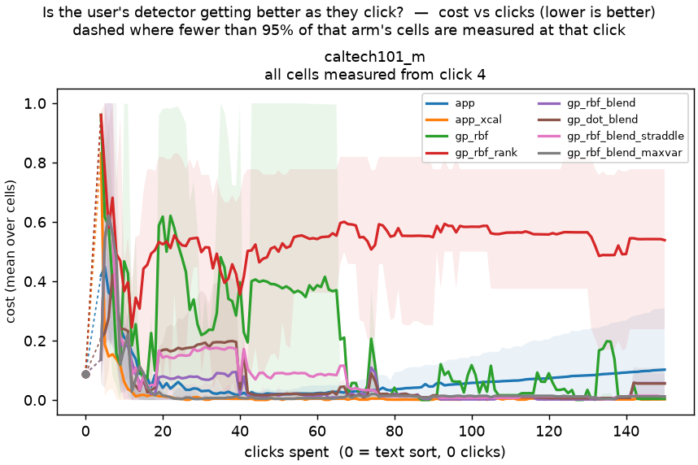
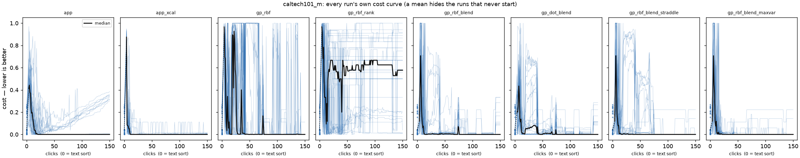

# A Gaussian-process head, conditioned on the votes — pilot (issue #3954)

**Question** (issue #3954, from a mathematically minded user): why not a Gaussian
process (GP) conditioned on the user's Good/Bad responses instead of the shipped
head? A GP gives a posterior over the whole haystack, so it answers two things
the app currently answers by other means: *how likely is this item a match*
(a calibrated probability, rather than a max-margin score squashed through a
sigmoid) and *which yes/no question is most informative next* (the posterior
spread, rather than the rank-nearest-cut Hard pick). The issue asks for the two
to be measured against the shipped algorithm on accuracy and calibration.

**What this is:** a CPU-box **pilot**, not the GRID study the question deserves.
One dataset (`caltech101_m`, SigLIP), six categories, five seeds, 150 clicks.
Its job is to build the arms into the harness, find out what breaks, and size
the follow-up — the follow-up is filed as its own issue (see the end). Every
number below is from this grid; every difference is paired on `(category,
seed)` and carries a standard error.

**Verdict — in one paragraph.** On the ranking the GP and the linear SVM are
indistinguishable here (AUROC 1.00 on every cell for every head: SigLIP
separates these six Caltech categories completely, so this dataset cannot rank
heads by ranking). On **probability calibration the GP is clearly better** from
16 labels on — Brier 0.036 vs 0.091 and ECE 0.18 vs 0.30 at 128 labels, paired
differences ten to a hundred times their standard errors — which is the one
claim the issue makes that this pilot can confirm. But **the app's threshold
machinery does not survive a GP's probabilities as they are**: the GP's score
scale moves with every refit (the marginal-likelihood fit re-scales the kernel
amplitude, and each added negative pulls the prior down), so a cut carried from
the calibration folds to the final model as a *raw score* lands under every
negative after ~20 votes and flags the whole haystack — on a ranking that is
perfect. Carrying the cut by *rank* fixes the collapse but under-admits, because
the fold models know fewer positives than the final model. The app's own
fold-less fallback (the schedule blend with a GMM on the final model's scores)
is the one shipped rule that holds. So the head question decomposes into two
that this repo already knows how to ask: the GP's calibration advantage is real
but the threshold that would let a user *see* it has to be fitted on the GP's
own haystack scores, not transferred from a re-fitted model. The
uncertainty-driven Hard picks are measured against the app's on the arms below.

**Stage B in one line:** inside the Autopilot loop no GP arm beats the plain
cross-calibrated linear SVM here (best GP arm +0.013 ± 0.004 AULC cost), the
threshold rule — not the head — decides every difference, and of the two GP
acquisition rules only max-variance is competitive, and only early. The GRID
study that could change this verdict is #3959.

## What was built

Everything is in the tree and gated by `./run-tests.sh`:

- **Two sweep trainers**, `gp_rbf` and `gp_dot`
  (`vtscore/eval/sweep_trainers.py`): scikit-learn's
  `GaussianProcessClassifier` (a latent GP with a logistic likelihood, Laplace
  approximation) on the vote embeddings. `gp_rbf` is `amplitude · RBF(ℓ)` —
  every embedding is L2-normalised, so the kernel reads `2 − 2·cos`; `gp_dot` is
  `amplitude · DotProduct(σ₀)`, a Bayesian linear classifier and the closest GP
  analogue of the shipped linear head. Hyperparameters are fitted by marginal
  likelihood (ML-II) on every call; `gp_<kernel>@ls=…,amp=…,fixed` pins them.
  Both return `(P(positive), per-item std)` like the MLP ensembles, where the
  std is the posterior standard deviation of `sigmoid(f)` under the latent
  posterior, integrated by Gauss–Hermite quadrature so it is bounded like any
  std of a `[0, 1]` variable. The latent mean and variance are read off the
  fitted estimator with the same identities sklearn's own `predict_proba` uses.
- **A `gp_*` step-trainer path** (`vtscore/eval/step_trainers.py`) for the
  Autopilot voting simulation, exposing the spread as `StepModel.predict_std`,
  and a `standalone_cut="rank"` knob on `simulate_voting_iterations` that
  carries the cross-calibration cut from the fold models to the final one by
  rank (`_rank_transferred_threshold`) instead of as a raw score.
- **Two vote-order strategies** beside `autopilot`
  (`vtscore/eval/al_strategies.py`): `autopilot_uncertainty` keeps every
  Autopilot phase and replaces the Hard pick with the level-set *straddle*
  `argmax 1.96·std − |p − cut|` at the detector's own acquisition cut;
  `autopilot_maxvar` replaces it with `argmax std`. Both refuse to run against
  a trainer that reports no spread, so the app's picks can never be attributed
  to a GP rule.
- An **`ece` column** on every label-curve row (`vtscore/eval/label_curve.py`).
- The runner, [`scripts/experiments/gp_head/`](../../../scripts/experiments/gp_head/README.md).

## Design

**Data.** `caltech101_m` (838 images, the slice the MLP-vs-SVM study ran on),
SigLIP 768-d. Six query categories spanning common → rare, chosen by even rank
over the categories with an eval query and at least 16 positives:

- `caltech101_m`: 838 medias; categories `airplanes` (228), `chandelier` (30), `starfish` (24), `laptop` (23), `flamingo` (19), `nautilus` (16)

Natural prevalence only: the slice has too few positives per category to thin
to 1% and keep a measurable test half. Five seeds. Every arm of a cell runs on
the same 50/50 simulation/test split and the same text-sort opening, so arms are
paired.

**Stage A — the head alone.** The label-curve sweep
(`run_label_curve_eval`): each estimator is given N balanced labels drawn from
the simulation half (N ∈ {8, 16, 32, 64, 128}; the sampler caps N at the
category's positives, so the larger grid points are smaller on the rarer
categories — `n_actual_mean` in the table says by how much) and scores the
held-out half. Ranking (AUROC, AP, best F1), the F1 at the cross-calibrated cut
(`f1_at_xcal`, the production threshold path), and two probability-calibration
diagnostics (Brier, ECE with ten equal-width bins). Trainers: `svm_linear` (the
standalone analogue of the shipped head), `gp_rbf`, `gp_dot`, and
`gp_rbf@fixed` (ℓ = 1, amplitude 1, no ML-II — the control for "is it the
kernel or the fit").

**Stage B — the head inside the loop.** The Autopilot voting simulation to 150
clicks, `calibrate_count=2`, the app's per-embedder calibration fraction (0.3),
inclusion 0. Eight arms:

| Arm | Trainer | Hard pick | Threshold rule |
|---|---|---|---|
| `app` | the shipped pipeline (linear-SVM head) | rank-nearest-cut | fold-anchored fusion — **the shipped detector** |
| `app_xcal` | the shipped pipeline | rank-nearest-cut | plain cross-calibration, raw score — the parity control |
| `gp_rbf` | RBF GP, ML-II | rank-nearest-cut | plain cross-calibration, raw score |
| `gp_rbf_rank` | RBF GP | rank-nearest-cut | cross-calibration carried by rank |
| `gp_rbf_blend` | RBF GP | rank-nearest-cut | the app's fold-less fallback: schedule blend of the cut with a GMM on the final model's haystack scores |
| `gp_dot_blend` | dot-product GP | rank-nearest-cut | blend |
| `gp_rbf_blend_straddle` | RBF GP | `autopilot_uncertainty` (straddle) | blend |
| `gp_rbf_blend_maxvar` | RBF GP | `autopilot_maxvar` | blend |

Why three threshold rules on one GP: the standalone arms **cannot** run the
shipped fused threshold — their fold models are not the app's head, so the
fold-anchored mixture has nothing to anchor on (`_safe_threshold_for_step`
lands them on the blend) — and the pilot's first pass found the raw cut
collapsing on the GP. `app_xcal` is the same head as `app` under a rule the GP
arms can share, so `gp_rbf − app_xcal` is the head with the rule held fixed
and `app − app_xcal` is what the shipped rule is worth on the shipped head.

**What is not here.** No rare-prevalence arm, one dataset, one embedder, no
region voting, no calibration-regret decomposition on the Stage B rows (the
harness emits the oracle cut only on the styled app path). The GRID study that
would settle the question is sized in the follow-up issue.

## Stage A — the head alone

| trainer | n_labels | auroc | average_precision | best_f1 | f1_at_xcal | brier | ece | std_mean | train_seconds | n_cells | n_actual_mean |
|---|---|---|---|---|---|---|---|---|---|---|---|
| gp_dot | 8 | 1.000 | 0.997 | 0.987 | 0.649 | 0.211 | 0.433 | 0.232 | 0.045 | 30 | 8.000 |
| gp_dot | 16 | 1.000 | 0.998 | 0.996 | 0.814 | 0.135 | 0.358 | 0.394 | 0.040 | 30 | 16.000 |
| gp_dot | 32 | 1.000 | 1.000 | 0.999 | 0.890 | 0.092 | 0.295 | 0.378 | 0.047 | 30 | 27.833 |
| gp_dot | 64 | 1.000 | 0.999 | 0.995 | 0.866 | 0.066 | 0.249 | 0.360 | 0.077 | 30 | 46.500 |
| gp_dot | 128 | 1.000 | 0.999 | 0.998 | 0.920 | 0.048 | 0.211 | 0.339 | 0.223 | 30 | 83.833 |
| gp_rbf | 8 | 1.000 | 0.997 | 0.991 | 0.683 | 0.214 | 0.448 | 0.331 | 0.052 | 30 | 8.000 |
| gp_rbf | 16 | 1.000 | 0.998 | 0.996 | 0.832 | 0.138 | 0.363 | 0.394 | 0.053 | 30 | 16.000 |
| gp_rbf | 32 | 1.000 | 1.000 | 0.999 | 0.883 | 0.088 | 0.288 | 0.370 | 0.048 | 30 | 27.833 |
| gp_rbf | 64 | 1.000 | 0.999 | 0.996 | 0.877 | 0.057 | 0.230 | 0.333 | 0.073 | 30 | 46.500 |
| gp_rbf | 128 | 1.000 | 0.999 | 0.996 | 0.923 | 0.036 | 0.179 | 0.297 | 0.161 | 30 | 83.833 |
| gp_rbf@fixed | 8 | 1.000 | 0.998 | 0.990 | 0.778 | 0.232 | 0.450 | 0.179 | 0.002 | 30 | 8.000 |
| gp_rbf@fixed | 16 | 1.000 | 0.997 | 0.994 | 0.648 | 0.209 | 0.442 | 0.166 | 0.002 | 30 | 16.000 |
| gp_rbf@fixed | 32 | 1.000 | 0.998 | 0.992 | 0.720 | 0.144 | 0.370 | 0.150 | 0.002 | 30 | 27.833 |
| gp_rbf@fixed | 64 | 1.000 | 0.998 | 0.995 | 0.768 | 0.082 | 0.275 | 0.125 | 0.004 | 30 | 46.500 |
| gp_rbf@fixed | 128 | 1.000 | 0.997 | 0.993 | 0.717 | 0.044 | 0.192 | 0.095 | 0.009 | 30 | 83.833 |
| svm_linear | 8 | 1.000 | 0.997 | 0.987 | 0.777 | 0.184 | 0.418 | nan | 0.038 | 30 | 8.000 |
| svm_linear | 16 | 1.000 | 0.998 | 0.996 | 0.790 | 0.152 | 0.382 | nan | 0.003 | 30 | 16.000 |
| svm_linear | 32 | 1.000 | 1.000 | 0.999 | 0.860 | 0.121 | 0.343 | nan | 0.003 | 30 | 27.833 |
| svm_linear | 64 | 1.000 | 0.999 | 0.997 | 0.843 | 0.106 | 0.320 | nan | 0.005 | 30 | 46.500 |
| svm_linear | 128 | 1.000 | 0.999 | 0.996 | 0.899 | 0.091 | 0.298 | nan | 0.008 | 30 | 83.833 |

Paired differences against `svm_linear` for every metric and N are in [`stage_a_paired.csv`](stage_a_paired.csv); the ones quoted below are all n = 30 cells.

Reading it:

- **Ranking cannot separate the heads here.** AUROC is 1.00 for every trainer
  at every N, AP ≥ 0.997. Whatever the GP is worth, this dataset will not show
  it in the ranking, and neither would any dataset SigLIP separates this well.
- **The GP's probabilities are better calibrated, and it is the ML-II fit that
  makes them so.** From 16 labels on, `gp_rbf` and `gp_dot` beat `svm_linear`
  on both Brier and ECE, paired differences ten to a hundred standard errors
  from zero; at 128 labels Brier 0.036 vs 0.091 and ECE 0.18 vs 0.30. At 8
  labels the GP is *worse* (ECE 0.45 vs 0.42): with three positives ML-II keeps
  the amplitude small and the GP hedges near 0.5 everywhere. `gp_rbf@fixed`
  never catches up on ECE until 64 labels and is the worst arm on `f1_at_xcal`
  at every N ≥ 16, so the fixed-kernel control rules out "any RBF would do".
- **At the production cut the GP is a little better past 16 labels and worse
  at 8.** `f1_at_xcal` favours `gp_rbf` by +0.02 to +0.04 (p ≤ 0.05 at 16, 64,
  128) and `gp_dot` by +0.02 to +0.03, and disfavours both at 8 labels (−0.09
  and −0.13). Note this is the cut applied at a *fixed* N, where the fold and
  final models differ by 30% of the labels; Stage B is where the two drift
  apart.
- ECE is high for every head, because the categories are 2–27% prevalent and a
  score that is not tiny on the negatives is wrong on most of the haystack;
  read the *differences*, not the levels.

## Stage B — the head inside the loop

The two figures every simulated-user study owes, from
[`scripts/experiments/calibration/curves.py`](../../../scripts/experiments/calibration/curves.py)
on the cell CSVs, and the interactive [`viewer.html`](viewer.html) (every arm,
category, seed and metric the run emitted; open it in a browser):

**Figure 1. Total error (cost = FPR + FNR at inclusion 0) as votes accumulate,
mean over the 30 cells per arm, inter-quartile band.** Click 0 is the text sort
each cell opened on (cost 0.088); lower and earlier is better. All 30 cells of
every arm are measured from click 4. Read the *level* of the two app arms and
the *shape* of the GP arms; do not read a mean across categories as a level any
one category experiences, and note that the band is an inter-quartile range
over cells, not a confidence interval.

**Figure 2. The same, one panel per arm, every cell as its own line, the
median in black.** This is where the mean's story is checked: `gp_rbf`'s mean
is a mixture of collapsed and perfect runs, `gp_rbf_rank`'s median sits at 0.6,
and `app`'s late rise is a handful of cells climbing steadily rather than all
of them a little.

The average-precision pair (`figures/average_precision_vs_clicks*.png`) is flat
at 1.00 for every arm from the first trainable click and is not reproduced
here.

### Budget table (mean over cells)

| arm | n_cells | cost@25 | cost@50 | cost@100 | cost@150 | fnr@50 | fnr@150 | average_precision@50 | average_precision@150 | aulc_cost |
|---|---|---|---|---|---|---|---|---|---|---|
| app | 30 | 0.049 | 0.020 | 0.058 | 0.102 | 0.000 | 0.000 | 1.000 | 1.000 | 0.059 |
| app_xcal | 30 | 0.004 | 0.005 | 0.005 | 0.003 | 0.004 | 0.000 | 1.000 | 1.000 | 0.006 |
| gp_rbf | 30 | 0.479 | 0.384 | 0.118 | 0.004 | 0.000 | 0.004 | 1.000 | 1.000 | 0.168 |
| gp_rbf_rank | 30 | 0.521 | 0.500 | 0.584 | 0.539 | 0.493 | 0.536 | 1.000 | 1.000 | 0.529 |
| gp_rbf_blend | 30 | 0.073 | 0.015 | 0.002 | 0.057 | 0.000 | 0.057 | 1.000 | 1.000 | 0.033 |
| gp_dot_blend | 30 | 0.172 | 0.019 | 0.009 | 0.056 | 0.007 | 0.056 | 1.000 | 1.000 | 0.051 |
| gp_rbf_blend_straddle | 30 | 0.151 | 0.091 | 0.007 | 0.012 | 0.006 | 0.012 | 1.000 | 1.000 | 0.059 |
| gp_rbf_blend_maxvar | 30 | 0.003 | 0.004 | 0.014 | 0.012 | 0.004 | 0.012 | 1.000 | 1.000 | 0.019 |

`aulc_cost` is the mean cost over clicks 8–150 (forward-filled). AP is 1.000 at
every budget for every arm, so every number in this table is the threshold.

### Paired differences against `app_xcal` (arm − ref, n = 30 cells)

Negative cost is better. `app_xcal` is the reference because it is the head the
app ships under the one rule every arm can share; the full grid, including the
same differences against `app`, is in [`paired.csv`](paired.csv).

| budget | metric | arm | ref | n | ref_mean | arm_mean | delta | se | wilcoxon_p |
|---|---|---|---|---|---|---|---|---|---|
| 50 | cost | app | app_xcal | 30 | 0.005 | 0.020 | 0.015 | 0.007 | 0.084 |
| 50 | cost | gp_rbf | app_xcal | 30 | 0.005 | 0.384 | 0.380 | 0.088 | 0.002 |
| 50 | cost | gp_rbf_rank | app_xcal | 30 | 0.005 | 0.500 | 0.495 | 0.061 | 0.000 |
| 50 | cost | gp_rbf_blend | app_xcal | 30 | 0.005 | 0.015 | 0.010 | 0.010 | 0.009 |
| 50 | cost | gp_dot_blend | app_xcal | 30 | 0.005 | 0.019 | 0.015 | 0.005 | 0.004 |
| 50 | cost | gp_rbf_blend_straddle | app_xcal | 30 | 0.005 | 0.091 | 0.086 | 0.034 | 0.005 |
| 50 | cost | gp_rbf_blend_maxvar | app_xcal | 30 | 0.005 | 0.004 | -0.000 | 0.000 | 0.093 |
| 150 | cost | app | app_xcal | 30 | 0.003 | 0.102 | 0.100 | 0.029 | 0.023 |
| 150 | cost | gp_rbf | app_xcal | 30 | 0.003 | 0.004 | 0.002 | 0.004 | 0.126 |
| 150 | cost | gp_rbf_rank | app_xcal | 30 | 0.003 | 0.539 | 0.536 | 0.058 | 0.000 |
| 150 | cost | gp_rbf_blend | app_xcal | 30 | 0.003 | 0.057 | 0.054 | 0.019 | 0.055 |
| 150 | cost | gp_dot_blend | app_xcal | 30 | 0.003 | 0.056 | 0.053 | 0.016 | 0.012 |
| 150 | cost | gp_rbf_blend_straddle | app_xcal | 30 | 0.003 | 0.012 | 0.010 | 0.009 | 0.209 |
| 150 | cost | gp_rbf_blend_maxvar | app_xcal | 30 | 0.003 | 0.012 | 0.010 | 0.009 | 0.209 |
| AULC | aulc_cost | app | app_xcal | 30 | 0.006 | 0.059 | 0.052 | 0.014 | 0.000 |
| AULC | aulc_cost | gp_rbf | app_xcal | 30 | 0.006 | 0.168 | 0.162 | 0.026 | 0.000 |
| AULC | aulc_cost | gp_rbf_rank | app_xcal | 30 | 0.006 | 0.529 | 0.522 | 0.046 | 0.000 |
| AULC | aulc_cost | gp_rbf_blend | app_xcal | 30 | 0.006 | 0.033 | 0.027 | 0.007 | 0.000 |
| AULC | aulc_cost | gp_dot_blend | app_xcal | 30 | 0.006 | 0.051 | 0.045 | 0.009 | 0.000 |
| AULC | aulc_cost | gp_rbf_blend_straddle | app_xcal | 30 | 0.006 | 0.059 | 0.052 | 0.017 | 0.000 |
| AULC | aulc_cost | gp_rbf_blend_maxvar | app_xcal | 30 | 0.006 | 0.019 | 0.013 | 0.004 | 0.000 |

### Cut health

Fraction of steps whose cut flagged nothing / everything in the test half, and
the per-step fit cost.

| arm | steps | flagged_nothing | flagged_everything | mean_threshold | mean_train_seconds | mean_xcal_seconds |
|---|---|---|---|---|---|---|
| app | 4410 | 0.0000 | 0.0000 | 0.4113 | 0.0077 | 0.0125 |
| app_xcal | 4410 | 0.0000 | 0.0000 | 0.4427 | 0.0082 | 0.0127 |
| gp_rbf | 4410 | 0.0005 | 0.0850 | 0.3126 | 0.0371 | 0.0449 |
| gp_rbf_rank | 4410 | 0.0351 | 0.0000 | 0.6850 | 0.0362 | 0.0996 |
| gp_rbf_blend | 4410 | 0.0093 | 0.0014 | 0.3317 | 0.0392 | 0.0411 |
| gp_dot_blend | 4410 | 0.0005 | 0.0002 | 0.3291 | 0.0259 | 0.0263 |
| gp_rbf_blend_straddle | 4410 | 0.0088 | 0.0018 | 0.3978 | 0.0386 | 0.0477 |
| gp_rbf_blend_maxvar | 4410 | 0.0100 | 0.0016 | 0.4223 | 0.0362 | 0.0490 |

### Crossover — first click at which the arm beats the zero-click text sort

| arm | dataset | baseline | final | crossover_t |
|---|---|---|---|---|
| app | caltech101_m | 0.088 | 0.102 | 15.000 |
| app_xcal | caltech101_m | 0.088 | 0.003 | 10.000 |
| gp_dot_blend | caltech101_m | 0.088 | 0.056 | 12.000 |
| gp_rbf | caltech101_m | 0.088 | 0.004 | 15.000 |
| gp_rbf_blend | caltech101_m | 0.088 | 0.057 | 13.000 |
| gp_rbf_blend_maxvar | caltech101_m | 0.088 | 0.012 | 12.000 |
| gp_rbf_blend_straddle | caltech101_m | 0.088 | 0.012 | 12.000 |
| gp_rbf_rank | caltech101_m | 0.088 | 0.539 | nan |

### Reading Stage B

- **The plain cross-calibrated linear SVM is the best arm on this dataset, and
  no GP arm beats it.** `app_xcal` holds cost ≈ 0.005 from click 10 to 150
  (AULC 0.006). Every GP arm is worse on AULC by a paired difference at least
  three times its standard error (+0.013 ± 0.004 for the best GP arm,
  `gp_rbf_blend_maxvar`; +0.027 ± 0.007 for `gp_rbf_blend`).
- **The raw cross-calibration cut collapses on the GP, then recovers.**
  `gp_rbf` flags the entire haystack on 8.5% of its steps — cost 0.48 at click
  25, 0.38 at 50, 0.12 at 100 — and only reaches `app_xcal`'s level at 150
  (0.004, not resolvable from it). Figure 2 shows the mechanism is per cell,
  not per click: a cell either sits at cost ≈ 1 for a stretch of tens of
  clicks or is perfect. The scale of the GP's probability moves between the
  fold models (fitted on 70% of the votes) and the final model, so a cut read
  off the folds' held-out scores lands under every final-model negative; as
  the votes grow the scale stabilises and the cut lands. `app_xcal` transfers
  the same cut the same way and never collapses, because the linear head's
  sigmoid scale barely moves with n.
- **Carrying the cut by rank does not repair it; it under-admits half the
  positives.** `gp_rbf_rank` sits at FNR ≈ 0.5 throughout (cost 0.50–0.58,
  never beating the text sort). The mechanism, checked by hand on
  `airplanes`: the fold cut is the conformal gap midpoint between held-out
  positives and negatives, and the held-out positives are votes Autopilot
  took from the *top* of the ranking, so they score higher under the fold model
  than the unseen positives in the haystack do. The fold cut therefore admits a
  smaller share of the haystack than the true positive share (0.50 vs 0.55 in
  the hand check, and much less on the rarer categories), and transferring
  *that share* by rank carries the fold model's blind spot onto a final model
  that does not have it. The raw transfer gets away with it because the final
  model scores the unseen positives higher than the fold cut. The knob stays in
  the harness as a measured negative; it is not a candidate.
- **The app's fold-less blend is the one rule the GP survives on, and it is
  worse than `app_xcal` at both ends.** `gp_rbf_blend` is +0.069 ± 0.034 at
  click 25 and, after matching `app_xcal` from 50 to 100, drifts to +0.054 ±
  0.019 at 150 with FNR 0.057: the blend's GMM half, fitted on the final
  model's own scores, is scale-consistent but its schedule hands weight back to
  the (raw-transferred) cut as votes accumulate. `gp_dot_blend` is the same
  story with a worse start (+0.17 at 25).
- **The uncertainty picks.** On the same GP and rule, the max-variance Hard
  pick is the best GP arm: it matches `app_xcal` for the first 50 clicks
  (−0.001 ± 0.004 at 25, ±0.000 at 50) where every other GP arm is behind, and
  ends at +0.010 ± 0.009 (not resolvable). The reason is visible in what it
  votes: the widest-posterior items are the ones farthest from every vote so
  far, which on a 3–27%-prevalent category are negatives, so the arm collects
  the Bad votes the cut needs early. The straddle pick is *not* better than
  the rank-nearest-cut pick on the same GP (AULC 0.059 vs 0.033, +0.086 ±
  0.034 at click 50): sampling at the cut in posterior-std units keeps voting
  the ambiguous band the blend's cut is already sitting in. Neither is an
  improvement over the app's own Hard pick under the shipped head, which is the
  comparison that would matter.
- **A side finding that is not this study's but is worth carrying.** The
  shipped arm `app` — fused threshold, same head as `app_xcal` — is worse than
  `app_xcal` on every budget (AULC +0.052 ± 0.014, cost +0.100 ± 0.029 at
  click 150, all of it FPR: the cut sinks as votes accumulate). This is the
  binary-voting fusion regression `docs/ML.md` already records on "an 838-image
  set, where `cap50` beats every fusion arm" — `caltech101_m` is that set — and
  [`docs/plans/population-anchored-calibration.md`](../../plans/population-anchored-calibration.md)
  owns it. It is reproduced here on the current code, five seeds, six
  categories, not filed again.
- **Cost.** A GP arm fits in ~40 ms per step plus ~45 ms for its two
  calibration folds against ~8 + 13 ms for the app's liblinear head, at n ≤
  150 votes. Runtime is not a factor at voting-session sizes.

## Follow-ups

- **#3959 — the GRID study.** Environments where the ranking can move (the
  pile's `vg_scale_*` / `coco_val` at natural and 1% prevalence, two
  embedders), and a GP-native threshold — a cut fitted on the final model's
  own haystack scores, or the fold-anchored mixture anchored on the GP's own
  fold posteriors, which needs `_safe_threshold_for_step` to accept non-torch
  fold models. Without the second, any GRID run measures the rule again.
- **Nothing ships from this pilot.** The GP arms, the `standalone_cut` knob and
  the two strategies stay in the harness as measured arms; the default arm is
  untouched (`scripts/check-eval-app-sync.py` is green with no re-pin).
