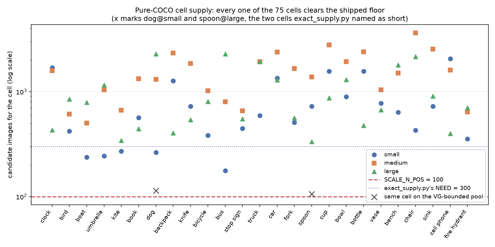
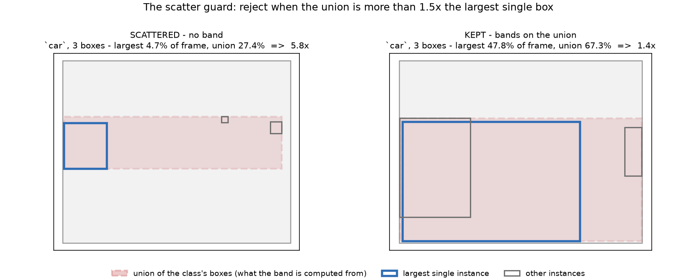

# COCO alone supplies every `vg_scale` cell (#3983)

**2026-09-18.** `vg_scale` draws its images from Visual Genome. This asks whether
it needs to: over COCO 2017 train+val, with **no VG at all**, does every
`(class, band)` cell still reach its designated positive count?

**It does, with margin.** All **75 cells** (25 classes x 3 bands) clear the
shipped `SCALE_N_POS` of 100; the thinnest is `bus@small` at **177**, 1.8x the
floor. The shared negative pool has **49,503** candidates against the 9,900 it
needs, 5.0x over-subscribed. The measurement takes ~1 minute on a laptop and
needs no pile and no GPU.

```bash
python coco_only_supply.py --annotations <dir with instances_*2017.json> --out supply.json
python figures_3983.py --supply supply.json --outdir docs/experiments/2026-09-18-coco-only-supply-3983
```

| | |
|---|---:|
| COCO 2017 train+val images | **123,287** |
| VG images, for comparison | 108,077 |
| VG∩COCO — the pool `exact_supply.py` measured | **51,497** |
| cells short of `SCALE_N_POS` = 100 | **0 of 75** |
| cells short of 300 (`exact_supply.py`'s `NEED`) | **5 of 75**, all `small` |
| thinnest cell | `bus@small`, **177** |
| shared-pool candidates (hold none of the 25) | **49,503** (need 9,900) |
| band-free supply, thinnest class | `kite`, **1,281** (`vg_scale_deep` needs 900) |

## Why this was not already known

[`exact_supply.py`](../../../scripts/experiments/pile/exact_supply.py) asked a
neighbouring question in August and is read as having answered this one. It
reported **20 of 36 shipped cells** short of 300 COCO-anchored positives, which
is the founding measurement of the 3,391-image exhaustive annotation pass (the
plan that carried it was retired by this study; see the migration plan,
[`docs/plans/vg-scale-image-source.md`](../../plans/vg-scale-image-source.md)).

It draws its candidates from `vg_source()`:

```python
paths, records, dims = vg_source()
...
coco_of = {int(m["image_id"]): int(m["coco_id"]) for m in meta if m.get("coco_id")}
```

So its "COCO half" is the **VG∩COCO overlap**, ~51,497 images — not COCO 2017,
123,287. The ~72,000 COCO images outside VG were never candidates. Their
*annotations* were already being read (`coco_anchor.ensure_sources` loads
`instances_train2017.json`); only their pixels were absent. The question asked
was *does the COCO half of VG reach*, and the answer has been read as *does COCO
reach*.

**The two measurements agree where they overlap**, which is the check that says
this one is not making a different error. On the two cells `exact_supply.py`
named, widening the pool moves supply by about the pool ratio:

| cell | VG-bounded | pure COCO | ratio | pool ratio |
|---|---:|---:|---:|---:|
| `dog@small` | 114 | **263** | 2.3x | 2.4x |
| `spoon@large` | 106 | **334** | 3.2x | 2.4x |
| `stop sign` band-free | 1,006 | **1,650** | 1.6x | 2.4x |

## The cells



The five cells below 300 are `bus@small` (177), `boat@small` (238),
`umbrella@small` (244), `dog@small` (263) and `kite@small` (270) — every one in
the `small` band, and every one between 1.8x and 2.7x the shipped floor of 100.
The 300 line is `exact_supply.py`'s threshold for the *deeper* band-free sets,
not the shipped cell size; at `SCALE_N_POS` nothing is short.

| class | small | medium | large | band-free |
|---|---:|---:|---:|---:|
| clock | 1,687 | 1,585 | 431 | 3,703 |
| bird | 420 | 610 | 852 | 1,882 |
| boat | 238 | 502 | 789 | 1,529 |
| umbrella | 244 | 1,042 | 1,156 | 2,442 |
| kite | 270 | 668 | 343 | 1,281 |
| book | 567 | 1,328 | 444 | 2,339 |
| dog | 263 | 1,314 | 2,283 | 3,860 |
| backpack | 1,265 | 2,339 | 404 | 4,008 |
| knife | 724 | 1,852 | 539 | 3,115 |
| bicycle | 384 | 1,023 | 808 | 2,215 |
| bus | **177** | 802 | 2,285 | 3,264 |
| stop sign | 445 | 656 | 549 | 1,650 |
| truck | 592 | 1,931 | 1,925 | 4,448 |
| car | 1,341 | 2,379 | 1,289 | 5,009 |
| fork | 510 | 1,661 | 560 | 2,731 |
| spoon | 724 | 1,385 | 334 | 2,443 |
| cup | 1,568 | 2,795 | 874 | 5,237 |
| bowl | 894 | 1,931 | 1,302 | 4,127 |
| bottle | 1,564 | 2,401 | 477 | 4,442 |
| vase | 774 | 1,039 | 671 | 2,484 |
| bench | 636 | 1,506 | 1,790 | 3,932 |
| chair | 430 | 3,636 | 2,156 | 6,222 |
| sink | 727 | 2,549 | 904 | 4,180 |
| cell phone | 2,064 | 1,611 | 400 | 4,075 |
| fire hydrant | 355 | 642 | 704 | 1,701 |

## The class axis roughly doubles

At the shipped floor, **54 of COCO's 80 classes** clear 100 in all three bands —
**29 beyond the current 25**. At 300 it is 26 classes, 6 of them new (`person`,
`handbag`, `tie`, `surfboard`, `skis`, `tennis racket`).

That matters because #3588 measured VG's ceiling and found it low: most of the
classes it proposed failed on small-band supply, and #3603 closed with *the easy
end of the context axis cannot be widened from VG*. Re-measured on COCO, that
finding splits cleanly in two:

| class | VG small-band | COCO small-band | at 100/band |
|---|---:|---:|---|
| `giraffe` | 14 | 3 | still short |
| `elephant` | 20 | 11 | still short |
| `zebra` | 27 | 14 | still short |
| `train` | 34 | 15 | still short |
| `cat` | 44 | 44 | still short |
| `airplane` | 85 | **129** | clears |
| `suitcase` | 54 | **182** | clears |
| `handbag` | 21 | **1,357** | clears |
| `potted plant` | 1 | **299** | clears |
| `traffic light` | 58 | **745** | clears |
| `motorcycle` | *alias of* `bike` | **183** | clears |
| `surfboard` | *alias of* `board` | **444** | clears |
| `skateboard` | *alias of* `board` | **235** | clears |
| `snowboard` | *alias of* `board` | **253** | clears |

**#3603's structural claim survives, and this is independent confirmation of
it.** The scene-exclusive animals and vehicles fail the small band on COCO too,
several of them *worse* than on VG — `giraffe` has 3 small-band images in all of
COCO against 14 in VG. That is the photography, exactly as #3603 argued: a class
that owns its scene is photographed filling the frame. No image source fixes it.

**What does change is everything VG blocked for vocabulary reasons.** The four
classes VG could not carry because free text collapsed them onto `bike` and
`board` are ordinary COCO classes with ordinary supply. `potted plant` went from
**1** small-band image in all of VG to 299. `traffic light` was additionally
barred by `scale_study_exclusion` because its head noun `light` is not an object;
COCO's vocabulary has no head nouns to exclude.

## What is inside a COCO class, and why that is not the review problem

Choosing a class list raised a second question: **which classes have boundaries
that are cheap to pin down?** The review programme's expensive moments were
definitional — COCO annotates magazines as `book` (#3612), landlines split
`cell phone`, planters split `vase` (#3784) — so it looked as though picking
classes with tidier boundaries would buy a lot.

Two instruments were tried.

**Box collision inside COCO measures nothing, and cannot.** The natural first
probe is `scan_name_overlap.py`'s: how often do two classes box the same pixels?
Run over COCO it separates nothing — the eight classes whose definitions actually
broke in review average **3.32%** collision against **3.43%** for all 80. That is
not a weak signal, it is a structural zero: COCO's vocabulary is curated and
disjoint, so an annotator records one label and no disagreement. The instrument
worked on VG only because free text let two annotators write two names on one
object. **Definitional ambiguity is invisible from inside COCO by construction.**

**A finer vocabulary with written definitions does see it.** LVIS re-annotated
COCO's images with 1,203 WordNet synsets, so matching COCO boxes to LVIS boxes
(mutual best match, IoU ≥ 0.7) reports what each COCO class is made of —
[`coco_class_purity.py`](../../../scripts/experiments/pile/coco_class_purity.py):

| COCO class | purity | LVIS dominant | what else is in there |
|---|---:|---|---|
| `truck` | 38% | `truck` | `car_(automobile)` **17%**, `pickup_truck` 16%, `trailer_truck` 8% |
| `cup` | 39% | `glass_(drink_container)` | `cup` 28%, `mug` 17% |
| `bottle` | 42% | `bottle` | `wine_bottle` 18%, `water_bottle` 9%, `beer_bottle` 7% |
| `chair` | 66% | `chair` | `armchair` 11%, `deck_chair` 8%, `stool` 5% |
| `book` | **85%** | `book` | `magazine` **6%**, `notebook` 2% |
| `cell phone` | **89%** | `cellular_telephone` | `telephone` **4%**, `camera` 3% |
| `knife` | **93%** | `knife` | `handle` 3%, `spatula` 2% |
| `bench` | **93%** | `bench` | `table` 2%, `desk` 1% |
| `fire hydrant` | **100%** | `fireplug` | — |

**And that is the finding: heterogeneity is not what made review painful.** Every
class whose review actually split is *homogeneous* — `book` 85% pure with
magazines at 6%, `cell phone` 89% with landlines at 4%, `knife` 93%, `bench` 93%.
The mean separation (74.1% for the eight against 82.8% overall) is carried
entirely by `cup`, `bottle` and `chair`, and those three are not the ones that
split a reviewer.

What splits reviewers is **an unwritten rule meeting a minority case**, and a 4%
minority does it as surely as a 40% one: the reviewer hits a landline, has
nothing to consult, and decides. So a purity threshold would select the wrong
classes. Read the **name list** instead — it is exactly the text
`SCALE_CLASS_RULES` needs, and it costs a minute per class against a review pass.

### The signal that does select: the scatter rate

A third number is worth more than either for *choosing* classes, and has nothing
to do with definitions.

A band is a claim about **how big the object is**, and `band_for` computes it
from the **union** of a class's boxes in an image — because the union is what one
Good vote drags in the app. That works while the instances sit together, and
stops meaning anything when they do not: three cars strung across a street have a
union box spanning the street, which is not the size of any car in it. So the
rule rejects the image when the union exceeds the largest single box by more than
`BAND_MAX_INFLATION` = 1.5:

```python
union = (ux1 - ux0) * (uy1 - uy0) / area      # bounding box of ALL the class's boxes
largest = max((b[2] - b[0]) * (b[3] - b[1]) for b in boxes) / area
if union > largest * pc.BAND_MAX_INFLATION:
    return SCATTERED                          # excluded from every band of this class
```



Both images above hold **three cars**. On the left the largest is 4.7% of the
frame and the union is 27.4% — **5.8x**, so the union describes the spread rather
than a car, and the image is dropped. On the right the cars overlap: largest
47.8%, union 67.3%, **1.4x**, so the union still describes a car and the image
bands as `large`.

**Scatter is about spread, not about count.** Five cars parked bumper to bumper
pass; two at opposite corners do not. That is why it is measured per image rather
than per class.

It costs three things, and all of them are the pain the review programme felt:

- **Supply.** A scattered image is excluded from *every* band of that class, so a
  high-scatter class discards most of its own candidates before banding.
- **Legibility.** The images it rejects are exactly the ones whose review render
  carries a dozen boxes, which is what made slates hard to read (#3976).
- **Meaning.** Where it *doesn't* fire but nearly does, the band rests on a union
  a user would not have dragged.

Measured over COCO for the current *C* and the shortlist:

| high scatter | | low scatter | |
|---|---:|---|---:|
| `car` | 59% | `fire hydrant` | 5% |
| `book` | 58% | `microwave` | 6% |
| `chair` | 52% | `stop sign` | 8% |
| `bottle` | 50% | `frisbee` | 11% |
| `boat` | 49% | `sink` | 13% |
| `cup` | 45% | `dog` | 13% |
| `kite` | 45% | `baseball bat` | 15% |
| `bird` | 43% | `mouse` | 15% |

`car` discards 59% of its images; `fire hydrant` 5%. That is a real, measured
difference in what a class costs to build and to review, and unlike purity it
points the same way as every other consideration.

One genuine boundary contest does fall out of the table, and it is actionable:
**17% of COCO `truck` boxes are objects LVIS calls `car_(automobile)`**, while
only 2% of `car` boxes are trucks. Both are in *C*, so the two classes are
contesting the same objects asymmetrically — #3588 added `truck` beside `car`
precisely as a same-scene partner, and this says the pair is partly a relabelling
of one population rather than two.

## Method, and what it is not

The band rule is **imported, not restated** —
[`coco_only_supply.py`](../../../scripts/experiments/pile/coco_only_supply.py)
calls `pilebuild.loaders.vg_scale.band_for`, for the reason that function's own
docstring gives: a second copy of the rule would answer a supply question with
its own drift. `BOX_BANDS`, the compact-union statistic and the
`BAND_MAX_INFLATION` scatter guard therefore apply exactly as the builder
applies them.

Two deliberate choices, both stricter than the builder needs to be:

* **`iscrowd` regions are dropped.** A crowd box is a region, not an instance, so
  admitting one would let a single annotation band an image by an extent no user
  would drag. VG has no equivalent concept, so this has no counterpart upstream
  and makes the COCO counts *conservative*.
* **Nothing else is filtered.** `scale_study_exclusion` exists to keep VG's free
  text (parts, places, polysemous bare names) out of a band. COCO's vocabulary is
  curated and disjoint, so it has nothing to reject.

**This is a census, not an eval.** It counts candidates the builder would
consider; it does not build cells, embed anything, or measure a detector. Three
things it therefore does not establish:

* **That the resulting benchmark is as *hard*.** Supply is not difficulty. The
  `anchor_to_coco` docstring asserts that dropping VG's non-COCO half loses
  "VG's non-COCO diversity for nothing", and that claim remains unmeasured — it
  is about the distribution of the images, not their count. It is now the only
  live argument for VG, and it is cheap to settle with
  `provenance_probe.py`/`provenance_shortcut.py`, which already read provenance
  off the vectors.
* **That the migration is free.** New images need vectors; corrections, roster
  pins and `human_record` labelsets are keyed to VG image ids.
* **That COCO's definitions are ours.** COCO annotates magazines as `book`, which
  is what split `book`'s review (#3612). Under pure COCO that stops being a
  disagreement to repair and becomes a definition the study inherits — which is
  cheaper, but is a change in what the class *means*, not just in where its
  images come from. `SCALE_CLASS_RULES` keeps its job of writing that down.

## Consequences

The retired exhaustive-annotation plan existed to answer the off-COCO half by
hand: 3,391 images, one exhaustive 25-way judgement each. Its premise was the
`exact_supply.py` reading above. With the pool unbounded by VG the debt is not
answered but **absent** — there is no off-COCO half — and with it go the name
tables, the two-search candidate hunt, pooled adjudication,
`pool_contamination.py`, the `provable`/`matched` composition switch (#3702),
#3655's global ambiguous exclusion and #3659's silent un-banding. Every one of
those exists to substitute inference for an answer VG cannot give.

The cost already sunk is the measure of what that is worth: **4,709 correction
rows** and **5,904 human judgements**, against a source whose recall over *C* is
0.61 and whose boxes sit on a smaller instance than the frame's main one 8.3% of
the time (#3924, #3925).
