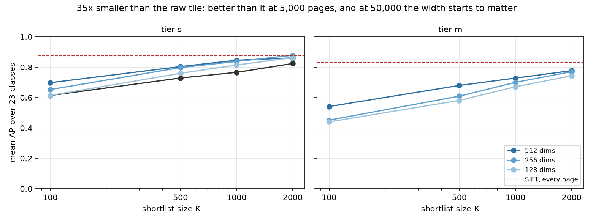
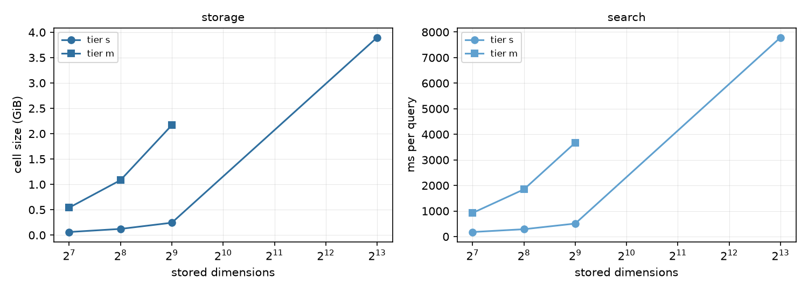

# DocMarks — a cached Stage 1, and what compressing it costs (#3928)

**2026-09-18.** #3928's probe established the shape of DocMarks' Stage 1:
max-over-tiles VLAD ranks the roster where a page-level vector ranks at chance,
and the top 1,000 it hands SIFT keep most of exhaustive verification. It did
that by recomputing every tile from the page images on each run, which is what
made it a probe rather than a stage — tier `m` cost 39 minutes of 40 CPUs to
answer 23 queries, and tier `l`, the 200,000-page tier the corpus was built for,
could not be searched at all.

This builds the stage: a cell stores the tiles once, and a query becomes a
matmul.

**Verdict: the stage is affordable, the compression that makes it affordable is
not a loss, and how narrow you can go depends on how many pages you search.** A
whitened PCA to 256 dimensions stores 23 KiB per page instead of 818 KiB —
**35x smaller** — and at tier `s` ranks *above* the raw 8,192-dimensional tile it
replaces at every shortlist size (AP 0.84 against 0.77 at K = 1,000). At tier `m`,
ten times the pages, **the widths separate and 512 is the one to keep** (0.73
against 0.70 at K = 1,000). Tier `l` becomes a **4.4 GiB** cell at 256 dims or
8.8 GiB at 512, against 156 GiB raw.

**One tier-`s` claim does not survive scale, and is corrected below**: at 5,000
pages, 256 dims matches verifying every page at K = 2,000 (0.879 against 0.876);
at 50,000 pages it does not (0.770 against 0.832, 93%).



## The obstacle is storage, and the arithmetic says so before anything is built

A tile VLAD is 64 x 128 = 8,192 dimensions and ~64 tiles survive a page, so at
fp16 a page costs 818 KiB (measured, tier `s`). Projected to `D` dimensions it
costs `D` x 2 x 64 bytes:

Tier `s` and tier `m` are both measured; tier `l` extrapolates from tier `m`'s
bytes per page, which is the honest base because its pages carry fewer tiles
(median 50 against 57) than the small tier's:

| stored width | KiB/page, tier `s` | KiB/page, tier `m` | tier `s` (5,000) | tier `m` (50,000) | tier `l` (200,000) |
|---|---:|---:|---:|---:|---:|
| 8,192 (raw) | 818 | *not built* | 3.90 GiB | *39 GiB* | *156 GiB* |
| 512 | 51.6 | 45.9 | 0.25 GiB | **2.17 GiB** | 8.8 GiB |
| 256 | 26.1 | 23.2 | 0.12 GiB | **1.08 GiB** | **4.4 GiB** |
| 128 | 13.3 | 11.8 | 0.06 GiB | **0.54 GiB** | 2.2 GiB |

156 GiB was never available: `/expscratch` had 249 GB free on the night this
ran, with a concurrent `coco_quarry` embed wanting ~36 GB of it. So the question
was never whether to compress, only how far — and that is a measurement.

## What was built

`stage1_cell.py` writes one cell per width in a single pass over the pages:

- **Tiles** are the layout #3928 measured as the better of two: 0.25 x 0.18 of a
  page in normalised coordinates, stride half a tile, keeping tiles with at
  least 20 keypoints. The geometry is pinned against the probe by a test, because
  the probe owns the published numbers.
- **The projection** is a PCA with whitening, fitted on ~20,000 tiles sampled
  from 400 pages and applied to every tile. Whitening scales each component by
  its own standard deviation, so the first `D` rows of a wider fit *are* the
  `D`-wide fit — which is why one pass writes every width, and a test pins it.
- **Rows are L2-normalised after projection**, so a stored dot product is a
  cosine and a page score is a segment max (`numpy.maximum.reduceat`) over one
  matmul.
- **Stage 2 is replayed, not re-run**: each shortlist is re-ordered by the SIFT
  inliers `eval_sift_rank.py` saved at the same tier and budget, which is exactly
  what verifying that shortlist would compute.

## Results, tier `s` (5,000 pages, 23 roster classes, v3.1 corpus)

| stored width | alone | K = 100 | K = 500 | K = 1,000 | K = 2,000 | recall@1,000 |
|---|---:|---:|---:|---:|---:|---:|
| 8,192 (raw) | 0.43 | 0.61 | 0.73 | 0.77 | 0.82 | 0.83 |
| **512** | **0.54** | **0.70** | **0.80** | **0.85** | 0.86 | **0.93** |
| **256** | 0.48 | 0.65 | 0.80 | 0.84 | **0.88** | 0.92 |
| 128 | 0.44 | 0.61 | 0.76 | 0.81 | 0.86 | 0.89 |
| *SIFT, every page* | | | | *0.88* | *0.88* | |

**The projection is not a compromise; it is an improvement.** Every projected
width beats the raw tile it compresses, at every K. At 512 dimensions the gain is
+0.08 AP at K = 1,000 (0.85 against 0.77) for 16x less storage. This is the
known effect of whitening on VLAD — the raw descriptor is dominated by
co-occurrence directions shared by every document page, and dividing each
component by its own spread stops those directions deciding the cosine.

**At K = 2,000, 256 dimensions matches verifying every page** (0.879 against
0.876), while looking at 40% of the tier.

### Where it fails, literally

- **`tobacco800/logo_cgr96c00_1`**: exhaustive SIFT 0.89, shortlisted 0.25,
  Stage-1 recall@1,000 **0.25**, Stage 1 alone **0.00**. Its query crop is a
  small binarised device with 117 SIFT keypoints — too few for a tile vector to
  describe. The probe found the same class at 0.00; nothing here fixes it.
- **`tobacco800/logo_aah97e00-page02_1_0`**: exhaustive 1.00, shortlisted 0.50,
  recall **0.48**. This is the Philip Morris class whose members carry two
  different crests — the globe and the PM monogram — which the owner ruled one
  mark on 2026-09-17. One query crop can only match one of them, so half the
  members never enter the shortlist. This is the case multiple query crops
  (#3949) exist for, and it is measurable evidence for that pass rather than a
  Stage-1 defect.
- **`tobacco800/logo_ald41a00-ernest_1`**: exhaustive 0.97 against 0.88.

### Where the projection rescues a class the raw tile lost

- **`spods/stamp_00612_1`**: raw **0.01** -> 256 dims **0.62**, against 0.54 for
  exhaustive SIFT. The raw tile vectors ranked this class at chance; whitening
  makes it findable.
- **`spods/stamp_00293_1`**: 0.57 -> 0.94. **`tobacco800/logo_bqz95d00_1`**:
  0.89 -> 1.00. **`logo_ajj10e00_1`**: 0.82 -> 0.98.

### Where a shortlist beats verifying everything

Four classes score higher behind the shortlist than under exhaustive SIFT:
`staver/stamp_stampds-00213_1` (0.53 -> 0.65), `spods/stamp_00612_1` (0.54 ->
0.62), `tobacco800/logo_aeq93a00_1` (0.34 -> 0.44) and `logo_asg54f00_1` (0.66
-> 0.76). The probe saw the same effect: printed confusers that match SIFT do
not match the tile ranking, so the shortlist keeps them out.

## Results, tier `m` (50,000 pages, the same 23 classes)

| stored width | alone | K = 100 | K = 500 | K = 1,000 | K = 2,000 | recall@1,000 |
|---|---:|---:|---:|---:|---:|---:|
| **512** | **0.38** | **0.54** | **0.68** | **0.73** | **0.78** | **0.78** |
| 256 | 0.30 | 0.45 | 0.61 | 0.70 | 0.77 | 0.74 |
| 128 | 0.26 | 0.44 | 0.58 | 0.67 | 0.74 | 0.71 |
| *SIFT, every page* | | | | *0.83* | *0.83* | |

**Ten times the pages separates the widths.** At tier `s`, 512 and 256
dimensions were within 0.01 AP of each other at K = 1,000 and the narrower cell
looked free. At tier `m` the gap is 0.03 at K = 1,000 and **0.09 on the Stage-1
ranking alone** (0.38 against 0.30) — a larger pool gives a narrow projection
more ways to be wrong, and the wider cell earns its 2x storage. **512 dimensions
is the width to build at tier `l`.**

**No raw arm was built at tier `m`** — 39 GiB for a baseline is not a good use of
the filesystem — so the "projection beats raw" result above is a tier-`s` result
and is not claimed at scale. What tier `m` shows is the *shape* of the
width-sensitivity, and it points the same way: retained dimensions matter more as
the pool grows.

**By source, 512 dims at K = 1,000** (exhaustive in brackets): SPODS **0.87**
(0.91), StaVer **0.86** (0.56), Tobacco800 **0.55** (0.80). Tobacco800 is the weak
group at scale, exactly as the probe found, and its roster classes are the ones
still missing members (#3927), which penalises any ranker that finds the
unlabelled copies.

**StaVer is where a shortlist beats verifying everything, by a lot.**
`staver/stamp_stampds-00213_1` scores **0.12** under exhaustive SIFT and **0.73**
behind the shortlist: the form box's printed confusers match SIFT but not the
tile ranking, so Stage 1 keeps them out of Stage 2's reach.
`tobacco800/logo_asg54f00_1` does the same (0.34 -> 0.73).

**The two Stage-1 losses are the same two classes as at tier `s`, and worse.**
`tobacco800/logo_cgr96c00_1` is **0.00 with recall 0.00** — its 117-keypoint crop
is invisible to a tile vector at any scale — and the two-crest
`tobacco800/logo_aah97e00-page02_1_0` falls from 1.00 exhaustive to **0.26**
(recall 0.26), against 0.50 at tier `s`. A single query crop that matches one of
two crests loses more members the more pages there are to rank, which is
quantified evidence for the multiple-query-crops pass (#3949).

One class prefers the narrower cell: `tobacco800/logo_ald41a00-ernest_1` scores
0.33 at 512 dims and 0.71 at 256. With 23 classes and one crop each, a per-class
reversal of that size is within the noise this design can resolve; it is recorded
rather than explained.

## Cost



| stored width | tier `s` cell | tier `s` search | tier `m` cell | tier `m` search |
|---|---:|---:|---:|---:|
| 8,192 (raw) | 3.90 GiB | **7,790 ms/query** | *not built* | |
| 512 | 0.25 GiB | 509 ms/query | 2.17 GiB | 3,672 ms/query |
| 256 | 0.12 GiB | **288 ms/query** | 1.08 GiB | **1,847 ms/query** |
| 128 | 0.06 GiB | 179 ms/query | 0.54 GiB | 926 ms/query |

Search scales **sub-linearly** with pages: ten times the pages costs 6.4x the
time at 256 dims (288 ms -> 1,847 ms), because a bigger matmul uses the machine
better. Loading a cell is 2 s at tier `m` and would be ~8 s at tier `l`, paid
once per process rather than per query.

Search is one matmul plus a segment max, single-threaded, over the whole tier.
Against it, exhaustive SIFT verification is ~100 s per query at 50,000 pages
(#3911), so the cached stage answers in under a third of a second what
verification needs minutes for — and the raw cell is 27x slower than the
projected one for a worse ranking.

### The build was 10x slower than it should be, and the cause was not what it looked like

The first tier-`m` build ran at **1.05 pages/s** — 13 h for the tier, against a
4 h walltime — and the obvious suspect was the payload, since the tier-`s` build
had shipped the raw 818 KiB tile matrix back from every worker. That guess was
wrong: tier `m` built *only* projected widths, 91 KiB per page, and was **slower
than the tier-`s` build that carried the raw width** (1.66 pages/s).

The cause is **BLAS thread oversubscription**. Each worker projects a
(tiles x 8,192) matrix, which is large enough for OpenBLAS to go multi-threaded,
so 40 pool workers each started ~40 threads: 1,600 threads over 40 cores. The
probe never hit it because its per-page matmul is (64 x 8,192) @ (8,192 x 23),
too small to trigger threading.

Pinning `OMP_NUM_THREADS=1` in the launcher — one BLAS thread per worker —
took the same build to **11.3 pages/s, a 9.7x speedup**, and `stage1_cell.py`
now warns when the variable is unset:

| tier-`m` build, 40 CPUs | rate | 50,000 pages |
|---|---:|---:|
| BLAS threads unpinned | 1.05 pages/s | 13.2 h (killed) |
| `OMP_NUM_THREADS=1` | **11.3 pages/s** | **74 min** |

At that rate tier `l` is **~5 h on 40 CPUs**, or an hour sharded four ways with
`--projection` reusing one fit — the flag exists so shards stay comparable, since
two shards projected by two different fits are not one cell.

**The PCA fit is a smaller cost than it first appeared**: 4 min 8 s measured
(sample pass included) with BLAS threads available, rising to ~16 min when
threads are pinned for the pool's sake. It is paid once per tier, and a
randomised SVD would remove even that; it was not tried here.

## Is tier `l` searchable now?

**On storage and search, yes — and the width question now has an answer.** From
tier `m`'s measured bytes per page, tier `l` is **4.4 GiB at 256 dims** or **8.8
GiB at 512**, and tier `m`'s measured search time scales to roughly **7 s per
query at 256 dims and 15 s at 512**, single-threaded, before any sharding. Given
how the widths separated at tier `m`, **512 is the width to build**: 8.8 GiB is
affordable and the narrower cell is measurably worse at scale.

Building it costs **~4.5 h of 40 CPUs** at the 12.4 pages/s this build sustained
once BLAS threads were pinned, and `--projection` lets that be sharded across
several jobs while keeping one fit, which is what makes the shards one cell.

**On labels, not yet.** Nothing can report end-to-end AP at tier `l`, because
Stage 2 has never been run exhaustively there — that is the cost this stage
exists to avoid. What *is* measurable without it is Stage-1 recall@K against the
known members, and `eval_stage1_cell.py` reports exactly that when `--inliers` is
omitted. Building and measuring it is the natural next step, at ~2.7 h of 40 CPUs
and 5 GiB.

## Caveats

- **The corpus moved under the comparison.** These numbers are on the **v3.1**
  corpus (721 instances; the completeness pass added 108 members on 2026-09-17),
  where the probe ran on the pre-completeness corpus. Exhaustive SIFT scores 0.88
  here against 0.78 then, and the raw arm scores 0.43 alone against the probe's
  0.40. **Compare within this report, not across to #3928's table.**
- **One query crop per class**, 23 classes, and per-source means rest on 2-11
  classes. The reviewed extra crops (#3949) are not countersigned yet, so
  averaging over them would report a number nobody has approved.
- **No raw arm at tier `m`**, so "the projection beats the raw tile" is measured
  at tier `s` only.
- **The headline pool still counts Tobacco800 pages carrying a class's mark as
  negatives** (#3927), so Tobacco800 rows are lower bounds for every ranker.
- **Tile coverage stops half a tile short of the bottom edge** (the last window
  ends at 0.99 of the page height). A mark in that strip is seen only through the
  window overlapping it. This is the probe's geometry, kept deliberately so the
  numbers stay comparable, and pinned by a test.

## Reproduce

```
source scripts/experiments/pile/pile_env.sh
export OMP_NUM_THREADS=1        # see the build-cost section; without it this is 10x slower
cd scripts/experiments/docmarks
python stage1_cell.py build --tier s --dims 0,512,256,128 --workers 40 --out <dir>/tier-s
python stage1_cell.py build --tier m --dims 512,256,128 --workers 40 --out <dir>/tier-m
python eval_stage1_cell.py --tier s \
    --cells <dir>/tier-s/raw,<dir>/tier-s/d512,<dir>/tier-s/d256,<dir>/tier-s/d128 \
    --inliers <sift run>/inliers.json --out <dir>/eval-s
python docs/experiments/2026-09-18-docmarks-stage1-3928/figures.py
```
