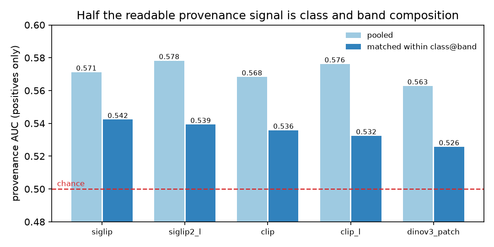
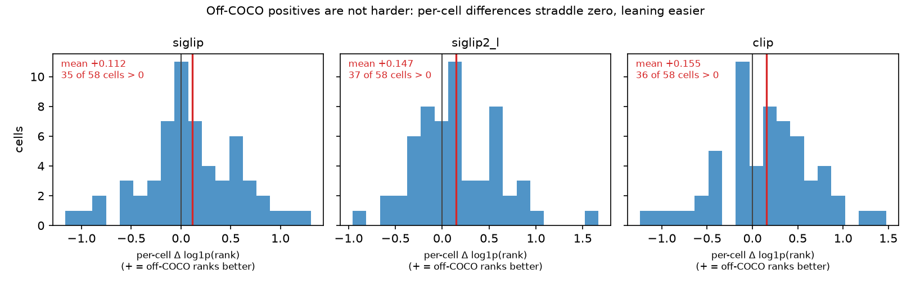

# The VG diversity claim, settled: off-COCO is differently distributed but not harder (#3997)

**2026-09-18.** `anchor_to_coco` says that dropping Visual Genome's non-COCO half
loses "VG's non-COCO diversity for nothing". The
[`coco_quarry` plan](../../plans/coco-quarry.md) names settling that claim as the
item that runs **first**, because it is the only live argument for keeping VG and
the only one that could still change the migration decision.

**It does not survive.** Off-COCO images are *distinguishable* from COCO ones at
matched band and class — but only just, at AUC **0.53–0.54** against a chance of
0.50 — and they are **not harder** for the shipped head. On every statistic, on
every embedder, the point estimate runs the other way: off-COCO positives rank
slightly *better*. The plan's disposition for a null result applies.

| | |
|---|---:|
| positives in the pooled `vg_scale` cell | 5,237 |
| of those, off-COCO (`coco_scored` false) | **2,887 (55%)** |
| provenance AUC, positives pooled | 0.56–0.58 |
| provenance AUC, **matched within `class@band`** | **0.53–0.54** |
| hardness, off-COCO − COCO, Δ log1p(rank) | **+0.11 to +0.16** (+ = easier) |
| cells where off-COCO ranks better | **34–37 of 58** |

## The instrument was reading the wrong partition

`provenance_probe.py` predicted `labels_exhaustive` and called it "COCO-sourced".
The loader sets two flags and documents them as different claims, at the point
where it sets them:

> `labels_exhaustive` is also set by a human looking at ONE class; this says COCO
> answered for all eighty at once

So `labels_exhaustive` is true for *a COCO image **or** an image a human
reviewed*. On today's cell that puts **2,138 reviewed-but-off-COCO positives on
COCO's side — 41% of all positives**. The gap widened after #3926 folded 4,709
corrections into `exhaustive`; when #3670 first ran the probe it was smaller, so
the old number was defensible when taken and is not now.

| partition | `labels_exhaustive` | `coco_scored` |
|---|---:|---:|
| positives (5,237) | 4,488 (86%) | **2,350 (45%)** |
| negative pool (10,900) | 10,900 (100%) | 10,900 (100%) |

Two further corrections follow from the same table. The **pool must be excluded**:
it is 100% COCO while positives are 55% off-COCO, so a probe run over the whole
cell scores positive-versus-negative under a provenance heading and reads 0.85.
And **composition must be matched away**: off-COCO supply runs from 4 to 82 per
cell, so class and band are themselves readable as provenance.



Matching halves the signal. What is left is small and consistent across five
embedders — `dinov3_patch` lowest at 0.53, `siglip` highest at 0.54. Draw-to-draw
variation is about ±0.005, so the spread between embedders is not a ranking.

**Per-cell fits are not usable at this supply.** 35 cells clear 25 per arm and
their AUCs run 0.22 to 0.75, straddling chance in both directions — the signature
of no signal at n=25 per arm, not of some classes differing more than others.
`bicycle` lands top-4 on all three single-vector embedders, which is the only
pattern worth a second look and is not evidence on its own.

## Readable is not harder

The claim is about difficulty, so the second half asks the shipped head —
`vtscore.training.svm.fit_linear_svm_head`, the production linear SVM, not a
stand-in. Per `class@band` cell: 5-fold over the cell's positives, fit against
half the shared negative pool, then score held-out positives against the other
half and record where each lands in that ranking. Class and band are constant
inside a cell, so the contrast is matched by construction; cells are averaged with
equal weight so a well-supplied cell cannot dominate. 58 cells clear 10 per arm.

**The statistic decides what you can see.** The obvious one — the fraction of the
pool a positive outranks — **saturates**: most positives sit between 0.85 and
1.00, so a difference living at the top of the ranking is compressed against the
ceiling and the answer reads as a flat nothing (+0.000 to +0.006, within ~1 se).
Re-aggregating the *same fits* on statistics that do not saturate shows what was
hidden there.

`+` means off-COCO ranks **better**. 58 cells, paired per cell:

| statistic | siglip | siglip2_l | clip |
|---|---:|---:|---:|
| percentile *(saturates)* | +0.003 ± 0.004 | +0.000 ± 0.004 | +0.006 ± 0.003 |
| **log1p(rank above)** | **+0.11 ± 0.06** | **+0.15 ± 0.06** | **+0.15 ± 0.07** |
| **share in the pool's top 1%** | **+0.018 ± 0.013** | **+0.027 ± 0.012** | **+0.026 ± 0.016** |
| median rank above | +4.1 ± 2.6 | +8.0 ± 3.6 | +11 ± 5.6 |



There is no direction here in which off-COCO is harder. The effect is small —
about 2 se on `log1p` for `siglip2_l` and `clip`, less for `siglip` — but it is
consistent, and it is the opposite of what the docstring asserts. Do not lean on
`median rank above`: its standard errors are 2.6–11, the noisiest of the four.

The individual cells make the size concrete (`siglip`; the other two agree in
shape). `bird@small` is the widest: COCO
positives outrank 0.82 of the pool against off-COCO's 0.91. `bench@small` is
0.85 against 0.92, `boat@small` 0.95 against 0.98. Against those,
`bench@large` runs the other way at 0.96 against 0.93, and `bird@medium` at 0.98
against 0.95. That is the distribution the histogram shows: a lean, not a
separation.

## Two confounds, and why only one of them is dealt with

**Label quality, which the verified arm bounds.** Off-COCO positives never got
COCO's adjudication: VG's recall over *C* is 0.61, and 8.3% of its boxes sit on a
smaller instance than the frame's main one (#3924, #3925). "Off-COCO scores
lower" would be equally consistent with more of them being mislabelled. #3926's
pass verified positives by hand, so the `verified` arm restricts off-COCO to
(image, class) pairs a human confirmed. It is *larger*, not smaller:

| statistic | siglip | siglip2_l | clip |
|---|---:|---:|---:|
| percentile | +0.017 ± 0.006 | +0.013 ± 0.005 | +0.013 ± 0.007 |
| log1p(rank above) | +0.26 ± 0.15 | +0.31 ± 0.12 | +0.25 ± 0.16 |

31 cells, sign counts 25-6, 26-4 and 21-10. The gap between this arm and the
unrestricted one is a plausible size for the label noise.

**Visibility selection, which it introduces.** #3926 verified by asking a human
*is this class present*, so its survivors are conditioned on a human having been
able to **see** the object — which selects for clear instances. The COCO arm gets
no equivalent filter, and COCO annotates small and occluded instances a reviewer
might well have called absent. So the verified arm is **not** "label noise
removed, true difficulty revealed"; it bounds how much of the effect is labelling,
and the unrestricted arm is the one that answers the plan's question. Reporting
only the verified arm would have overstated the result by roughly 2x.

## What this settles, and what it does not

- **The difficulty argument for keeping VG is gone.** No statistic makes off-COCO
  harder; several make it slightly easier. The `anchor_to_coco` docstring claim
  should come out with the loader it describes.
- **The distributional finding is real but small.** If a VG arm is kept it has to
  be argued on 0.53–0.54 of matched AUC and named as a *contrast*, not defended as
  extra difficulty.
- **#3670 and #3702's composition argument cites the old number.** Those
  conclusions were reached on a partition that mixed reviewed images into the COCO
  side; `provenance_shortcut.py`'s docstring quotes "AUC 0.53–0.56" from it. The
  corrected matched figure lands in the same range by coincidence, so the
  conclusions are not overturned — but they now rest on a measurement that was
  re-derived rather than on the one they cite.
- **Scope.** This is ranking difficulty for the production linear head on
  whole-image embeddings against the shared pool. It says nothing about region
  voting, about the acquisition trajectory, or about patch embedders — the probe
  covers `dinov3_patch`, the hardness run does not, and region scoring is a
  different instrument that would want its own.

## Reproducing

```bash
python scripts/experiments/pile/provenance_probe.py provenance_probe.json
python scripts/experiments/pile/provenance_hardness.py --out provenance_hardness.json
python scripts/experiments/pile/provenance_hardness.py --aggregate --out provenance_hardness.json
python scripts/experiments/pile/figures_3997.py --probe provenance_probe.json \
    --hardness provenance_hardness.json --outdir docs/experiments/2026-09-18-vg-diversity-3997
```

The probe is a few minutes; the hardness run is ~35 minutes on a `cpu` node
(`--mem=64G`), fitting 3 embedders x 58 cells x 5 folds. Per-image ranks are
stored, so `--aggregate` re-reads them under a different statistic without
refitting anything — which is how the ceiling problem was found and fixed after
the fits had already run.
