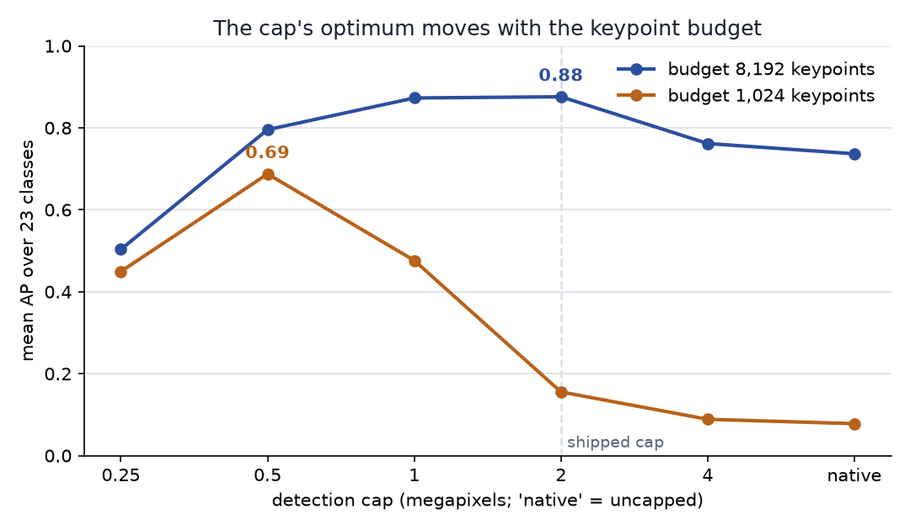
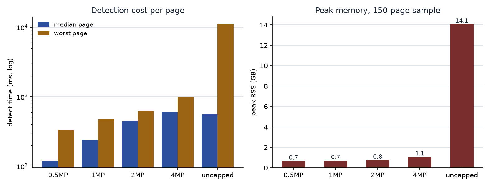

# DocMarks — pinning the detection cap on retrieval, not on a synthetic warp (#3908)

**2026-09-19.** #3907 capped local-feature detection at `MAX_STRUCTURAL_DETECT_PIXELS`
(2 MP) on the strength of a synthetic warp sweep: 24 images, one rotate+rescale of a
centre crop, scored by whether a *true* pair verifies. #3908 called that insufficient —
it scores verification rather than retrieval, so it cannot see the false-positive side,
and its curve was flat between 0.5 and 2 MP, making 2 MP a choice for consistency rather
than a measured optimum. This runs the sweep on a real retrieval task.

**Findings:**

1. **Keep 2 MP. It is the optimum, and by a wide margin.** At the 8,192-keypoint
   budget #3911 recommends, the shipped cap ranks the DocMarks roster at **mean AP
   0.88**, against **0.74 uncapped (−0.139 ± 0.028, worse on 20 of 23 classes)** and
   0.76 at 4 MP (−0.114 ± 0.027). The synthetic sweep picked the right value; it simply
   could not see why.
2. **Both budgets have an interior optimum, and it moves with the budget — that is the
   finding.** Drop the budget 4× (8,192 → 1,024) and the best cap moves 4× (2 MP →
   0.5 MP). At 1,024 keypoints the shipped 2 MP cap scores **0.16** where 0.5 MP scores
   **0.69** — **+0.532 ± 0.074, better on 21 of 23 classes** — and pushing further to
   0.25 MP gives it back (0.45, −0.238 ± 0.040). The two constants are coupled, and
   #3908's worry that "content type almost certainly moves it" understates the problem:
   the *budget* moves it, on one corpus.
3. **At 1,024 keypoints the cap cannot change how many keypoints a page keeps — only
   which ones — and that alone is worth 0.61 AP.** The median page keeps exactly 1,024
   at every cap from native to 0.5 MP, because the budget binds everywhere; AP still
   runs 0.08 → 0.69 as the cap falls. This is direct evidence for the claim
   `MAX_STRUCTURAL_DETECT_PIXELS`'s own docstring makes — that a large image spends its
   keypoints on fine texture that does not survive a rescale — measured on retrieval
   instead of asserted.
4. **Uncapped detection is a memory hazard on this corpus, not merely a slow one.** One
   worker's high-water mark over a 150-page sample is **14.4 GB uncapped against 0.77 GB
   at 2 MP**, and the worst page (`ucsf/shhw0229#0`, 63.2 MP) takes **11.3 s against
   0.39 s** — 29×. That is the wall #3842 hit, now priced.

## What was run

DocMarks v3.1 tier `s` (5,000 pages, 23 roster classes, 721 instances), the
`own_verified` pool, `eval_sift_rank.py` — the same harness and the same ordering rules
as #3911, with `VTSEARCH_MAX_STRUCTURAL_DETECT_PIXELS` set per arm. Ten arms: five caps
× two budgets, 24 CPUs each. Per-page cost is a separate 150-page stratified sample
(`bench_detect_cap.py`), one child process per cap so a peak-RSS high-water mark is that
cap's and not the previous one's.

**The corpus moved since #3911**, so its 0.78 is not comparable to the 0.88 here: the
completeness pass (#3927) added 108 members, changing every pool. The 2 MP / 8,192 arm
reproduces the v3.1 number measured independently in #4014 (0.88), which is the
cross-check that this harness is pointed at the same thing.

## The sweep

Mean AP over 23 classes, exhaustive SIFT ranking. `±` is the standard error of the
paired per-class difference against the 2 MP arm.

**Budget 8,192 keypoints** (what the retrieval path should use, per #3911):

| cap | keypoints/page (median) | KB/page | extract, 24 CPUs | mean AP | paired vs 2 MP |
|---|---:|---:|---:|---:|---|
| native | 8,192 | 1,152 | 1,383 s | 0.74 | **−0.139 ± 0.028** (3 up, 20 down) |
| 4 MP | 7,670 | 1,079 | 586 s | 0.76 | **−0.114 ± 0.027** (3 up, 18 down) |
| **2 MP** (shipped) | 5,922 | 833 | 477 s | **0.88** | — |
| 1 MP | 2,760 | 388 | 477 s | 0.87 | −0.003 ± 0.032 (7 up, 8 down) |
| 0.5 MP | 1,375 | 193 | 347 s | 0.80 | −0.080 ± 0.036 (4 up, 14 down) |
| 0.25 MP | 902 | 127 | 255 s | 0.50 | −0.373 ± 0.049 (0 up, 23 down) |

**Budget 1,024 keypoints** (`DEFAULT_MAX_FEATURES`, what the shipped embedder uses):

| cap | keypoints/page (median) | KB/page | extract, 24 CPUs | mean AP | paired vs 2 MP |
|---|---:|---:|---:|---:|---|
| native | 1,024 | 144 | 1,251 s | 0.08 | −0.077 ± 0.039 |
| 4 MP | 1,024 | 144 | 990 s | 0.09 | −0.067 ± 0.028 |
| 2 MP (shipped) | 1,024 | 144 | 704 s | 0.16 | — |
| 1 MP | 1,024 | 144 | 486 s | 0.48 | **+0.321 ± 0.056** (19 up, 1 down) |
| **0.5 MP** | 1,024 | 144 | 237 s | **0.69** | **+0.532 ± 0.074** (21 up, 1 down) |
| 0.25 MP | 902 | 127 | 265 s | 0.45 | +0.294 ± 0.069 (19 up, 3 down) |

**Why the two rows disagree.** Above the optimum the cap is choosing *which* keypoints a
page spends its budget on, and a smaller cap chooses better: at 1,024 the median page
keeps exactly 1,024 keypoints at every cap from native to 0.5 MP, yet AP runs 0.08 →
0.69. Below the optimum the cap starts destroying *supply* and the curve turns over —
at 0.25 MP both budgets converge on the same 902 keypoints per page and collapse together
(0.50 and 0.45), because neither budget is binding any more and the page simply has no
more features to give. The optimum is where the two effects cross, which is why it tracks
the budget: 8,192 keypoints wants 2 MP, 1,024 wants 0.5 MP.

**Classes that move.** Against uncapped at 8,192 the gains are concentrated in small,
low-contrast marks: `tobacco800/logo_cgr96c00_1` 0.42 → 0.89, `tobacco800/logo_asg54f00_1`
0.25 → 0.66, `spods/stamp_00612_1` 0.19 → 0.54. At 1,024 the collapse is near-total and
the recovery at 0.5 MP is too: `spods/stamp_00577_1` 0.01 → 0.99, `spods/stamp_00293_1`
0.00 → 0.94, `spods/logo_00029_0` 0.09 → 1.00.

## What each cap costs

150 pages sampled across the megapixel distribution (DocMarks tier `s` runs 0.13–63 MP,
median 2.3), budget 8,192, one child process per cap:

| cap | detect, median page | p90 | worst page | peak RSS (one worker) |
|---|---:|---:|---:|---:|
| native | 566 ms | 1,653 ms | 11,283 ms | **14.4 GB** |
| 4 MP | 614 ms | 855 ms | 1,001 ms | 1.11 GB |
| **2 MP** | 446 ms | 541 ms | 620 ms | **0.77 GB** |
| 1 MP | 240 ms | 356 ms | 476 ms | 0.73 GB |
| 0.5 MP | 119 ms | 184 ms | 337 ms | 0.69 GB |

The median barely moves between native and 4 MP — half the corpus is under 2.3 MP, so
most pages are untouched by either — and the whole cost of an uncapped run sits in the
tail. The four largest pages in the sample are all UCSF scans over 50 MP; uncapped they
take 9.2–11.3 s each and carry the 14.4 GB high-water mark, against 0.39–0.62 s and
0.77 GB at 2 MP.

**A tier-`l` build at the shipped cap** (200,000 pages, 8,192 keypoints): ~5.3 h of
extraction on 24 CPUs and **167 GB** of cell, matching the ~170 GB #3911 projected. At
1 MP the same build is ~2.7 h and **78 GB**.

## The decision

**Keep `MAX_STRUCTURAL_DETECT_PIXELS = 2_000_000`.**

*Ship rule:* change the default only when an arm beats it by more than 2 SE on the paired
per-class difference, at the budget the retrieval path uses. The best alternative, 1 MP,
is **−0.003 ± 0.032** — a tie, not a win — and every other arm is worse by 2.2 SE or
more (4 MP −0.114 ± 0.027, native −0.139 ± 0.028, 0.5 MP −0.080 ± 0.036, 0.25 MP
−0.373 ± 0.049). Nothing clears the bar, so the value stands and #3908's open question is retired
for line art.

Two things follow that are *not* changes to the default:

- **A tier-`l` cell should be built at 1 MP.** Same AP within noise, 2.1× less storage
  (78 GB against 167 GB) and 1.9× faster detection. That is a build-time argument about
  a cell that does not exist yet, not a claim that 1 MP is better; it should be confirmed
  on tier `m` before a 200k-page build commits to it.
- **The shipped *pairing* is a defect, and it is not this knob's fault.** The production
  embedder's `DEFAULT_MAX_FEATURES = 1024` with a 2 MP cap scores **0.16** — near the
  worst cell in the grid. #3911 already recommends raising the budget to 8,192; this adds
  that the two constants are coupled. Any path that must keep 1,024 keypoints wants a cap
  of 0.5 MP — not lower, since 0.25 MP gives a third of the gain back.

## Limits

- **DocMarks only.** #3908 asked for OpenLogo as well, and photographs may well put the
  optimum elsewhere — that is the per-media-profile question it raised, and it stays
  open. Everything here is 300 dpi line-art scans.
- **Stage 1 was not rescued by any cap.** VLAD from the same features stays at chance
  across the whole grid (0.006–0.033), as #3911 found; the codebook was built from
  uncapped descriptors and no arm here disturbs that conclusion.
- **One tier.** Tier `s` only; #3911 found the SIFT ranking holds to tier `m` at a fixed
  cap, but the cap × tier interaction is unmeasured.
