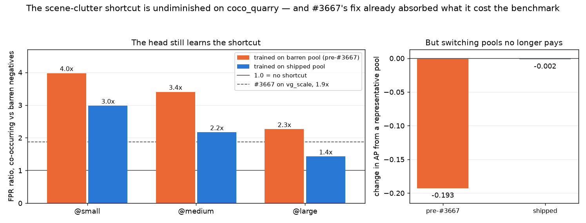

# The negative pool does not need to be shared — but fixing it buys no accuracy

**Issue:** #3986. **Dataset:** `coco_better`, 25 classes, 75 cells, four
single-vector columns. **Date:** 2026-09-20.

## Verdict

**The representativeness cost the issue calls "the serious one" is, on the
shipped benchmark, the minor one.** Moving from today's negatives to a fully
representative per-class pool moves a measured cell by **−0.002 AP**. No
published `coco_better` number needs re-reading on this account.

That is not because the shortcut is absent. It is present at full strength: a
head trained on the shipped pool still fires **2.0-2.3x** as often on negatives that
hold another class in *C* as on barren ones, against #3667's **1.9x** on
`vg_scale`. The benchmark simply already contains those images — #3667's fix
made 40% of every cell's negatives the hard kind — so going the rest of the way
to 61% changes almost nothing a ship decision reads.

**The issue's other cost stands untouched**, and is now the whole case for the
change: "holds none of *C*" caps the class list at 1.5x the needed pool where
per-class pools give 5–11x.

## The premise that needed correcting first

The issue argues from "~84% of negatives still hold nothing in *C*". That is
#3670's figure for `vg_scale`, and it does not transfer. Measured on the built
cell (`pool_shape.py`):

| | |
|---|---:|
| shipped negatives per cell (median) | **16,535** |
| barren shared pool | 9,900 (**60%**) |
| #3667 cross-class negatives | ~6,600 (**40%**) |

A designated positive of one class carries `evaluable_categories` for the other
73 cells, so it *is* a negative for them. Any measurement that trains on the
barren 9,900 is measuring the **pre-#3667** benchmark, which is not the one that
ships. Both probes here default to the shipped set; `--train-pool barren`
reproduces the old design on purpose, because that arm prices what #3667 bought.

This was found the hard way: the first run of the trained probe made exactly
that mistake and produced a 2.38x headline, which is a true number about a
benchmark nobody runs.

## Instruments

All three are deliberately the ones #3667 used, so the numbers compare rather
than being two scales that each say "harder".

- `coco_negative_pool_effect.py` — the text-sort probe. Same positives, same
  query, two negative sets **pinned to the same size**, so prevalence is
  identical and AP cannot move mechanically. (#3667's pool grew, which
  confounded its AP column.)
- `coco_negative_pool_shortcut.py` — the trained-head probe. A linear head fit
  on the cell as posed, 5-fold, then scored on held-out baseline negatives
  versus a same-size representative draw, threshold pinned to 5% FPR on the
  baseline.
- `decompose.py` — recovers the 100%-vs-0% contrast from the mixture identity
  `fpr_base = w·fpr_co + (1−w)·fpr_barren`, exactly and with no extra run. This
  step is what makes the comparison with #3667's 1.88 honest: the shipped ratio
  is measured against a 40%-co-occurring baseline, not a 0% one, and the two are
  not the same contrast.

## The shortcut is at full strength

Co-occurring negatives against the barren subset — the same contrast #3667
measured — with the head trained on each pool:

| | trained on barren (pre-#3667) | trained on shipped |
|---|---:|---:|
| **all 75 cells** | 3.22 ± 0.13 | **2.19 ± 0.14** |
| `@small` | 3.98 ± 0.18 | 2.98 ± 0.28 |
| `@medium` | 3.41 ± 0.17 | 2.17 ± 0.20 |
| `@large` | 2.26 ± 0.17 | 1.43 ± 0.13 |

#3667 measured **1.88** on `vg_scale`. Training against a pool that already
holds 40% co-occurring negatives teaches the head less of the shortcut — 3.22
down to 2.19 — but does not remove it, and the `@small` → `@large` gradient is
the same shape #3667 found (2.50 → 1.25). A small target leaves most of the
frame to context, so a head trained against context-free images has the most to
learn wrongly there. The mechanism the issue describes is real and reproduces on
a second corpus.

## But the benchmark already absorbs it

| trained on | n_neg | baseline co-occur | FPR ratio, representative | ΔAP | mean AP |
|---|---:|---:|---:|---:|---|
| **shipped** | 16,535 | 40% | **1.09 ± 0.02** | **−0.002** | 0.41 → 0.41 |
| pre-#3667 | 9,900 | 0% | 2.38 ± 0.08 | −0.193 | 0.61 → 0.42 |

Read the two ΔAP figures together: under the design #3667 replaced, switching to
a representative pool would have moved a cell by **−0.19 AP**. Under the design
that actually ships it moves it by **−0.002**. The issue's argument was correct
about the mechanism and is being made about a benchmark where the bill was
already paid.

## Four columns, the same answer

The zero-shot half showed real embedder-dependence, so the trained probe was run
on all four single-vector columns rather than generalised from `siglip`
(job 668577). They agree closely:

| embedder | ΔAP | FPR ratio, representative | shortcut, co-occurring / barren | mean AP |
|---|---:|---:|---:|---|
| `siglip` | **−0.002** | 1.09 ± 0.02 | 2.19 ± 0.14 | 0.410 → 0.409 |
| `siglip2_l` | −0.000 | 1.09 ± 0.02 | 2.25 ± 0.15 | 0.471 → 0.471 |
| `clip` | +0.002 | 1.07 ± 0.02 | 2.06 ± 0.13 | 0.359 → 0.361 |
| `clip_l` | +0.007 | 1.06 ± 0.02 | 1.97 ± 0.12 | 0.388 → 0.395 |

Across 300 measured cells the largest |ΔAP| is **0.007**, and its sign is not
even consistent — two columns come out marginally *better* under a
representative pool. The shortcut meanwhile sits at **1.97–2.25** in every
column, all four above #3667's 1.88, with the same band gradient throughout
(`@small` 2.67–3.00, `@medium` 1.90–2.22, `@large` 1.33–1.53).

So neither half of the verdict is a `siglip` artefact: the shortcut is real and
uniform across encoder families, and the cost of removing the rest of it is
indistinguishable from zero in all four.

## The zero-shot probe says nothing, and that is expected

| embedder | ΔAUC | ΔAUC co-occurring | ΔAP |
|---|---:|---:|---:|
| `clip` | +0.002 | +0.003 | +0.006 |
| `clip_l` | +0.003 | +0.008 | +0.004 |
| `siglip` | −0.001 | −0.005 | +0.007 |
| `siglip2_l` | −0.003 | −0.013 | −0.001 |

A text query cannot learn "an image containing a B cannot contain an A" — it can
only report whether the other negatives are semantically nearer. #3667 already
demonstrated the trap: its text probe read −0.004 on a contrast where its trained
probe read 1.88x. **These numbers are a null by construction, not evidence of
absence**, and are recorded so that nobody re-derives them as a finding.

Pool shape also leaves the ranking of the four columns intact: pairwise AP gaps
move −5% to +5%, and **0 of 75 cells change winning column** (`ranking.py`). The
one outlier is `siglip2_l − siglip` at −10%, the closest strong pair.

## What this does and does not settle

**Settled:** the accuracy case for per-class pools. It is worth ~0.002 AP, which
is not a reason to change anything.

**Untouched:** the supply case, which was always the stronger of the two.
"Holds none of *C*" gives 16,058 images against the 10,900 the pool and spares
need at 54 classes (1.5x); per-class the thinnest is `person` at 56,479 (5x) and
most classes sit at 10–11x. That is a cap on the class list, and #3983's widening
of *C* runs straight into it. Nothing here weakens it.

**So: make the change for supply, not for accuracy** — and do not expect
published numbers to move when it lands. Worth knowing in advance, because a
change that moves nothing is easy to mistake for a change that did not take.

## Limits

- **One head family.** A linear head on whole-image embeddings, which is the
  production head (#2683, #2790) — but region-voting and patch arms are not
  measured here, and #3667 had the same limit. The `coco_better_full` patch
  column now exists in 8 shards, so this is newly answerable, and filed as #4043.
- **25 classes, not 54.** The supply arithmetic the issue reports is on the
  #3983 roster; this is on the shipped roster, where a representative draw is
  61% co-occurring rather than the 86% the issue quotes for 54 classes.
- **The representative draw excludes the baseline pool**, because that pool is
  the training set. It is ~15% of the candidates; the realised co-occurrence
  rate is reported per cell rather than assumed.
- **AP here is per cell** (100 positives against the cell's negatives), matching
  #3667's convention, not the three-band 300-positive figure a shipped cell
  quotes.
