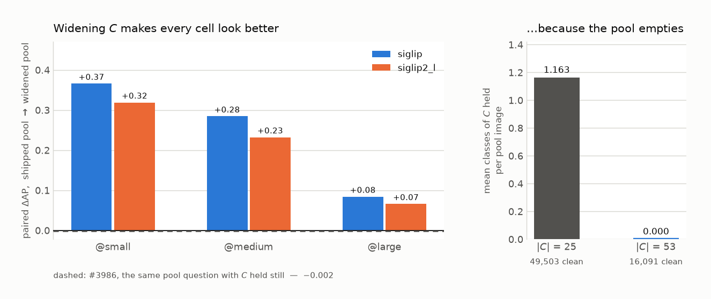

# Widening *C* to 53 costs nothing in supply and breaks every published number

**Issue:** #4056. **Dataset:** `coco_quarry`, COCO 2017 train+val, 123,287
images. **Date:** 2026-09-20.

## Verdict

**The count rule admits 53 classes and the shared pool supports all of them —
but a cell measured against the widened pool reads +0.24 AP higher, so no
published `coco_quarry` number survives the change.**

Supply was never the constraint, and #3983 already said so. What nobody had
measured is what widening does to the *negatives*. The shared pool is drawn as
*holds none of C*, so every class added shrinks the candidate set — and, more
importantly, changes what is left in it. At *C* = 25 a clean pool image still
holds **1.163** classes of the wider roster on average. At *C* = 53 it holds
**0.000**. The filter stops selecting images without these 25 things and starts
selecting **empty scenes**, and an empty scene is trivially easy to tell from a
positive.



| | `siglip` | `siglip2_l` |
|---|---:|---:|
| paired ΔAP, shipped pool → widened | **+0.2447 ± 0.0230** | **+0.2057 ± 0.0217** |
| paired ΔAUC | +0.0232 ± 0.0031 | +0.0175 ± 0.0027 |
| FPR ratio, widened / shipped | 0.54 ± 0.04 | 0.54 ± 0.04 |
| mean AP | 0.602 → 0.846 | 0.680 → 0.885 |
| `@small` ΔAP | +0.3658 | +0.3190 |
| `@medium` ΔAP | +0.2843 | +0.2322 |
| `@large` ΔAP | +0.0841 | +0.0659 |

**Read that against #3986**, which asked the same question about pool
composition with *C* held still and answered **−0.002 AP**. The two differ by
two orders of magnitude and in sign. Pool composition is harmless when the
roster is fixed; under a roster change it is the largest effect measured on this
benchmark.

**Nothing about this looks broken from the outside.** Every cell still has 100
positives and 9,900 negatives, every script runs, the suite is green. The
benchmark just gets easier. That is the failure mode worth naming: a change that
silently improves every number is indistinguishable from a change that improved
the method.

## The mechanism, measured rather than argued

`coco_roster_width_pool.py` draws `SCALE_N_NEG` from each roster's clean set,
**size-matched at 9,900 in both arms**, fits the head the benchmark fits
(5-fold, threshold pinned to 5% FPR on the shipped arm), and reports the mean
number of *C*-classes held per pool image beside the result — so the mechanism is
visible in the output, not inferred from the effect.

| | \|C\| = 25 | \|C\| = 53 |
|---|---:|---:|
| clean candidates | 49,503 | **16,091** |
| mean classes held per pool image | 1.163 | **0.000** |
| headroom over the 10,900 the pool and spares need | 4.5x | **1.48x** |

The band gradient follows the mechanism exactly. `@large` moves least (+0.08)
because a large target already dominates its frame and the background was never
what separated it; `@small` moves most (+0.37) because a small target leaves the
rest of the frame to context, and it is precisely the context that the widened
pool deletes. The largest individual moves are the classes whose negatives
were ordinary furnished scenes: on `siglip`, `backpack@medium` **+0.707**
(AP 0.174 → 0.881), `chair@small` **+0.691**, `car@medium` **+0.625**,
`bench@small` **+0.625**. Once every image holding any of 53 classes is
excluded, almost no furniture and no street survives in the pool, and a `chair`
detector has nothing left to be confused by. **Only 2 of 75 cells get worse**
(5 of 75 on `siglip2_l`), so this is a near-uniform lift, not a redistribution.

**This was predicted before it was run.** The direction is stated in the
instrument's own docstring, because the intuitive reading — a smaller pool is a
worse pool, so numbers should get *worse* — has the sign backwards.

## The roster

All 25 shipped classes survive; 28 join. Re-measured today, `coco_only_supply.py`
reproduces #3983: **159 cells, 0 short of `SCALE_N_POS` = 100**.

```
airplane, apple, banana, baseball bat, dining table, frisbee, handbag,
keyboard, laptop, microwave, motorcycle, mouse, orange, parking meter,
person, potted plant, remote, scissors, skateboard, skis, snowboard,
suitcase, surfboard, tennis racket, tie, toothbrush, traffic light, tv
```

**The rule is the count and nothing else.** Selection deliberately ignores
scatter and purity: both correlate with how hard a class is to detect, so
screening on either would make the benchmark easier and bias every result
optimistically — a selection rule that correlates with the quantity being
measured is a confound, not a convenience. Scatter is recorded as a covariate.

### One exception, and it is about identity

`wine glass` clears the count rule and is **held out** (owner ruling,
2026-09-20). `SCALE_CLASS_MERGES` folds it into `cup`, so admitting it would
redefine `cup` and cost every published `cup` number its meaning. The purity
measurement says the same from the other side: `cup` is 39%
`glass_(drink_container)` and `wine glass` is 24% of that *same* synset, so these
are not two disjoint classes waiting to be split. Dropping it returns 33 images
to the clean pool (16,058 → 16,091). This is the only exception, and it is about
class **identity** — it is not a licence to exclude a class for being hard.

## What COCO actually put in the 28

From `coco_class_purity.py` against LVIS's defined synsets. Four names misread
badly enough that a reader who trusts the name will misreport the result:

| class | what COCO boxed |
|---|---|
| `dining table` | **10.4%** `dining_table` — 34.2% `tablecloth`, 30.5% `table`. The object is the covered *surface*. |
| `tv` | 50.4% `television_set`, **46.9%** computer monitor. A screen class, not a television class. |
| `potted plant` | **75.1%** `flower_arrangement`, 20.7% `flowerpot`. Mostly cut flowers, not potted plants. |
| `remote` | 56.2% `remote_control`, 41.2% `control` — one object under two LVIS names, so effectively ~97% pure. |

`mouse` is **99.3%** `mouse_(computer_equipment)` and not once an animal, so an
animal in that class is an annotation error rather than a boundary case.
`person` reads as 64% pure, but that is an **artefact**: LVIS boxes the garment
(`wet_suit` 7.8%, `jacket` 5.4%) where COCO boxes the wearer, and mutual best
match pairs the two. The object is always the person.

**Five of the 28 are cross-class pairs inside *C*** — the `truck`/`car`
situation, where each side looks right alone and a reviewer gets it wrong
silently: `skis`/`snowboard` (4.6% of `snowboard`'s boxes are `ski`),
`backpack`/`handbag`/`suitcase` (`handbag` is 7.8% suitcase and 6.5% backpack),
`apple`/`orange`, `tv`/`laptop`, `potted plant`/`vase`.

## The briefs, and the instrument that no longer exists

Every class in *C* needs a `SCALE_CLASS_RULES` brief —
`test_contents_and_rules_cover_the_same_classes` enforces parity with the
composition notes — so 28 were written.

They could not be written the way the first 25 were. `pile_config.py` says each
of those was "measured with `coco_folds.py` before it was written", and
**`coco_folds.py` was deleted by the VG retirement** (`e466e3a19`, #4038). That
was correct: fold-in asked which *VG name* lands on a COCO box, and there are no
VG names now. But three live documents still instruct a reader to run it, which
is filed as **#4060**.

So the briefs are written against `coco_class_purity.py` instead. That is the
right replacement rather than a fallback: under a pure-COCO build nobody reviews
COCO's labels, so the question a brief answers has changed from "which VG name
lands here" to "what did COCO's annotators actually put in this class" — which is
exactly what the composition note measures.

## What this does and does not settle

**Settled:** the roster, the supply, and the size of the comparability break.
53 classes, 159 cells, none short, 1.48x pool headroom, and +0.24 AP of
inflation that no published number survives.

**Decided rather than measured:** that we take the break. The owner's ruling is
to widen and renumber — every published `coco_quarry` number is re-read against
*C* = 53, with this report as the reason old and new cannot be compared. The
roster they were drawn against is frozen as `SCALE_CLASSES_25` so the old pool
can be **reproduced**, not merely disclaimed.

**Not settled, and the obvious next question:** whether per-class pools remove
the artefact. A per-class pool is drawn as *{i : i does not hold A}*, which does
not shrink or empty out as *C* grows, so in principle it is immune to this
entirely — and #4034 already made the pool a query at export. Measuring that is
the natural follow-on, and it would also say whether the widening should
eventually be re-based on per-class pools rather than carrying the break.

## Limits

- **Two columns, not four.** `siglip` and `siglip2_l` agree closely (+0.2447 vs
  +0.2057) and #3986 found the four single-vector columns behave alike on the
  neighbouring question, but `clip` and `clip_l` are not measured here.
- **One head family.** A linear head on whole-image embeddings, the production
  head, as in #3986. The patch and region arms are unmeasured (#4043).
- **The widened arm is a simulation of the pool, not a rebuild.** It draws from
  the clean set the widened roster implies and measures the 75 shipped cells;
  it does not build the 84 new cells, whose own numbers are unmeasured.
- **AP is per cell** (100 positives against 9,900 negatives), matching #3986's
  convention, not the three-band 300-positive figure a shipped cell quotes.
