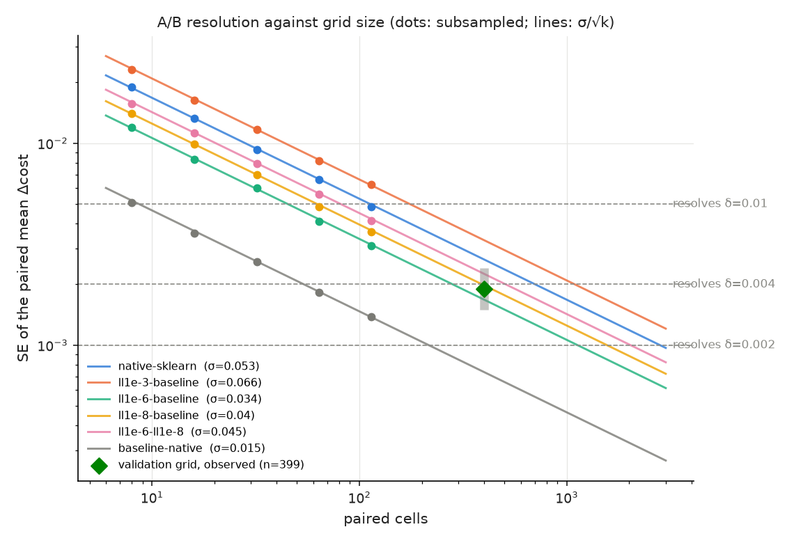
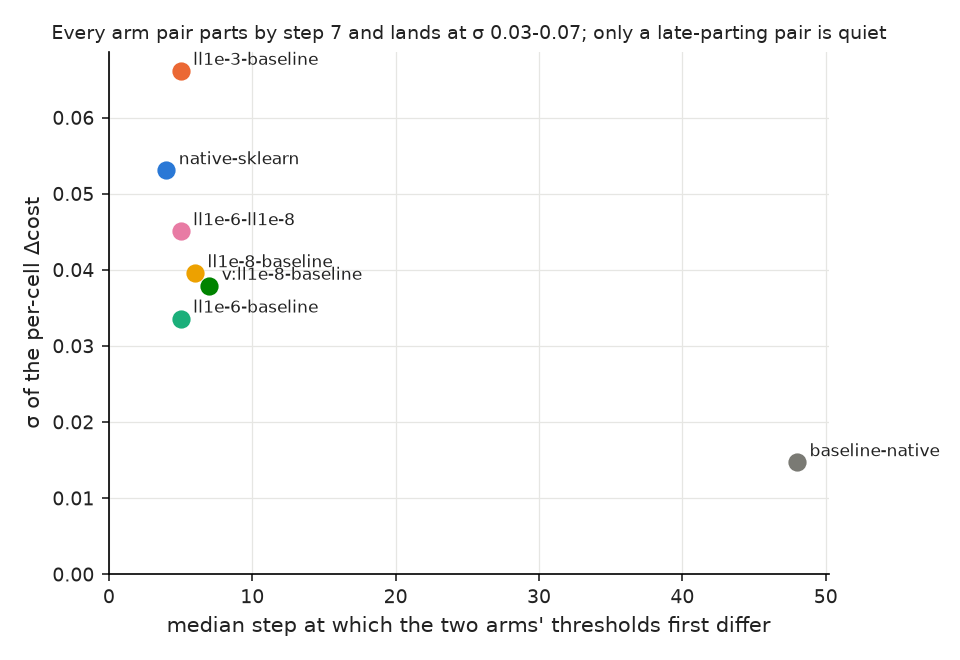
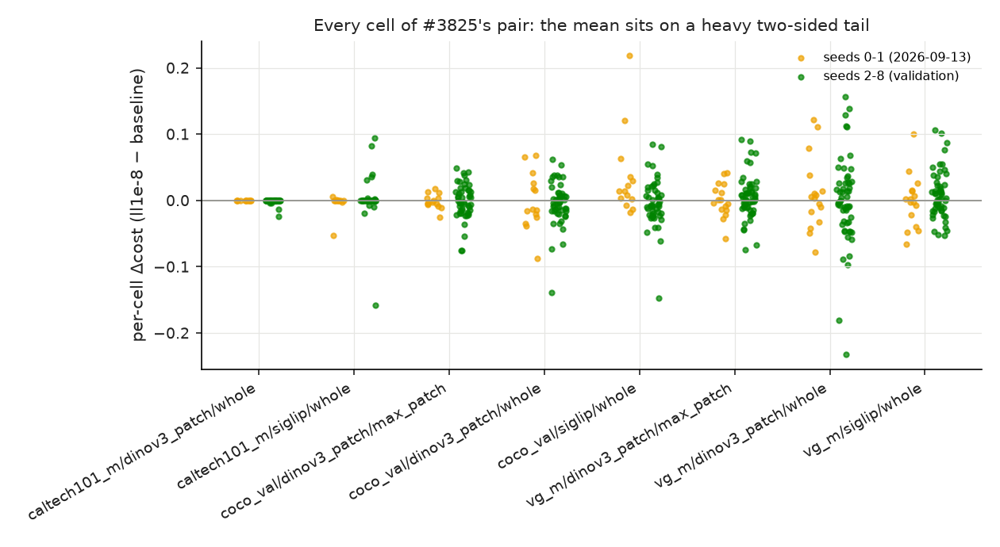
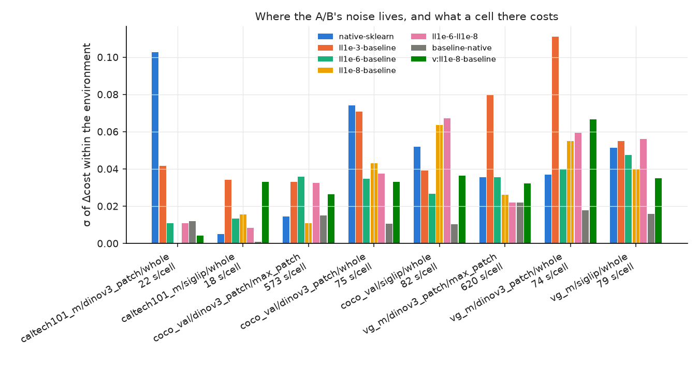
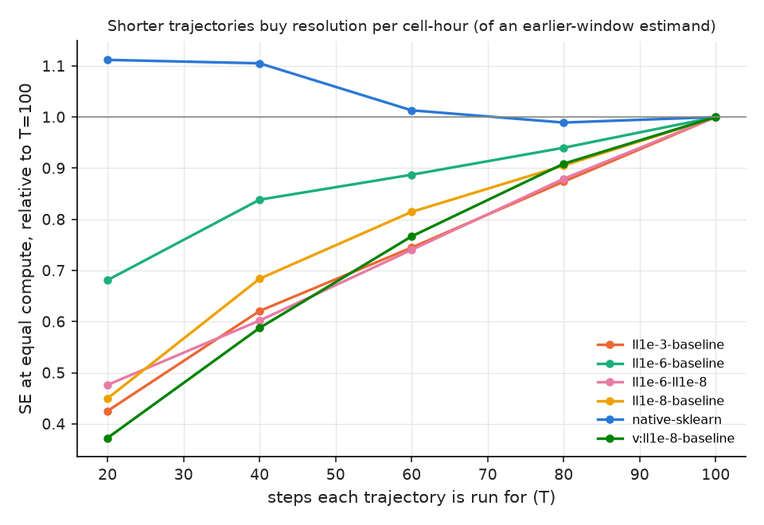
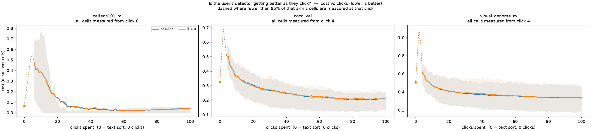

# How many cells the trajectory A/B needs, and a prediction that held (issue #3840)

[#3840](https://github.com/samggreenberg/VTSearch/issues/3840) came out of
#3825's own A/B. Two stopping rules that differ **fourteen-fold** in how much
haystack they move (`ll1e-6`, p90 0.70%; `ll1e-8`, p90 0.050%) came back
indistinguishable at 114 paired cells: +0.0044 ± 0.0031 against +0.0049 ± 0.0037.
Every study here finds that floor at the end, after the grids have run. The issue
asked for the curve to design against instead: subsample the paired-cell frames
#3585 and #3825 already hold, read it by environment and by seeds vs categories,
and validate it with one grid of a size it predicts.

## The design rule

> **SE of the paired mean Δcost = σ / √n, with σ ≈ 0.04 for any two arms whose
> thresholds differ.** To resolve δ at two standard errors you need
> **n = (2σ/δ)² paired cells**. For an 80% chance of resolving a true δ, you need
> **n = (2.8σ/δ)²**.

| δ you need to resolve | cells, 2 SE (σ = 0.04) | cells, 80% power | 2 SE, over the 5 arm pairs measured (σ 0.034–0.066) |
|---|---|---|---|
| 0.02 | 16 | 32 | 12–44 |
| 0.01 | 64 | 130 | 46–175 |
| 0.005 | 260 | 520 | 181–700 |
| **0.004** | **400** | **810** | 282–1,094 |
| 0.002 | 1,600 | 3,200 | 1,128–4,373 |

The #3585 environments hold **57 (environment, category) pairs**, so one seed adds
57 cells. #3825's 114-cell grid resolves about **0.0075** at 2 SE. It could never
have seen 0.004.

It is written into the `grid-experiments` skill ("Size an A/B before you launch
it"), where every launch starts, and into the short form in
`docs/experiments/README.md`. Making it a preflight check is
[#4111](https://github.com/samggreenberg/VTSearch/issues/4111).

## The short version

1. **σ/√n holds from 8 cells to 399, and the prediction held on cells the curve
   never saw.** Pre-registered in [`PLAN.md`](PLAN.md) before submission: SE
   **0.0020** (90% interval 0.0015–0.0024) at 399 new cells. Observed:
   **0.0019**, with σ 0.038. Subsampling each existing pair puts the empirical SE
   within 3% of σ/√k at every k from 8 to 114 (`agg/curve.csv`).

2. **At small k the curve is fine and a single grid's SE is not.** At 8 cells the
   true SE for #3825's pair is 0.014. One 8-cell grid *estimates* it anywhere from
   **0.0042 to 0.028** (5th–95th percentile), a sevenfold range, and its ±2 SE
   interval covers the truth 90% of the time rather than 95%. Below ~32 cells,
   size the grid from the table, not from its own error bar.

3. **σ does not shrink with the size of the change, and that is why the floor
   exists.** Every arm pair's thresholds first differ at a median of vote
   **4–7**, and from there Autopilot's Hard pick sends the two runs to different
   items. σ is 0.034–0.066 whether an arm moves 0.05% of the haystack or 20%.
   `ll1e-6` moves fourteen times what `ll1e-8` moves and has the *smaller* σ
   (0.034 vs 0.040). The one quiet pair is the one that parts late. Two dev
   checkouts of nominally the same fit first differ at a median of vote **48**, and
   σ is 0.015. **A small change does not get a cheaper A/B.** Below about
   (2 · 0.04 / δ)² cells, the gate is the instrument, as #3825 found.

4. **#3825's `ll1e-8` "cost" was noise.** The 399 new cells give
   **+0.0010 ± 0.0019**. Pooled with the original 114 cells, 513 give
   **+0.0018 ± 0.0017**. Whatever the shipped rule costs, it is under 0.005.
   The original +0.0049 sat on one environment's 14 cells
   (`coco_val`/`siglip`, **+0.035**). The same environment reads **−0.0031** over
   49 new cells.

5. **A seed buys what a new category buys.** With 2 seeds per category, a
   category component looked real (ICC 0.21–0.42 on four of six pairs). With 7
   seeds it is **zero** (σ_category 0, σ_seed 0.039), and the category-clustered
   SE is *smaller* than the naive one (0.0016 vs 0.0019). At 2 seeds the component
   cannot be estimated; it was noise. **Grow a grid by seeds**, the axis that is
   free: the categories are already `CATEGORY_MODE=all`.

6. **Environments differ 30x in cost per cell, and allocating by cost alone saves
   a third to a half of the compute.** A `max_patch` cell costs **570–620 s**, a
   `whole_image` cell **75 s**, and a `caltech101_m` cell **18–22 s**. σ per environment is
   *not* portable between pairs (`caltech101_m`/`dinov3_patch` is 0.10 for
   #3585's pair and 0.000018 for #3825's), so do not allocate by σ. Allocating by
   cost alone (n_e ∝ W_e / √cost_e, reporting the same W_e-weighted mean) needs
   **0.49–0.79** of the compute for the same SE across the seven pairs, and
   **0.65** on the validation cells.

7. **Shorter trajectories are cheaper per unit of resolution, but they measure
   something else.** Cutting every run at 40 of 100 steps costs 35% of the
   compute. At equal compute its SE is 0.59–0.84 of the full run's on five of six
   pairs (`native-sklearn` is the exception, at 1.1). But it is an estimate of the
   **early-vote** Δ. Use it when the effect lives there (a ramp, an init) and not
   as a free discount on a deep-regime question.

8. **The harness is almost, but not exactly, deterministic, and two dev checkouts
   are not the same grid.** Running `baseline` seeds 0–1 twice on the same commit:
   **111 of 114 cells identical**, 3 differ (σ **0.0030**, at most 0.11 on one
   step). Thresholds first differ by exactly 1e-6, the last printed digit, so the
   wobble is a float below print precision, and it flips a Hard pick in 3% of
   cells. That is 0.6% of an arm pair's variance and does not move the curve. Filed as
   [#4110](https://github.com/samggreenberg/VTSearch/issues/4110). Across eleven
   days of `dev` (the 2026-09-13 grids against today's, same seeds) σ is
   **0.009–0.012** and 31–39% of cells are unchanged. **Pair a grid only with a
   grid from the same commit.** #3839's A/B reuses this study's `v_ll1e-8` for
   exactly that reason.

---

## What was measured

**The statistic is the one the reports quote.** Per cell (environment,
category, seed), the mean cost over the app-visible steps (`app_trained == 1`,
at least 2 votes: `analyze_ab`'s `app_visible`/`all_steps`). Per pair, the
paired Δ over cells, and SE = sd/√n. `resolution_3840.py` reproduces #3825's
`ll1e-8` line from raw cells before doing anything else, **cell by cell against
the published `ab_paired_cells.csv` (max |diff| 1.1e-16)**, and refuses to run
if it cannot.

**Seven pairs, all from grids that already existed except the last:**

| pair | cells | Δcost | σ | SE | cells unchanged | thresholds part at (median vote) |
|---|---|---|---|---|---|---|
| `native − sklearn` (#3585) | 114 | −0.0061 | 0.053 | 0.0050 | 10% | 4 |
| `ll1e-3 − baseline` (#3825) | 114 | **+0.026** | 0.066 | 0.0062 | 5% | 5 |
| `ll1e-6 − baseline` | 114 | +0.0044 | 0.034 | 0.0031 | 10% | 5 |
| `ll1e-8 − baseline` | 114 | +0.0049 | 0.040 | 0.0037 | 16% | 6 |
| `ll1e-6 − ll1e-8` | 114 | −0.0005 | 0.045 | 0.0042 | 10% | 5 |
| `baseline − native` (one fit, two studies' checkouts) | 114 | −0.0024 | 0.015 | 0.0014 | 30% | 48 |
| **validation**: `ll1e-8 − baseline`, seeds 2–8 | **399** | +0.0010 | 0.038 | **0.0019** | 15% | 7 |



*One line per pair: σ/√k through its own σ. Dots are the empirical SE of
k-cell subsamples, and they sit on the lines at every k. The green diamond is the
validation grid, inside its pre-registered interval (grey bar). Dashed: the SE
at which a δ of 0.01 / 0.004 / 0.002 is resolved at 2 SE.*



*Every arm pair parts within the first few votes and lands in one band of σ,
whatever the arm does to the haystack. The only point outside the band is the
pair that parts at vote 48.*

### Every cell of #3825's pair



*Each dot is one cell's Δcost. The mean sits on a two-sided tail of
±0.1–0.2. #3825's +0.0049 was the 14 `coco_val`/`siglip` cells at seeds 0–1
(+0.035), and the 49 new cells there read −0.0031.*

Per environment on the validation grid (Δ = `ll1e-8` − `baseline`):

| environment | cells | Δcost | σ | cost per cell | share of Δ variance |
|---|---|---|---|---|---|
| `caltech101_m`/`dinov3_patch`/whole | 42 | −0.0011 | 0.0042 | 22 s | 0.2% |
| `caltech101_m`/`siglip`/whole | 42 | +0.0022 | 0.033 | 18 s | 7.8% |
| `coco_val`/`dinov3_patch`/max_patch | 49 | −0.0010 | 0.026 | 573 s | 5.9% |
| `coco_val`/`dinov3_patch`/whole | 49 | −0.0042 | 0.033 | 75 s | 9.5% |
| `coco_val`/`siglip`/whole | 49 | −0.0031 | 0.036 | 82 s | 11% |
| `visual_genome_m`/`dinov3_patch`/max_patch | 56 | +0.0053 | 0.032 | 620 s | 10% |
| `visual_genome_m`/`dinov3_patch`/whole | 56 | −0.0007 | **0.067** | 74 s | **43%** |
| `visual_genome_m`/`siglip`/whole | 56 | +0.0087 | 0.035 | 79 s | 12% |



*σ per environment for every pair, with each environment's cost per cell. The
bars change order from pair to pair, so the recommended allocation uses cost,
which is known before a run, and not σ, which is not.*

### Seeds vs categories

A one-way random-effects split of Δ within environment:

| pair | seeds per category | σ_seed | σ_category | ICC |
|---|---|---|---|---|
| `ll1e-8 − baseline`, 2026-09-13 | 2 | 0.031 | 0.024 | 0.38 |
| same pair, validation | **7** | 0.039 | **0** | **0** |

With two seeds, each category's between-category mean square rests on two cells
and is mostly noise. At 7 seeds the component disappears. For the question these
A/Bs ask, a seed is as good as a category.

### Steps



*Each pair's SE at equal compute if every trajectory were cut at T steps,
relative to running all 100. Compute is priced from the cells' own cumulative
`elapsed_seconds`: 20 steps cost 16% of a full run, and 40 cost 35%.*

### Drift and determinism

| comparison (same seeds 0–1) | σ | Δcost | cells identical |
|---|---|---|---|
| `baseline`, same commit, run twice | **0.0030** | −0.0003 ± 0.0003 | **111 / 114** |
| `baseline`, 2026-09-13 vs today's `dev` | 0.0087 | +0.0012 ± 0.0008 | 36 / 114 |
| `ll1e-8`, 2026-09-13 vs today's `dev` | 0.012 | −0.0001 ± 0.0011 | 45 / 114 |

The three same-commit cells that differ are `caltech101_m`/`dinov3_patch`
`cougar_face` s0 (first differs at vote 33, largest per-step Δ 0.0049),
`coco_val`/`dinov3_patch` whole `bed` s0 (vote 30, 0.10) and
`visual_genome_m`/`dinov3_patch` max_patch `ball` s1 (vote 82, 0.11).

### The quality-over-clicks pair



Per run: [`caltech101_m`](figures/cost_vs_clicks_runs__caltech101_m.png) ·
[`coco_val`](figures/cost_vs_clicks_runs__coco_val.png) ·
[`visual_genome_m`](figures/cost_vs_clicks_runs__visual_genome_m.png). Interactive:
[`viewer.html`](viewer.html).

*The two arms of the validation grid, averaged and per run, anchored at click 0
on the text sort. They overlap everywhere, which is item 4 as a picture.*

---

## What this does not license

- **σ ≈ 0.04 is for these six environments at 100 votes.** #3796 measured a
  cell-to-cell sd of 0.056 on `vg_scale_any` at 150 votes, the same order but not
  the same number. A study on another environment should read σ off its first
  seeds and re-size. The rule n = (2σ/δ)² transfers; the constant is a default.
- **Allocating by cost leaves the estimand alone only if the weights are kept.**
  Report the environment-weighted mean with the original W_e, not the raw mean
  over a reallocated grid.
- **Cutting trajectories changes the estimand.** See item 7.

## Follow-ups

- [#4110](https://github.com/samggreenberg/VTSearch/issues/4110): the same cell
  on the same commit is not bit-identical run to run (3 of 114 cells).
- [#4111](https://github.com/samggreenberg/VTSearch/issues/4111): make the rule a
  check. `preflight.sh` should take the δ a study means to resolve and refuse a
  grid smaller than (2σ/δ)².

## Reproducing this

```bash
cd scripts/experiments/ab_resolution
bash launch_3840.sh ab          # the validation grid, seeds 0-8, plus the same-commit repeat
bash launch_3840.sh frames      # every grid -> one per-step frame
bash launch_3840.sh analyse     # tables + figures (resolution_3840.py, figures_3840.py)
bash launch_3840.sh abfigures   # quality-over-clicks pair + viewer
python selftest_3840.py         # planted answers for every estimator
```

Results: `/expscratch/sgreenberg/abres-3840/` (frames, `analysis/`, the three
grids). The tables are in [`agg/TABLES.md`](agg/TABLES.md). The pre-registration
[`PLAN.md`](PLAN.md) was committed before the grid was submitted (`d58e61ffd`).
