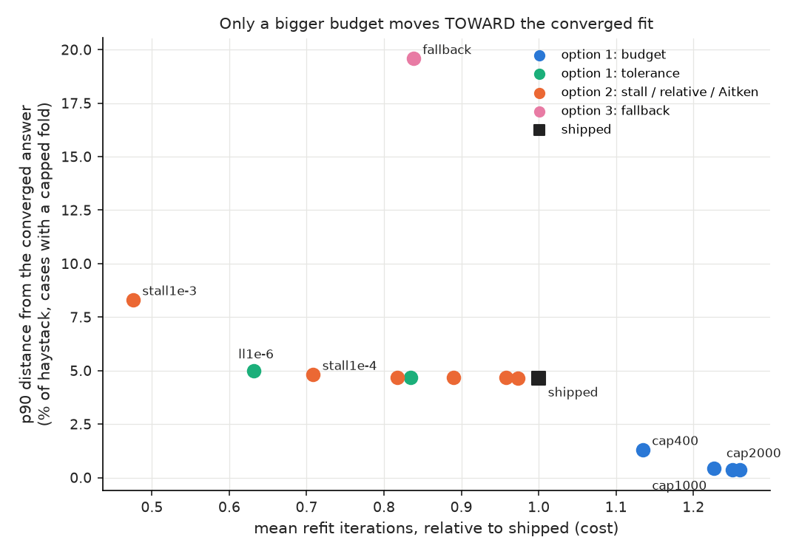
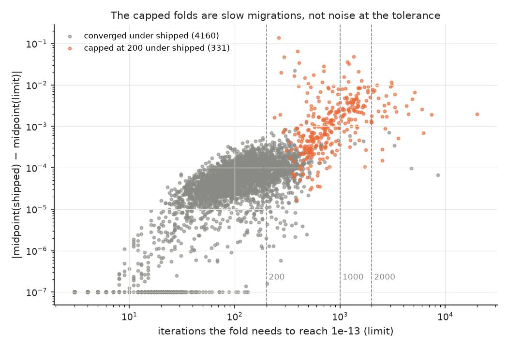
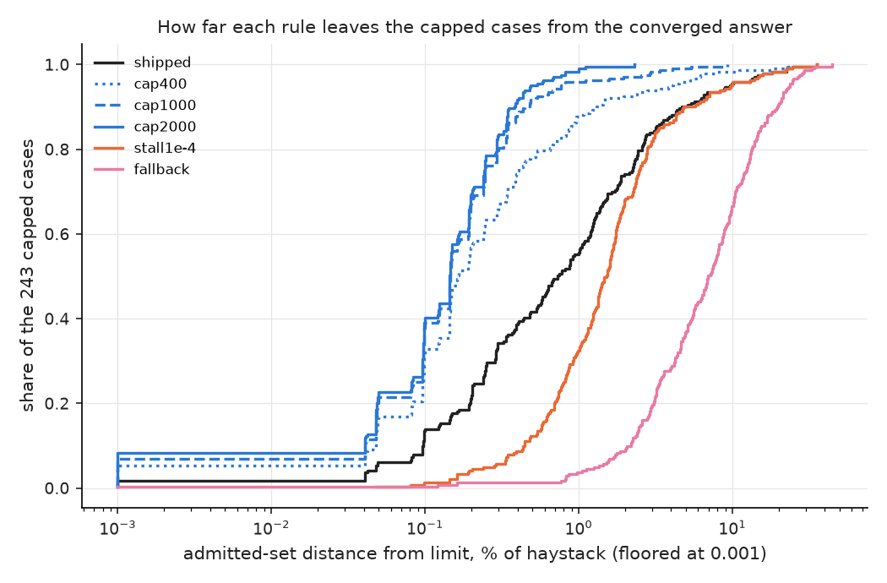
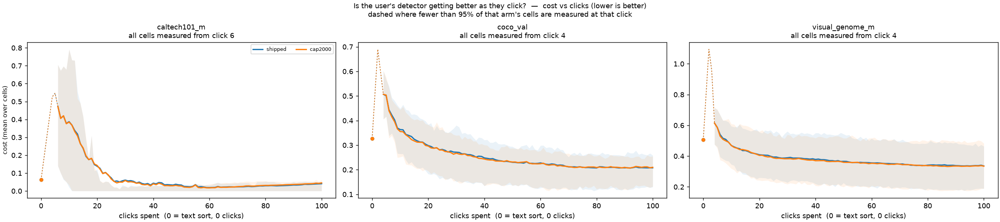

# A capped anchored refit is not a nearly converged one: raise the budget, not the rule (issue #3839)

[#3839](https://github.com/samggreenberg/VTSearch/issues/3839) is #3825's
leftover. Moving the anchored refit's stopping rule onto its own objective at
1e-8 cut the share of fold refits that leave on `max_iter` from 26.5% to
**7.4%**, and nobody had decided what the remaining 7.4% *mean*. The issue named
three answers and priced none of them:

1. **accept and document a rate** (by tolerance or by budget);
2. **give the loop a guarantee**: a relative tolerance or a stall detector, so
   "converged" is reachable;
3. **treat a capped refit as a degeneracy** and fall back to the fold's
   unanchored fit.

## The short version

**Ship option 1 by budget: `_ANCHORED_EM_MAX_ITER` 200 → 2,000. Reject options 2
and 3.** Every number below is on the #3585 fold corpus (84 cells, 2,258 fold
cases, 4,516 fold refits), re-used without re-running a cell. Each arm is read
against the shipped rule *and* against a **limit**: the same loop run to 1e-13
with 20,000 iterations. A capped fit is only wrong to the extent that finishing
would move the line.

1. **The capped folds are far from converged.** The shipped rule caps 331 folds
   in 243 cases. Finishing them moves the admitted set on **98%** of those cases,
   by a median of **0.73%** of the haystack, p90 4.7% and max **36%**. The
   converged folds are already where the limit is: their midpoints are within
   0.00014 of it at p90. Of 4,160 converged folds, one is off by more than 0.01.
   The gap to the limit is almost entirely the capped folds.

2. **They are slow migrations, not noise at the tolerance.** A capped fold needs
   a median of **750** iterations to reach the limit (p90 2,000), and on the way
   its midpoint moves a median of 0.0011 and up to 0.14. The minority component is
   still walking out to the high mode, which is #3825's worked case at 1e-3,
   continued. In 184 of the 217 cases where finishing moves the line, the
   converged fit admits **fewer**: a capped fit's midpoint sits low and the cut
   over-admits.

3. **Option 2 makes "converged" reachable by stopping earlier, and that moves
   every capped case further from the answer.** Among the stall, relative and
   Aitken arms, none brings a capped case closer to the limit than `shipped`
   does, and all but `aitken1e-7` and `rel1e-8` (which change almost nothing) are
   worse (`stall1e-4`: median 1.5% of the haystack from converged, against
   `shipped`'s 0.73%). None beats `shipped`'s objective on any fold where they
   differ except `aitken1e-7` (370 better, 2,930 worse). The issue's premise was
   that 1e-8 is *unreachable*. It is reachable; it takes more than 200 iterations.

4. **Option 3 is the worst of all.** Falling back to the unanchored fit on a
   capped fold puts the case a median **7.0%** of the haystack from converged
   (p90 20%), loses 333 anchored fits, and replaces a fit that is going somewhere
   with one that never saw the labels.

5. **Option 1 by tolerance doesn't help either.** `ll1e-7` and `ll1e-6` cut the
   capped rate to 4.5% and 1.5% by stopping everything earlier, and leave the
   capped cases where they were (median 0.82% and 1.6% from converged).

6. **Option 1 by budget moves the line toward the converged fit and does not cost
   cost.**

   | arm | capped folds | capped cases: median / p90 / max distance to converged | mean iterations | mean refit |
   |---|---|---|---|---|
   | `shipped` (200) | 7.4% | 0.73% / 4.7% / 36% | 66 | 10 ms |
   | `cap400` | 2.5% | 0.16% / 1.3% / 24% | 75 | 11 ms |
   | `cap1000` | 0.42% | 0.15% / 0.44% / 9.3% | 81 | 12 ms |
   | **`cap2000`** | **0.067%** (3 folds) | **0.15% / 0.38% / 2.3%** | **83** | **13 ms** |
   | `cap5000` | 0 | 0.15% / 0.35% / 2.3% | 83 | 13 ms |

   Against `shipped`, `cap2000` changes the admitted set on 9.6% of cases, with
   median and p90 move **0**. It changes nothing on a fold that converges within
   200 iterations, and on every fold it does change the objective is better
   (331 better, 0 worse). The residual distance to the limit is the limit's own
   tighter tolerance, one or two order statistics. 2,000 is where the tail
   flattens: 5,000 buys nothing further.

7. **The trajectory A/B finds no regression.** 513 paired cells (seeds 0–8 of
   the #3585 environments), `cap2000` against the shipped rule on the same commit
   (#3840's `v_ll1e-8` grid). #3840's rule says that resolves about 0.003 at
   2 SE. The expected direction was written down before the grid returned
   ([`PREDICTION.md`](PREDICTION.md)):

   | Δ (cap2000 − shipped) | cost | regret | FNR | FPR | AP |
   |---|---|---|---|---|---|
   | 513 cells | **−0.0021 ± 0.0015** | −0.0009 ± 0.0010 | +0.0012 ± 0.0015 | **−0.0033 ± 0.0014** | +0.0028 ± 0.0018 |

   The cost is not resolvable and points the candidate's way. FPR falls at
   2.4 SE, the predicted direction (a raised cut). σ of the per-cell Δ is
   **0.033**, below the 0.04 of a whole-population arm, and **39%** of cells pair
   to exactly zero (83% on `caltech101_m`/`dinov3_patch`), again as predicted: the
   arm only acts on a trajectory in which some fold reaches 200 iterations.

8. **The price is in the tail.** The median fold never reaches 200 and is
   untouched (7.7 ms both ways); the mean refit rises **25%** (10.1 → 12.6 ms).
   On the folds that were capped, min-of-3 per call: **26 → 47 ms** at fold size
   (p90 91 ms) and, on a bootstrap resample to `_GMM_MAX_SAMPLES` (50k, a
   projection, not a measurement), **0.32 → 0.77 s** median, 2.9 s max. That
   tail is what #3827 (fit on fewer samples) addresses.

**This clears #3825's bar.** Gate: median and p90 admitted-set move 0 against
the incumbent, and every move goes toward the converged fit. Estimator: better on
every fold it changes. A/B: no regression (−0.0021 ± 0.0015). #3825 shipped
ll1e-8 on the same three instruments. The one thing that differs is the gate's
tail: `cap2000` moves some cases a lot (p99 5.1%, max 35%). Those are the cases
that were wrong, and the limit is the reference that says so.

**The documented rate is now 0.07%** of fold refits (3 of 4,493). It is still
reported: `FoldAnchoredCut.n_unconverged`, the `fold_anchored_maxiter{u}[a/k]`
provenance and the `_fused_threshold` warning are unchanged.

---

## The worked case: 200 iterations, 1,141 admitted; converged, 288

`coco_val` / `dinov3_patch` / whole_image, `clock`, seed 1, step 75 (`cell_0080`,
case `0075`): the largest shipped-vs-limit move in the corpus. Final haystack
2,396 scores, two folds, 40 anchors each (29 Good in fold 1).

| arm | fold 0 | fold 1 | threshold | admits |
|---|---|---|---|---|
| `shipped` | inverted means → unanchored | **200 iters, capped**: w_hi 0.026, μ 0.429 / 0.461, midpoint 0.445 | 0.380 | **1,141** |
| `cap2000` | 384 iters, converged: midpoint 0.466 | 289 iters, converged: w_hi 0.0052, μ 0.429 / **0.591**, midpoint **0.510** | 0.430 | **293** |
| `limit` | 477 iters: midpoint 0.466 | 397 iters: midpoint 0.511 | 0.430 | **288** |
| `stall1e-4` | as `shipped` | as `shipped` | 0.380 | 1,141 |
| `fallback` | unanchored | unanchored | 0.369 | **1,360** |

Fold 1, traced:

| iteration | objective | last step | w_hi | μ_lo | μ_hi | midpoint |
|---|---|---|---|---|---|---|
| 10 | 1.70365 | 5.8e-4 | 0.59 | 0.407 | 0.446 | 0.426 |
| 100 | 1.71662 | 4.3e-5 | 0.36 | 0.432 | 0.425 | 0.429 |
| **200** | 1.72788 | **2.3e-4** | 0.026 | 0.429 | 0.461 | 0.445 |
| 400 | 1.72995 | 6.5e-14 | 0.0052 | 0.429 | 0.592 | 0.511 |

At the cap the loop is taking **larger** steps than it took at iteration 100.
It is mid-migration, shedding the high component's weight onto the tail, and it
lands 200 iterations later. A "stall" rule cannot see this. Nothing here is
flat, the loop is simply slow. Option 3 is worse still: it discards fold 0's
converged fit as well as fold 1's. The two anchored fits also fix fold 0's
`inverted_means` degeneracy: given the budget, fold 0 converges to an anchored
fit (5 folds corpus-wide go from `inverted_means` to anchored, and 2 the other
way).



*Mean refit iterations relative to `shipped`, against the p90 distance from the
converged answer on the 243 capped cases. Blue (more budget) is the only
direction that goes down.*



*Each fold refit: iterations it needs to reach 1e-13, against how far
`shipped`'s midpoint sits from the converged one. The capped folds (orange) need
hundreds to thousands of iterations and sit 10–1000x further from converged than
the rest.*



*On the capped cases, how far each rule leaves the admitted set from the
converged fit.*

---

## Per environment

| environment | folds capped at 200 | cases whose line moves when finished | p90 / max move |
|---|---|---|---|
| `visual_genome_m`/`siglip`/whole | **21%** | 70% | 1.8% / 16% |
| `visual_genome_m`/`dinov3_patch`/whole | **20%** | 68% | 1.2% / 29% |
| `coco_val`/`siglip`/whole | 5.4% | 55% | 0.088% / 22% |
| `coco_val`/`dinov3_patch`/whole | 3.6% | 62% | 0.12% / **36%** |
| `visual_genome_m`/`dinov3_patch`/max_patch | 1.7% | 32% | 0.050% / 9.0% |
| `coco_val`/`dinov3_patch`/max_patch | 1.4% | 38% | 0.042% / 18% |
| `caltech101_m`/`siglip`/whole | 0.42% | 1.7% | 0 / 13% |
| `caltech101_m`/`dinov3_patch`/whole | 0.22% | 0.44% | 0 / 0.25% |

("moves when finished" counts any admitted-set change against the limit,
including the one-order-statistic moves every rule makes at 1e-8.)

A/B per environment (Δcost, cap2000 − shipped): every environment is within
2 SE of zero. The largest are `visual_genome_m`/`dinov3_patch`/max_patch
−0.0043 ± 0.0028 and `visual_genome_m`/`siglip` −0.0037 ± 0.0040.

### The quality-over-clicks pair



Per run: [`caltech101_m`](figures/cost_vs_clicks_runs__caltech101_m.png) ·
[`coco_val`](figures/cost_vs_clicks_runs__coco_val.png) ·
[`visual_genome_m`](figures/cost_vs_clicks_runs__visual_genome_m.png).
Interactive: [`viewer.html`](viewer.html).

---

## How the new rules were run, and the check that makes it legitimate

The stall, relative and Aitken rules are not in the shipped loop, and putting
them there to measure them would have put unmeasured rules on the production
path. `arms_3839.py` runs them by **stepping the real loop one iteration at a
time**: `_anchored_em(..., max_iter=1)` returns the next parameters and the
objective at the ones it started from, which is exactly the pair the shipped loop
compares. `drv_shipped` (the shipped rule, driven that way) reproduces `shipped`
**bit for bit on 4,516 of 4,516 folds**, and `analyze_3839.py` refuses to run if
it does not. Driven arms are priced in iterations, not seconds.

## What this does not license

- **It does not fix false convergence.** At 1e-8 a converged fold can still stop
  mid-migration. It happened to 1 of 4,160 here (`visual_genome_m`/`dinov3_patch`
  `nose`, seed 0, `cell_0013` case `0025`: 663 admitted against 67 converged). It is rare, and a
  budget cannot touch it.
- **The 50k cost is a projection.** Resampled haystacks keep the shape that sets
  the iteration count and not the granularity.
- **Six environments at ≤2.4k medias**, as in #3825.

## Also fixed

The `_ANCHORED_EM_LOGLIK_TOL` comment still quoted #3825's retracted κ=10 numbers
("1.6x", "5.7% → 1.4%"). It now says 1.9x and 26.5% → 7.4%, and says why it
changed.

## Reproducing this

```bash
cd scripts/experiments/gmm_init
bash launch_3839.sh gate                    # 16 arms over the #3585 corpus, 12 shards
bash launch_3839.sh analyse                 # analyze_3839.py + figures_3839.py
AB_ARMS=cap2000 bash launch_3839.sh ab      # seeds 0-8; baseline is #3840's v_ll1e-8 grid
AB_ARMS=cap2000 bash launch_3839.sh abanalyze
python bench_3839.py --corpus ... --fits ... --out bench3839.csv
python worked_case_3839.py --corpus ... --cell cell_0080 --style whole_image --case 0075
```

Results: `/expscratch/sgreenberg/maxiter-3839/`. Tables: [`agg/TABLES.md`](agg/TABLES.md).
