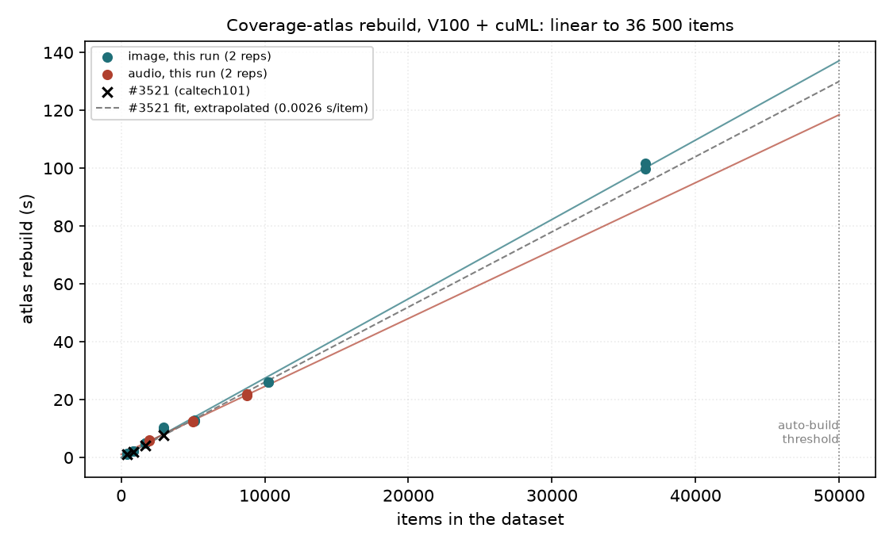
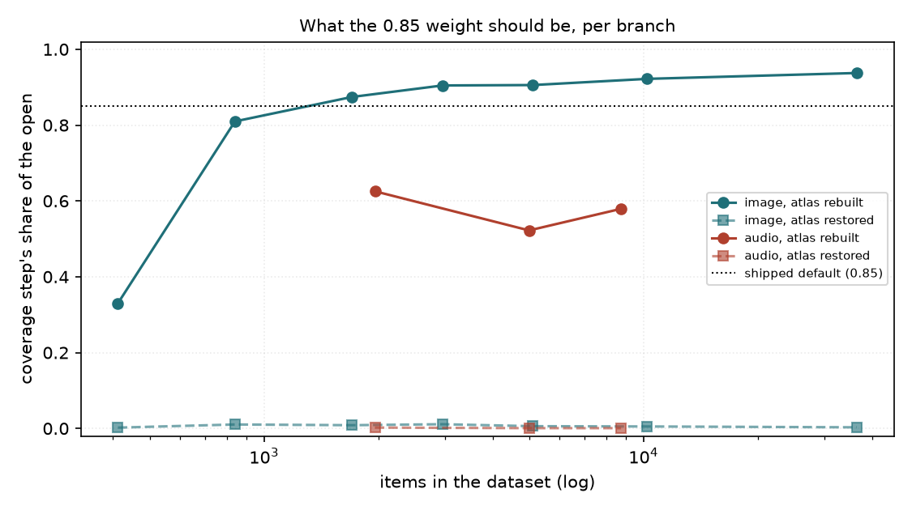

# The coverage-atlas rebuild past n = 2954 (#3595)

**Question.** #3521 measured the coverage-atlas rebuild on `caltech101` up to
2954 items and fitted 0.0026 s/item. Every larger figure quoted since, including
"~131 s at the 50 000-item auto-build threshold", extrapolated that fit across
a 17× gap. Is the rebuild still linear out there? And does the shipped
`dataset_open` weight (0.85 of the bar to the coverage step) match what a
rebuilding open actually spends?

**Answer.** Yes, it is linear, measured to **36 497 items**. The weight holds for image and not
for audio.

## Setup

One job ([`run_atlas_3595.sbatch`](../../../scripts/experiments/drive_cold/run_atlas_3595.sbatch),
SLURM 678051) ran on `rack7n06`, the same V100 + cuML node as #3521
([`measurements/env.txt`](measurements/env.txt)), with its own data dir and demo
media symlinked from the shared cache. Each dataset was imported once. The job
then drove `dataset_open --cold-atlas` twice, so every size has two real
rebuilds (through the on-demand endpoint) and two restores:

- image, `siglip`: `caltech101_{s,m,l,a}` (412 / 838 / 1704 / 2954) and
  `places365_{s,m,a}` (5110 / 10 220 / 36 497);
- audio, `clap_general`: `esc50_a` (1960 after dedup) and `urbansound8k_{l,a}`
  (4995 / 8732).

The tables and figures are rebuilt from the committed rows by
[`analyze_atlas_3595.py`](../../../scripts/experiments/drive_cold/analyze_atlas_3595.py)
([`tables.md`](tables.md)).

## 1. The rebuild is linear to 36 497 items

*Rebuild seconds against dataset size, on linear axes so any curvature would
show. Dots are this run's two reps per size; crosses are #3521's caltech101
points; the dashed line is #3521's fit extended to the threshold.*

| media | n | rebuild (2 reps) | s/item |
|---|---:|---:|---:|
| image | 412 | 1.2 / 1.3 s | 0.0031 |
| image | 2954 | 10 / 10 s | 0.0035 |
| image | 5110 | 13 / 13 s | 0.0025 |
| image | 10 220 | 26 / 26 s | 0.0025 |
| image | 36 497 | **100 / 102 s** | 0.0028 |
| audio | 1960 | 5.7 / 6.1 s | 0.0030 |
| audio | 8732 | 22 / 22 s | 0.0025 |

Fitted over every rep: **image 0.0027 s/item, intercept ≈ 0, r² 0.999
(n = 412…36 497)**, and **audio 0.0025 s/item, r² 0.997 (n = 1960…8732)**. Reps
agree to within 4 %. The fit predicts ~140 s at 50 000 items, against the old
extrapolation's 131 s. The earlier figure was right, but it rested on nothing
until now. The practical reading: a rebuild takes seconds below ~20 000 items
and becomes minutes only near the auto-build threshold.

One point runs slow. Caltech at 2954 took 10 s here against 7.7 s in #3521 on
the same node class. Places at 5110 (0.0025 s/item) shows it is not a size
effect. Two reps cannot say more, and the slope is unaffected.

## 2. The 0.85 weight: right for image, too high for audio

*The coverage step's share of a dataset open (coverage ÷ (coverage + items)),
per branch, against n. The dotted line is the shipped default of 0.85.*

When the atlas rebuilds, the measured share for **image is 0.81–0.94** at every
size from 838 to 36 497, bracketing 0.85. For **audio it is 0.52–0.63**, because
reading and converting an audio pickle (3.5–16 s) is a much larger part of the
open. At 0.85, every rebuilding audio open budgets ~0.3 of its bar to the wrong
step. When the atlas is restored the share is ≤ 0.01 for both media. The route
re-weights for that branch once it knows which one ran (#3594), so the default
never has to serve it.

The image point at n = 412 (0.33) is not a size effect. It is the first open of
the process, which pays a cold `items` step (2.6 s against ~0.5 s warm).

**Decision: keep 0.85.** It is the measured value for image, the media type
behind every `dataset_open` sweep so far. `default_terms` is one vector per
task with no media axis, so the data cannot support a single better number:
lowering it for audio would break image by the same margin. Making the default
per media, or shipping a measured profile, is **#4105**.

## What changed in the tree

The rate and its range now replace the "0.0026 s/item … extrapolates across a
17× gap" prose at every site that carried it: `vtscore/timing/tasks.py`,
`vtsearch/routes/datasets/registry.py` (two places), `vtscore/timing/fit.py`,
`scripts/profiling/tune_timing_profile.py` (docstring and `--cold-atlas` help,
which still said "minutes per dataset"), and `tests_lib/core/test_timing_branches.py`.
