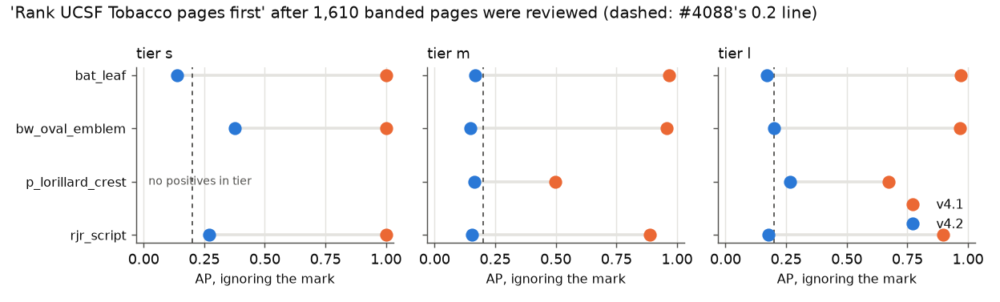
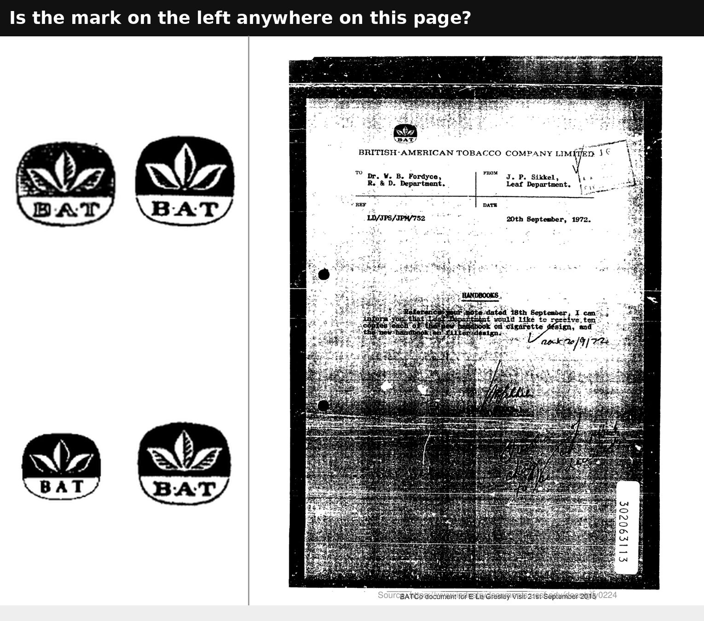
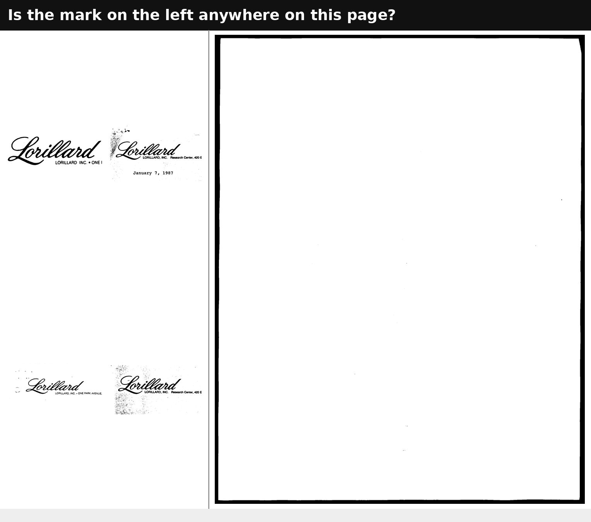

# DocMarks v4.2: reviewing the negatives a benchmark had never looked at

**2026-09-22 · #4088, #4089, #4087 · corpus v4.1 → v4.2**

## Result

Two hand passes, 2,153 Good/Bad questions, all answered the same afternoon.
66 of 66 planted known positives were found.

| pass | pages | carry the mark | became |
|---|---:|---:|---|
| **#4088** banded tobacco letters, four UCSF classes | 1,571 | **20** | 20 positives, 1,551 reviewed negatives |
| **#4089** SigLIP's top-ranked presumed negatives, all 27 classes | 516 | **0** | 516 reviewed negatives |

- **The banded review found real misses.** 19 of 1,060 bat_leaf pages (1.8%)
  carry the BAT emblem, and so does 1 of 66 p_lorillard_crest pages. Until
  today every one of them was a negative that no method could score on.
  rjr_script (0 of 324) and bw_oval_emblem (0 of 121) were complete.
- **It closes the UCSF classes' style shortcut at tier `m`.** A control that
  ignores the mark and ranks UCSF Tobacco pages first scored **AP 0.50–0.97**;
  it now scores **0.15–0.17**.
- **The top-hit review found nothing to fix.** None of the pages SigLIP ranked
  highest among the unchecked negatives carries the mark. A quarter of them are
  near-blank pages.



## #4088: banded tobacco letters

At v4.1 every positive of a UCSF class sat on a *banded* page, a single-page
tobacco-company letter chosen by the letterhead pull. The only other banded
pages in the pool were the 1–13 per class a person had rejected. So "is this a
tobacco letter?" nearly answered "does it carry the mark?"

`banded_review.py` samples banded tier-`s`/`m` pages **uniformly**, not by any
detector's ranking, so the new negatives aren't selected for being easy for
one. It sizes each class by simulating that control. Its AP is roughly
P/(P+N), so N scales with the class's positives: bat_leaf with 181 needed
1,060 pages, p_lorillard_crest with 9 needed 66. The target was 0.15, not the
issue's 0.2, to leave room for Good votes, which move a planned negative into
the positives. bat_leaf finished at 0.17 for exactly that reason.

Each question is a single-cell `ucsf_classes` sheet, applied by the same
`apply_ucsf_classes` that admitted the classes. A Good becomes a positive
located by its letterhead band (`ucsf_classes_band`), and a Bad becomes a
reviewed negative.

| class | pages | new positives | control at `m`, v4.1 → v4.2 | `s` | `l` |
|---|---:|---:|---|---:|---:|
| bat_leaf | 1,060 | **19** | 0.97 → **0.17** | 0.14 | 0.17 |
| rjr_script | 324 | 0 | 0.89 → **0.15** | 0.27 | 0.18 |
| bw_oval_emblem | 121 | 0 | 0.96 → **0.15** | 0.38 | 0.20 |
| p_lorillard_crest | 66 | **1** | 0.50 → **0.16** | (no positives) | 0.27 |

The residuals are small-sample effects:
- **Tier `s`:** 2–5 positives per class, so a handful of pages moves the control.
- **Tier `l`:** p_lorillard_crest has 13 more positives there, whose banded
  neighbours were not sampled.

A new positive, literally. A 1972 BAT memo so degraded the emblem is a smudge
at the top. It is exactly the page a detector-cleared pool would have kept as a
negative ([the rule](../2026-09-22-docmarks-ucsf-contamination/REPORT.md)):



**Extrapolated, the banded pool still holds ~40 unlabelled bat_leaf pages.**
The rate is 1.8% of the 3,122 unruled banded pages, and 1,060 were reviewed.
They sit on banded Tobacco pages, which no UCSF class is scored against, so
they cost no AP. They matter only if a study adds those pages back.

## #4089: the top of a real ranking

The contamination checks bound the *rate* of unlabelled positives among
presumed negatives. A rate bound is not a count bound, and an unlabelled
positive only distorts AP where a method ranks it high. So the pages worth a
look are the ones a real run put at the top.

- `eval_retrieval.py` now writes `surprise_hits.json`: each method's first
  `--surprise-k` (10) presumed negatives per class and tier.
- `surprise_review.py` turns them into queues, with planted controls.
- The answers are applied by `audit_to_corrections.py --task surprise`. A Good
  vote excludes the page and lists it for boxing; a Bad vote makes it a
  reviewed negative.

**Only SigLIP's hits were reviewed.** VLAD and its re-rank score a mean AP of
0.001 at tier `m`, so their "top" presumed negatives are random pages: an
expensive uniform sample, which the contamination checks already are. Including
them would have taken the pass from 516 pages to 1,246.

**0 of 516 carried the mark**: 96 hits at rank ≤ 3, 220 at ranks 4–10 and 200
below rank 10. Ranks count the positives above them. SigLIP's worst errors on this benchmark are
therefore its own, not the labels':
- **They are shared.** The 516 hits are only 294 distinct pages. One Tobacco800
  page tops the list for 11 classes, and three blank UCSF pages for 9–10 each.
- **A quarter are near-blank.** 119 of 516 hits (45 of 294 pages) have under
  0.2% ink (`measurements/tophit_ink.json`). Ranking a blank page above the mark
  is a failure a better embedder should fix, and the benchmark scores it
  correctly.



## #4087: the four UCSF classes, re-scored

`own_verified`, the headline pool. At v4.0 the pool was ~2,900 pages; at v4.2 it
is ~4,850 at `s` and ~47,000 at `m`.

| class | n+ (m) | SigLIP v4.0 | source-only control v4.0 | **SigLIP v4.2** | SIFT @8192 v4.2 | Tobacco-first control v4.2 |
|---|---:|---:|---:|---:|---:|---:|
| bat_leaf | 200 | 0.42 | 0.98 | **0.11** | 0.82 | 0.17 |
| rjr_script | 52 | 0.47 | 0.65 | **0.16** | 0.91 | 0.15 |
| bw_oval_emblem | 16 | 0.03 | 0.41 | **0.00** | 0.88 | 0.15 |
| p_lorillard_crest | 10 | 0.10 | 0.12 | **0.01** | 0.75 | 0.16 |

**The v4.0 SigLIP numbers were mostly the shortcut.** On the same pool, a
control that ranked UCSF pages first without looking at the mark matched or beat
SigLIP on every class. On the v4.2 pool SigLIP scores 0.00–0.16 at `m`, below
the Tobacco-first control on three of four classes. SigLIP has not yet learned
these marks at all; it has learned where they appear.

**SIFT has learned them.** Exhaustive SIFT at 8,192 keypoints scores 0.75–0.91
on the same pools, 4.7–6.1× the mark-blind control. That is the evidence the
four UCSF classes are now measuring the mark rather than the letter.

The 23 anchor classes are unchanged (SigLIP mean 0.085 at `m` before and after),
as they should be: converting presumed negatives into reviewed ones changes what
is known about a page, not its score. SIFT @8192 on all 27 classes is
**0.79 at `s`** and **0.83 at `m`**; the DATASHEET's reference table now
carries both. The tier-`s` mean includes p_lorillard_crest, which has no positive
there and scores 0; over the 26 classes that do, it is 0.82.

## What this does not license

- **Band-located positives have no tight box.** The 20 new marks carry the
  letterhead band, like the 44 band-located marks before them. That is fine for
  retrieval, but a localisation study must drop or box them.
- **The banded pool is not complete.** See the ~40 estimate above; it is out of
  every scored pool, but it is not clean.
- **Top hits come from one method.** A method that ranks differently surfaces
  different pages. The tooling is built to be re-run on any new method's
  `surprise_hits.json`.

## Reproduce

```
cd scripts/experiments/docmarks
python banded_review.py --out <root> --emit                              # #4088 queues + slate
python eval_retrieval.py --tiers s,m --out <run>                         # writes surprise_hits.json
python surprise_review.py emit --hits <run>/s/surprise_hits.json --hits <run>/m/surprise_hits.json --out <root2>
python binary_review.py load --queue <root>/<queue> ...                  # onto the dashboard
python binary_review.py bank --root <root>                               # after answering
python audit_to_corrections.py --task ucsf_classes --audit-dir ucsf_banded_banked --reviewer <name> --apply
python audit_to_corrections.py --task surprise --audit-dir surprise_banked --reviewer <name> --apply
```

The re-score rows are in `measurements/rescore/` (`eval_*.csv` from
`eval_retrieval.py`, `sift_*.csv` from `eval_sift_rank.py --budget 8192`).
Verdicts are in `measurements/banded_verdicts.jsonl` (1,610 rows) and
`measurements/tophit_verdicts.jsonl` (543 rows). The controls came from
`measure_shortcut.py`, and the ink shares from `measure_blank.py`. Detector
backups are in `keep/detectors-cleared-20260922/`, and the pre-apply corpus in
`corpus/backup-pre4088-20260922/`.
