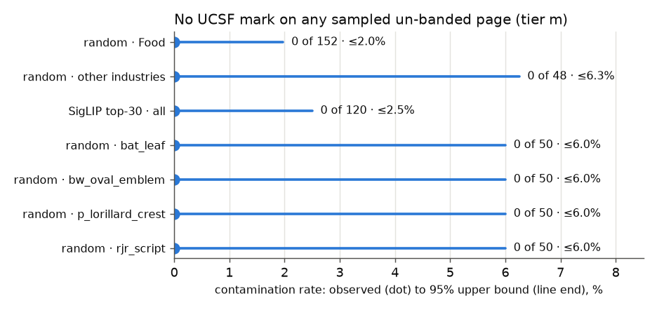
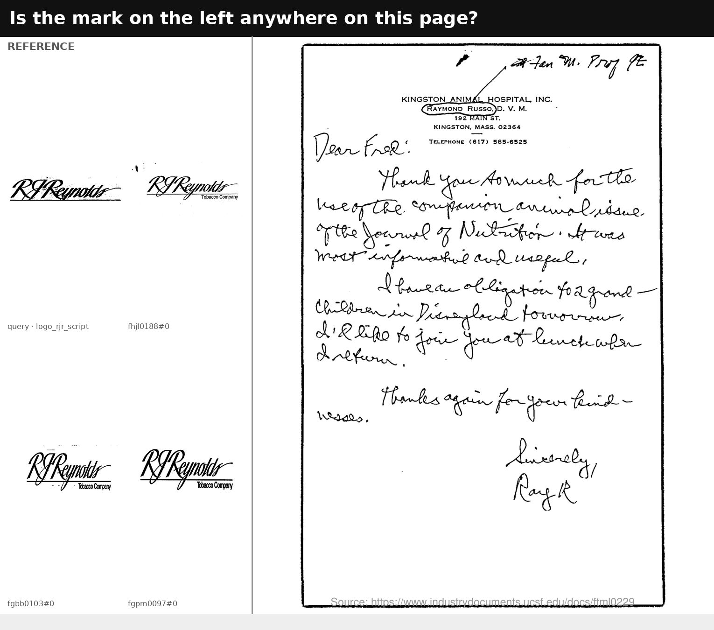
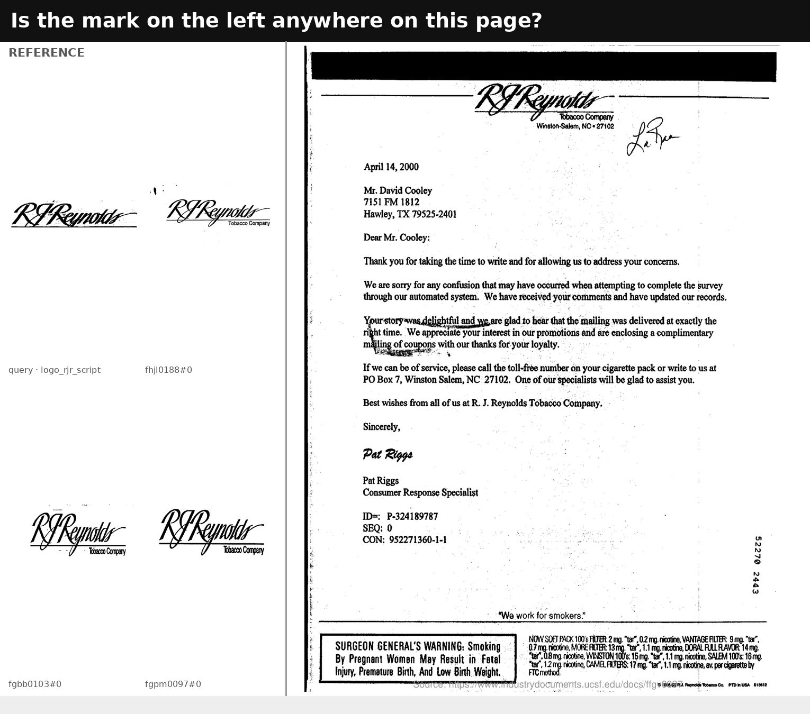
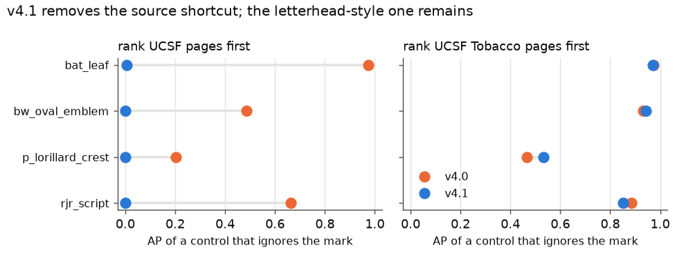

# FullMarks: can the four UCSF classes score against the rest of UCSF?

**2026-09-22 · #3922 · corpus v4.0 → v4.1**

## Result

**Yes, and v4.1 does it.** No sampled page carries the mark. That covers 200
random un-banded UCSF pages and each class's SigLIP top 30, 120 pages, across
the four UCSF roster classes. All **6 of 6** planted controls were found. The
contamination rule for a UCSF class narrows from *all of UCSF* to *UCSF's
Tobacco industry*. At tier `m` that takes each class's headline pool from
~2,900 pages to ~46,700.



| sample | n | pages carrying the mark | 95% upper bound (3/n) |
|---|---:|---:|---:|
| random, Food | 152 | **0** | ≤2.0% |
| random, other industries (Opioids 47, Chemical 1) | 48 | **0** | ≤6.3% |
| SigLIP top 30 per class | 120 (111 Food) | **0** | ≤2.5% |
| random, per class | 50 each | **0** | ≤6.0% each |
| planted controls | 6 | **6 found** | |

## Why this was asked

The four UCSF classes (`bat_leaf`, `bw_oval_emblem`, `p_lorillard_crest`,
`rjr_script`) were admitted at v4.0. Their own source was excluded wholesale,
so every one was ranked against ~2,900 pages while the other 23 classes face
~45,000. No mean over all 27 meant one thing (#3922).

Excluding UCSF wholesale was broader than it had to be. The letterhead pull
that produced these classes looked only at single-page `type:letter`
documents from listed tobacco authors. **Those "banded" pages are exactly UCSF's
Tobacco industry: 13,857 pages, and nothing else.** The band classes miss most
of their own mark inside that set (#3922), so it has to stay out. The other
five industries were never looked at by anything. That is a metadata query,
not a detector, so its misses can't correlate with how faint a mark is. That
makes it a legitimate provenance argument for a negative
([the rule](../2026-09-20-fullmarks-contamination/REPORT.md#what-it-licenses-and-what-it-does-not)).
The argument needed checking, not assuming.

## Design

This is the 2026-09-20 contamination check (#4067, #4070) on a new frame,
`contamination_sample.py --mode ucsf-unbanded`, seed pinned in the source:

- **Frame:** tier `m` UCSF pages with no `letterhead_author`, 43,882 pages
  (Food 15,796, Opioids 26,954, Chemical 826, Drug 234, Fossil Fuel 72).
- **Random arm, weighted 3:1 toward Food.** These are tobacco marks, and
  Food is the one documented route into another industry: Philip Morris owned
  Kraft and RJR owned Nabisco. Rates are reported per stratum, never pooled.
- **Ranked arm:** each class's SigLIP top 30 over the whole frame. An
  unlabelled positive only moves AP where it ranks high.
- **Controls:** 1–2 known positives per class, shuffled in, with an anonymous
  footer so nothing gives them away.
- One question per page, one class per queue, all four answered on 2026-09-22.

Two literal questions, both from the `rjr_script` queue:

| a Food page in SigLIP's top 30 for RJR: **no** | planted control: **yes** |
|---|---|
|  |  |
| `ucsf/ftml0229#0`, a handwritten note on Kingston Animal Hospital letterhead. SigLIP matched the script. | `ucsf/ffgv0097#0`, an RJR consumer-response letter. The mark is unmistakable. |

## What v4.1 changes

`CONTAMINATES["ucsf"]` goes from `{"ucsf"}` to `{"ucsf:Tobacco"}`. That is the
per-page rule Tobacco800 has used since #3904. A test pins Tobacco as the
only pulled industry a UCSF class may not use, so a renamed industry can't
quietly admit the banded pages.

| class | positives (m) | pool v4.0 | pool v4.1 |
|---|---:|---:|---:|
| `bat_leaf` | 181 | 2,965 | 46,847 |
| `bw_oval_emblem` | 16 | 2,813 | 46,677 |
| `p_lorillard_crest` | 9 | 2,834 | 46,680 |
| `rjr_script` | 52 | 2,858 | 46,720 |

At tier `l` the pools reach ~186,000. No added page is from the Tobacco
industry and no page leaves any pool (`measurements/pools.json`).

**It's a minor bump.** By the DATASHEET's rule, pages, tiers, labels and roster
are unchanged. The other 23 classes' numbers carry over. The four UCSF classes
must be **re-scored**. No cell needs a relabel, because pools are computed at
scoring time.

## The shortcut this does not fix



At v4.0 the UCSF classes' headline pool had the source shortcut `own_verified`
was built to remove. Positives were nearly the only UCSF pages in it, so
"rank UCSF first" scored **AP 0.20–0.97**. At v4.1 that control scores
**0.00**.

A narrower shortcut survives. Every positive is on a banded Tobacco-industry
letter. The only other such pages in the pool are the **1–13 per class**
that a person reviewed and rejected. "Rank UCSF Tobacco pages first" scores
**AP 0.53–0.97** under both versions. No method sees the industry field, but a
method that has learned "tobacco company letterhead" rather than the mark
approximates it. So a UCSF-class number is good for comparing methods and not
yet good as a headline. The DATASHEET now says so.

The fix is same-style known negatives: reviewed banded pages that don't carry
the class's mark. That is the banded-pool review #3922 already plans, and it
also completes the positives (#4088).

## What this does not license

- **A rate bound is not a count bound.** 1% of a 46,700-page pool is ~470
  pages, against 9–181 positives per class. The check shows nothing is
  *common*, and that nothing sits at the top of a SigLIP ranking. It can't show
  that nothing is there. Adjudicating top-ranked "false positives" before a
  result is final (#3922 rung 3, #4089) is what handles the residual.
- **Tier `m` only.** Tier `l`'s further 139,000 un-banded pages come from the
  same pull and industries, but nobody looked at them.
- **SigLIP chose the ranked arm.** A copy SigLIP can't see isn't in it. The
  random arm is the detector-free part.

## Reproduce

```
cd scripts/experiments/fullmarks
python contamination_sample.py --mode ucsf-unbanded --out <dir>   # render the queues
python binary_review.py load --queue <dir>/*__contam              # onto the dashboard
python ../../../docs/experiments/2026-09-22-fullmarks-ucsf-contamination/measure.py
python ../../../docs/experiments/2026-09-22-fullmarks-ucsf-contamination/figures.py
```

The votes were banked from the four detectors and joined to class, page, arm
and industry in `measurements/verdicts.jsonl` (326 rows). The originals are
`/expscratch/sgreenberg/fullmarks/contam-ucsf/verdicts.final.jsonl`, and the
detector JSONs are archived under `keep/detectors-cleared-20260922/`.

## Follow-ups

- #4087: re-score the four UCSF classes at v4.1, each beside its mark-blind
  control.
- #4088: review banded pages into known negatives until the Tobacco-letter
  control drops below 0.2 AP. The same review completes the positives.
- #4089: turn each run's top-ranked presumed negatives into a review queue.
  That covers the residual that a rate bound can't, including the 17 anchor
  classes no sample has touched.
