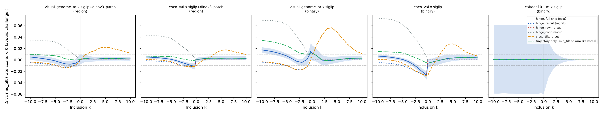
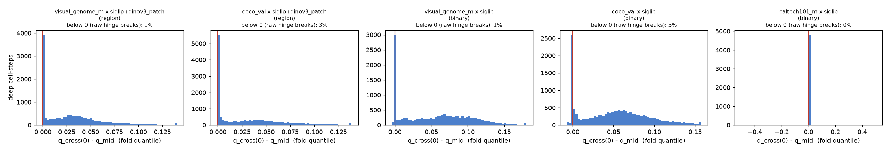
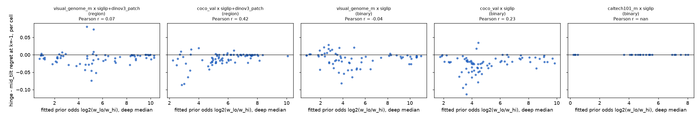
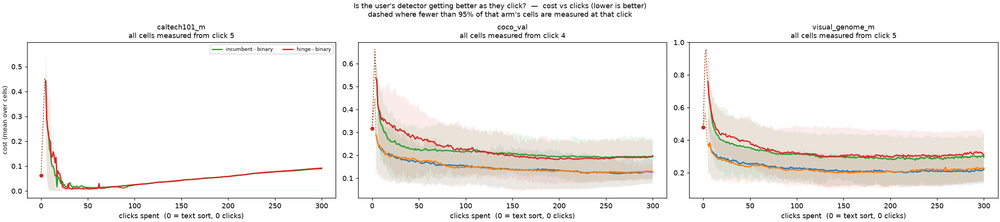
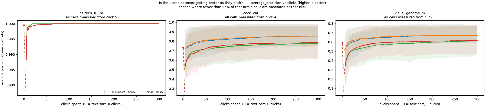

# A sign-dependent ("hinge") cut rule for the Inclusion knob (#3557)

> **⚠️ Raw-cell note (#4128, 2026-09-23).** The `coco_val × siglip` (binary COCO) rows read **un-normalised** vectors (#4099). "Nothing ships" is independent of them, because every harmed shipping stop is caltech or VG. But all three literal nesting-violation examples in §1 are `coco_val × siglip` cold starts and may be raw-norm artefacts; #4118 should draw its examples from elsewhere. See the [#4128 recheck](../2026-09-23-coco-siglip-recheck-4128/REPORT.md).

**Verdict: nothing ships.** `FOLD_ANCHOR_CUT_RULE` stays `mid_tilt`.

The guarded hinge keeps the nesting contract, both by proof and on every one of
184,686 measured cell-steps. **As a reporting line it is a clean win**: better
than the incumbent at 40 of 105 (environment, k) stops, worse at none. **As a
shipped rule it fails** the pre-registered decision rule on three counts. The
reason is not the reporting cut. The acquisition cut reads the same estimator
below the seam, and the votes it collects end Visual Genome sessions worse
(final cost +0.025 binary, +0.014 region). The split that follows,
**hinge for reporting and `mid_tilt` for acquisition**, is a different rule
with a different contract to prove. It is filed as **#4118**.

Plan (pre-registered before the first cell ran): [PLAN.md](PLAN.md). Interactive
viewer: [viewer.html](viewer.html).

## 1. The rule, and the contract

Write `M(k)` for `mid_tilt`'s combined fold quantile and `C(k)` for
`cross_tilt`'s (the rule that keeps the mixture weights as priors). Both are
non-increasing in k. Three hinge arms, all equal to `mid_tilt` at every k >= 0:

| arm | below k=0 | nested? | measured violations |
|---|---|---|---|
| **`hinge`** (the candidate) | `max(C(k), M(k))` | **yes, by construction** | **0** of 184,686 cell-steps |
| `hinge_raw` (#3557's literal rule) | `C(k)` | only where `C(0-) >= q_mid` | **3,550** (1.9%) |
| `hinge_cont` (decomposition) | `q_mid + C(k) - C(0)` | yes, by construction | 0 |

The proof is short. For k < 0 <= k', `H(k) >= M(k) >= M(0) >= M(k') = H(k')`,
and a max of non-increasing functions is non-increasing. It is written into
`FoldAnchoredCut._quantile_at`. It is checked by a property test over 40 random
two-fold estimators on a 0.05-step grid that approaches the seam from both
sides (`tests_lib/detectors/test_hinge_cut_rule.py`). Every other rule on the
grid (`mid`, `mid_tilt`, `rate`, `cross_tilt`) also measured 0 violations.

**The literal rule really breaks, and not where the unit test predicted.** The
test's counterexample is a rare, wide Good component. On real fits, the large
violations are **cold-start** fits (clicks 5 and 6) whose prior odds are
**negative**: the mixture puts more weight on Good than on Bad, so `cross_tilt`
becomes wildly inclusive. Literal cases, all `coco_val x siglip`, admitted items
out of 2,476:

| cell | click | k=-1 | k=-0.25 | k=0 | prior odds (bits) | `q_cross0` / `q_mid` |
|---|---|---|---|---|---|---|
| `toothbrush` s0 | 6 | 2476 | 2476 | 1349 | -1.4 | 0.000 / 0.48 |
| `cat` s1 | 5 | 2449 | 2475 | 1375 | -1.1 | 0.000 / 0.47 |
| `baseball bat` s3 | 6 | 2329 | 2420 | 1350 | -1.3 | 0.007 / 0.45 |

Asking for *fewer* false alarms (k=0 to -0.25) would admit 1,100 more items. In
all, 1.4% of incumbent cell-steps break at the seam (-0.25 vs 0), and 0.7% break
already at the integer stop (-1 vs 0).

## 2. What was run

Two run-level arms, paired on cell (dataset x embedder x category x seed), on
dev `054c62d88` plus this branch. Shipped defaults everywhere else: linear SVM
head, kappa=0.3, `qmean`, 2 folds, acquisition offset **-4**, exclusion floor.
This was checked by preflight 12, and the one divergence (`live_cut_rule`) was
declared. 300 clicks, 4 seeds, **312 cells per arm, 624 of 624 completed, 0
failed, 0 dropped**.

| environment | voting | cells/arm |
|---|---|---|
| `visual_genome_m x siglip+dinov3_patch x max_patch` | region | 68 |
| `coco_val x siglip+dinov3_patch x max_patch` | region | 76 |
| `visual_genome_m x siglip x whole_image` | binary | 68 |
| `coco_val x siglip x whole_image` | binary | 76 |
| `caltech101_m x siglip x whole_image` | binary | 24 |

- **Arm A `incumbent`** is the live rule `mid_tilt`. Its `__cutincl` frame
  re-cuts every rule at every stop on the *same* fit, which gives the
  **reporting-only** price, paired within the step.
- **Arm B `hinge`** is the live rule `hinge`. It is what a user of the shipped
  rule gets, because acquisition re-cuts the same estimator at k-4.

All numbers are on the rate scale (`/2^|k|`, #2865). Each cell is reduced to
its deep-band mean (more than 100 votes), then differenced, then bootstrapped
over cells (2000 resamples). Values are mean +/- SE with 95% CIs. Every table is
per environment.

**`caltech101_m` cannot discriminate between rules.** On its 838 media, every
fold haystack has an empty band between its modes. All seven rules admit the
same set at every stop (1.0 distinct sets across 21 stops, dead-step rate
1.00). This is #2865 section 7's "haystack ceiling" in its extreme form. Its
rows are reported, but they carry no information about the cut rule.

## 3. The reporting line: a clean win below zero

Arm A, `hinge` re-cut vs `mid_tilt`, delta regret x 1000 (negative favours the hinge):

| environment | k=-8 | -4 | -2 | -1 | -0.25 | >= 0 |
|---|---|---|---|---|---|---|
| VG region | -6.4 | -12 | -12 | -8.7 | -3.6 | 0 |
| COCO region | -2.1 | -6.3 | -10 | -11 | -11 | 0 |
| VG binary | -5.7 | -14 | -17 | -12 | -0.7 | 0 |
| COCO binary | -5.8 | -14 | -21 | -25 | -27 | 0 |
| caltech | 0 | 0 | 0 | 0 | 0 | 0 |

SEs are 0.4-4 x 10^-3. The best stop per environment:

- COCO binary: **-0.027 +/- 0.003** (k=-0.25)
- VG binary: -0.017 +/- 0.002 (k=-3)
- VG region: -0.014 +/- 0.002 (k=-3)
- COCO region: -0.012 +/- 0.003 (k=-0.5)

Over the 105 (environment, integer k) stops: **40 significantly better, 0
worse, 0 harmed**. #2865's asymmetry reproduces on today's stack: `cross_tilt`
alone is 34 better, 35 worse and 39 harmed, and the hinge keeps its left half.
The knob stays live: on arm A, `hinge` gives 0.1-0.4 fewer distinct admitted
sets than `mid_tilt` (for example 16.3 vs 16.6 on COCO binary), inside the
pre-registered 0.5.

Literal cells (COCO binary, k=-1, deep mean). At k=-1 a false alarm is priced
double, and the hinge trades FPR for FNR:

| cell | regret `mid_tilt` -> `hinge` | FPR | FNR |
|---|---|---|---|
| `scissors` s2 | 0.13 -> 0.019 | 0.17 -> 0.038 | 0.18 -> 0.22 |
| `elephant` s3 | 0.10 -> 0.020 | 0.12 -> 0.032 | 0.001 -> 0.003 |
| `toothbrush` s1 (the worst) | 0.041 -> 0.076 | 0.13 -> 0.029 | 0.21 -> 0.49 |

That is 72 cells better, 2 worse and 2 tied.

**The win is `cross_tilt`'s location, not its slope.** `hinge_cont` puts
cross's slope on the midpoint's location. It is resolvably *worse* at every
stop below zero, by up to +0.072 at k=-8 on COCO binary. The prior-keeping rule
helps because it sits **stricter** than `mid_tilt`. At inclusion 0 its median
quantile is 0.96-0.99 against the midpoint's 0.88-0.97, because the fitted
prior odds are 4-6 bits (Bad outweighs Good 16-64:1). The guard takes over
(C(k) < M(k)) on 3-14% of deep steps at k=-1, and on 22-48% at k=-10.

## 4. The shipped rule: the acquisition path pays for it

Arm B's `hinge` rows vs arm A's `mid_tilt` rows (full ship, delta cost x 1000):

| environment | k=-8 | -4 | -2 | -1 | -0.25 | 0 | +1 | +4 |
|---|---|---|---|---|---|---|---|---|
| VG region | +3.0 | -4.5 | -7.6 | -5.9 | -1.6 | +0.6 | +2.8 | +2.0 |
| COCO region | +4.1 | -1.1 | -6.9 | -9.7 | -11 | 0.0 | +1.8 | +3.0 |
| VG binary | **+15** | +2.3 | -4.4 | +0.5 | +15 | **+12** | +7.2 | -0.8 |
| COCO binary | +5.3 | -2.4 | -14 | -21 | -27 | -5.9 | -3.5 | +2.6 |

The trajectory-only contrast is the `mid_tilt` re-cut on arm B's votes vs on
arm A's. The rule is the same and only the votes differ, and this contrast
accounts for the damage. On VG binary it is **+0.012 at k=0 and +0.032 at
k=-8**. At k >= 0 the ship and trajectory-only columns are identical, because
the hinge *is* `mid_tilt` there.

At the reporting inclusion users sit at (k=0), end of session:

| environment | final cost delta [95% CI] | cost-AUC delta [95% CI] | positives delta | median clicks to incumbent's end cost |
|---|---|---|---|---|
| VG region | **+0.014 [+0.003, +0.026]** | -0.003 [-0.010, +0.005] | +5.1 | 63 -> 45 |
| COCO region | +0.003 [-0.005, +0.008] | +0.001 [-0.003, +0.004] | +3.7 | 33 -> 28 |
| VG binary | **+0.025 [+0.007, +0.043]** | **+0.016 [+0.005, +0.027]** | +6.6 | 61 -> 58 (16% never reach) |
| COCO binary | -0.003 [-0.011, +0.004] | +0.008 [-0.000, +0.017] | +3.1 | 26 -> 34 |
| caltech | +0.002 [-0.088, +0.093] | +0.001 [-0.044, +0.046] | +5.5 | 11 -> 11 |

The stricter acquisition cut harvests **more positives in every environment**
(+3 to +7, all resolved). It still ends VG sessions worse, and on VG binary the
loss is not a positives story: the correlation between delta positives and
delta cost over cells is 0.03. The losers find the same positives and end at a
worse cut:

| VG binary cell | final cost `incumbent` -> `hinge` | positives |
|---|---|---|
| `skateboard` s1 | 0.17 -> 0.40 | 15 -> 15 |
| `elephant` s3 | 0.13 -> 0.33 | 13 -> 13 |
| `laptop` s1 | 0.17 -> 0.35 | 25 -> 23 |

18 of 68 VG binary cells end more than 0.05 worse, and 6 end more than 0.05
better. Caltech's CI is wide because a handful of runs end stuck at cost ~0.7,
and which runs they are swaps between arms (`cougar_face` s1 fails under the
incumbent, `starfish` s2 under the hinge). That is a lottery, not an effect.

The knob also loses ground on the shipped trajectory. Distinct admitted sets,
arm B `hinge` vs arm A `mid_tilt`, paired: VG binary 13.0 vs 17.0, COCO binary
14.6 vs 16.6, VG region 14.6 vs 15.9, COCO region 12.8 vs 13.7. Most of that is
the trajectory, not the rule: arm B's own `mid_tilt` re-cut is 14.0 / 15.0 /
15.0 / 13.0 respectively.

## 5. Against the pre-registered rule

| rule | result |
|---|---|
| 1. Contract: 0 violations for `hinge` | **pass**: 0 of 184,686 (both arms) |
| 2. No stop with upper CI >= +0.010 | **fail on the ship**: 22 harmed stops, namely 8 on VG binary (k=-10..-5, 0, +1), 1 on VG region (k=-10) and 13 on caltech's lottery-wide CI. The **re-cut passes** (0 harmed). |
| 3. Resolved gain at k<0 in >= 3 of 5 environments | **pass**: COCO binary, COCO region, VG region |
| 4. Trajectory at k=0 not worse | **fail** in 4 of 5 (VG both, COCO binary AUC, caltech width) |
| 5. Knob within 0.5 of a stop | **fail** on the ship in all four live environments; passes on the re-cut |

**The shipped rule does not ship.** The measurement that separates the two
readings is the trajectory-only contrast. The hinge is good at deciding what to
*show*. Through acquisition, it is bad at deciding what to *ask about*.

## 6. What this changes

- `FOLD_ANCHOR_CUT_RULE` stays `mid_tilt`. `hinge`, `hinge_raw` and
  `hinge_cont` land as **eval-only** rules (`FOLD_ANCHOR_HINGE_RULES`). The
  shared constant `FOLD_LEVEL_CUT_RULES` tells the single-fit arm family which
  rules to skip.
- The harness gains `CALIB_LIVE_CUT_RULE` (a run-level live-rule arm, declared
  to preflight check 12), fractional inclusion stops in the cut-inclusion frame,
  and five per-step seam columns on it (`seam_q_mid`, `seam_q_cross0`,
  `seam_q_rate0`, `fit_log2_prior_odds`, `fit_log2_var_ratio`).
- **#3557's "cheap half"** (read #2865's `__cutdiag`) could not be done: #2865's
  run directory no longer exists. The seam columns are its replacement. They
  record the anchored fold fits' own prior odds and variance ratio, which are
  the quantities the hinge actually reads.
- **Follow-up #4118**: hinge for the reporting line only, with acquisition kept
  on `mid_tilt`. Its contract is the acquisition *gap* (`mid_tilt(k-4)` must
  stay at least as strict as `hinge(k)`), not nesting. Section 3's table is
  already its reporting price.
- #3546 (the knob's step shortfall) was out of scope and is untouched.

## Figures



*Per environment: the full ship (solid blue, with 95% band), the re-cut
`hinge`, `hinge_raw`, `hinge_cont` and `cross_tilt` (dotted/dashed), and the
trajectory-only contrast (green). Dashed grey lines mark the +/-0.010 bar. Read
the gap between solid and dotted blue as the price of the acquisition path.
Panels are not in comparable units of user pain across environments.*



*`q_cross(0) - q_mid` over deep cell-steps, arm A. Mass left of the red line is
where the literal hinge would break nesting. It is small in the deep band; the
large violations are cold-start fits (section 1).*



*Per cell: the fitted prior odds against the re-cut hinge's gain at k=-1.*



*The quality-over-clicks pair, one line per arm and voting mode, anchored at
click 0 on the free text sort. Green/red are incumbent/hinge on binary voting;
blue/orange are incumbent/hinge on region voting (the legend sits on the
caltech panel, which has no region cells). Per-seed panels are in `figures/*_runs__*.png`.*



## Reproducing

```bash
bash scripts/experiments/calibration/launch_hinge_3557.sh prepare
bash scripts/experiments/calibration/launch_hinge_3557.sh incumbent
bash scripts/experiments/calibration/launch_hinge_3557.sh hinge
HINGE3557_DEPEND=<A>:<B> bash scripts/experiments/calibration/launch_hinge_3557.sh analyze
python scripts/experiments/calibration/selftest_analyze_hinge_3557.py
python scripts/experiments/calibration/figures_hinge_3557.py --analysis $BASE/analysis \
  --out docs/experiments/2026-09-22-hinge-tilt-3557/figures --baseline $BASE/analysis/text_baseline.csv
```

Run directory: `/expscratch/sgreenberg/hinge-3557` (arrays 678747 / 679369).
Measured cell cost: region 40-67 min at 6.5 GB peak, binary 4-7 min.
