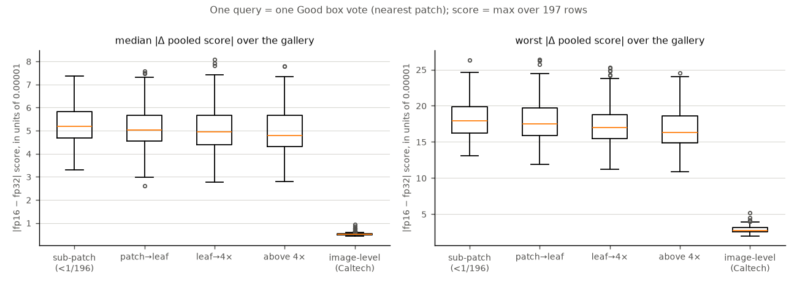
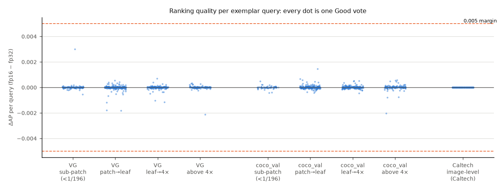
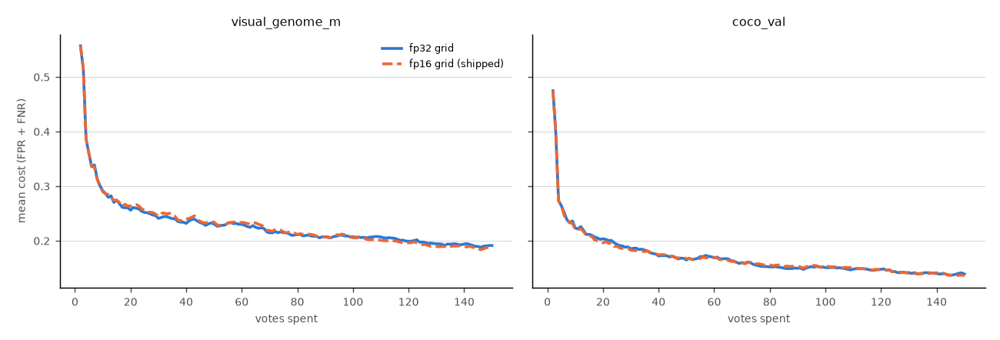
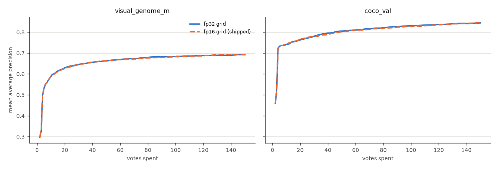
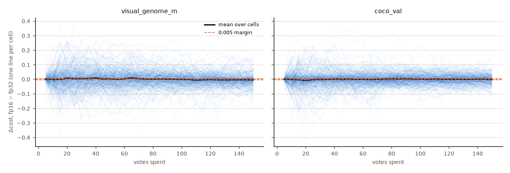
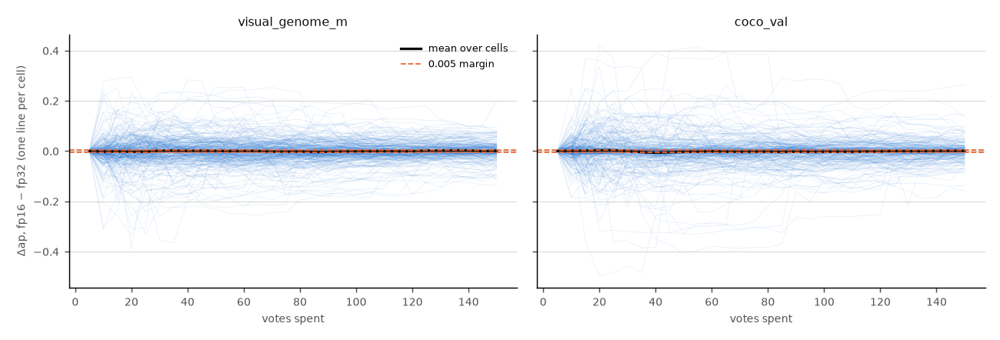
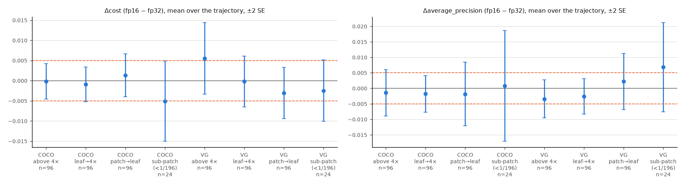

# The float16 patch grid: what the storage cast costs region voting

**Run:** 2026-09-22/23 · branch `claude/fp16-patch-grid-3159` · builds `678320`,
`678820` on `rack7n03` · drift `683007` · bench arrays `683344` (fp16) /
`683346` (fp32), 624 paired cells · analysis `692669`
**Data:** `/expscratch/sgreenberg/patchgrid-3159/{piles,drift,bench,bench_analysis}`
**Code:** `scripts/experiments/precision/*_3159.*` (see that directory's README)

Issue #3159: region voting reads a DINOv3 patch grid that ingest **stores
float16**, and the live scorer keeps its flattened region matrix float16 to
match. #3143 measured half precision in the *compute* path and left this arm
out on purpose. Nobody had measured the *storage* cast, which is where the
region path is actually quantised. The worry was that MaxPatch max-pools over
197 rows, that a max might amplify rounding error, and that sub-patch objects,
where the signal is weakest, would be hit hardest.

## Verdict

**Keep float16.** The cast is a non-event at every level we measured:

| level | what float16 changes | scale |
|---|---|---|
| a stored row | length, not direction: 1 − cos ≤ 0.00000024 on all 1.9M rows; median norm error 0.00004 | half of float16's step |
| the max-pooled score a vote reads | median 0.00005 per image; worst image in any gallery 0.00026 | about 1/20 of the 0.005 margin |
| retrieval order, 1,827 queries | Spearman ≥ 0.99999; top-10 overlap 0.999; **one** top-1 change, and that one was a tie | ties broken differently |
| ranking AP per query | 99% of queries within 0.001; worst 0.0030 (one exemplar), 0.033 (the tied centroid) | below the margin |
| a region-voting run, 624 paired cells | cost **+0.0001 ± 0.0012**, AP **−0.0011 ± 0.0015** (fp16 − fp32, whole trajectory) | **resolved below 0.005**; no split resolves from zero |

**The small-object regime gets no special treatment.** Pooled-score drift is
0.000052 in the sub-patch band and 0.000048 above 4×. A max is 1-Lipschitz, so
it cannot move by more than its largest row does, and every unit row moves by
about half of float16's step. A small object weakens the *signal*; it does not
enlarge the *rounding*. In the bench, the 48 sub-patch cells give cost
−0.0038 ± 0.0031 and AP +0.0038 ± 0.0057. Both point toward fp16 being *better*,
both are within 2 SE of zero, and neither is resolvable at this n (§3).

What float16 buys is **exactly half the memory** for the grid and the resident
region matrix (§4). The storage tradeoff costs nothing measurable, so it stays.

Two findings along the way matter more than the verdict, and both are about
**reproducing** a pile cell rather than precision (§1): the DINOv3 grid depends
on the **embed batch size**, and a second build in the same pile root
**silently drops every label** (#4117).

## Figures



*Figure 1. Max-pooled score drift per exemplar query (one Good box vote), by the
box band of the vote that made it. Left: the median image in the gallery.
Right: the worst image. The drift does not grow as the object shrinks. Caltech
(image-level queries, boxless) is 10× smaller because its winning row is
usually the CLS row, which the cast barely moves.*



*Figure 2. ΔAP (fp16 − fp32) for each of the 1,624 exemplar queries, split by
dataset and band. None reaches the 0.005 margin.*




*Figures 3–4. Mean cost and AP over the 150-vote trajectory, both arms, 312
cells per dataset. The two lines lie on top of each other.*




*Figures 5–6. Every cell's paired difference, one thin line each, with the
mean in black. Individual runs spread by ±0.2 because the trajectories diverge
(§3); the mean sits on zero.*



*Figure 7. Paired difference per dataset × band, whole trajectory, ±2 SE.
Every interval covers zero. The sub-patch intervals are wide because there are
only 24 cells each: one sub-patch category per dataset (§3).*

---

## §0. Making the two arms differ in one thing only

**One name for the dtype.** The cast was spelled `np.float16` in three places:
ingest (`_attach_patch_grid_to_media`), the live region matrix
(`matrix._build_region_arrays`), and the harness's MaxPatch stack
(`patch_styles`). A float32 arm that lifted only the storage cast would have
been re-quantised by the other two. It would then have compared float16 with
float16 and reported a perfect null. All three now read
`vtscore.embedding.matrix.PATCH_ROW_DTYPE` at call time. It is float16, so there
is no behaviour change. `tests_lib/core/test_patch_row_dtype.py` pins that value
and checks that every site follows the name. It is not an env knob, on purpose:
a stored grid keeps the dtype it was built with, so a runtime switch would flip
only half the path.

**The float16 arm is the published pile.** Its cells are symlinks to
`vts-cache/datadir/embeddings/*__dinov3_patch.pkl`. The float32 arm is a
rebuild in this study's own side pile. `run_cells_3159.py` asserts, per pickle,
that the grids on disk have the arm's dtype. It also records the dtype the
harness's scoring stack actually held (`dtype_<i>.json`: float32 in every fp32
cell). The opening (a SigLIP text sort; the arm is `siglip+dinov3_patch`, as in
the app) reads the same SigLIP file in both arms.

**`verify` gates everything.** It checks that the float32 grid, cast to float16,
equals the pile's grid **bit for bit**. When that holds, the pile cell *is* the
float32 cell passed through the storage cast, and nothing else separates the
arms. Final result, `measurements/verify.json`: ids, labels, boxes and CLS
identical, and **0 of 1.5 billion** cast grid elements differ, in all three
cells.

## §1. Reproducing the pile took three attempts

| attempt | result | cast-grid elements differing |
|---|---|---|
| today's builder, batch 64 | ~1.3% of elements off by one or more float16 steps; CLS off by up to 0.0000008 | VG 8.3M / 630M, COCO 9.8M / 750M, Caltech 1.6M / 130M |
| Caltech probe: batch 64 / 32 / 1, CPU dispatch default vs `avx2` | **batch 32 matches exactly**; 64 and 1 do not; CPU dispatch changes nothing | 0 at batch 32 |
| batch 32 + `adopt-cls` | grids exact, but VG came back with **no labels** | 0 |
| batch 32, cached base pickle deleted first | PASS | **0** |

- **The DINOv3 grid is not batch-invariant.** The pile cells predate the
  per-embedder batch table in `pile_config` and were embedded at the then-default
  batch of 32. A rebuild at today's 64 moves about 1.3% of elements by at least one
  float16 step, which is the same order as the cast itself. A rebuild at the wrong
  batch would have put a second difference of that size into every number
  here. The same holds for any future rebuild: for patch cells, "rebuild the
  cell" is not a no-op (#4117).
- **CLS vectors still differ by up to 0.00000003 at batch 32** (661 of 4,193 VG
  images, 128 of 838 Caltech, none on COCO). `adopt-cls` copies the pile's CLS in,
  and refuses if any vector differs by more than 0.000001. That row is float32 in
  both stored cells and only gets cast inside the scoring stack, which is part of
  the treatment.
- **A second build in the same root drops every label.** The demo loader
  caches `visual_genome_m.pkl` on the first build and reads it on the second,
  and that pickle's serializer drops `categories` and `regions`. The rebuilt cell
  had the right medias and vectors and **no labels**, and nothing failed.
  Filed as #4117, since the shared pile carries the same cache files.

## §2. Drift where a vote reads it: the max-pooled score

`grid_drift_3159.py` scores whole galleries the way the app does. For each arm
it builds `media_score_rows` at that arm's dtype (CLS row + 196 patches),
upcasts, takes the dot product with a query and max-pools per image. Each arm's
query comes from **its own** grid, because a Good box vote on a float16 dataset
trains on a float16 patch.

- **exemplar** query (1,624 in all): one Good box vote under the production
  nearest-patch rule (`pool_box_from_media`), 8 per category. Caltech is boxless,
  so its exemplars are image-level vectors.
- **centroid** query (203): the unit mean of a category's exemplars. It is closer
  to what a linear head learns, and it is never itself a row.

| | VG | COCO | Caltech |
|---|---|---|---|
| median \|Δ score\| per image, typical query | 0.000051 | 0.000051 | 0.0000050 |
| worst \|Δ score\| in the gallery, worst query | 0.00026 | 0.00025 | 0.000052 |
| images whose winning row changes, median query | 0.38% | 0.40% | 0% |
| fp32 gap between the top two rows on those images, median | 0.000043 | 0.000043 | 0.000005 |
| Spearman over the gallery, worst query | 0.999996 | 0.999996 | 0.999999 |
| largest single rank move, median query | 10 | 12 | 2 |
| ΔAP per exemplar query, mean ± sd | −0.000009 ± 0.00020 | +0.000006 ± 0.00016 | 0.0000001 ± 0.000002 |
| worst per-query \|ΔAP\| | 0.0030 | 0.0020 | 0.000014 |

The winning row changes only where the top two rows were already closer than
the cast's own error: on the images that flip, the top-two gap has a median of
0.000043, the same size as the drift.

| band (exemplar queries) | n | median \|Δ score\| | winner flips | ΔAP mean ± sd |
|---|---|---|---|---|
| sub-patch (< 1/196) | 222 | 0.000052 | 0.33% | +0.000006 ± 0.00022 |
| patch → leaf | 517 | 0.000050 | 0.36% | −0.000004 ± 0.00018 |
| leaf → 4× | 403 | 0.000050 | 0.41% | −0.000002 ± 0.00013 |
| above 4× | 282 | 0.000048 | 0.42% | −0.000006 ± 0.00021 |

Positives held at sub-patch scale moved at most 15 rank places (VG) and 12
(COCO), out of galleries of 4,193 and 4,952 images.

**The one top-1 change** (`measurements/drift/bear_top1.txt`): VG `bear`, centroid
query.

| arm | rank 1 | rank 2 |
|---|---|---|
| fp32 | `285685.jpg` (bear) 0.7219989 | `285937.jpg` (not a bear) 0.7219131 |
| fp16 | `285937.jpg` (not a bear) 0.7219952 | `285685.jpg` (bear) 0.7219341 |

The two images are 0.00009 apart, close to the cast's worst-case error. With 15
positives, one positive moving from rank 1 to rank 2 costs 0.033 AP. That is the
only query of 1,827 where the cast changed what a user would see first, and it is
a tie.

**Literal examples.** These are the largest rank moves
(`measurements/drift/examples.json` holds 60). Every one is a negative in the
middle of the ranking, crossing a gap smaller than the drift:

| query | image | fp32 → fp16 rank | score fp32 / fp16 | fp32 gap to the next image |
|---|---|---|---|---|
| VG `cow` (centroid) | `3108.jpg` | 1918 → 1945 | 0.45617 / 0.45602 | 0.0000006 |
| COCO `bird` | `000000402720.jpg` | 2453 → 2430 | 0.45992 / 0.46009 | 0.0000056 |
| COCO `hot dog` | `000000127270.jpg` | 2985 → 3007 | 0.41109 / 0.41095 | 0.0000027 |
| COCO `sheep` | `000000042628.jpg` | 3012 → 2990 | 0.37143 / 0.37158 | 0.0000024 |
| COCO `dining table` | `000000396863.jpg` | 2268 → 2247 | 0.55811 / 0.55832 | 0.0000024 |

## §3. The benchmark: 624 paired region-voting runs

The calibration harness ran at production defaults (MaxPatch, shipped cut
rule, 150 votes) with the paired `siglip+dinov3_patch` embedder. It covered
`visual_genome_m` and `coco_val`, 13 categories each chosen across the four scale
bands, 24 seeds, identical splits and identical opening. The pairs were matched
on (dataset, category, seed, t). Each cell was collapsed to its mean, and the SE
is taken over cells (#2825).

| split (fp16 − fp32) | cells | Δcost | ΔAP |
|---|---|---|---|
| **pooled, whole trajectory** | 624 | **+0.0001 ± 0.0012** | **−0.0011 ± 0.0015** |
| pooled, deep (t ≥ 100) | 624 | −0.0019 ± 0.0013 | −0.0003 ± 0.0015 |
| VG | 312 | +0.0005 ± 0.0020 | −0.0006 ± 0.0020 |
| COCO | 312 | −0.0003 ± 0.0013 | −0.0015 ± 0.0023 |
| sub-patch band | 48 | −0.0038 ± 0.0031 | +0.0038 ± 0.0057 |
| patch → leaf | 192 | −0.0009 ± 0.0021 | +0.0002 ± 0.0034 |
| leaf → 4× | 192 | −0.0006 ± 0.0019 | −0.0022 ± 0.0020 |
| above 4× | 192 | +0.0027 ± 0.0025 | −0.0024 ± 0.0024 |

The pooled cost, regret, AP, FPR, FNR and rule inefficiency are all **resolved
below the 0.005 margin** (`measurements/bench/analyze_bench_precision.txt`).
`calibration_shift` (+0.0011 ± 0.0021) sits just outside it. **No split, at any
level, is resolvable from zero.** Per band the n cannot resolve 0.005: the
sub-patch band has one category per dataset (`hat`, `sports ball`), because the
band selection finds only one candidate in each of these vocabularies. §2 is the
instrument that covers small objects well.

**Why the per-cell spread is ±0.2 when the vectors moved by 0.00005.** 0 of 624
cells kept an identical trajectory. The median cell first diverges at **vote 5**
(quartiles 5–6), and the arms chose the same threshold rule on 95% of steps. A
0.00005 score change reorders a near-tie in the acquisition sort, which changes
which image the simulated user sees next; from then on the two runs are
different sessions. This is #3143's finding again. The paired test bounds a
*systematic* effect, and the per-cell spread is trajectory noise, not precision.

## §4. What the cast buys

| cell | float16 grid (pile) | float32 grid |
|---|---|---|
| `visual_genome_m` (4,193) | 1.45 GB | 2.54 GB |
| `coco_val` (4,952) | 1.51 GB | 3.00 GB |
| `caltech101_m` (838) | 0.29 GB | 0.51 GB |

(The VG and Caltech pile cells also carry legacy HAC `patch_regions`, so their
ratio is below 2.) The resident region matrix is 197 × 768 × 2 bytes ≈ 300 KB
per image in float16, against 600 KB in float32. For a 25,000-image dataset that
is 7.4 GB rather than 15 GB of server RAM.

## Limits

- **One patch embedder.** A future patch embedder would get the same *relative*
  half-step; the absolute drift scales with row norm, and these rows are unit
  length.
- **The sub-patch band is thin in the bench** (48 cells). The drift analysis
  (222 sub-patch queries) carries the small-object claim, and it shows no band
  dependence to extrapolate from.
- **A bench-only side fix.** `analyze_bench_precision.py` (#3143) paired on `t`
  alone. Since #3400 turned safe thresholds on, each step emits ~33 rows (the
  production row plus counterfactual cut variants), so that pairing cross-joined
  them. It now keeps the production row (`_cells_io._base_rows`) and reads main
  frames through `_cells_paths`. #3143's own numbers predate #3400 and are not
  affected.

## Reproduce

```bash
cd scripts/experiments/precision
bash launch_grid_3159.sh build && bash launch_grid_3159.sh verify     # verify MUST pass
bash launch_grid_3159.sh drift
bash launch_grid_3159.sh prepare && bash launch_grid_3159.sh cells
bash launch_grid_3159.sh analyze
# copy $VTS_GRID_STUDY/{drift,bench_analysis} into measurements/, then
python docs/experiments/2026-09-22-patch-grid-fp16-3159/figures.py
```
