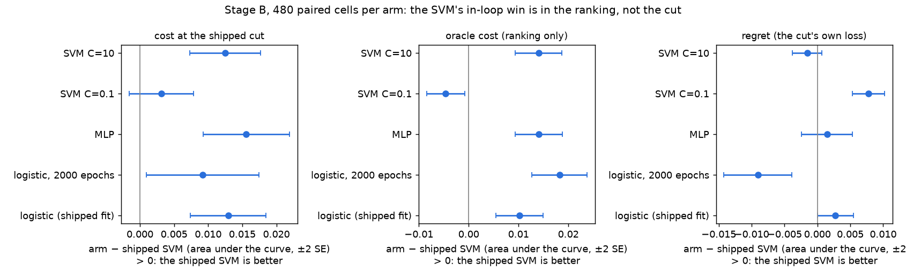
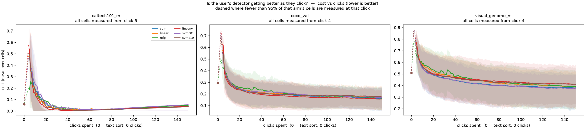
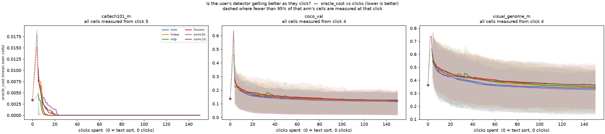
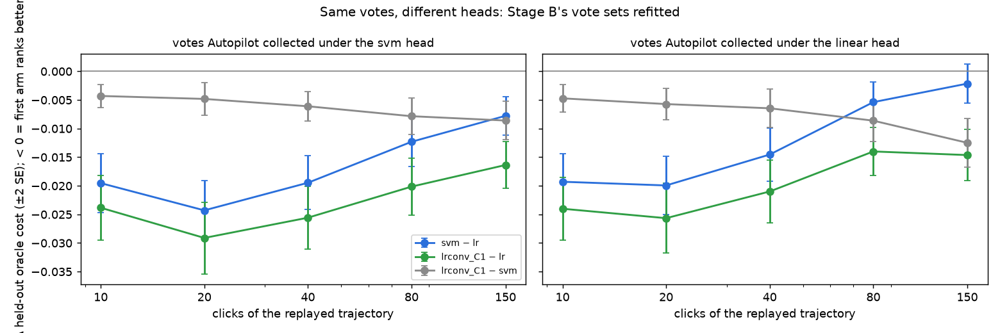
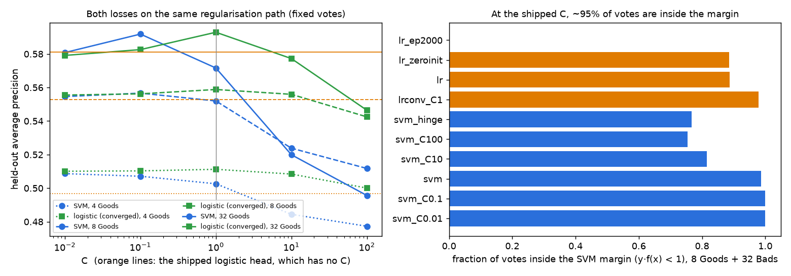
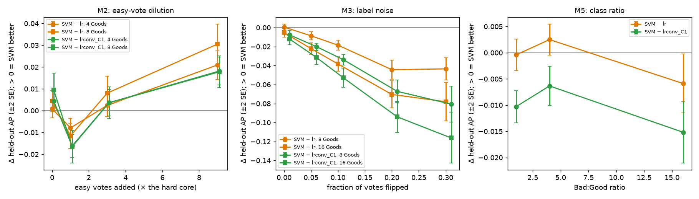

# Why does the linear SVM head beat the logistic one? (issue #3197)

**Question.** The shipped detector head is a linear SVM (`LINEAR_SVM_HEAD`, squared hinge + L2, C = 1). It replaced a logistic head (`LINEAR_HEAD`) on evidence from another environment, and the mechanism was left open. Both are one `Linear(D, 1)` over the same embeddings. Which property of the SVM is doing the work? The answer decides which inherited constants need re-tuning. Pre-registered design and decision rules: [`PLAN.md`](PLAN.md).

**Verdict in one paragraph.** The gap is real here and it is mostly **ranking**. Inside the Autopilot loop the SVM beats the old logistic head by **0.013 ± 0.003** cost (area under 150 clicks, 480 paired cells). **0.010 ± 0.002** of that is ranking (oracle cost), and only 0.003 ± 0.001 is the cut. But **the hinge loss is not what wins.** Refit on the very same Autopilot vote sets, a logistic regression fitted to convergence at C = 1 ranks **as well as the SVM, or slightly better** (oracle cost −0.004 to −0.009, resolvable at every click from 10 to 150). What loses is the way the old head was **fitted**: Adam at lr 1e-3, early-stopped at ≤ 200 epochs. That leaves its weight vector at cosine **0.75** to converged logistic regression, i.e. nowhere on the logistic regularisation path. Label smoothing and the random init have nothing to do with it; each changes AP by < 0.001. The three loss-shaped mechanisms the issue proposed are all **falsified** as explanations: the margin barely spares any vote at C = 1, the SVM is **less** robust to mis-votes (the textbook direction), and class ratio moves nothing resolvably. So the constant that most needs re-tuning is **C** itself, with the cut (#4115). The cheapest candidate improvement is a properly fitted logistic head (#4114).

## Environments

Three pile datasets that depend on none of `vg_scale`, FullMarks or `coco_better`, whole-image voting, harness-selected categories, 5 seeds, 150 clicks:

| dataset | images | categories | embedders |
|---|---|---|---|
| `caltech101_m` | 838 | 6 (prevalence-spread) | `siglip`, `siglip2_l` |
| `coco_val` | 4952 | 19 (box-scale bands) | `siglip`, `siglip2_l` |
| `visual_genome_m` | 4193 | 23 (box-scale bands) | `siglip`, `siglip2_l` |

That is 96 (dataset, embedder, category) cells × 5 seeds = **480 cells per arm**. Every arm finished all 480 with 0 unreadable, 0 zero-byte and 0 starved cells ([`stageB_provenance.json`](stageB_provenance.json)).

**A defect found on the way (#4099).** The pile's `coco_val__siglip` cell stores **un-normalised** vectors, with norms 12–19 where every other cell is unit-norm. The app normalises at ingest, but the harness reads cells raw, so every previous harness run on `coco_val × siglip` trained on vectors the app never produces. This study reads a private datadir that links the pile's cells and normalises that one ([`make_datadir.py`](../../../scripts/experiments/svm_vs_logistic/make_datadir.py), [`datadir_report.json`](datadir_report.json)). It also keeps the raw copy as a natural input-scale arm (M5).

**Caltech is saturated.** Every head reaches AUROC ≈ 1 on these six categories (as #3954 found), so Caltech contributes zeros to every ranking contrast. The gap lives on COCO and VG.

## Two stages

- **Stage B: the heads inside the loop.** Each head is its own Autopilot trajectory on the shipped threshold path (fold-anchored fusion), so the head also chooses the next vote. There are six arms: `svm` (shipped), `linear` (the old logistic head), `mlp` (the retired MLP), `linconv` (the logistic loop run for 2000 epochs without early stop), and `svmc01` / `svmc10` (C = 0.1 / 10). Arms are paired on the cell. Launcher: [`launch_svmlog_3197.sh`](../../../scripts/experiments/calibration/launch_svmlog_3197.sh).
- **Stage A: the heads on fixed votes.** Every arm is fitted on the **same** vote set and scored on the harness's own held-out half, so the difference is only what the objective did with the votes. There are two sources. **Controlled** sets are composed to switch one mechanism on at a time. **Replays** are Stage B's own Autopilot vote sets from the `svm` and `linear` arms, cut at clicks 10–150. The two production heads are called through `train_model`. Every other arm is a one-knob replica whose all-defaults form is asserted identical to the production fit before anything is measured (SVM to 3e-8, logistic bit-exact) ([`heads.py`](../../../scripts/experiments/svm_vs_logistic/heads.py), [`stage_a.py`](../../../scripts/experiments/svm_vs_logistic/stage_a.py)).

Every difference below is paired, with a standard error clustered on (dataset, embedder, category). Differences are called **not resolvable** when |mean| < 2 SE.

## Control: the shuffled-label test (#3945)

Every label in the cell is permuted, then the controlled base sets are rerun with 8 and 16 Goods, beside a REAL twin drawn from the same state:

| arm | NOISE held-out AUROC | NOISE train AUROC | REAL held-out AUROC |
|---|---|---|---|
| shipped SVM | 0.498 ± 0.002 | 1.00 | 0.86 |
| old logistic head | 0.498 ± 0.002 | 1.00 | 0.86 |
| converged logistic C=1 | 0.499 ± 0.002 | 0.98 | 0.87 |

Every head separates coin-flip labels perfectly on its own votes and scores chance on held-out images ([`A_control.csv`](A_control.csv)). The split does not leak, and a difference in held-out ranking is a difference in generalisation, not in memorisation. This control underwrites every Stage A number below.

## G0: is there a gap to explain? Yes, and it is ranking



*Each arm minus the shipped SVM, averaged over clicks 1–150, ±2 SE, 480 paired cells. Right of zero means the shipped SVM is better. Oracle cost is the best cut the test labels allow, so it measures the ranking alone. Regret is cost minus oracle cost, the cut's own loss.*

| arm − shipped SVM (area under 150 clicks) | cost | oracle cost | regret | AUROC |
|---|---|---|---|---|
| old logistic head | **+0.013 ± 0.003** | **+0.010 ± 0.002** | +0.003 ± 0.001 | −0.006 ± 0.001 |
| logistic, 2000 epochs | +0.009 ± 0.004 | **+0.018 ± 0.003** | −0.009 ± 0.003 | −0.009 ± 0.001 |
| MLP | +0.016 ± 0.003 | +0.014 ± 0.002 | not resolvable | −0.008 ± 0.001 |
| SVM C = 0.1 | not resolvable | **−0.005 ± 0.002** | **+0.008 ± 0.001** | +0.002 ± 0.001 |
| SVM C = 10 | +0.013 ± 0.003 | +0.014 ± 0.002 | not resolvable | −0.006 ± 0.001 |

The shipped SVM's advantage over the old head is about **80% ranking** (0.010 of 0.013). It concentrates on VG (cost +0.030 ± 0.010 on `siglip`, +0.032 ± 0.014 on `siglip2_l`) and COCO (+0.012 ± 0.005, +0.013 ± 0.003), with Caltech at zero ([`stageB_paired.csv`](stageB_paired.csv)). By click the ranking gap is largest early (oracle cost +0.019 ± 0.004 at click 10, +0.016 at click 40) and shrinks to +0.005 ± 0.002 by click 150. Average precision alone is not resolvable (−0.004 ± 0.002); the difference shows in AUROC and oracle cost.

Quality over clicks, averaged and per run (the standard pair), from the shared [`curves.py`](../../../scripts/experiments/calibration/curves.py). Click 0 is the zero-click text sort:



*Cost at the shipped cut, one panel per dataset, one line per arm, mean over categories and seeds.*



*The same, for oracle cost (ranking only).*

Per-run views, every seed as its own line: [`cost_vs_clicks_runs__visual_genome_m.png`](figures/cost_vs_clicks_runs__visual_genome_m.png), [`cost_vs_clicks_runs__coco_val.png`](figures/cost_vs_clicks_runs__coco_val.png), [`cost_vs_clicks_runs__caltech101_m.png`](figures/cost_vs_clicks_runs__caltech101_m.png). The interactive **[`viewer.html`](viewer.html)** carries every arm × dataset × category × metric.

## M1: is it the fit, not the loss? Survives, and it is the answer

If the loss were the mechanism, the logistic loss would stay behind the SVM once both are fitted the same way. It does not.

**On Stage B's own vote sets** (replay, 480 cells, held-out oracle cost; negative means the first arm ranks better):



| same votes | click 10 | click 20 | click 40 | click 80 | click 150 |
|---|---|---|---|---|---|
| shipped SVM − old logistic head | −0.020 ± 0.003 | −0.024 ± 0.003 | −0.020 ± 0.002 | −0.012 ± 0.002 | −0.008 ± 0.002 |
| converged logistic C=1 − old logistic head | −0.024 ± 0.003 | −0.029 ± 0.003 | −0.026 ± 0.003 | −0.020 ± 0.003 | −0.016 ± 0.002 |
| **converged logistic C=1 − shipped SVM** | **−0.004 ± 0.001** | **−0.005 ± 0.001** | **−0.006 ± 0.001** | **−0.008 ± 0.002** | **−0.009 ± 0.002** |

*Votes from the `svm` arm's trajectories. The `linear` arm's trajectories give the same signs: converged logistic − SVM is −0.005 to −0.013 ([`A_replay.csv`](A_replay.csv)).*

Holding the votes fixed reproduces the in-loop gap (0.020–0.024 early). The logistic **loss**, fitted to convergence, closes all of it and then passes the SVM. On controlled sets the same holds at each family's best C, chosen on the other seeds: converged logistic − SVM is **+0.003 ± 0.001 AP** at every size ([`A_bestC.csv`](A_bestC.csv)).

**What about the old fit loses?** The ladder from the shipped logistic head (controlled base sets, held-out AP, paired to the shipped logistic head; every SE ≤ 0.005):

| one knob changed | 4 Goods | 8 | 16 | 32 |
|---|---|---|---|---|
| no label smoothing | +0.0008 | +0.0003 | +0.0004 | −0.0001 |
| zero init instead of random | +0.0004 | +0.0003 | +0.0009 | +0.0009 |
| 2000 epochs, no early stop | −0.019 | −0.028 | −0.032 | −0.033 |
| converged sklearn logistic, C = 1 | +0.014 | +0.006 | +0.010 | +0.012 |

Neither smoothing nor init explains it. Running the **same Adam loop** longer makes it *worse*, because weight decay 1e-4 is almost no regularisation: the head drifts toward the hard-margin end (‖w‖ ≈ 21, no vote inside the margin). The in-loop `linconv` arm shows the same thing at scale (oracle cost +0.018 ± 0.003 behind the SVM). The early stop was the only thing regularising the old head. It regularised by **Adam's trajectory**, whose per-coordinate step sizes aim it in a different direction from the L2 path: at 8 Goods its weight vector has cosine 0.75 to converged logistic regression and 0.76 to the SVM, while the SVM and converged logistic regression sit at 0.96 to each other ([`A_geometry.csv`](A_geometry.csv)).



*Left: held-out AP along C for the SVM (blue) and converged logistic regression (green), with the old head as orange lines (it has no C). Right: the fraction of votes inside the SVM margin.*

## M2: margin insensitivity to easy votes. Falsified as the mechanism

The hinge only ignores votes that clear the margin. At the shipped C = 1 on unit-norm embeddings, **95%** of votes sit inside it (8 Goods + 32 Bads; 100% for the smaller sets). At that point the squared hinge is a squared loss on nearly every vote, which is why the SVM ranks within ~0.01 AP of a ridge classifier. There is almost nothing for the margin to spare.

The dilution arm (a uniformly hard core plus k× its size in easy votes, same core at every k) does not show the predicted monotone growth:

| SVM − old logistic head, held-out AP | k = 0 | 1 | 3 | 9 |
|---|---|---|---|---|
| 4 Goods | not resolvable | −0.008 ± 0.002 | not resolvable | +0.021 ± 0.003 |
| 8 Goods | not resolvable | −0.012 ± 0.003 | not resolvable | +0.031 ± 0.005 |



*Held-out AP, SVM minus each logistic head, along each manipulated axis (±2 SE). Left: dilution. Middle: label noise. Right: Bad:Good ratio.*

The SVM does gain once **90%** of the votes are easy (k = 9), and it gains against converged logistic regression as well (+0.018). So the textbook effect exists at an extreme. But the gap is negative at k = 1 and flat at k = 0, and on real Autopilot vote sets converged logistic regression beats the SVM anyway (M1). Autopilot's votes are not the 90%-easy regime where this effect would appear.

## M3: robustness to a mis-vote. Falsified, in the textbook direction

Flipping a fraction r of the votes:

| SVM − old logistic head, held-out AP | r = 0.05 | 0.1 | 0.2 | 0.3 |
|---|---|---|---|---|
| 8 Goods | −0.009 ± 0.002 | −0.019 ± 0.003 | −0.044 ± 0.005 | −0.044 ± 0.006 |
| 16 Goods | −0.022 ± 0.003 | −0.038 ± 0.004 | −0.070 ± 0.007 | −0.078 ± 0.010 |

The SVM loses ground with every mis-vote, against both logistic heads (−0.067 to −0.094 against converged logistic regression at r = 0.2). The fragility is specific to the **squared** hinge: the plain hinge beats it by +0.066 ± 0.006 AP (8 Goods) and +0.089 ± 0.007 (16 Goods) at r = 0.2. A single boundary mis-vote (the hardest Bad relabelled Good) is not resolvable against the old head at any size ([`A_mechanism.csv`](A_mechanism.csv)). So the SVM is **not** winning on noisy label sets. If users mis-click at a few percent, the shipped head pays for it. This is folded into #4114 as the tie-breaker.

## M4: ranking or cut? Ranking

This is covered under G0: 0.010 of the 0.013 in-loop gap is oracle cost, and regret is +0.003 ± 0.001. The one arm where the two halves disagree is **C = 0.1**. It ranks *better* than the shipped C = 1 (oracle cost −0.005 ± 0.002 in the loop, −0.003 to −0.008 on identical votes), but the shipped cut gives it back (regret +0.008 ± 0.001), for a not-resolvable net. The fold-anchored cut and its blend schedules were tuned on other heads' score scales. That interaction is #4115.

## M5: class balance and regularisation scale. Balance falsified; scale matters for the SVM

- **Bad:Good ratio** 1 / 4 / 16 at 8 Goods: SVM − old head is −0.000 / +0.003 / −0.006 ± 0.003. Not resolvable at any ratio.
- **Removing the class balance** hurts both heads, but not equally: the old logistic head loses 0.10–0.13 AP, the SVM 0.005–0.009. That asymmetry is real, but both shipped heads are balanced, so it explains no part of the shipped gap.
- **Input scale.** On the raw `coco_val × siglip` cell (norms ~15, so C = 1 behaves like C ≈ 225 on unit vectors), the SVM falls **0.031–0.039 AP behind** converged logistic regression, where on the normalised cell it is level (not resolvable). The SVM's result depends on where C lands relative to the data scale, which is also what M1 says about the logistic head's fit. It is the second reason #4099 matters.

## Literal examples

[`EXAMPLES.md`](EXAMPLES.md) (from [`examples.py`](../../../scripts/experiments/svm_vs_logistic/examples.py)) refits both shipped heads on the same 40 Autopilot votes for the cells with the largest in-loop gap, one per environment. It lists the held-out images the two heads rank most differently, with filenames. Two readings are worth checking by eye:

- **`visual_genome_m × siglip2_l`, `neck`, seed 0** (5 Good / 35 Bad votes): the SVM lifts true `neck` images such as `4951.jpg` (dog, eye, head, neck) from rank 669 to 341. Its largest "losses" are `2363.jpg` (girl, hair, jacket, man, pants, people) and `150418.jpg` (bench, eye, horse, pants, tail, woman). These are images of people and animals that almost certainly contain an **unlabelled neck**. Some of the SVM's apparent false positives on this category are annotation gaps, not model errors.
- **`coco_val × siglip2_l`, `microwave`, seed 1** (3 Good / 37 Bad): the SVM lifts `000000216497.jpg` (…microwave, oven, sink) from 1221 to 400 and `000000571313.jpg` (…microwave, mouse) from 289 to 112. Its losses are kitchen- and office-adjacent negatives (`000000413247.jpg`, laptop/mouse). With three Goods, both heads are ranking by "indoor appliance scene", and the SVM does so less noisily.

## What this changes

- **Nothing ships from this study** (a mechanism study, by brief).
- **`SVM_HEAD_C`** is the inherited constant that measurably matters. More regularisation ranks better, but only a cut re-tuned with it can bank that. **#4115.**
- **The logistic loss was never the problem.** A converged, balanced, L2 logistic head ranks at least as well on the same votes and is more robust to mis-votes. Whether it wins in the loop, with the shipped cut, is **#4114**.
- **The fold-anchored cut and blend schedules** (the issue's other two inherited constants): the cut costs the SVM only 0.003 relative to the old head, so neither needs re-tuning *for the head swap already made*. Both do need it for any C change (#4115).
- **The pile cell** `coco_val__siglip` must be normalised and the harness should normalise on load: **#4099.**
- Tooling: preflight check 12 now compares the heads' own app env knobs (`VTSEARCH_SVM_HEAD_C`, `VTSEARCH_TRAIN_EPOCHS`, `VTSEARCH_TRAIN_PATIENCE`) against their shipped defaults. Before this, a launcher that pinned them passed silently.

## Scope and limits

- Whole-image voting only. Region voting uses the same `Linear(D, 1)` but adds max-pooling and per-bag sample weights. It is out of scope here and noted in #4114.
- Two SigLIP embedders. DINOv3 and CLIP were not run.
- Stage A's controlled sets are compositions, not Autopilot trajectories. That is why the replay exists, and why every claim that bears on the shipped detector is quoted from the replay or from Stage B.
- One run bug is worth recording: the first replay pass cut clicks with `t < T` against a harness that numbers clicks from 1. It kept T − 1 rows, failed the length check, and emitted nothing, with every task reporting success. It now raises instead of writing an empty result.

## Reproduce

```bash
bash scripts/experiments/calibration/launch_svmlog_3197.sh datadir     # private unit-norm datadir
bash scripts/experiments/calibration/launch_svmlog_3197.sh prepare
bash scripts/experiments/calibration/launch_svmlog_3197.sh all         # six arms, cpu, ~2-8 min/cell
bash scripts/experiments/svm_vs_logistic/launch_stage_a.sh controlled
python scripts/experiments/svm_vs_logistic/harvest_picks.py <stageB>/svm   # and <stageB>/linear
bash scripts/experiments/svm_vs_logistic/launch_stage_a.sh replay
python scripts/experiments/svm_vs_logistic/analyze_stage_b.py --root <stageB> --out <analysis>
python scripts/experiments/svm_vs_logistic/analyze_stage_a.py --controlled <A>/controlled --replay <A>/replay --out <analysis>
python scripts/experiments/svm_vs_logistic/figures.py --analysis <analysis> --out <figures>
python scripts/experiments/svm_vs_logistic/examples.py --stageB <stageB> --out EXAMPLES.md
```

Run root on the GRID: `/expscratch/sgreenberg/svmlog-3197/` (Stage B cells, Stage A CSVs, analysis).
