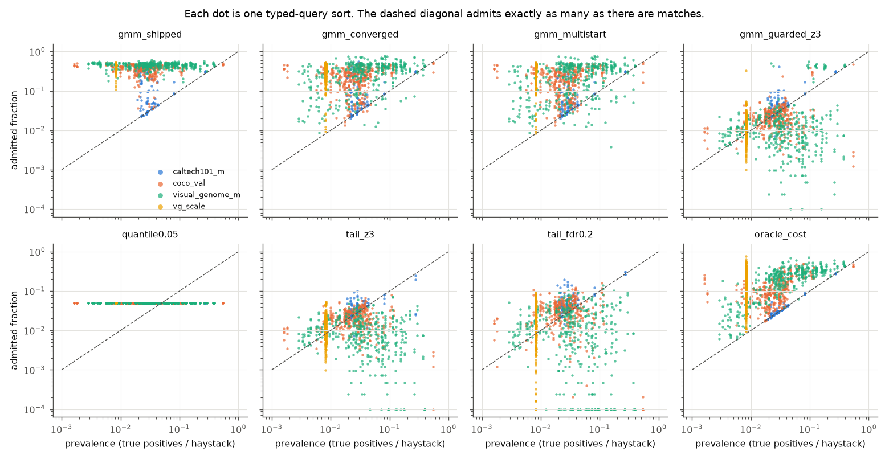
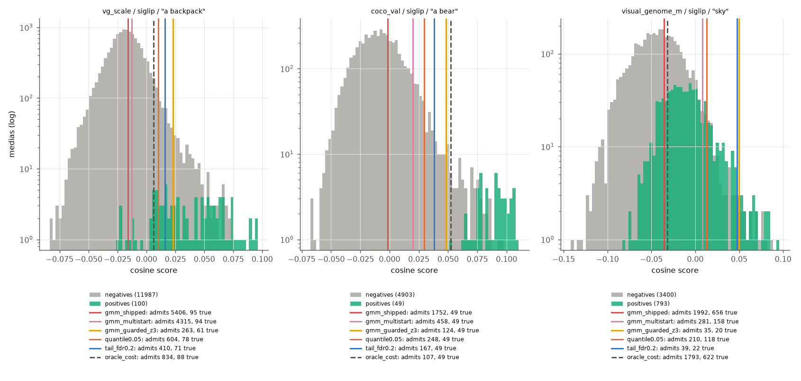
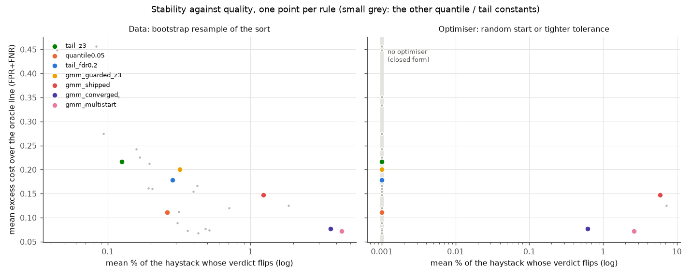
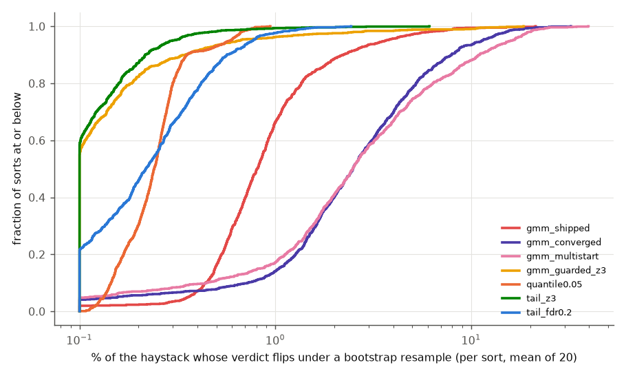
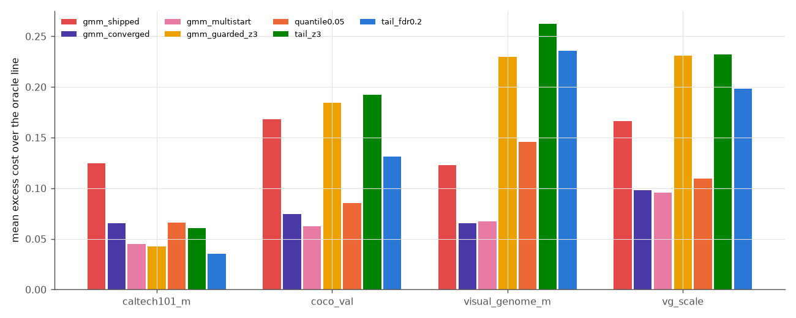
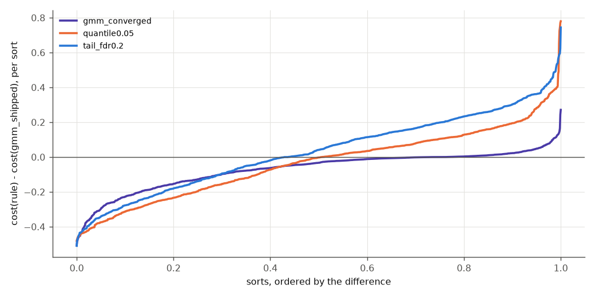

# What should draw the line on a typed-query sort? (issue #3826)

> **Decision needed from Sam.** This study does not change the shipped rule. It
> lays out five options, with numbers, and recommends one. Which one ships
> depends on what the line on a text sort is *for*, and that is a product
> judgment (see [The decision](#the-decision)).

Every text sort paints a green/red line at `calculate_gmm_threshold`: fit two
Gaussians to the cosine scores and cut at the midpoint of their means. #3585
found that on text sorts this fit is barely identifiable: starting sklearn's EM
somewhere else moved 6.5% of the verdicts, and a tighter tolerance moved up to
35%. #3826 asks what should replace it, or whether anything should.

This study captured **1,120 real text sorts with their labels**: 4 environments
× 4 text towers × every category with at least 5 positives. It then ran 30
candidate lines through two stability tests and scored each against the labels.

## The short version

1. **The instability is a symptom, and the disease is where the line sits.** The
   shipped line admits a **median 43% of the haystack**, while the median query
   has 2.6-3.5% true matches (0.8% on `vg_scale`). Outside `caltech101_m` it
   admits **12 to 54 times** as many medias as there are matches. A text sort is
   one broad mode with the matches as a thin right shoulder. The two-component
   fit therefore splits the *mode* itself, and the cut lands in the densest part
   of the distribution. At that point any small change in the fit moves
   thousands of medias.
2. **Stabilising the mixture fixes one instability and makes the other worse.**
   Running the same EM until it converges cuts the optimiser flip from **6.0%**
   of the haystack to **0.62%**. It also raises the bootstrap flip from **1.2%**
   to **3.6%**, and the line still admits 29%. Multi-start EM has the same
   pattern, at 2.6% and 4.4%.
3. **Lines that model only the bulk are stable, and they admit about the right
   number of medias.** One such rule cuts at the median plus 3 robust sigmas
   (`tail_z3`); a fixed 5% quantile is another. These rules have no optimiser,
   and their bootstrap flip is **0.13%-0.26%**, 5-9 times lower than the shipped
   line's. They admit 0.93-2.3× the number of true matches. Their F1 is
   **0.31-0.38 against the shipped 0.17**.
4. **Which rule is "best" depends on the loss, and the two readings disagree.**
   On the Inclusion-0 rate cost (FPR+FNR, the repo's scoring convention), the
   precise tail rules lose to the shipped line by 0.01-0.07. The best rules on
   that loss admit 10-26% of the haystack. On F1, or on precision of what is
   painted green, the tail rules double the shipped line.
5. **Recommendation: `gmm_guarded_z3`**, the issue's option 3. Keep the mixture
   when its components are clearly separated (Ashman's D ≥ 2, true on 9% of
   sorts, mostly `caltech101_m`). Otherwise cut at median + 3 × the
   left-half-MAD sigma. Against the shipped line it gives **F1 +0.22 ± 0.016**,
   a **bootstrap flip of 0.32%** (4× lower), and a median admitted/true ratio of
   **1.0** (shipped: 17). It costs **+0.053 ± 0.011** on FPR+FNR, and it fails
   on queries whose matches are the *majority* ("a person" in COCO, 54%
   prevalence).

## Reproducing the issue first

The #3585 corpus went through the new gate as a label-free stability frame,
with the pre-#3585 sklearn fit as a reference rule
([`tables/reproduce.csv`](tables/reproduce.csv)):

| | issue says | re-measured |
|---|---|---|
| `vg_scale`, 20 sorts: sklearn default vs `init_params="k-means++"`, mean admitted-set move | 869 medias, 6.5% | **869 medias, 6.5%** |
| the same, worst query | 27% | **28%** |
| the same EM run to a tight parameter tolerance, worst query | up to 35% | **36%** |
| overview text sorts (42): the k-means++ control | 6.2% (pooled with vg_scale) | **6.0%** |

The gate also asserts on every sort that its re-implemented `gmm_shipped` equals
`calculate_gmm_threshold` bit for bit. The capture checks the harness's scores
against the app's own `cosine_sort_with_boxes` on one category per pair, and 15
of 16 pairs agree to 1e-7. The exception is `coco_val`/`siglip`, whose pile
pickle holds unnormalised vectors (norms 12-18). That defect is filed as #4095.
The harness normalises, so the text-sort scores used here are true cosines.

## What was measured

| | shape | text towers | sorts | haystack | median prevalence |
|---|---|---|---|---|---|
| `caltech101_m` | single-label, one object per image | siglip, siglip2_l, clip, clip_l | 100 | 838 | 2.9% |
| `coco_val` | multi-label, 80 categories | same | 320 | 4,952 | 2.6% |
| `visual_genome_m` | multi-label, 100 categories incl. stuff (`sky`, `wall`) | same | 400 | 4,193 | 3.5% |
| `vg_scale` | 75 size-banded cells, 100 positives each | same | 300 | 12-16k | 0.82% |

Each sort's score array is the list the app passes to the cut. The query is the
curated text where one exists, otherwise the category name. No rule reads a
label.

**Two stability tests, because "stable" means two different things:**

- **Optimiser.** The same rule on the same data, with a random start (5 draws)
  or a tighter tolerance (1e-4, 1e-5). This is the issue's experiment. A
  closed-form rule has no optimiser, so its flip is zero by construction.
- **Data.** The rule on a bootstrap resample of the sort (20 draws, the same
  draws for every rule), applied back to the original sort. This asks how much
  of the line comes from the data and how much from this particular sample of
  it, and every rule can be asked it.

The **flip** is the fraction of the haystack whose verdict changes. Every line
is a threshold on the same array, so admitted sets are nested and the flip is
exactly `|Δadmitted| / n`. The Jaccard distance on the admitted set is reported
too, because a rule that admits little has little to flip.

**Quality** is scored against the labels in two ways that the rest of the report
keeps separate:

- **Cost = FPR + FNR**, the Inclusion-0 rate loss the repo scores everything
  with. Both errors are normalised by their own class, so on a query with 100
  positives among 12,000 media, missing one positive costs the same as 120
  false alarms.
- **F1 / precision**, i.e. whether what is painted green is mostly matches.

`oracle_cost` and `oracle_f1` are the best line each loss allows on each sort,
chosen with the labels.

### The candidates

| family | rule | what it is |
|---|---|---|
| shipped | `gmm_shipped` | `calculate_gmm_threshold`: 2-means init, EM to 1e-3 mean log-likelihood, midpoint of the means |
| mixture | `gmm_priorfree` | the same fit, #2836's rate-optimal crossing instead of the midpoint |
| mixture, stabilised | `gmm_converged` | the same EM run to 1e-10 (up to 5,000 iterations), so the stopping point is no longer a parameter |
| mixture, stabilised | `gmm_multistart` | best log-likelihood of 8 fully converged starts (2-means + splits at the 50th-99th percentile), so the starting point is no longer a parameter |
| prior-free, exact | `otsu` | the exact global 2-means split, found by a scan over the sorted scores: the mixture's question with no optimiser |
| rank | `quantile{q}` | admit the top q of the haystack, q from 0.5% to 20% |
| unimodal tail | `tail_z{k}` | median + k·σ, where σ = 1.4826 × the median distance of the *lower* half from the median (positives cannot inflate it), k from 1.5 to 5 |
| unimodal tail | `tail_fdr{a}` | the Benjamini-Hochberg-style cut at which a Gaussian bulk would explain at most a fraction a of what is admitted |
| guarded | `gmm_guarded_z3`, `gmm_guarded_fdr0.2` | the issue's option 3: `gmm_shipped` when its Ashman's D ≥ 2, else the tail rule |

## 1. Where the shipped line sits



*Each dot is one sort. The x axis is the fraction of the haystack that truly
matches, and the y axis is the fraction the rule admits. On the dashed diagonal
the admitted count equals the number of matches. The shipped line (top left) is
a horizontal band at 30-50% in three of four environments, whatever the query's
prevalence. Only `caltech101_m` (blue) comes down to the diagonal.*

| dataset | median admitted fraction | median admitted / true matches | share with separated components (D ≥ 2) | F1 |
|---|---|---|---|---|
| `caltech101_m` | 9.5% | 2.2× | 60% | 0.57 |
| `coco_val` | 40% | 14× | 4.4% | 0.16 |
| `visual_genome_m` | 46% | 12× | 7.0% | 0.17 |
| `vg_scale` | 44% | 54× | 0.3% | 0.035 |

([`tables/shipped_shape.csv`](tables/shipped_shape.csv).) The mixture can only be
identified where it is a mixture, which in practice means `caltech101_m`. Its
images each contain one object, so the query either matches or clearly does
not. Everywhere else the two components are two halves of one mode, and the
midpoint of their means lies near the middle of the sort. This is why the
issue's instability exists: a line through the densest region of the scores
moves thousands of medias for any small change in the fit.

### Literal examples

These rows come straight from the gate CSVs. The worst cases per rule are
listed in [`tables/examples.csv`](tables/examples.csv); check them for
annotation errors (Visual Genome's stuff classes are suspect). Each cell is
*admitted (of which true)*.

| sort | haystack | matches | `gmm_shipped` | `gmm_guarded_z3` | `quantile0.05` | `oracle_cost` |
|---|---|---|---|---|---|---|
| `vg_scale` / siglip / "a backpack" (large) | 12,087 | 100 | 5,406 (95) | 263 (61) | 604 (78) | 834 (88) |
| `coco_val` / siglip / "a bear" | 4,952 | 49 | 1,752 (49) | 124 (49) | 248 (49) | 107 (49) |
| `visual_genome_m` / siglip / "a kite in the sky" | 4,193 | 18 | 2,349 (18) | 21 (14) | 210 (17) | 90 (17) |
| `visual_genome_m` / siglip / "sky" | 4,193 | 793 | 1,992 (656) | 35 (20) | 210 (118) | 1,793 (622) |
| `visual_genome_m` / siglip / "rock" | 4,193 | 142 | 2,571 (129) | **1 (1)** | 210 (54) | 1,040 (100) |
| `coco_val` / clip / "a person" | 4,952 | **2,693** | 2,292 (1,393) | **6 (5)** | 248 (198) | 2,081 (1,291) |
| `vg_scale` / clip / "a bottle" (small) | 12,099 | 100 | 5,393 (58) | 99 (**0**) | 605 (7) | 5,504 (60) |



*Score histograms, with negatives in grey and positives in aqua, on a log count
axis, and each rule's line drawn over them. "A bear" is a clean case: every rule
catches all 49 bears, and the shipped line also paints 1,700 non-bears green.
"Sky" is the high-prevalence case, where a tail model has the wrong premise.
`gmm_converged` is not drawn because it coincides with `gmm_multistart` in all
three panels.*

The last four rows are where the guarded tail rule fails, and they fail in
three different ways:

- **"rock"**: nothing stands out of the bulk, so the rule admits one media. That
  is arguably the honest answer for a query the embedder barely separates.
  Shipped admits 61% of the haystack to catch 91% of the rocks.
- **"sky", "a person"**: the matches are a large share (19%) or the *majority*
  (54%), so the median sits near or inside them and the "tail" is only the top
  of the positives. Any tail model breaks here. On the 28 sorts with prevalence
  above 20%, F1 is **0.62 for shipped against 0.31 for guarded and 0.12 for
  `tail_z3`**. On the 916 sorts below 5% it is **0.13 against 0.43**.
- **"a bottle"** (clip on `vg_scale`, small band): the text sort itself fails,
  and its top 99 results contain no bottles. No line can fix a ranking. A small
  green list does make the failure *visible* ("99 highlighted, all wrong"),
  whereas a 45% green region hides it.

## 2. Stability

| rule | optimiser flip, mean (% haystack) | sorts moved > 1% by the optimiser | worst optimiser flip | bootstrap flip, mean | bootstrap flip, p90 | bootstrap Jaccard distance | median admitted |
|---|---|---|---|---|---|---|---|
| `gmm_shipped` | **6.0%** | 99% | 50% | 1.2% | 2.2% | 0.038 | 43% |
| `gmm_priorfree` | 7.2% | 97% | 50% | 1.8% | 4.3% | 0.054 | 40% |
| `gmm_converged` | 0.62% | 6.4% | 75% | 3.6% | 8.0% | 0.13 | 29% |
| `gmm_multistart` | 2.6% | 11% | 75% | 4.4% | 11% | 0.15 | 26% |
| `otsu` | none (closed form) | — | — | 1.3% | 1.9% | 0.035 | 42% |
| `quantile0.05` | none | — | — | 0.26% | 0.35% | 0.050 | 5.0% |
| `tail_z3` | none | — | — | 0.13% | 0.22% | 0.077 | 1.4% |
| `tail_fdr0.2` | none | — | — | 0.29% | 0.57% | 0.14 | 2.3% |
| **`gmm_guarded_z3`** | none on 91% of sorts; the shipped fit's on the other 9% | — | — | **0.32%** | 0.35% | 0.079 | 1.5% |

([`tables/stability.csv`](tables/stability.csv).) Three readings:

- **The issue's number is general, not specific to `vg_scale`.** A random start
  moves the shipped line by 5.7-6.8% of the haystack in every environment. A
  tight tolerance moves it by up to 43-50% in every environment.
- **Removing the optimiser's freedom does not make the line data-stable.** The
  converged fit lands within 1% of the haystack from any start on 94% of sorts.
  Its optimum, however, is a sharper function of the sample: the bootstrap flip
  triples, because a resample moves the argmax of a flat likelihood ridge a long
  way. "Fits better" and "cuts the same" pull in opposite directions again, as
  #3585 found.
- **Relative to the admitted set, the tail rules churn more.** The Jaccard column
  matters here. `tail_z3` flips 0.13% of the haystack, but its Jaccard distance
  is 0.077 on a set that is only 1.4% of the haystack. The shipped line's 1.2% is
  0.038 of a set 30 times larger. In absolute medias a user would see, the tail
  rules move much less. In proportion to what is painted green, they move about
  twice as much. No rule here wins on both measures.



*One point per rule. The y axis is the mean excess cost over the per-sort oracle
line. The left panel's x axis is the bootstrap flip. The right panel's x axis is
the optimiser flip, with closed-form rules pinned to the left edge. The
stabilised mixtures (violet, pink) have the lowest cost but the highest data
flip. The tail and quantile rules are 5-30× more stable, at the same or higher
cost.*



*The per-sort distribution behind the stability means: the fraction of sorts
whose bootstrap flip is at or below x.*

## 3. Quality, and the two readings of it

| rule | cost (FPR+FNR) | Δcost vs shipped ± SE | precision | recall | F1 | ΔF1 vs shipped ± SE | median admitted / true |
|---|---|---|---|---|---|---|---|
| `oracle_cost` (labels) | 0.36 | — | 0.26 | 0.80 | 0.34 | — | 4.9× |
| `oracle_f1` (labels) | 0.51 | — | 0.52 | 0.54 | 0.50 | — | 1.0× |
| `gmm_multistart` | 0.43 | **−0.076 ± 0.006** | 0.19 | 0.81 | 0.25 | +0.084 ± 0.008 | 8.6× |
| `gmm_converged` | 0.43 | −0.071 ± 0.005 | 0.17 | 0.83 | 0.23 | +0.067 ± 0.006 | 10× |
| `quantile0.05` | 0.47 | −0.036 ± 0.011 | 0.28 | 0.57 | 0.31 | +0.15 ± 0.011 | 2.3× |
| `gmm_priorfree` | 0.48 | −0.022 ± 0.001 | 0.12 | 0.86 | 0.17 | +0.008 ± 0.001 | 16× |
| **`gmm_shipped`** | **0.50** | — | 0.12 | 0.88 | **0.17** | — | **17×** |
| `otsu` | 0.50 | 0.000 ± 0.001 (not resolvable) | 0.11 | 0.87 | 0.16 | −0.005 ± 0.002 | 17× |
| `tail_z2.5` | 0.52 | +0.014 ± 0.012 (not resolvable) | 0.37 | 0.50 | 0.36 | +0.19 ± 0.015 | 1.4× |
| `tail_fdr0.2` | 0.53 | +0.031 ± 0.012 | 0.40 | 0.48 | 0.35 | +0.18 ± 0.016 | 1.2× |
| **`gmm_guarded_z3`** | 0.56 | +0.053 ± 0.011 | **0.46** | 0.46 | **0.39** | **+0.22 ± 0.016** | **1.0×** |
| `tail_z3` | 0.57 | +0.069 ± 0.012 | 0.47 | 0.44 | 0.38 | +0.21 ± 0.018 | 0.93× |

(Full grid in [`tables/quality.csv`](tables/quality.csv) and
[`tables/paired.csv`](tables/paired.csv). Differences are paired per sort, with
the SE clustered on (dataset, category) because the four towers see the same
query.)

**The two losses want different lines, and this is the decision the issue
anticipated.** Even the *labels* show it: the cost-optimal line admits 4.9× the
number of matches, catches 80% of them, and has 26% precision. The F1-optimal
line admits 1.0× and catches 54%. FPR+FNR prices one missed match at
1/prevalence false alarms, which is 120 on a `vg_scale` cell. Under that loss,
painting a quarter of the haystack green is close to right. Under a loss that
cares whether the green items are matches, the shipped line is at 12% precision
and the tail rules roughly double F1.



*Mean excess cost over the oracle line, by dataset. The stabilised mixtures are
cheapest on FPR+FNR in every environment, and the tail rules come close to them
only on `caltech101_m`.*



*The per-sort view behind the paired means: cost(rule) − cost(shipped) for
every sort, sorted.*

**Choosing the constant is stable when the loss is F1.** Each family's constant
was chosen on three datasets and tested on the fourth
([`tables/lodo.csv`](tables/lodo.csv)). Under F1, `tail_z` picks **k = 3 in 3
of 4 folds** (3.5 in the other), and `quantile` picks **2% in 3 of 4**. Under
FPR+FNR the picks drift to k = 1.5 and to 10-15%, which admit 9-15% of the
haystack.

**The tail model is not calibrated as a false-discovery rate.** At k = 3 the
Gaussian bulk under-predicts the negatives above the line by a factor of
**2.7-6.1** ([`tables/null_check.csv`](tables/null_check.csv)): the real negative
tail is heavier than Gaussian. So `tail_fdr{a}`'s `a` is a nominal knob, not an
error rate. That is the reason to prefer `tail_z`, which makes no probabilistic
claim, and to document k = 3 as a tuned constant and not a p-value.

## 4. What the line also steers: Autopilot's opening

Autopilot's Bad phase votes items at or just below the seed sort's line until
it has four negatives ([`tables/autopilot.csv`](tables/autopilot.csv)). The
positive rate among the 8 items just below the line is:

| rule | `caltech101_m` | `coco_val` | `visual_genome_m` | `vg_scale` |
|---|---|---|---|---|
| `gmm_shipped` | 1.1% | 1.7% | 4.6% | 0.3% |
| `gmm_guarded_z3` | 5.4% | 24% | 27% | 8.5% |

Today those picks come from the middle of the ranking and are almost certainly
negatives, which makes them cheap but uninformative. With the guarded line they
are hard negatives next to the matches, and on `coco_val` and `visual_genome_m`
about one pick in four is actually a positive. That costs clicks in the Bad
phase and may buy a better first model. Nothing here measures which effect is
larger. Before any rule ships, the trajectory A/B that the issue already asks
for is the instrument for it.

## 5. Cost

Median time per call on the sort as captured
([`tables/timing.csv`](tables/timing.csv)):

| `gmm_shipped` | `gmm_converged` | `gmm_multistart` | `gmm_guarded_z3` | `tail_z3` | `quantile` |
|---|---|---|---|---|---|
| 3.4 ms | 140 ms | 1.0 s | 3.8 ms | 0.25 ms | 0.06 ms |

`gmm_multistart` would add a second to every text sort, and `gmm_converged`
would add a seventh of one.

## The decision

The five options, in the order the issue listed them:

| option | rule | optimiser-stable | data flip | F1 | cost | what the green region means to a user |
|---|---|---|---|---|---|---|
| 1. Leave it | `gmm_shipped` | no (6.0%) | 1.2% | 0.17 | 0.50 | "the upper half of the ranking, roughly" |
| 1b. Stabilise it | `gmm_converged` | yes (0.62%) | 3.6% | 0.23 | **0.43** | the same, a third smaller, 40× slower |
| 2. Quantile | `quantile0.05` | trivially | 0.26% | 0.31 | 0.47 | "the top 5%", whatever the query |
| 3. Guarded tail | `gmm_guarded_z3` | closed form on 91% of sorts | **0.32%** | **0.39** | 0.56 | "the results that stand out from the rest", sized to the matches |
| 3b. Pure tail | `tail_z3` | fully (closed form) | 0.13% | 0.38 | 0.57 | the same, without the separated-mixture branch |

**Recommendation: option 3, `gmm_guarded_z3`.** This rests on the reading that
the green line on a *typed* query is a highlight of what probably matches, not a
Bayes-optimal split of the collection into two populations, because there is
only one population. The reasons:

- It is the only option that is both close to the right *size* (median 1.0× the
  true matches, against 17×) and much more *stable* in the medias a user sees
  (0.32% against 1.2%, with no optimiser on 91% of sorts).
- It doubles precision and F1, and its constant k = 3 was also the choice on
  held-out environments.
- It keeps today's behaviour exactly where today's behaviour is well posed (the
  separated, `caltech101_m`-like sorts). Of the issue's options, it is the one
  that says honestly when the mixture is not there.
- It makes a failed text sort visible (a short green list that is wrong) instead
  of hiding it inside 45% of the haystack.

**What it costs:**

- **+0.053 ± 0.011** on the repo's FPR+FNR cost. If the text line should serve
  that loss, the recommendation flips to `gmm_converged` (−0.071, but a 3.6%
  data flip, 29% admitted and 140 ms) or to a 10-15% quantile.
- **It breaks on majority-class queries.** At prevalence above 20% ("a person",
  "sky") it admits a handful where the shipped line is roughly right: F1 0.31 vs
  0.62 on those 28 sorts. The guard catches the ones whose mixture is
  separated, but not the rest.
- **The switch inherits the shipped fit's optimiser noise** on the 9% of sorts
  where D ≥ 2. The shipped fit still moves 5.4% of the haystack under a random
  start there. If this ships, that branch should use the converged fit, which is
  cheap on well-separated data. That combination was not measured here.
- **It changes Autopilot's opening** (section 4), in a direction that needs the
  trajectory A/B before it ships.

**What this study does not settle:** whether the Inclusion knob should move k (a
looser Inclusion means a lower line), and what users expect the line on a text
sort to mean. The second is a question for a user study, not a label score.

## Reproducing

Harness: [`scripts/experiments/text_cut/`](../../../scripts/experiments/text_cut/README.md).
Results root: `/expscratch/sgreenberg/textcut-3826` (`corpus/` captures with
labels, `analysis/parts/` gate CSVs, `analysis/tables/`).

```bash
cd scripts/experiments/text_cut
bash launch_3826.sh capture                        # 16 sbatch tasks, 1-3 min each
bash launch_3826.sh gate                           # 18 tasks, up to ~2.5 h; vg_scale x clip / clip_l need chunking:
bash launch_3826.sh gatechunk vg_scale__clip 6
bash launch_3826.sh gatechunk vg_scale__clip_l 6
bash launch_3826.sh analyse                        # tables + these figures
```

The analyzer refuses to run unless the number of sorts it analysed equals the
number on disk (here 1,120 of 1,120).
