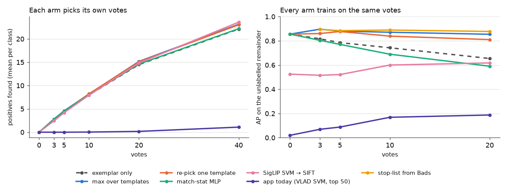
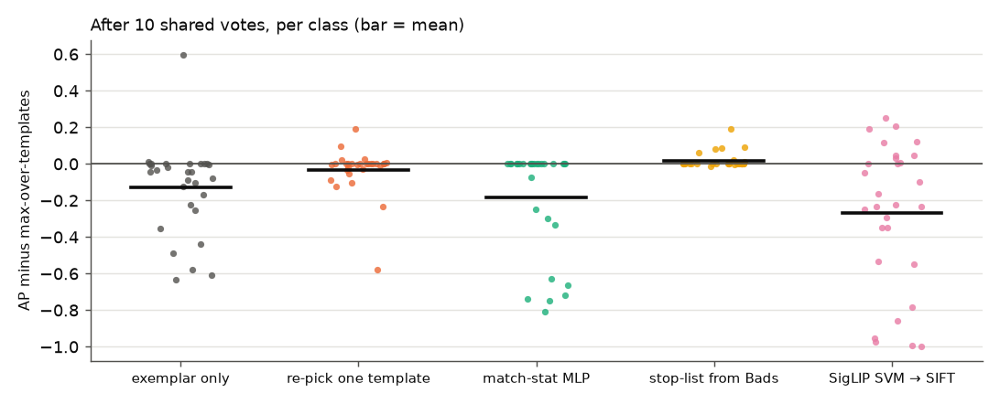
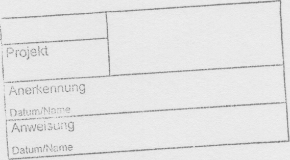
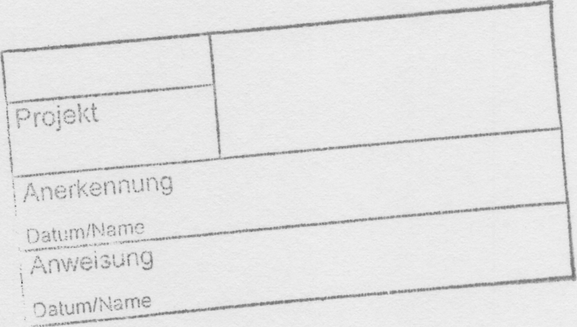
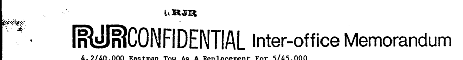

# Does stamp-finding learn from votes? Vote curves on DocMarks (#4162)

**Question (#4161).** Stamp-finding starts from one query crop and ranks by it.
Does anything a user clicks afterwards teach it to find the rest of the mark, or
do the clicks only calibrate a threshold? This compares six learning rules on
DocMarks v5.0, the benchmark built for exactly this: pages with stamps and logos,
all of them boxed.

**Answer.** Tier `s` ran every arm. Tier `m`, with 10× the pages, re-ran the
arms that passed at tier `s`.

- **Votes do help, but only one rule turns them into gains:** adding each Good
  page's boxed mark as a template, and scoring each page by its best-matching
  template (max over templates). After 10 shared votes it scores AP 0.87 on the
  unlabelled remainder, where the query crop alone scores 0.74 (paired +0.13,
  95% interval [+0.04, +0.22]).
- **The one rule that learns from Bads helps on average, but is not confirmed:**
  a descriptor stop-list.
  - Tier `s`: +0.018 over max-over-templates at 10 votes, interval
    [+0.005, +0.035].
  - Tier `m`: +0.022, but the interval [−0.013, +0.068] crosses zero at the
    pre-registered point. It is +0.049 at 20 votes, [+0.003, +0.106].
  - It has one clear failure mode, where it strips the mark's own features
    ([tier `m`](#tier-m)).
- **Two rules make things worse:**
  - **Re-picking a single better exemplar** gives no gain: −0.03 at 10 votes,
    and −0.04 at 20, where the interval excludes zero.
  - **The match-statistic MLP** loses in every class where it trains on a Bad.
- **The app's current voted path scores 0.17 where max-over-templates scores
  0.87.** The learning rule isn't the reason. The reason is the first stage: a
  VLAD SVM whose top 50 are the only pages SIFT ever checks.

Max over templates holds at tier `m`: +0.12 over the exemplar at 10 votes.



## Setup

- **Corpus:** DocMarks **v5.0**, 36 roster classes. One class,
  `ucsf/logo_p_lorillard_crest`, has no positive at tier `s`, which leaves 35.
- **Pool:** each class's `own_verified` pool, about 4,900 pages at tier `s`, with
  the query page excluded. This is the benchmark's headline pool.
- **Matcher:** 8,192-keypoint SIFT with the shipped matcher settings (ratio
  0.75, RANSAC 0.02, scale floor 0.03).
- **Pre-registration:** the arms, readouts and verdict rule were posted on
  [#4162](https://github.com/samggreenberg/VTSearch/issues/4162#issuecomment-5803168637)
  before any run.

**Templates.** A class's templates are:

- its query crop;
- for each positive page, the page's own SIFT features that fall inside its
  DocMarks box (`filter_features_to_box`). This is the template the app builds
  from a Good vote with a drawn region.

One idealisation: a simulated vote carries the ground-truth box, where a real
user would draw their own.

**One match computation, replayed.** `template_matrix.py` checks every template
against every pool page once. The arms that only combine templates differently
(0, 1, 1p, 2, 3s, 5) then replay from that stored table. So every difference
between those arms comes from the learning rule, never from the matcher.

That replay reproduces the published zero-vote numbers exactly, class for class.
For the first class checked:
- SIFT on the query crop: 1.0;
- SigLIP: 0.163;
- VLAD: 0.019;
- SigLIP top-1,000 → SIFT: 0.902.

**The vote loop.** One vote per step: the top unlabelled page of the arm's
current ranking, labelled from ground truth. There are two readouts.

- **Closed loop:** each arm picks its own votes. Metric: positives found after
  *v* votes, which is what a user gets.
- **Shared sequence:** every arm trains on the *same* *v* votes, the top *v* of
  the exemplar ranking. Metric: AP and P@10 on the same unlabelled remainder.
  - Comparing the arms class by class isolates the learning rule from which
    pages each arm happened to ask about.
  - A class-step with nothing left to find is dropped. The class counts are in
    the [summary](measurements/tier-s/summary.md).
  - **This is the verdict readout.**

## The arms

| arm | what it does |
|---|---|
| 0 exemplar | inliers against the query crop; never learns |
| 1 **max over templates** (control) | best inlier count over the crop and every Good's box template |
| 1p Goods only | as 1, but the crop is dropped once a Good exists |
| 2 re-pick | one template, whichever of the crop or a Good has the highest median inliers against the *other* Goods |
| 3 VLAD SVM | the app's linear SVM head on page VLAD vectors (crop + Goods vs Bads) |
| 3s **the app today** | arm 3's top 50, re-ranked by the Good templates, as `structural_rerank` ships: cold inlier gate below 3 votes, match-statistic MLP after |
| 4 SigLIP SVM (and 4r → SIFT) | the SVM head on SigLIP; 4r re-ranks its top 1,000 by arm 1's inliers |
| 5 match-stat MLP | `train_verification_classifier`'s recipe over arm 1's best-template statistics |
| 6 **stop-list from Bads** | every template drops the descriptors that pass the ratio test against any Bad page, then is re-checked against arm 1's top 1,000 |

## Results, tier `s`

Shared sequence, AP on the unlabelled remainder (mean over classes). The count
in brackets is the number of classes with a positive still left to find:

| arm | 0 votes | 3 | 5 | 10 | 20 |
|---|---:|---:|---:|---:|---:|
| exemplar | 0.86 | 0.82 | 0.79 | 0.74 | 0.65 |
| **max over templates** | 0.86 | 0.90 | 0.88 | 0.87 | 0.85 |
| Goods only | 0.86 | 0.91 | 0.89 | 0.88 | 0.86 |
| re-pick | 0.86 | 0.86 | 0.88 | 0.84 | 0.81 |
| stop-list | — | 0.89 | 0.88 | 0.89 | 0.88 |
| match-stat MLP | 0.86 | 0.80 | 0.77 | 0.69 | 0.59 |
| SigLIP SVM → SIFT | 0.52 | 0.52 | 0.52 | 0.60 | 0.62 |
| SigLIP SVM | 0.12 | 0.14 | 0.14 | 0.27 | 0.33 |
| **the app today** | 0.02 | 0.07 | 0.09 | 0.17 | 0.19 |
| VLAD SVM | 0.02 | 0.02 | 0.03 | 0.08 | 0.12 |
| (classes) | (35) | (34) | (31) | (29) | (29) |

Paired against max-over-templates at 10 shared votes, over 29 classes (bootstrap
95% interval):

| arm | mean AP difference | interval |
|---|---:|---|
| exemplar | −0.13 | [−0.22, −0.04] |
| Goods only | +0.007 | [+0.001, +0.016] |
| re-pick | −0.032 | [−0.081, +0.006] |
| stop-list | **+0.018** | [+0.005, +0.035] |
| match-stat MLP | −0.18 | [−0.29, −0.08] |
| SigLIP SVM → SIFT | −0.27 | [−0.42, −0.14] |



The same tables for the 27 classes v4.3 had are in the
[summary](measurements/tier-s/summary.md). The nine classes v5.0 added are easy
for SIFT. Every verdict above holds on the 27 alone; for example the stop-list is
+0.023 there, interval [+0.006, +0.043].

### 1. Max over templates is the rule that learns

With each Good added as a template, the ranking of what is left *improves*
after votes: 0.86 at 0 votes, 0.90 at 3. The exemplar's ranking only decays
(0.86 → 0.65 by 20 votes), because its easy positives are voted away and its
hard ones remain.

Arm 1 keeps finding those hard positives through the Goods that resemble them.
The clearest case is `tobacco800/logo_aeq93a00_1`, where the query crop finds
10 of 27 in 40 closed-loop votes and max-over-templates finds 22.

In the closed loop the arms barely separate: 23 positives found by 40 votes
against the exemplar's 22. SIFT already ranks 28 of the 35 classes at AP ≥ 0.7
from the crop alone, so a user voting top-down meets few Bads. Learning shows on
the classes that are hard for the crop. The shared readout is where that shows.

**Dropping the crop once Goods exist (1p)** changes almost nothing: +0.007. That
is statistically real but has no practical size. The crop is redundant once
Goods exist, and removing it is not worth the change.

### 2. Re-picking the exemplar does not help

Keeping only the single template that best explains the other Goods throws
away what max-over-templates keeps: a Good that looks unlike the others is
exactly the one that finds the positives nothing else reaches. Re-pick is level
with max-over-templates at 5 votes and below it after. At 40 votes its mean is
0.49 against 0.71, over 22 classes.

### 3. The match-statistic MLP hurts, and only when it has a Bad to learn from

The MLP needs both a Good and a Bad to train.

- **With no Bad, no change:** in the 19 classes whose first 10 shared votes are
  all Good, it never trains and matches the control exactly.
- **With at least one Bad, it loses every time:** that happens in 10 classes.
  Its scores fall by 0.08 to 0.81; for example `spods/stamp_00716_1` drops 0.81
  with 9 Goods and 1 Bad.

The Bads that reach the top of a strong SIFT ranking are hard negatives: pages
that match with many inliers. A boundary learned from a handful of them sits
above many true positives that fit less well.

OpenLogo found this classifier no better than the cold gate
(`docs/plans/structural-embedder.md`). On a corpus where SIFT works, it is
worse. The app's voted path (3s) uses this classifier from 3 votes.

### 4. The stop-list: the first thing that learns from Bads in SIFT space

Each Bad page tells the matcher which descriptors are not the mark: the ones
that also match a page without it. Dropping those from every template gains
+0.018 at 10 votes, from a few classes; examples are `ucsf/logo_bat_leaf`
0.81 → 1.00 and `spods/stamp_00612_1` 0.85 → 0.94.

The gain grows as Bads accumulate: 0.84 against 0.71 at 40 votes, over 22
classes. The 40-vote point was not pre-registered and has few positives left
per class, so treat it as a direction rather than a number.

P@10 does not move (0.85 against 0.85 at 10 votes). The stop-list re-orders the
middle of the ranking, not its head.

**Where it matters: a mark made of type.** `staver/stamp_stampds-00213_1` is a
ruled form box printed in Helvetica:

| the query crop | a Good page's box, as a template |
|---|---|
|  |  |

The query crop is a good template: its strongest negative has 17 inliers. The
same mark cut from a Good page's own features matches unrelated typed pages
(SPODS, UCSF, Tobacco800) at **100–130 inliers**. Its descriptors are mostly
glyphs, and letters repeat along a line of any typed page.

So max-over-templates makes this class *worse*:
- in the closed loop it finds 5 of 19 in 40 votes, where the crop alone finds 16;
- the MLP finds 1.

The stop-list removes 661 of 3,239 template descriptors after 5 Bads, and AP on
this class goes 0.08 → 0.14. That is not enough to bring it back: this class
needs the crop's template kept apart from the Goods' templates, or a text mask.
([#4170](https://github.com/samggreenberg/VTSearch/issues/4170))

### 5. The app's voted path is limited by Stage 1, not by learning

What the app does today on a structural dataset (arm 3s):
1. The page VLAD vector feeds the SVM head.
2. Only that ranking's top 50 are ever checked geometrically.

VLAD ranks DocMarks at chance (AP 0.02), so almost no positive reaches the top
50. Votes lift it to 0.17 by 10 votes, but the same Goods scored against every
page reach 0.87. By 40 closed-loop votes the app has found 1.1 positives per
class; max-over-templates finds 23.

- **Most of that gap is in Stage 1 and the K=50 shortlist.** Exhaustive SIFT at
  8,192 keypoints costs about 45 ms of CPU per page-template pair. That is about
  40 CPU-minutes per template on 50,000 pages: affordable for a benchmark, not
  for an interactive app.
- **SigLIP as the first stage is the hybrid that
  `docs/plans/structural-embedder.md` names.** Here it finds slightly more by
  40 votes than max-over-templates: +0.46 positives, interval [+0.06, +1.0].
  That is because SigLIP reaches variants SIFT misses, for example
  `tobacco800/logo_asg54f00_1`, where the SigLIP SVM alone finds all 9.
- **But it ranks worse:** −0.27 AP on the shared remainder.

## Tier `m`

**What ran.** The pre-registered follow-up: the shared readout only, for the
arms that passed at tier `s` (Goods only, stop-list) plus the exemplar and the
control.

- **Classes:** all 36, since the Lorillard crest has positives at tier `m`.
- **Pool:** about 47,000–50,000 pages per class.
- **Templates:** the crop, plus the positives in the exemplar's top 20. Those
  are all the Goods a 20-vote shared sequence can reveal.
- **Readout:** to 20 votes, not 40.
- **Runs:** matrix 698087 and its continuation 700831; curves 698088;
  stop-list 698089. Measurements are in
  [`measurements/tier-m/`](measurements/tier-m/summary.md).

Shared sequence, AP on the unlabelled remainder (mean over classes):

| arm | 0 votes | 3 | 5 | 10 | 20 |
|---|---:|---:|---:|---:|---:|
| exemplar | 0.87 | 0.85 | 0.81 | 0.76 | 0.67 |
| **max over templates** | 0.87 | 0.91 | 0.90 | 0.87 | 0.86 |
| Goods only | 0.87 | 0.91 | 0.90 | 0.88 | 0.86 |
| stop-list | — | 0.91 | 0.90 | 0.90 | 0.91 |
| (classes) | (36) | (36) | (33) | (31) | (31) |

Paired against max-over-templates, bootstrap 95% interval over classes:

| arm | 10 votes | 20 votes |
|---|---|---|
| exemplar | −0.12 [−0.19, −0.06] | −0.18 [−0.27, −0.11] |
| Goods only | +0.008 [+0.001, +0.019] | +0.007 [+0.000, +0.018] |
| stop-list | +0.022 [−0.013, +0.068] | +0.049 [+0.003, +0.106] |

- **Max over templates replicates.** It improves on the exemplar by about as much
  as at tier `s`, and it keeps improving the remainder as votes arrive.
- **Goods only replicates, and stays negligible:** +0.008.
- **The stop-list:** its mean gain is larger than at tier `s`, but so is the
  spread. At the pre-registered point (10 votes) the interval crosses zero, so
  it is **not confirmed**. It is significant at 20 votes, which was not the
  pre-registered point. Most classes don't move; a few move a lot, in both
  directions:

| class | max over templates | stop-list | votes | what happened |
|---|---:|---:|---:|---|
| `staver/stamp_stampds-00213_1` | 0.14 | **0.69** | 10 | the text-bearing form stamp: pruning the *crop's* glyph descriptors against 10 Bads rescues it (no Good yet) |
| `tobacco800/logo_asg54f00_1` | 0.07 | 0.33 | 10 | |
| `ucsf/logo_bw_oval_emblem` | 0.52 | 1.00 | 20 | |
| `tobacco800/logo_aeq93a00_1` | 0.92 | **0.68** | 10 | a Bad that carries the mark: the stop-list strips the mark itself |

**The failure mode: a Bad that contains the mark.** The RJR logo class
(`aeq93a00`) has one Bad in its exemplar's top 10, `tobacco800/idr55d00`:

| the query crop | the Bad page's letterhead |
|---|---|
|  |  |

That page's "RJR CONFIDENTIAL" lockup contains the RJR letters. The completeness
review ruled it *not* an instance of this class, and it is a correct Bad under
the benchmark's definition. But every descriptor it shares with the mark is,
by construction, a descriptor of the mark. The stop-list drops those from every
template, and the class loses 0.24 AP.

A user who votes such a page Bad ("not this one, it's the lockup") would get
the same result. Any rule that learns from Bads needs a guard against it, for
example keeping descriptors that most Goods also match.

## Verdict

| arm | tier `s` | tier `m` | decision |
|---|---|---|---|
| max over templates | +0.13 over the exemplar | +0.12 | the rule to keep; it is what the app's templates already do, once Stage 1 lets positives reach them |
| Goods only | +0.007 | +0.008 | null in practice; not worth a change |
| re-pick | −0.03 / −0.04 | not run | **null**: recorded, not promoted |
| stop-list from Bads | +0.018 | +0.022, interval crosses 0; +0.049 at 20 votes | **a candidate, not confirmed**: plan item with a guard for Bads that carry the mark ([#4180](https://github.com/samggreenberg/VTSearch/issues/4180)) |
| match-stat MLP | −0.18; loses in every class with a Bad | not run | **negative**; the app should not re-rank with it ([#4169](https://github.com/samggreenberg/VTSearch/issues/4169)) |
| VLAD SVM / the app today | 0.02–0.19 | not run | the bottleneck is Stage 1 (the hybrid plan item) |
| SigLIP SVM → SIFT | −0.27 AP, +0.46 found by 40 votes | not run | the hybrid: a recall gain, a ranking loss |

## Reproduce

```bash
cd scripts/experiments/docmarks
python template_matrix.py --tier s --shard 0/4 --out <dir>/matrix-s   # x4 shards, 24 CPUs, ~30 min each
python vote_curve.py --matrix <dir>/matrix-s --tier s --out <dir>/curves-s
python vote_stoplist.py --matrix <dir>/matrix-s --tier s --shard 0/4 --out <dir>/curves-s
python vote_curve.py --matrix x --out <dir>/curves-s --summarise
```

Tier `m` adds `--goods-in-top 20 --no-vectors` to `template_matrix.py`,
`--arms a0_exemplar,a1_max,a1p_goods_only --readouts shared --max-v 20` to
`vote_curve.py`, and `--max-v 20` to `vote_stoplist.py`.

GRID runs, tier `s`: matrix 695763, curves 695810, stop-list 695812. Results are under
`/expscratch/sgreenberg/docmarks/votes-4162/`, and the measurements here are
copied from there.
