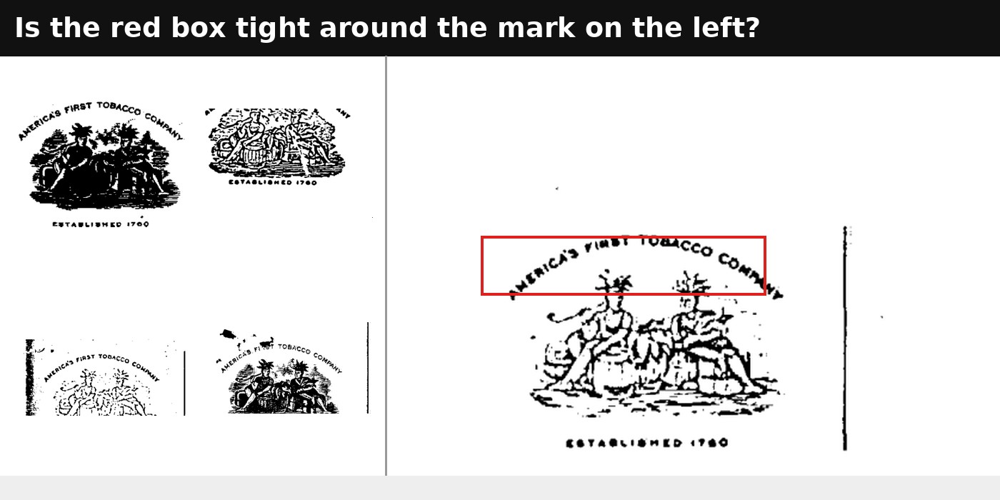
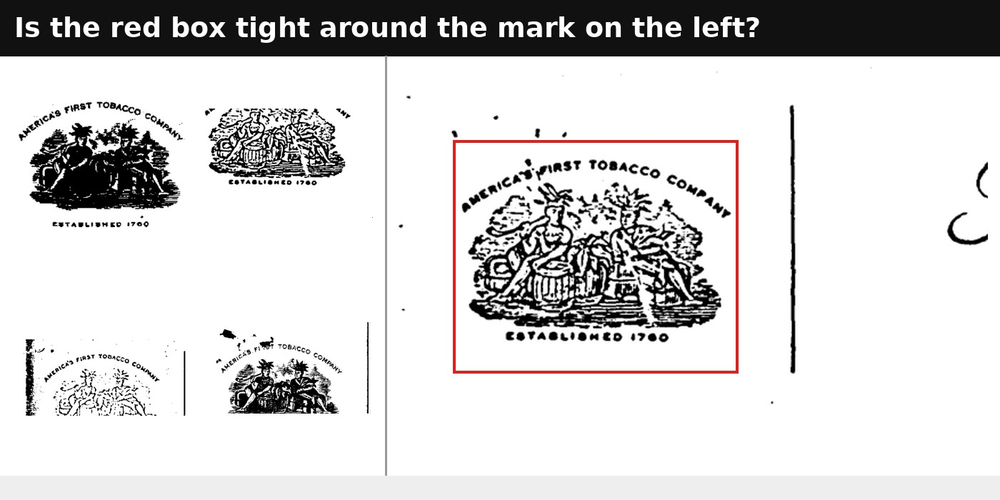
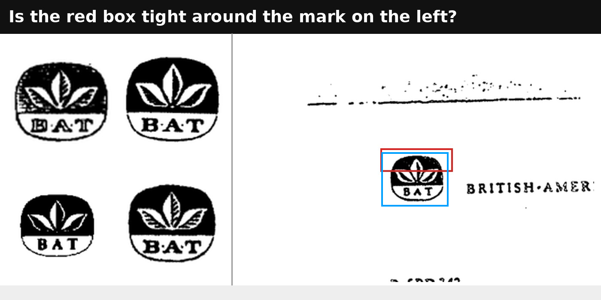
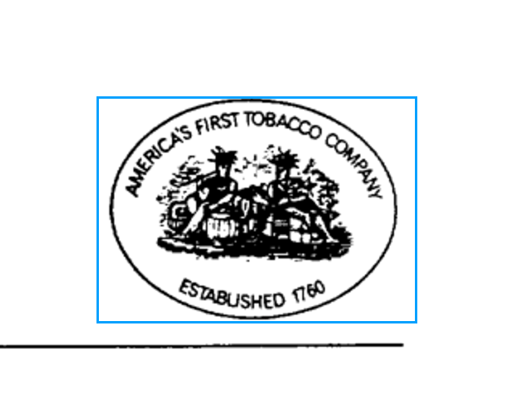
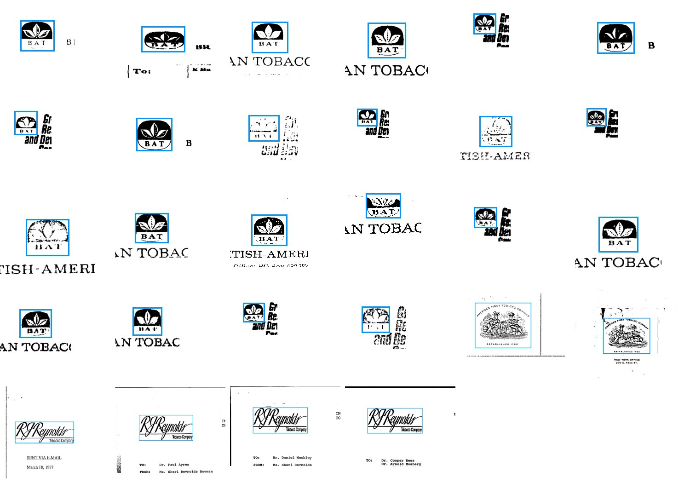

# FullMarks v4.3: real boxes for the four UCSF classes

**2026-09-23 · #4109, #4073, #4125 · corpus v4.2 → v4.3**

## Result

**Every UCSF-class box is now reviewed.** 303 proposals were accepted (2 of
them redrawn by hand), 28 marks no proposal fitted were drawn by hand, and 3
query pages were given their crop's own extent. 334 questions in all.

| class | instances | band-located, v4.2 → v4.3 | wrong-shaped boxes, v4.2 → v4.3 |
|---|---:|---|---|
| bat_leaf | 213 | 54 → **0** | 74 → **0** |
| p_lorillard_crest | 24 | 9 → **0** | 11 → **0** |
| rjr_script | 68 | 1 → **0** | 25 → **0** (4 flagged boxes take in an optional line; see below) |
| bw_oval_emblem | 30 | 0 → 0 | 0 → 0 |

"Wrong-shaped" means an aspect ratio more than 1.6× off the class's query crop.
**Retrieval scores are unchanged** (they are page-level), so every v4.2
retrieval number is a v4.3 number. Localisation on these four classes is now
supported, under the tolerance below.

## What was wrong

#4109 set out to box the 64 marks located only by their letterhead band. The
bigger problem was the boxes that already looked tight. They came from the
#3921 search, which took the region where SIFT's matches *clustered* on the
band. That is where the distinctive texture is, not the mark's outline.
11 of 15 p_lorillard_crest boxes covered only the "AMERICA'S FIRST TOBACCO
COMPANY" arc. So the pass covered every UCSF-class instance, and queued a box
only where the new proposal differed from the old one.

## How the boxes were proposed

`box_tighten.py` fits the **query crop only** with SIFT, then projects the crop's
*ink* outline through the similarity fit.
- A first try also fitted the class's largest existing boxes as extra
  references. It inherited their errors (below, left): a partial reference
  gives a partial proposal.
- It searches and clamps within the page's **letterhead band**
  (`--within-band`), not the current box. Clamping to a wrong-shaped box keeps
  the wrong shape.
- It upsamples 2×, because these marks are 40–60 px on a 150 dpi page.
- It pads each proposal 10%. The ink outline's 0.5% trim clipped descenders
  and the ends of arc lettering, and a slightly loose box beats a clipped one.

| first try: fitted to a partial reference | final: query crop only, within the band |
|---|---|
|  |  |

Questions render the #4073 way. An outlined candidate is never enlarged past
2×; the window widens until the panel is filled with real pixels, and the red
outline marks the question. A 24 px mark used to be blown up 16×.

## The reviewer's rules

- **Tolerance** (Sam, 2026-09-23): a box is tight if it clips only the tips of
  descending loops, and not if it cuts off substantial strokes such as the tops
  of letters. Localisation should use a loose IoU criterion to match.
- **A wrong box was redrawn and voted Good** (bat_leaf, p_lorillard_crest), or
  voted Bad (rjr_script). The bank now reads a box drawn with a Good vote,
  maps it from sheet to page pixels through the same layout function the
  renderer uses, and applies it in place of the proposal, keeping the proposal
  as `proposed_box`. A proposal round-trips to the pixel.

Both drawn boxes, mapped back to their pages:

| bat_leaf `fspp0201` (the proposal covered the top half) | p_lorillard_crest `fhkw0113` (an oval-framed crest the fit missed) |
|---|---|
|  |  |

## Held back, then finished (#4125)

- **Three query-page boxes were not applied from proposals.** Accepting a box
  on a class's query page made `audit_to_corrections.py` re-cut the query crop
  from it. That would have replaced three hand-made crops with padded proposals
  and changed every retrieval number for those classes. Each query page now
  carries its crop's own extent (`query_box`), and a box pass re-cuts a crop
  only with `--recut-query-crop`. The crops' checksums are unchanged.
- **The 28 marks no proposal fitted, or whose proposal was rejected, were
  drawn by hand** (`box_leftovers.py`, `binary_review.py emit --task box_draw`).
  Most are faint or broken BAT emblems on "Group Research and Development"
  letterheads. All 28 mapped boxes were checked on their pages before apply:

  
- **4 rjr_script boxes take in the "Tobacco Company" line; that is fine.** The
  logo is the script. The line is printed under it on some letters and not
  others without changing what the mark is (owner, 2026-09-23), so a box with or
  without it is correct. These 4 hand-drawn boxes include it because the
  script's loops hug it. They are the 4 the aspect check flags, and the flag
  is a false alarm.

## Reproduce

```
cd scripts/experiments/fullmarks
python box_tighten.py --classes <the four UCSF classes> --upsample 2 --pad 0.10 --within-band --audit-dir box_tighten_band
python binary_review.py emit --task box_tighten_band --root <root>
python binary_review.py load --queue <root>/<queue> ...
python binary_review.py bank --root <root>                    # reads drawn boxes too
python audit_to_corrections.py --task box_tighten --audit-dir box_tighten_band_banked --reviewer <name> --apply
python box_leftovers.py --slate box_tighten_band_banked       # query pages -> audit/box_query, the rest -> audit/box_draw
python audit_to_corrections.py --task box_tighten --audit-dir box_query --reviewer "query crop extent" --apply
python binary_review.py emit --task box_draw --root <root2>   # draw, bank, then apply --audit-dir box_draw_banked
```

Verdicts are in `measurements/box_verdicts.jsonl` (with the held-back query pages
removed) and `measurements/draw_verdicts.jsonl`. The pre-apply corpora are in
`corpus/backup-pre4109-20260923/`, `backup-pre4125-20260923/` and `backup-pre4125draw-20260923/`, and detector backups are in
`keep/detectors-cleared-20260922/`.
