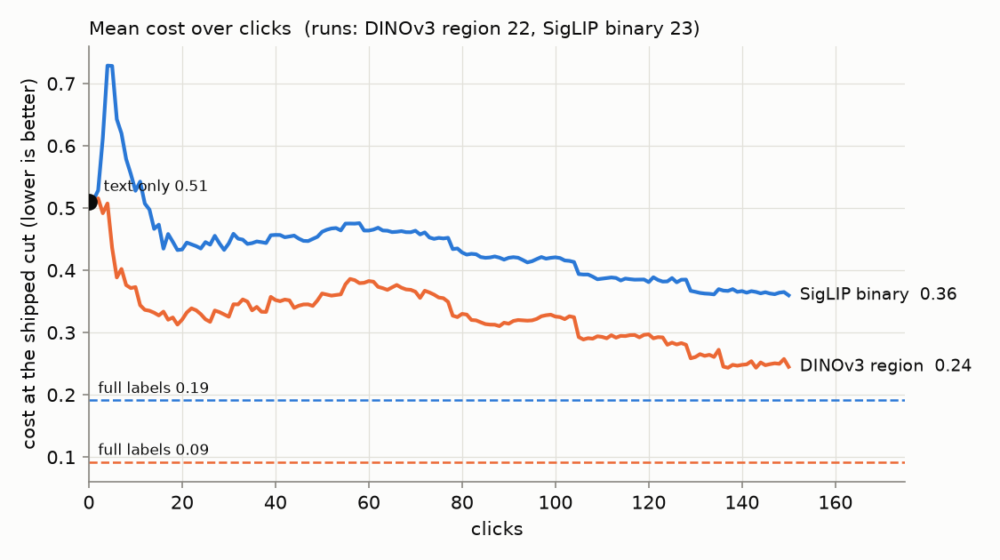
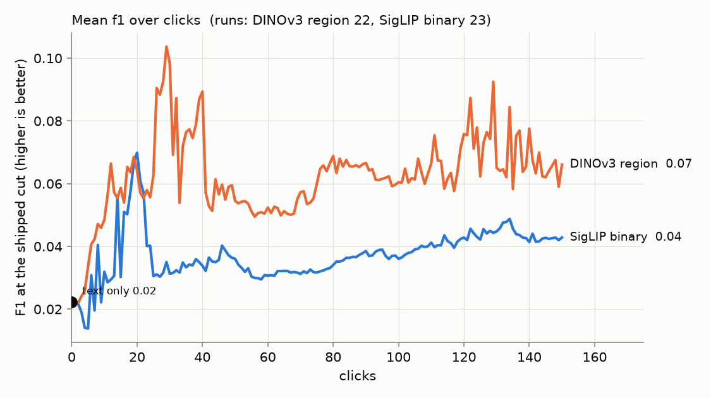
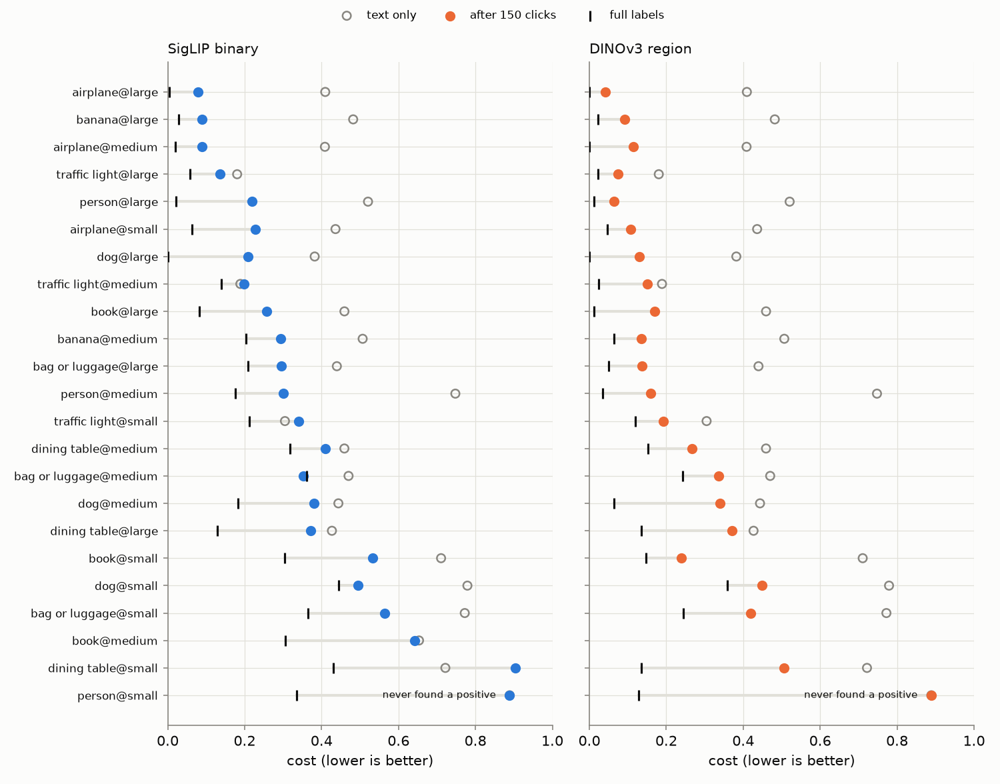

# State of the App — 2026-09-23 (first round, 8 classes)

**Issue:** #4159. **Recipe:** `.claude/skills/state-of-the-app/SKILL.md`.
**Status: DRAFT, round 1.** This round settles the presentation: 8 classes, 1
seed, 23 cells × 2 paths = 46 runs. One run is still out (`book@medium`, region),
so the region numbers are over 22 runs. **Every number here is one seed**; the
widened run (more classes and seeds together) is what gets quoted.

A **review**, not an experiment: the app as it ships, on `coco_quarry`, the way
a user meets it. The user types a query, looks at the text sort, and then votes
for up to 150 clicks while Autopilot picks what to show. There are two production
paths: **SigLIP binary** (whole-image votes) and **DINOv3 region** (box votes,
opened on SigLIP's text sort). Each curve runs from the **text-only score at
click 0**, through the clicks, to the **full-label ceiling** (the same head
trained on every label; region supervised with each positive's box).

**Scores:** *Cost* is the harness's weighted FNR/FPR at the shipped threshold,
where lower is better. *F1* is at the same threshold.

## Headline

| (median over runs) | text only | after 150 clicks | full labels | F1 at 150 | precision | recall |
|---|---:|---:|---:|---:|---:|---:|
| **DINOv3 region** | 0.46 | **0.16** | 0.09 | 0.05 | 0.03 | 0.98 |
| **SigLIP binary** | 0.46 | **0.30** | 0.19 | 0.04 | 0.02 | 0.92 |



1. **Region beats binary everywhere** on this bench: lower final cost, and a
   ceiling half as high (0.09 vs 0.19 mean). The region path is the better
   product today.
2. **The clicks find almost no positives.** In 150 clicks the median run found
   **4** positives (region 4.5) of about 50 in its training half. `person@small`
   found **none on either path**: 150 Bad votes, no detector ever trained, and
   the user is left with the text sort. This is the positive-starvation regime
   of #3261 / #2910, and it is probably what the next two findings are made of.
3. **The shipped threshold buys recall with precision.** Median recall is
   0.92–0.98, but precision is **0.02–0.03**: at ~1% prevalence a user sees
   roughly 35–50 false positives per true one. Cost rewards that trade; F1 does
   not. The review shows both, and they disagree.
4. **SigLIP's first detector is worse than typing.** The mean cost jumps from
   0.51 (text only) to **0.73 at click 4**, and does not beat the text sort
   again until **click 12**. Region beats the text sort from click 3. Both
   paths then get **worse between clicks 25 and 50** (region 0.32 → 0.36,
   SigLIP 0.45 → 0.46) before improving.



*(The region F1 curve is spiky because it is a 22-run mean at one seed: a single
run crossing the threshold moves it.)*

## Where the app does well and where it does poorly



| band (mean) | region: text → final → ceiling | binary: text → final → ceiling |
|---|---|---|
| large | 0.41 → **0.14** → 0.03 | 0.41 → **0.21** → 0.07 |
| medium | 0.46 → **0.21** → 0.08 | 0.48 → **0.33** → 0.21 |
| small | 0.66 → **0.40** → 0.17 | 0.66 → **0.56** → 0.31 |

- **Well:** `airplane`, `banana@large`, `person@large`/`medium`, and
  `traffic light@large`. On the region path these end at 0.04–0.16.
- **Poorly:** the **small** band, on both paths.
  - Worst are `person@small` (never trained), `dining table@small`,
    `bag or luggage@small` and `dog@small`.
  - `dining table` is the hardest class overall, on both paths.
- **Clicking made it worse than typing** in three SigLIP runs:
  `dining table@small` (0.72 → **0.90**, recall 0.36), `traffic light@medium`
  (0.19 → 0.20) and `traffic light@small` (0.30 → 0.34). No region run ends
  worse than its text sort.
- **Headroom (final − ceiling)** is largest in `dining table`, `dog` and `book`
  on the region path. There, the head could do much better with the right
  labels, so the loop, not the class, is the limit.

## Images

The per-image credit is computed and conserved: every scored step's change is
split equally among the clicks since the previous scored step, and the credits
sum exactly to each run's net change. **At this scale it cannot name an image.**
Only 279 of 4,850 clicked images were clicked 3+ times (at most 7), and the
per-image spread is larger than the per-image mean. The tables exist
(`influence.csv`, `images.csv`, `image_detector.csv`) and the report section will
carry thumbnails once the widened run gives images enough repeat observations.
Negatives shared across detectors will get there first.

## Flagged regimes (reported, not fixed here)

- **Runs that never found a positive:** `person@small` on both paths.
- **Positive exhaustion (#4121)** did not arise: runs found too few positives to
  run out.

## What to A/B next (proposed; not yet filed)

1. **Find positives faster:** the acquisition offset and the text-seed dwell
   (#3261, #2910). Starvation is the first-order problem on this bench.
2. **The operating point:** a cut that trades some recall for precision, judged
   on F1 as well as cost (#4118's reporting-line hinge is adjacent).
3. **Don't let the first detector replace a better text sort:** blend the text
   score with the early detector (#3944), which targets SigLIP's click-4 dip.
4. **The 25–50 click regression** on both paths: find out what changes there
   (the opening ending, the threshold schedule) before choosing a fix.

## Reproduce

```bash
cd scripts/experiments/state_of_app
srun -p cpu --mem=8G -c 2 -t 60 bash launch.sh prepare
bash launch.sh subset "airplane,dining table,book,bag or luggage,banana,traffic light,person,dog"
srun -p cpu --mem=32G -c 4 -t 2:00:00 bash analyze.sh
python figures.py --analysis <exp>/analysis --out docs/experiments/2026-09-23-state-of-the-app/figures
```

Run directory: `/expscratch/sgreenberg/state-of-the-app/2026-09-23/`. The
interactive `viewer.html` is in `analysis/`.
