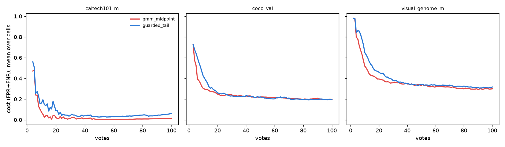

# Trajectory A/B: the guarded text-sort line and Autopilot's opening (issue #3826)

> **Verdict: does not clear the pre-registered ship rule.** The guarded line
> ships behind `VTSEARCH_TEXT_SORT_CUT=guarded_tail`, **off by default**.

Sam chose the guarded rule for a typed-query sort's line (the study is
`2026-09-22-text-cut-3826`): keep the GMM when Ashman's D ≥ 2, converged, and
otherwise cut at median + 3 robust sigma. That line is not display-only.
Autopilot's Bad phase votes the unlabelled items nearest the text sort's line
until it has four negatives. The study predicted that this would move the
opening's picks from the middle of the ranking to its top, and said an A/B was
required before the rule became the default. This is that A/B.

## Design and the rule, fixed before the arrays ran

The rule was posted on #3826 before either arm was submitted.

- **Grids.** Two calibration grids that differ only in `VTSEARCH_TEXT_SORT_CUT`:
  - ON: `guarded_tail`
  - OFF: `gmm_midpoint`

  Both are `caltech101_m`, `coco_val`, `visual_genome_m` × siglip ×
  whole_image. The categories are the 42 that prepare selects with
  `CALIB_REQUIRE_SEED_QUERY=1`, so every cell opens on a typed query
  (`CALIB_REQUIRE_OPENING=text` asserted it, and 168 of 168 cells opened
  `mode=text`). Each runs 2 seeds for 100 clicks, with shipped defaults
  everywhere else.
- **Size.** 84 paired cells. By the #3840 rule (per-cell σ ≈ 0.04), resolving
  δ = 0.01 at 2 SE needs (2·0.04/0.01)² = 64. The realised per-cell SD over all
  steps was **0.044**, so the rule's σ held.
- **The flag reaches the harness through the app's own call.**
  `text_sort_threshold` is called by the Bad phase's `_sort_threshold`, by
  `startup_schedule`'s `@mid`, and by `text_baseline.py`. The arm wrapper
  refused to run unless the thresholds module resolved the arm's rule.
- **Decision.** Δ = ON − OFF of `cost` (Inclusion-0 FPR+FNR), paired per
  (dataset, category, seed) cell, with SE over cells.
  - PRIMARY: scope `app_visible`, window `all_steps`, requires **mean + 2 SE ≤
    +0.010**.
  - SECONDARY: scope `app_visible`, window `ramp_6_20`, requires **mean + 2 SE
    ≤ +0.020**.
  - Ship as the default only if both hold.

## Result

| test | cells | Δcost (guarded − midpoint) | SE | mean + 2 SE | margin | passes |
|---|---|---|---|---|---|---|
| PRIMARY, all steps | 84 | **+0.016** | 0.0048 | +0.026 | ≤ +0.010 | **no** |
| SECONDARY, votes 6-20 | 82 | **+0.071** | 0.013 | +0.097 | ≤ +0.020 | **no** |

Both fail, and not narrowly. Each Δ is more than 3 SE above zero, so the guarded
line makes Autopilot's detector **worse**. It is not merely failing to be
proved equivalent. ([`tables/ab_3826_decision.json`](tables/ab_3826_decision.json).)

| window | Δcost | ΔFPR | ΔFNR | ΔAP | ΔAUROC |
|---|---|---|---|---|---|
| votes 6-20 | +0.071 ± 0.013 | +0.045 ± 0.011 | +0.026 ± 0.008 | −0.038 ± 0.009 | −0.027 ± 0.006 |
| votes 21+ | +0.0095 ± 0.0044 | +0.012 ± 0.0045 | −0.002 ± 0.004 (not resolvable) | +0.0005 ± 0.006 (not resolvable) | −0.0027 ± 0.0016 (not resolvable) |
| all steps | +0.016 ± 0.0048 | +0.015 ± 0.0048 | +0.0012 ± 0.004 (not resolvable) | −0.0033 ± 0.005 (not resolvable) | −0.0053 ± 0.0017 |

Per dataset, all steps: `caltech101_m` +0.039 ± 0.019 (12 cells), `coco_val`
+0.0072 ± 0.0068 (38, not resolvable), `visual_genome_m` +0.019 ± 0.006 (34).
The damage is concentrated in the first detectors, and there it is in the
*ranking* (AP −0.038) as well as the threshold. After 20 votes, the ranking
recovers everywhere, and the threshold recovers on `coco_val` but not on the
other two ([`tables/ab_3826_deltas.csv`](tables/ab_3826_deltas.csv)).

*Mean cost over cells against votes cast, per dataset. Blue is the guarded line
and red the shipped midpoint. The guarded arm starts behind on every dataset
and catches up by about 25 votes on `coco_val` and `visual_genome_m`. On
`caltech101_m` it stays behind for all 100 votes, with AP identical in both
arms (the dataset is saturated), so there the gap is in the detector's
threshold and not its ranking. Only 12 cells support that panel.*

## Why: the opening votes somewhere else

The Bad phase's picks under each arm
([`tables/bad_phase_by_cell.csv`](tables/bad_phase_by_cell.csv), 84 cells per
arm):

| | median position of a Bad-phase pick in the text ranking (0 = top) | clicks spent in the Bad phase | true matches voted while hunting negatives |
|---|---|---|---|
| `gmm_midpoint` | 35th percentile | 3.8 | 0.11 per cell |
| `guarded_tail` | **2.5th percentile** | 5.0 | **1.3 per cell** |

This is what the study predicted. The midpoint puts the Bad phase in the
middle of the ranking, where almost everything is a negative. The guarded line
sits at the top of the ranking, among the matches. So the Bad phase:

- costs more clicks;
- votes some positives it was not looking for;
- builds the first detector from **near-miss negatives only**, with none of the
  bulk that the detector must later reject. The FPR rise in the 6-20 window
  (+0.045) is that missing bulk.

It is also where the study's known failure shows up in a trajectory: high-prevalence queries.

| cell | Bad-phase clicks, midpoint → guarded | true matches voted there, midpoint → guarded |
|---|---|---|
| `visual_genome_m` / "a man" / seed 1 | 5 → **26** | 1 → **22** |
| `visual_genome_m` / "a bus" / seed 1 | 4 → 20 | 0 → 16 |
| `visual_genome_m` / "a man" / seed 0 | 4 → 12 | 0 → 8 |
| `coco_val` / "a dining table" / seed 1 | 3 → 11 | 0 → 8 |

On "a man" (a common Visual Genome class), the guarded line sits inside the
matches. The phase meant to collect four negatives spends a quarter of the
100-click budget voting men.

## What this means for the decision

The study showed the guarded line is a better **display**: it paints about as
many medias green as truly match, where the midpoint paints 43%. This A/B shows
it is a worse **place to sample negatives**. Today one number does both jobs.
The app already carries a second number for exactly this split: the Hard/Bad
pick reads `acq_threshold ?? threshold` (`SortStateService.acqThreshold`).
Sam's decision could therefore still ship as a display-only change: paint the
guarded line, and keep the midpoint as the text sort's acquisition cut. That
has no trajectory effect by construction, because the opening's picks would be
bit-identical to today's. It is filed as #4136 and not done here, because it is
a different change from the one pre-registered.

## Reproducing

Harness on branch `claude/text-cut-guard-3826`, `scripts/experiments/text_cut/`:
`launch_ab_3826.sh` (`prepare`, `size`, `ab`, `abanalyze`), with
`run_cells_ab_3826.py` as the arm wrapper and `analyze_ab_3826.py` applying the
rule on top of `calibration/analyze_ab.py`. Results root
`/expscratch/sgreenberg/textcut-ab-3826`. A cell costs about 2 minutes and 1.3 GB
on one cpu node, so 168 cells took about 12 minutes at 12 concurrent tasks per
arm.
